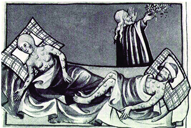
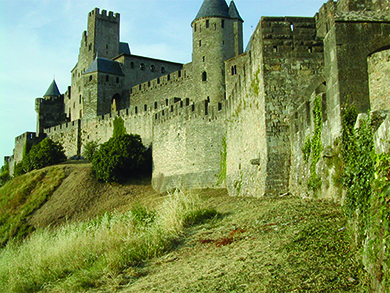
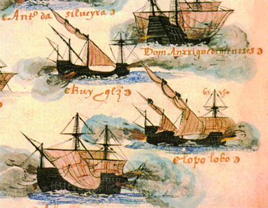

By the end of this section, you will be able to:
* Describe the European societies that engaged in conversion, conquest, and commerce
* Discuss the motives for and mechanisms of early European exploration

The fall of the Roman Empire (476 CE) and the beginning of the European Renaissance in the late fourteenth century roughly bookend the period we call the Middle Ages. Without a dominant centralized power or overarching cultural hub, Europe experienced political and military discord during this time. Its inhabitants retreated into walled cities, fearing marauding pillagers including Vikings, Mongols, Arabs, and Magyars. In return for protection, they submitted to powerful lords and their armies of knights. In their brief, hard lives, few people traveled more than ten miles from the place they were born.

The Christian Church remained intact, however, and emerged from the period as a unified and powerful institution. Priests, tucked away in monasteries, kept knowledge alive by collecting and copying religious and secular manuscripts, often adding beautiful drawings or artwork. Social and economic devastation arrived in 1340s, however, when Genoese merchants returning from the Black Sea unwittingly brought with them a rat-borne and highly contagious disease, known as the bubonic plague. In a few short years, it had killed many millions, about one-third of Europe’s population. A different strain, spread by airborne germs, also killed many. Together these two are collectively called the **Black Death**{: data-type="term"} ([\[link\]](#CNX_History_01_02_BlackDeath)). Entire villages disappeared. A high birth rate, however, coupled with bountiful harvests, meant that the population grew during the next century. By 1450, a newly rejuvenated European society was on the brink of tremendous change.

{: #CNX_History_01_02_BlackDeath}

  
Visit [EyeWitness to History][1] to learn more about the Black Death.

### LIFE IN FEUDAL EUROPE

During the Middle Ages, most Europeans lived in small villages that consisted of a manorial house or castle for the lord, a church, and simple homes for the peasants or **serfs**{: data-type="term"}, who made up about 60 percent of western Europe’s population. Hundreds of these castles and walled cities remain all over Europe ([\[link\]](#CNX_History_01_02_Carcass)).

{: #CNX_History_01_02_Carcass}

Europe’s **feudal society**{: data-type="term"} was a mutually supportive system. The lords owned the land; knights gave military service to a lord and carried out his justice; serfs worked the land in return for the protection offered by the lord’s castle or the walls of his city, into which they fled in times of danger from invaders. Much land was communally farmed at first, but as lords became more powerful they extended their ownership and rented land to their subjects. Thus, although they were technically free, serfs were effectively bound to the land they worked, which supported them and their families as well as the lord and all who depended on him. The Catholic Church, the only church in Europe at the time, also owned vast tracts of land and became very wealthy by collecting not only tithes (taxes consisting of 10 percent of annual earnings) but also rents on its lands.

A serf’s life was difficult. Women often died in childbirth, and perhaps one-third of children died before the age of five. Without sanitation or medicine, many people perished from diseases we consider inconsequential today; few lived to be older than forty-five. Entire families, usually including grandparents, lived in one- or two-room hovels that were cold, dark, and dirty. A fire was kept lit and was always a danger to the thatched roofs, while its constant smoke affected the inhabitants’ health and eyesight. Most individuals owned no more than two sets of clothing, consisting of a woolen jacket or tunic and linen undergarments, and bathed only when the waters melted in spring.

In an **agrarian society**{: data-type="term" .no-emphasis}, the seasons dictate the rhythm of life. Everyone in Europe’s feudal society had a job to do and worked hard. The father was the unquestioned head of the family. Idleness meant hunger. When the land began to thaw in early spring, peasants started tilling the soil with primitive wooden plows and crude rakes and hoes. Then they planted crops of wheat, rye, barley, and oats, reaping small yields that barely sustained the population. Bad weather, crop disease, or insect infestation could cause an entire village to starve or force the survivors to move to another location.

Early summer saw the first harvesting of hay, which was stored until needed to feed the animals in winter. Men and boys sheared the sheep, now heavy with wool from the cold weather, while women and children washed the wool and spun it into yarn. The coming of fall meant crops needed to be harvested and prepared for winter. Livestock was butchered and the meat smoked or salted to preserve it. With the harvest in and the provisions stored, fall was also the time for celebrating and giving thanks to God. Winter brought the people indoors to weave yarn into fabric, sew clothing, thresh grain, and keep the fires going. Everyone celebrated the birth of Christ in conjunction with the winter solstice.

### THE CHURCH AND SOCIETY

After the fall of Rome, the Christian Church—united in dogma but unofficially divided into western and eastern branches—was the only organized institution in medieval Europe. In 1054, the eastern branch of Christianity, led by the Patriarch of Constantinople (a title that because roughly equivalent to the western Church’s pope), established its center in Constantinople and adopted the Greek language for its services. The western branch, under the pope, remained in Rome, becoming known as the Roman Catholic Church and continuing to use Latin. Following this split, known as the Great Schism, each branch of Christianity maintained a strict organizational hierarchy. The pope in Rome, for example, oversaw a huge bureaucracy led by cardinals, known as “princes of the church,” who were followed by archbishops, bishops, and then priests. During this period, the Roman Church became the most powerful international organization in western Europe.

Just as agrarian life depended on the seasons, village and family life revolved around the Church. The **sacraments**{: data-type="term" .no-emphasis}, or special ceremonies of the Church, marked every stage of life, from birth to maturation, marriage, and burial, and brought people into the church on a regular basis. As Christianity spread throughout Europe, it replaced pagan and animistic views, explaining supernatural events and forces of nature in its own terms. A benevolent God in heaven, creator of the universe and beyond the realm of nature and the known, controlled all events, warring against the force of darkness, known as the Devil or Satan, here on earth. Although ultimately defeated, Satan still had the power to trick humans and cause them to commit evil or sin.

All events had a spiritual connotation. Sickness, for example, might be a sign that a person had sinned, while crop failure could result from the villagers’ not saying their prayers. Penitents confessed their sins to the priest, who absolved them and assigned them penance to atone for their acts and save themselves from eternal damnation. Thus the parish priest held enormous power over the lives of his parishioners.

Ultimately, the pope decided all matters of theology, interpreting the will of God to the people, but he also had authority over temporal matters. Because the Church had the ability to excommunicate people, or send a soul to hell forever, even monarchs feared to challenge its power. It was also the seat of all knowledge. Latin, the language of the Church, served as a unifying factor for a continent of isolated regions, each with its own dialect; in the early Middle Ages, nations as we know them today did not yet exist. The mostly illiterate serfs were thus dependent on those literate priests to read and interpret the Bible, the word of God, for them.

### CHRISTIANITY ENCOUNTERS ISLAM

The year 622 brought a new challenge to Christendom. Near Mecca, Saudi Arabia, a prophet named Muhammad received a revelation that became a cornerstone of the Islamic faith. The **Koran**{: data-type="term"} contained his message, affirming monotheism but identifying Christ not as God but as a prophet like Moses, Abraham, David, and Muhammad. Following Muhammad’s death in 632, Islam spread by both conversion and military conquest across the Middle East and Asia Minor to India and northern Africa, crossing the Straits of Gibraltar into Spain in the year 711 ([\[link\]](#CNX_History_01_02_Islam)).

{: #CNX_History_01_02_Islam}

The Islamic conquest of Europe continued until 732. Then, at the Battle of Tours (in modern France), Charles Martel, nicknamed the Hammer, led a Christian force in defeating the army of Abdul Rahman al-Ghafiqi. Muslims, however, retained control of much of Spain, where Córdoba, known for leather and wool production, became a major center of learning and trade. By the eleventh century, a major Christian holy war called the **Reconquista**{: data-type="term"}, or reconquest, had begun to slowly push the Muslims from Spain. This drive was actually an extension of the earlier military conflict between Christians and Muslims for domination of the Holy Land (the Biblical region of Palestine), known as the **Crusades**{: data-type="term"}.

  
Visit [EyeWitness to History][2] to read a personal account of the Crusades.

### JERUSALEM AND THE CRUSADES

The city of Jerusalem is a holy site for Jews, Christians, and Muslims. It was here King Solomon built the Temple in the tenth century BCE. It was here the Romans crucified Jesus in 33 CE, and from here, Christians maintain, he ascended into heaven, promising to return. From here, Muslims believe, Muhammad traveled to heaven in 621 to receive instructions about prayer. Thus claims on the area go deep, and emotions about it run high, among followers of all three faiths. Evidence exists that the three religions lived in harmony for centuries. In 1095, however, European Christians decided not only to retake the holy city from the Muslim rulers but also to conquer what they called the Holy Lands, an area that extended from modern-day Turkey in the north along the Mediterranean coast to the Sinai Peninsula and that was also held by Muslims. The Crusades had begun.

Religious zeal motivated the knights who participated in the four Crusades. Adventure, the chance to win land and a title, and the Church’s promise of wholesale forgiveness of sins also motivated many. The Crusaders, mostly French knights, retook Jerusalem in June 1099 amid horrific slaughter. A French writer who accompanied them recorded this eyewitness account: “On the top of Solomon’s Temple, to which they had climbed in fleeing, many were shot to death with arrows and cast down headlong from the roof. Within this Temple, about ten thousand were beheaded. If you had been there, your feet would have been stained up to the ankles with the blood of the slain. What more shall I tell? Not one of them was allowed to live. They did not spare the women and children.” A Muslim eyewitness also described how the conquerors stripped the temple of its wealth and looted private homes.

In 1187, under the legendary leader Saladin, Muslim forces took back the city. Reaction from Europe was swift as King Richard I of England, the Lionheart, joined others to mount yet another action. The battle for the Holy Lands did not conclude until the Crusaders lost their Mediterranean stronghold at Acre (in present-day Israel) in 1291 and the last of the Christians left the area a few years later.

The Crusades had lasting effects, both positive and negative. On the negative side, the wide-scale persecution of Jews began. Christians classed them with the infidel Muslims and labeled them “the killers of Christ.” In the coming centuries, kings either expelled Jews from their kingdoms or forced them to pay heavy tributes for the privilege of remaining. Muslim-Christian hatred also festered, and intolerance grew.

On the positive side, maritime trade between East and West expanded. As Crusaders experienced the feel of silk, the taste of spices, and the utility of porcelain, desire for these products created new markets for merchants. In particular, the Adriatic port city of Venice prospered enormously from trade with Islamic merchants. Merchants’ ships brought Europeans valuable goods, traveling between the port cities of western Europe and the East from the tenth century on, along routes collectively labeled the Silk Road. From the days of the early adventurer Marco Polo, Venetian sailors had traveled to ports on the Black Sea and established their own colonies along the Mediterranean Coast. However, transporting goods along the old Silk Road was costly, slow, and unprofitable. Muslim middlemen collected taxes as the goods changed hands. Robbers waited to ambush the treasure-laden caravans. A direct water route to the East, cutting out the land portion of the trip, had to be found. As well as seeking a water passage to the wealthy cities in the East, sailors wanted to find a route to the exotic and wealthy Spice Islands in modern-day Indonesia, whose location was kept secret by Muslim rulers. Longtime rivals of Venice, the merchants of Genoa and Florence also looked west.

### THE IBERIAN PENINSULA

Although Norse explorers such as Leif Ericson, the son of Eric the Red who first settled Greenland, had reached and established a colony in northern Canada roughly five hundred years prior to Christopher Columbus’s voyage, it was explorers sailing for Portugal and Spain who traversed the Atlantic throughout the fifteenth century and ushered in an unprecedented age of exploration and permanent contact with North America.

Located on the extreme western edge of Europe, Portugal, with its port city of Lisbon, soon became the center for merchants desiring to undercut the Venetians’ hold on trade. With a population of about one million and supported by its ruler Prince Henry, whom historians call “the Navigator,” this independent kingdom fostered exploration of and trade with western Africa. Skilled shipbuilders and navigators who took advantage of maps from all over Europe, Portuguese sailors used triangular sails and built lighter vessels called caravels that could sail down the African coast.

Just to the east of Portugal, King Ferdinand of Aragon married Queen Isabella of Castile in 1469, uniting two of the most powerful independent kingdoms on the Iberian peninsula and laying the foundation for the modern nation of Spain. Isabella, motivated by strong religious zeal, was instrumental in beginning the **Inquisition**{: data-type="term"} in 1480, a brutal campaign to root out Jews and Muslims who had seemingly converted to Christianity but secretly continued to practice their faith, as well as other heretics. This powerful couple ruled for the next twenty-five years, centralizing authority and funding exploration and trade with the East. One of their daughters, Catherine of Aragon, became the first wife of King Henry VIII of England.

Motives for European Exploration

Historians generally recognize three motives for European exploration—God, glory, and gold. Particularly in the strongly Catholic nations of Spain and Portugal, religious zeal motivated the rulers to make converts and retake land from the Muslims. Prince Henry the Navigator of Portugal described his “great desire to make increase in the faith of our Lord Jesus Christ and to bring him all the souls that should be saved.”

Sailors’ tales about fabulous monsters and fantasy literature about exotic worlds filled with gold, silver, and jewels captured the minds of men who desired to explore these lands and return with untold wealth and the glory of adventure and discovery. They sparked the imagination of merchants like Marco Polo, who made the long and dangerous trip to the realm of the great Mongol ruler Kublai Khan in 1271. The story of his trip, printed in a book entitled *Travels*, inspired Columbus, who had a copy in his possession during his voyage more than two hundred years later. Passages such as the following, which describes China’s imperial palace, are typical of the *Travels*\:

<q>You must know that it is the greatest Palace that ever was. . . . The roof is very lofty, and the walls of the Palace are all covered with gold and silver. They are also adorned with representations of dragons \[sculptured and gilt\], beasts and birds, knights and idols, and sundry other subjects. And on the ceiling too you see nothing but gold and silver and painting. \[On each of the four sides there is a great marble staircase leading to the top of the marble wall, and forming the approach to the Palace.\]</q> <q>The hall of the Palace is so large that it could easily dine 6,000 people; and it is quite a marvel to see how many rooms there are besides. The building is altogether so vast, so rich, and so beautiful, that no man on earth could design anything superior to it. The outside of the roof also is all colored with vermilion and yellow and green and blue and other hues, which are fixed with a varnish so fine and exquisite that they shine like crystal, and lend a resplendent lustre to the Palace as seen for a great way round. This roof is made too with such strength and solidity that it is fit to last forever.</q>

Why might a travel account like this one have influenced an explorer like Columbus? What does this tell us about European explorers’ motivations and goals?

The year 1492 witnessed some of the most significant events of Ferdinand and Isabella’s reign. The couple oversaw the final expulsion of North African Muslims (Moors) from the Kingdom of Granada, bringing the nearly eight-hundred-year Reconquista to an end. In this same year, they also ordered all unconverted Jews to leave Spain.

Also in 1492, after six years of lobbying, a Genoese sailor named Christopher Columbus persuaded the monarchs to fund his expedition to the Far East. Columbus had already pitched his plan to the rulers of Genoa and Venice without success, so the Spanish monarchy was his last hope. Christian zeal was the prime motivating factor for Isabella, as she imagined her faith spreading to the East. Ferdinand, the more practical of the two, hoped to acquire wealth from trade.

Most educated individuals at the time knew the earth was round, so Columbus’s plan to reach the East by sailing west was plausible. Though the calculations of Earth’s circumference made by the Greek geographer Eratosthenes in the second century BCE were known (and, as we now know, nearly accurate), most scholars did not believe they were dependable. Thus Columbus would have no way of knowing when he had traveled far enough around the Earth to reach his goal—and in fact, Columbus greatly underestimated the Earth’s circumference.

In August 1492, Columbus set sail with his three small caravels ([\[link\]](#CNX_History_01_02_Caravels)). After a voyage of about three thousand miles lasting six weeks, he landed on an island in the Bahamas named Guanahani by the native Lucayans. He promptly christened it San Salvador, the name it bears today.

 {: #CNX_History_01_02_Caravels}

### Section Summary

One effect of the Crusades was that a larger portion of western Europe became familiar with the goods of the East. A lively trade subsequently developed along a variety of routes known collectively as the Silk Road to supply the demand for these products. Brigands and greedy middlemen made the trip along this route expensive and dangerous. By 1492, Europe—recovered from the Black Death and in search of new products and new wealth—was anxious to improve trade and communications with the rest of the world. Venice and Genoa led the way in trading with the East. The lure of profit pushed explorers to seek new trade routes to the Spice Islands and eliminate Muslim middlemen.

Portugal, under the leadership of Prince Henry the Navigator, attempted to send ships around the continent of Africa. Ferdinand of Aragon and Isabella of Castile hired Columbus to find a route to the East by going west. As strong supporters of the Catholic Church, they sought to bring Christianity to the East and any newly found lands, as well as hoping to find sources of wealth.

### Review Questions

The series of attempts by Christian armies to retake the Holy Lands from Muslims was known as \_\_\_\_\_\_\_\_.

1.  the Crusades
2.  the Reconquista
3.  the Black Death
4.  the Silk Road
{: type="A"}

A

\_\_\_\_\_\_\_\_ became wealthy trading with the East.

1.  Carcassonne
2.  Jerusalem
3.  Rome
4.  Venice
{: type="A"}

D

In 1492, the Spanish forced these two religious groups to either convert or leave.

1.  Jews and Muslims
2.  Christians and Jews
3.  Protestants and Muslims
4.  Catholics and Jews
{: type="A"}

A

How did European feudal society operate? How was this a mutually supportive system?

In feudal society, lords owned the land, which serfs worked and knights defended. Lords thus utilized the labor of serfs and the military service of knights, who in turn received the protection of the lord’s castle or city walls and, sometimes, the ability to rent land on which to live and farm.

Why did Columbus believe he could get to the Far East by sailing west? What were the problems with this plan?

It was known that the Earth was round, so Columbus’s plan seemed plausible. The distance he would need to travel was not known, however, and he greatly underestimated the Earth’s circumference; therefore, he would have no way of recognizing when he had arrived at his destination.

### Glossary
{: data-type="glossary-title"}

Black Death
: two strains of the bubonic plague that simultaneously swept western Europe in the fourteenth century, causing the death of nearly half the population
^

Crusades
: a series of military expeditions made by Christian Europeans to recover the Holy Land from the Muslims in the eleventh, twelfth, and thirteenth centuries
^

feudal society
: a social arrangement in which serfs and knights provided labor and military service to noble lords, receiving protection and land use in return
^

Inquisition
: a campaign by the Catholic Church to root out heresy, especially among converted Jews and Muslims
^

Koran
: the sacred book of Islam, written by the prophet Muhammad in the seventh century
^

Reconquista
: Spain’s nearly eight-hundred-year holy war against Islam, which ended in 1492
^

serf
: a peasant tied to the land and its lord

[1]: http://openstaxcollege.org/l/plague
[2]: http://openstaxcollege.org/l/crusades
