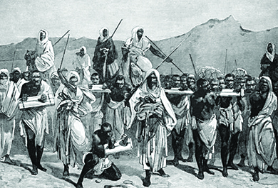
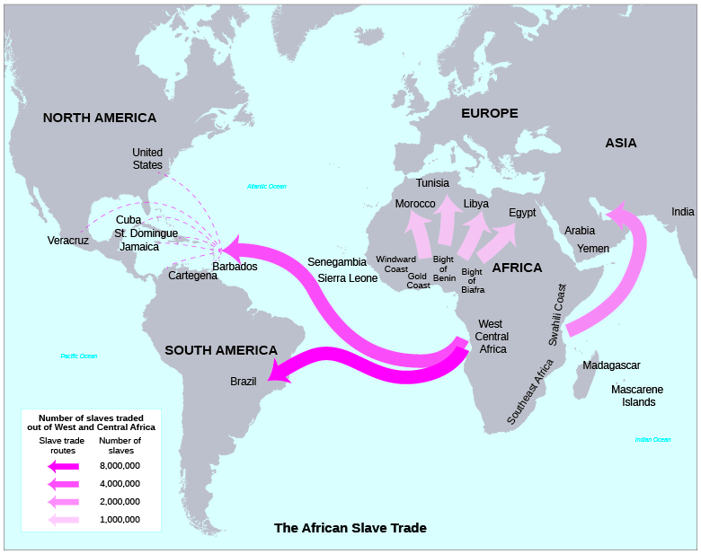

At the end of this section, you will be able to:
* Locate the major West African empires on a map
* Discuss the roles of Islam and Europe in the slave trade

It is difficult to generalize about West Africa, which was linked to the rise and diffusion of Islam. This geographical unit, central to the rise of the Atlantic World, stretches from modern-day Mauritania to the Democratic Republic of the Congo and encompasses lush rainforests along the equator, savannas on either side of the forest, and much drier land to the north. Until about 600 CE, most Africans were hunter-gatherers. Where water was too scarce for farming, herders maintained sheep, goats, cattle, or camels. In the more heavily wooded area near the equator, farmers raised yams, palm products, or plantains. The savanna areas yielded rice, millet, and sorghum. Sub-Saharan Africans had little experience in maritime matters. Most of the population lived away from the coast, which is connected to the interior by five main rivers—the Senegal, Gambia, Niger, Volta, and Congo.

Although there were large trading centers along these rivers, most West Africans lived in small villages and identified with their extended family or their clan. Wives, children, and dependents (including slaves) were a sign of wealth among men, and **polygyny**{: data-type="term"}, the practice of having more than one wife at a time, was widespread. In time of need, relatives, however far away, were counted upon to assist in supplying food or security. Because of the clannish nature of African society, “we” was associated with the village and family members, while “they” included everyone else. Hundreds of separate dialects emerged; in modern Nigeria, nearly five hundred are still spoken.

  
Read [The Role of Islam in African Slavery][1] to learn more about the African slave trade.

### THE MAJOR AFRICAN EMPIRES

Following the death of the prophet Muhammad in 632 CE, Islam continued to spread quickly across North Africa, bringing not only a unifying faith but a political and legal structure as well. As lands fell under the control of **Muslim**{: data-type="term" .no-emphasis} armies, they instituted Islamic rule and legal structures as local chieftains converted, usually under penalty of death. Only those who had converted to Islam could rule or be engaged in trade. The first major empire to emerge in West Africa was the Ghana Empire ([\[link\]](#CNX_History_01_03_AfricanEmp)). By 750, the Soninke farmers of the sub-Sahara had become wealthy by taxing the trade that passed through their area. For instance, the Niger River basin supplied gold to the Berber and Arab traders from west of the Nile Valley, who brought cloth, weapons, and manufactured goods into the interior. Huge Saharan salt mines supplied the life-sustaining mineral to the Mediterranean coast of Africa and inland areas. By 900, the monotheistic Muslims controlled most of this trade and had converted many of the African ruling elite. The majority of the population, however, maintained their tribal animistic practices, which gave living attributes to nonliving objects such as mountains, rivers, and wind. Because Ghana’s king controlled the gold supply, he was able to maintain price controls and afford a strong military. Soon, however, a new kingdom emerged.

 {: #CNX_History_01_03_AfricanEmp}

By 1200 CE, under the leadership of Sundiata Keita, Mali had replaced Ghana as the leading state in West Africa. After Sundiata’s rule, the court converted to Islam, and Muslim scribes played a large part in administration and government. Miners then discovered huge new deposits of gold east of the Niger River. By the fourteenth century, the empire was so wealthy that while on a *hajj*, or pilgrimage to the holy city of Mecca, Mali’s ruler Mansu Musa gave away enough gold to create serious price inflation in the cities along his route. Timbuktu, the capital city, became a leading Islamic center for education, commerce and the slave trade. Meanwhile, in the east, the city of Gao became increasingly strong under the leadership of Sonni Ali and soon eclipsed Mali’s power. Timbuktu sought Ali’s assistance in repelling the Tuaregs from the north. By 1500, however, the Tuareg empire of Songhay had eclipsed Mali, where weak and ineffective leadership prevailed.

### THE ROLE OF SLAVERY

The institution of slavery is not a recent phenomenon. Most civilizations have practiced some form of human bondage and servitude, and African empires were no different ([\[link\]](#CNX_History_01_03_Coffles)). Famine or fear of stronger enemies might force one tribe to ask another for help and give themselves in a type of bondage in exchange. Similar to the European serf system, those seeking protection, or relief from starvation, would become the servants of those who provided relief. Debt might also be worked off through a form of servitude. Typically, these servants became a part of the extended tribal family. There is some evidence of **chattel slavery**{: data-type="term"}, in which people are treated as personal property to be bought and sold, in the Nile Valley. It appears there was a slave-trade route through the Sahara that brought sub-Saharan Africans to Rome, which had slaves from all over the world.

 {: #CNX_History_01_03_Coffles}

Arab slave trading, which exchanged slaves for goods from the Mediterranean, existed long before Islam’s spread across North Africa. Muslims later expanded this trade and enslaved not only Africans but also Europeans, especially from Spain, Sicily, and Italy. Male captives were forced to build coastal fortifications and serve as galley slaves. Women were added to the harem.

The major European slave trade began with Portugal’s exploration of the west coast of Africa in search of a trade route to the East. By 1444, slaves were being brought from Africa to work on the sugar plantations of the Madeira Islands, off the coast of modern Morocco. The slave trade then expanded greatly as European colonies in the New World demanded an ever-increasing number of workers for the extensive plantations growing tobacco, sugar, and eventually rice and cotton ([\[link\]](#CNX_History_01_03_SlaveRoute)).

 {: #CNX_History_01_03_SlaveRoute}

In the New World, the institution of slavery assumed a new aspect when the mercantilist system demanded a permanent, identifiable, and plentiful labor supply. African slaves were both easily identified (by their skin color) and plentiful, because of the thriving slave trade. This led to a race-based slavery system in the New World unlike any bondage system that had come before. Initially, the Spanish tried to force Indians to farm their crops. Most Spanish and Portuguese settlers coming to the New World were gentlemen and did not perform physical labor. They came to “serve God, but also to get rich,” as noted by Bernal Díaz del Castillo. However, enslaved natives tended to sicken or die from disease or from the overwork and cruel treatment they were subjected to, and so the indigenous peoples proved not to be a dependable source of labor. Although he later repented of his ideas, the great defender of the Indians, Bartolomé de Las Casas, seeing the near extinction of the native population, suggested the Spanish send black (and white) laborers to the Indies. These workers proved hardier, and within fifty years, a change took place: The profitability of the African slave trade, coupled with the seemingly limitless number of potential slaves and the Catholic Church’s denunciation of the enslavement of Christians, led race to become a dominant factor in the institution of slavery.

In the English colonies along the Atlantic coast, indentured servants initially filled the need for labor in the North, where family farms were the norm. In the South, however, labor-intensive crops such as tobacco, rice, and indigo prevailed, and eventually the supply of indentured servants was insufficient to meet the demand. These workers served only for periods of three to seven years before being freed; a more permanent labor supply was needed. Thus, whereas in Africa permanent, inherited slavery was unknown, and children of those bound in slavery to the tribe usually were free and intermarried with their captors, this changed in the Americas; slavery became permanent, and children born to slaves became slaves. This development, along with slavery’s identification with race, forever changed the institution and shaped its unique character in the New World.

The Beginnings of Racial Slavery

Slavery has a long history. The ancient Greek philosopher Aristotle posited that some peoples were *homunculi*, or humanlike but not really people—for instance, if they did not speak Greek. Both the Bible and the Koran sanction slavery. Vikings who raided from Ireland to Russia brought back slaves of all nationalities. During the Middle Ages, traders from the interior of Africa brought slaves along well-established routes to sell them along the Mediterranean coast. Initially, slavers also brought European slaves to the Caribbean. Many of these were orphaned or homeless children captured in the cities of Ireland. The question is, when did slavery become based on race? This appears to have developed in the New World, with the introduction of gruelingly labor-intensive crops such as sugar and coffee. Unable to fill their growing need from the ranks of prisoners or indentured servants, the European colonists turned to African laborers. The Portuguese, although seeking a trade route to India, also set up forts along the West African coast for the purpose of exporting slaves to Europe. Historians believe that by the year 1500, 10 percent of the population of Lisbon and Seville consisted of black slaves. Because of the influence of the Catholic Church, which frowned on the enslavement of Christians, European slave traders expanded their reach down the coast of Africa.

When Europeans settled Brazil, the Caribbean, and North America, they thus established a system of racially based slavery. Here, the need for a massive labor force was greater than in western Europe. The land was ripe for growing sugar, coffee, rice, and ultimately cotton. To fulfill the ever-growing demand for these crops, large plantations were created. The success of these plantations depended upon the availability of a permanent, plentiful, identifiable, and skilled labor supply. As Africans were already familiar with animal husbandry as well as farming, had an identifying skin color, and could be readily supplied by the existing African slave trade, they proved the answer to this need. This process set the stage for the expansion of New World slavery into North America.

### Section Summary

Before 1492, Africa, like the Americas, had experienced the rise and fall of many cultures, but the continent did not develop a centralized authority structure. African peoples practiced various forms of slavery, all of which differed significantly from the racial slavery that ultimately developed in the New World. After the arrival of Islam and before the Portuguese came to the coast of West Africa in 1444, Muslims controlled the slave trade out of Africa, which expanded as European powers began to colonize the New World. Driven by a demand for labor, slavery in the Americas developed a new form: It was based on race, and the status of slave was both permanent and inherited.

### Review Questions

The city of \_\_\_\_\_\_\_\_ became a leading center for Muslim scholarship and trade.

1.  Cairo
2.  Timbuktu
3.  Morocco
4.  Mali
{: type="A"}

B

Which of the following does *not* describe a form of slavery traditionally practiced in Africa?

1.  a system in which those in need of supplies or protection give themselves in servitude
2.  a system in which debtors repay those whom they owe by giving themselves in servitude
3.  a system in which people are treated as chattel—that is, as personal property to be bought and sold
4.  a system in which people are enslaved permanently on account of their race
{: type="A"}

D

### Critical Thinking Questions

The Inca were able to control an empire that stretched from modern Colombia to southern Chile. Which of their various means for achieving such control do you think were most effective, and why?

How did the Olmec, Aztec, Inca, Maya, and North American Indians differ in their ways of life and cultural achievements? How did their particular circumstances—geography, history, or the accomplishments of the societies that had preceded them, for example—serve to shape their particular traditions and cultures?

What were the lasting effects of the Crusades? In what ways did they provide opportunities—both negative and positive—for cross-cultural encounters and exchanges?

Was race identified with slavery before the era of European exploration? Why or why not? How did slavery’s association with race change the institution’s character?

What are the differences between the types of slavery traditionally practiced in Africa and the slavery that developed in the New World? How did other types of servitude, such as European serfdom, compare to slavery?

### Glossary
{: data-type="glossary-title"}

chattel slavery
: a system of servitude in which people are treated as personal property to be bought and sold
^

polygyny
: the practice of taking more than one wife

[1]: http://openstaxcollege.org/l/islamslavery
