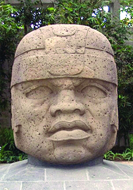
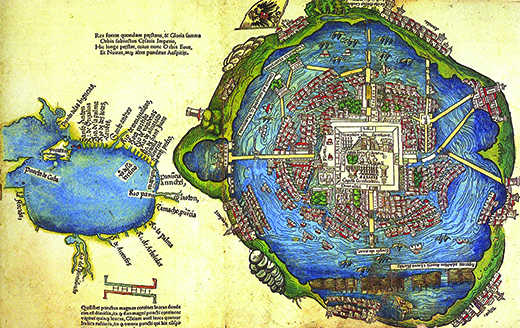
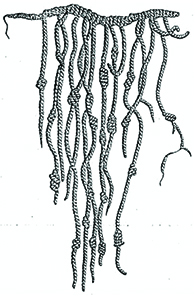
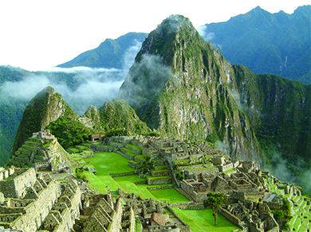
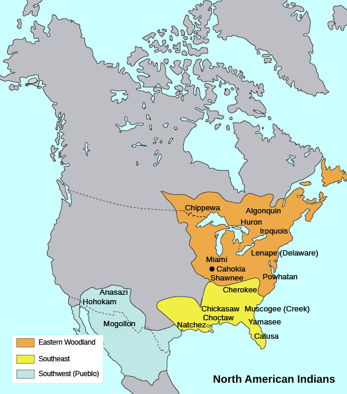

By the end of this section, you will be able to:
* Locate on a map the major American civilizations before the arrival of the Spanish
* Discuss the cultural achievements of these civilizations
* Discuss the differences and similarities between lifestyles, religious practices, and customs among the native peoples

 ![A timeline shows important events of the era. In ca. 13,000 to ca. 7000 BCE, humans cross the land bridge between Asia and North America. In ca. 5000 BCE, corn is domesticated in Mesoamerica; an illustration of the corn plant is shown. In ca. 2000 BCE to ca. 900 CE, Mayan civilization flourishes in the Yucat&#xE1;n Peninsula; Mayan pottery is shown. In 622, Muhammad receives the vision for Islam; an illustration of Muhammad is shown. In ca. 1000, Leif Ericson arrives in present-day Canada; a painting depicting Ericson&#x2019;s arrival is shown. In ca. 1100, Cahokia is at its peak near modern St. Louis. In 1325&#x2013;1521, Aztec civilization flourishes in present-day Mexico; a map of Tenochtitl&#xE1;n is shown. In 1346, the Black Death decimates Europe; an illustration of Black Death victims is shown. In 1492, Columbus arrives in the Bahamas; a painting of Columbus&#x2019;s arrival is shown. In 1400&#x2013;1532, the Inca Empire thrives in South America.](../resources/CNX_History_01_01_Timeline.jpg "(credit: modification of work by Architect of the Capitol)"){: #CNX_History_01_01_Timeline}

Between nine and fifteen thousand years ago, some scholars believe that a land bridge existed between Asia and North America that we now call **Beringia**{: data-type="term"}. The first inhabitants of what would be named the Americas migrated across this bridge in search of food. When the glaciers melted, water engulfed Beringia, and the Bering Strait was formed. Later settlers came by boat across the narrow strait. (The fact that Asians and American Indians share genetic markers on a Y chromosome lends credibility to this migration theory.) Continually moving southward, the settlers eventually populated both North and South America, creating unique cultures that ranged from the highly complex and urban Aztec civilization in what is now Mexico City to the woodland tribes of eastern North America. Recent research along the west coast of South America suggests that migrant populations may have traveled down this coast by water as well as by land.

Researchers believe that about ten thousand years ago, humans also began the domestication of plants and animals, adding agriculture as a means of sustenance to hunting and gathering techniques. With this agricultural revolution, and the more abundant and reliable food supplies it brought, populations grew and people were able to develop a more settled way of life, building permanent settlements. Nowhere in the Americas was this more obvious than in Mesoamerica ([\[link\]](#CNX_History_01_01_Americas)).

 {: #CNX_History_01_01_Americas}

# THE FIRST AMERICANS: THE OLMEC

Mesoamerica is the geographic area stretching from north of Panama up to the desert of central Mexico. Although marked by great topographic, linguistic, and cultural diversity, this region cradled a number of civilizations with similar characteristics. Mesoamericans were **polytheistic**{: data-type="term" .no-emphasis}; their gods possessed both male and female traits and demanded blood sacrifices of enemies taken in battle or ritual bloodletting. Corn, or maize, domesticated by 5000 BCE, formed the basis of their diet. They developed a mathematical system, built huge edifices, and devised a calendar that accurately predicted eclipses and solstices and that priest-astronomers used to direct the planting and harvesting of crops. Most important for our knowledge of these peoples, they created the only known written language in the Western Hemisphere; researchers have made much progress in interpreting the inscriptions on their temples and pyramids. Though the area had no overarching political structure, trade over long distances helped diffuse culture. Weapons made of obsidian, jewelry crafted from jade, feathers woven into clothing and ornaments, and cacao beans that were whipped into a chocolate drink formed the basis of commerce. The mother of Mesoamerican cultures was the Olmec civilization.

Flourishing along the hot Gulf Coast of Mexico from about 1200 to about 400 BCE, the Olmec produced a number of major works of art, architecture, pottery, and sculpture. Most recognizable are their giant head sculptures ([\[link\]](#CNX_History_01_01_Olmec)) and the pyramid in La Venta. The Olmec built aqueducts to transport water into their cities and irrigate their fields. They grew maize, squash, beans, and tomatoes. They also bred small domesticated dogs which, along with fish, provided their protein. Although no one knows what happened to the Olmec after about 400 BCE, in part because the jungle reclaimed many of their cities, their culture was the base upon which the Maya and the Aztec built. It was the Olmec who worshipped a rain god, a maize god, and the feathered serpent so important in the future pantheons of the Aztecs (who called him Quetzalcoatl) and the Maya (to whom he was Kukulkan). The Olmec also developed a system of trade throughout Mesoamerica, giving rise to an elite class.

 {: #CNX_History_01_01_Olmec}

# THE MAYA

After the decline of the Olmec, a city rose in the fertile central highlands of Mesoamerica. One of the largest population centers in pre-Columbian America and home to more than 100,000 people at its height in about 500 CE, Teotihuacan was located about thirty miles northeast of modern Mexico City. The ethnicity of this settlement’s inhabitants is debated; some scholars believe it was a multiethnic city. Large-scale agriculture and the resultant abundance of food allowed time for people to develop special trades and skills other than farming. Builders constructed over twenty-two hundred apartment compounds for multiple families, as well as more than a hundred temples. Among these were the Pyramid of the Sun (which is two hundred feet high) and the Pyramid of the Moon (one hundred and fifty feet high). Near the Temple of the Feathered Serpent, graves have been uncovered that suggest humans were sacrificed for religious purposes. The city was also the center for trade, which extended to settlements on Mesoamerica’s Gulf Coast.

The Maya were one Mesoamerican culture that had strong ties to Teotihuacan. The Maya’s architectural and mathematical contributions were significant. Flourishing from roughly 2000 BCE to 900 CE in what is now Mexico, Belize, Honduras, and Guatemala, the Maya perfected the calendar and written language the Olmec had begun. They devised a written mathematical system to record crop yields and the size of the population, and to assist in trade. Surrounded by farms relying on primitive agriculture, they built the city-states of Copan, Tikal, and Chichen Itza along their major trade routes, as well as temples, statues of gods, pyramids, and astronomical observatories ([\[link\]](#CNX_History_01_01_Chichen)). However, because of poor soil and a drought that lasted nearly two centuries, their civilization declined by about 900 CE and they abandoned their large population centers.

 "){: #CNX_History_01_01_Chichen}

The Spanish found little organized resistance among the weakened Maya upon their arrival in the 1520s. However, they did find Mayan history, in the form of glyphs, or pictures representing words, recorded in folding books called codices (the singular is *codex*). In 1562, Bishop Diego de Landa, who feared the converted natives had reverted to their traditional religious practices, collected and burned every codex he could find. Today only a few survive.

  
Visit the [University of Arizona Library Special Collections][1] to view facsimiles and descriptions of two of the four surviving Mayan codices.

# THE AZTEC

When the Spaniard Hernán Cortés arrived on the coast of Mexico in the sixteenth century, at the site of present-day Veracruz, he soon heard of a great city ruled by an emperor named Moctezuma. This city was tremendously wealthy—filled with gold—and took in tribute from surrounding tribes. The riches and complexity Cortés found when he arrived at that city, known as Tenochtitlán, were far beyond anything he or his men had ever seen.

According to legend, a warlike people called the Aztec (also known as the Mexica) had left a city called Aztlán and traveled south to the site of present-day Mexico City. In 1325, they began construction of Tenochtitlán on an island in Lake Texcoco. By 1519, when Cortés arrived, this settlement contained upwards of 200,000 inhabitants and was certainly the largest city in the Western Hemisphere at that time and probably larger than any European city ([\[link\]](#CNX_History_01_01_Tenochtitl)). One of Cortés’s soldiers, Bernal Díaz del Castillo, recorded his impressions upon first seeing it: “When we saw so many cities and villages built in the water and other great towns on dry land we were amazed and said it was like the enchantments . . . on account of the great towers and cues and buildings rising from the water, and all built of masonry. And some of our soldiers even asked whether the things that we saw were not a dream? . . . I do not know how to describe it, seeing things as we did that had never been heard of or seen before, not even dreamed about.”

 {: #CNX_History_01_01_Tenochtitl}

Unlike the dirty, fetid cities of Europe at the time, Tenochtitlán was well planned, clean, and orderly. The city had neighborhoods for specific occupations, a trash collection system, markets, two aqueducts bringing in fresh water, and public buildings and temples. Unlike the Spanish, Aztecs bathed daily, and wealthy homes might even contain a steam bath. A labor force of slaves from subjugated neighboring tribes had built the fabulous city and the three causeways that connected it to the mainland. To farm, the Aztec constructed barges made of reeds and filled them with fertile soil. Lake water constantly irrigated these ***chinampas***{: data-type="term"}, or “floating gardens,” which are still in use and can be seen today in Xochimilco, a district of Mexico City.

Each god in the Aztec pantheon represented and ruled an aspect of the natural world, such as the heavens, farming, rain, fertility, sacrifice, and combat. A ruling class of warrior nobles and priests performed ritual human sacrifice daily to sustain the sun on its long journey across the sky, to appease or feed the gods, and to stimulate agricultural production. The sacrificial ceremony included cutting open the chest of a criminal or captured warrior with an obsidian knife and removing the still-beating heart ([\[link\]](#CNX_History_01_01_Aztec)).

 {: #CNX_History_01_01_Aztec}

  
Explore [Aztec-History.com][2] to learn more about the Aztec creation story.

The Aztec Predict the Coming of the Spanish

The following is an excerpt from the sixteenth-century Florentine Codex of the writings of Fray Bernardino de Sahagun, a priest and early chronicler of Aztec history. When an old man from Xochimilco first saw the Spanish in Veracruz, he recounted an earlier dream to Moctezuma, the ruler of the Aztecs.

\> Said Quzatli to the sovereign, “Oh mighty lord, if because I tell you the truth I am to die, nevertheless I am here in your presence and you may do what you wish to me!” He narrated that mounted men would come to this land in a great wooden house \[ships\] this structure was to lodge many men, serving them as a home; within they would eat and sleep. On the surface of this house they would cook their food, walk and play as if they were on firm land. They were to be white, bearded men, dressed in different colors and on their heads they would wear round coverings.

Ten years before the arrival of the Spanish, Moctezuma received several omens which at the time he could not interpret. A fiery object appeared in the night sky, a spontaneous fire broke out in a religious temple and could not be extinguished with water, a water spout appeared in Lake Texcoco, and a woman could be heard wailing, “O my children we are about to go forever.” Moctezuma also had dreams and premonitions of impending disaster. These foretellings were recorded after the Aztecs’ destruction. They do, however, give us insight into the importance placed upon signs and omens in the pre-Columbian world.

# THE INCA

In South America, the most highly developed and complex society was that of the Inca, whose name means “lord” or “ruler” in the Andean language called Quechua. At its height in the fifteenth and sixteenth centuries, the Inca Empire, located on the Pacific coast and straddling the Andes Mountains, extended some twenty-five hundred miles. It stretched from modern-day Colombia in the north to Chile in the south and included cities built at an altitude of 14,000 feet above sea level. Its road system, kept free of debris and repaired by workers stationed at varying intervals, rivaled that of the Romans and efficiently connected the sprawling empire. The Inca, like all other pre-Columbian societies, did not use axle-mounted wheels for transportation. They built stepped roads to ascend and descend the steep slopes of the Andes; these would have been impractical for wheeled vehicles but worked well for pedestrians. These roads enabled the rapid movement of the highly trained Incan army. Also like the Romans, the Inca were effective administrators. Runners called ***chasquis***{: data-type="term"} traversed the roads in a continuous relay system, ensuring quick communication over long distances. The Inca had no system of writing, however. They communicated and kept records using a system of colored strings and knots called the ***quipu***{: data-type="term"} ([\[link\]](#CNX_History_01_01_Quipu)).

 {: #CNX_History_01_01_Quipu}

The Inca people worshipped their lord who, as a member of an elite ruling class, had absolute authority over every aspect of life. Much like feudal lords in Europe at the time, the ruling class lived off the labor of the peasants, collecting vast wealth that accompanied them as they went, mummified, into the next life. The Inca farmed corn, beans, squash, quinoa (a grain cultivated for its seeds), and the indigenous potato on terraced land they hacked from the steep mountains. Peasants received only one-third of their crops for themselves. The Inca ruler required a third, and a third was set aside in a kind of welfare system for those unable to work. Huge storehouses were filled with food for times of need. Each peasant also worked for the Inca ruler a number of days per month on public works projects, a requirement known as the ***mita***{: data-type="term"}. For example, peasants constructed rope bridges made of grass to span the mountains above fast-flowing icy rivers. In return, the lord provided laws, protection, and relief in times of famine.

The Inca worshipped the sun god Inti and called gold the “sweat” of the sun. Unlike the Maya and the Aztecs, they rarely practiced human sacrifice and usually offered the gods food, clothing, and coca leaves. In times of dire emergency, however, such as in the aftermath of earthquakes, volcanoes, or crop failure, they resorted to sacrificing prisoners. The ultimate sacrifice was children, who were specially selected and well fed. The Inca believed these children would immediately go to a much better afterlife.

In 1911, the American historian Hiram Bingham uncovered the lost Incan city of Machu Picchu ([\[link\]](#CNX_History_01_01_Machu)). Located about fifty miles northwest of Cusco, Peru, at an altitude of about 8,000 feet, the city had been built in 1450 and inexplicably abandoned roughly a hundred years later. Scholars believe the city was used for religious ceremonial purposes and housed the priesthood. The architectural beauty of this city is unrivaled. Using only the strength of human labor and no machines, the Inca constructed walls and buildings of polished stones, some weighing over fifty tons, that were fitted together perfectly without the use of mortar. In 1983, UNESCO designated the ruined city a World Heritage Site.

 {: #CNX_History_01_01_Machu}

  
Browse the [British Museum’s World Cultures collection][3] to see more examples and descriptions of Incan (as well as Aztec, Mayan, and North American Indian) art.

# NORTH AMERICAN INDIANS

With few exceptions, the North American native cultures were much more widely dispersed than the Mayan, Aztec, and Incan societies, and did not have their population size or organized social structures. Although the cultivation of corn had made its way north, many Indians still practiced hunting and gathering. Horses, first introduced by the Spanish, allowed the Plains Indians to more easily follow and hunt the huge herds of bison. A few societies had evolved into relatively complex forms, but they were already in decline at the time of Christopher Columbus’s arrival.

In the southwestern part of today’s United States dwelled several groups we collectively call the Pueblo. The Spanish first gave them this name, which means “town” or “village,” because they lived in towns or villages of permanent stone-and-mud buildings with thatched roofs. Like present-day apartment houses, these buildings had multiple stories, each with multiple rooms. The three main groups of the Pueblo people were the Mogollon, Hohokam, and Anasazi.

The Mogollon thrived in the Mimbres Valley (New Mexico) from about 150 BCE to 1450 CE. They developed a distinctive artistic style for painting bowls with finely drawn geometric figures and wildlife, especially birds, in black on a white background. Beginning about 600 CE, the Hohokam built an extensive irrigation system of canals to irrigate the desert and grow fields of corn, beans, and squash. By 1300, their crop yields were supporting the most highly populated settlements in the southwest. The Hohokam decorated pottery with a red-on-buff design and made jewelry of turquoise. In the high desert of New Mexico, the Anasazi, whose name means “ancient enemy” or “ancient ones,” carved homes from steep cliffs accessed by ladders or ropes that could be pulled in at night or in case of enemy attack ([\[link\]](#CNX_History_01_01_Anasazi)).

  in Arizona and Mesa Verde National Park in Colorado."){: #CNX_History_01_01_Anasazi}

Roads extending some 180 miles connected the Pueblos’ smaller urban centers to each other and to Chaco Canyon, which by 1050 CE had become the administrative, religious, and cultural center of their civilization. A century later, however, probably because of drought, the Pueblo peoples abandoned their cities. Their present-day descendants include the Hopi and Zuni tribes.

The Indian groups who lived in the present-day Ohio River Valley and achieved their cultural apex from the first century CE to 400 CE are collectively known as the Hopewell culture. Their settlements, unlike those of the southwest, were small hamlets. They lived in wattle-and-daub houses (made from woven lattice branches “daubed” with wet mud, clay, or sand and straw) and practiced agriculture, which they supplemented by hunting and fishing. Utilizing waterways, they developed trade routes stretching from Canada to Louisiana, where they exchanged goods with other tribes and negotiated in many different languages. From the coast they received shells; from Canada, copper; and from the Rocky Mountains, obsidian. With these materials they created necklaces, woven mats, and exquisite carvings. What remains of their culture today are huge burial mounds and earthworks. Many of the mounds that were opened by archaeologists contained artworks and other goods that indicate their society was socially stratified.

Perhaps the largest indigenous cultural and population center in North America was located along the Mississippi River near present-day St. Louis. At its height in about 1100 CE, this five-square-mile city, now called Cahokia, was home to more than ten thousand residents; tens of thousands more lived on farms surrounding the urban center. The city also contained one hundred and twenty earthen mounds or pyramids, each dominating a particular neighborhood and on each of which lived a leader who exercised authority over the surrounding area. The largest mound covered fifteen acres. Cahokia was the hub of political and trading activities along the Mississippi River. After 1300 CE, however, this civilization declined—possibly because the area became unable to support the large population.

# INDIANS OF THE EASTERN WOODLAND

Encouraged by the wealth found by the Spanish in the settled civilizations to the south, fifteenth- and sixteenth-century English, Dutch, and French explorers expected to discover the same in North America. What they found instead were small, disparate communities, many already ravaged by European diseases brought by the Spanish and transmitted among the natives. Rather than gold and silver, there was an abundance of land, and the timber and fur that land could produce.

The Indians living east of the Mississippi did not construct the large and complex societies of those to the west. Because they lived in small autonomous clans or tribal units, each group adapted to the specific environment in which it lived ([\[link\]](#CNX_History_01_01_Tribes)). These groups were by no means unified, and warfare among tribes was common as they sought to increase their hunting and fishing areas. Still, these tribes shared some common traits. A chief or group of tribal elders made decisions, and although the chief was male, usually the women selected and counseled him. Gender roles were not as fixed as they were in the patriarchal societies of Europe, Mesoamerica, and South America.

 {: #CNX_History_01_01_Tribes}

Women typically cultivated corn, beans, and squash and harvested nuts and berries, while men hunted, fished, and provided protection. But both took responsibility for raising children, and most major Indian societies in the east were matriarchal. In tribes such as the Iroquois, Lenape, Muscogee, and Cherokee, women had both power and influence. They counseled the chief and passed on the traditions of the tribe. This **matriarchy**{: data-type="term"} changed dramatically with the coming of the Europeans, who introduced, sometimes forcibly, their own customs and traditions to the natives.

Clashing beliefs about land ownership and use of the environment would be the greatest area of conflict with Europeans. Although tribes often claimed the right to certain hunting grounds—usually identified by some geographical landmark—Indians did not practice, or in general even have the concept of, private ownership of land. A person’s possessions included only what he or she had made, such as tools or weapons. The European Christian worldview, on the other hand, viewed land as the source of wealth. According to the Christian Bible, God created humanity in his own image with the command to use and subdue the rest of creation, which included not only land, but also all animal life. Upon their arrival in North America, Europeans found no fences, no signs designating ownership. Land, and the game that populated it, they believed, were there for the taking.

# Section Summary

Great civilizations had risen and fallen in the Americas before the arrival of the Europeans. In North America, the complex Pueblo societies including the Mogollon, Hohokam, and Anasazi as well as the city at Cahokia had peaked and were largely memories. The Eastern Woodland peoples were thriving, but they were soon overwhelmed as the number of English, French, and Dutch settlers increased.

Mesoamerica and South America had also witnessed the rise and fall of cultures. The once-mighty Mayan population centers were largely empty. In 1492, however, the Aztecs in Mexico City were at their peak. Subjugating surrounding tribes and requiring tribute of both humans for sacrifice and goods for consumption, the island city of Tenochtitlán was the hub of an ever-widening commercial center and the equal of any large European city until Cortés destroyed it. Further south in Peru, the Inca linked one of the largest empires in history through the use of roads and disciplined armies. Without the use of the wheel, they cut and fashioned stone to build Machu Picchu high in the Andes before abandoning the city for unknown reasons. Thus, depending on what part of the New World they explored, the Europeans encountered peoples that diverged widely in their cultures, traditions, and numbers.

# Review Questions

Which of the following Indian peoples built homes in cliff dwellings that still exist?

1.  Anasazi
2.  Cherokee
3.  Aztec
4.  Inca
{: data-number-style="upper-alpha"}

A

Which culture developed the only writing system in the Western Hemisphere?

1.  Inca
2.  Iroquois
3.  Maya
4.  Pueblo
{: data-number-style="upper-alpha"}

C

Which culture developed a road system rivaling that of the Romans?

1.  Cherokee
2.  Inca
3.  Olmec
4.  Anasazi
{: data-number-style="upper-alpha"}

B

What were the major differences between the societies of the Aztec, Inca, and Maya and the Indians of North America?

North American Indians were fewer in number, more widely dispersed, and did not have the population size or organized social structures of the Maya, Aztec, or Inca societies. The Eastern Woodland peoples, in particular, lived in small clan groups and adapted to their singular environments. Some North American Indians lived by hunting and gathering rather than cultivating crops.

## Glossary
{: data-type="glossary-title"}

Beringia
: an ancient land bridge linking Asia and North America
{: .definition}

*chasquis*
: Incan relay runners used to send messages over great distances
{: .definition}

*chinampas*
: floating Aztec gardens consisting of a large barge woven from reeds, filled with dirt and floating on the water, allowing for irrigation
{: .definition}

matriarchy
: a society in which women have political power
{: .definition}

*mita*
: the Incan labor tax, with each family donating time and work to communal projects
{: .definition}

*quipu*
: an ancient Incan device for recording information, consisting of variously colored threads knotted in different ways
{: .definition}

[1]: http://openstaxcollege.org/l/mayancodex
[2]: http://openstaxcollege.org/l/azteccreation
[3]: http://openstaxcollege.org/l/inca
