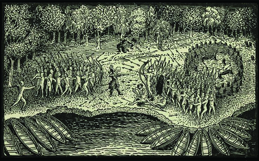
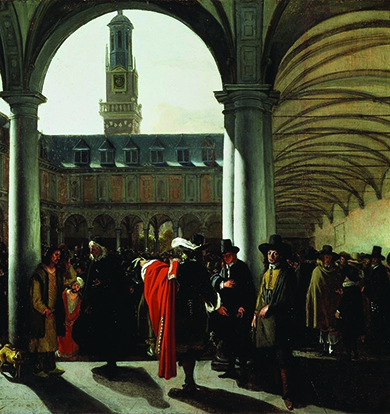

By the end of this section, you will be able to:
* Identify regions where the English, French, and Dutch explored and established settlements
* Describe the differences among the early colonies
* Explain the role of the American colonies in European nations’ struggles for domination

For Europeans, the discovery of an Atlantic World meant newfound wealth in the form of gold and silver as well as valuable furs. The Americas also provided a new arena for intense imperial rivalry as different European nations jockeyed for preeminence in the New World. The religious motives for colonization spurred European expansion as well, and as the Protestant Reformation gained ground beginning in the 1520s, rivalries between Catholic and Protestant Christians spilled over into the Americas.

# ENGLISH EXPLORATION

Disruptions during the Tudor monarchy—especially the creation of the Protestant Church of England by Henry VIII in the 1530s, the return of the nation to Catholicism under Queen Mary in the 1550s, and the restoration of Protestantism under Queen Elizabeth—left England with little energy for overseas projects. More important, England lacked the financial resources for such endeavors. Nonetheless, English monarchs carefully monitored developments in the new Atlantic World and took steps to assert England’s claim to the Americas. As early as 1497, Henry VII of England had commissioned John Cabot, an Italian mariner, to explore new lands. Cabot sailed from England that year and made landfall somewhere along the North American coastline. For the next century, English fishermen routinely crossed the Atlantic to fish the rich waters off the North American coast. However, English colonization efforts in the 1500s were closer to home, as England devoted its energy to the colonization of Ireland.

Queen Elizabeth favored England’s advance into the Atlantic World, though her main concern was blocking Spain’s effort to eliminate Protestantism. Indeed, England could not commit to large-scale colonization in the Americas as long as Spain appeared ready to invade Ireland or Scotland. Nonetheless, Elizabeth approved of English **privateers**{: data-type="term"}, sea captains to whom the home government had given permission to raid the enemy at will. These skilled mariners cruised the Caribbean, plundering Spanish ships whenever they could. Each year the English took more than £100,000 from Spain in this way; English privateer Francis Drake first made a name for himself when, in 1573, he looted silver, gold, and pearls worth £40,000.

Elizabeth did sanction an early attempt at colonization in 1584, when Sir Walter Raleigh, a favorite of the queen’s, attempted to establish a colony at **Roanoke**{: data-type="term"}, an island off the coast of present-day North Carolina. The colony was small, consisting of only 117 people, who suffered a poor relationship with the local Indians, the Croatans, and struggled to survive in their new land ([\[link\]](#CNX_History_02_03_Hariot)). Their governor, John White, returned to England in late 1587 to secure more people and supplies, but events conspired to keep him away from Roanoke for three years. By the time he returned in 1590, the entire colony had vanished. The only trace the colonists left behind was the word *Croatoan* carved into a fence surrounding the village. Governor White never knew whether the colonists had decamped for nearby Croatoan Island (now Hatteras) or whether some disaster had befallen them all. Roanoke is still called “the lost colony.”

  by Theodor de Bry, shows the ingenuity and wisdom of the &#x201C;savages&#x201D; of the New World. (credit: UNC Chapel Hill)"){: #CNX_History_02_03_Hariot}

English promoters of colonization pushed its commercial advantages and the religious justification that English colonies would allow the establishment of Protestantism in the Americas. Both arguments struck a chord. In the early 1600s, wealthy English merchants and the landed elite began to pool their resources to form **joint stock companies**{: data-type="term"}. In this novel business arrangement, which was in many ways the precursor to the modern corporation, investors provided the capital for and assumed the risk of a venture in order to reap significant returns. The companies gained the approval of the English crown to establish colonies, and their investors dreamed of reaping great profits from the money they put into overseas colonization.

The first permanent English settlement was established by a joint stock company, the Virginia Company. Named for Elizabeth, the “virgin queen,” the company gained royal approval to establish a colony on the east coast of North America, and in 1606, it sent 144 men and boys to the New World. In early 1607, this group sailed up Chesapeake Bay. Finding a river they called the James in honor of their new king, James I, they established a ramshackle settlement and named it Jamestown. Despite serious struggles, the colony survived.

Many of Jamestown’s settlers were desperate men; although they came from elite families, they were younger sons who would not inherit their father’s estates. The Jamestown adventurers believed they would find instant wealth in the New World and did not actually expect to have to perform work. Henry Percy, the eighth son of the Earl of Northumberland, was among them. His account, excerpted below, illustrates the hardships the English confronted in Virginia in 1607.

George Percy and the First Months at Jamestown

The 144 men and boys who started the Jamestown colony faced many hardships; by the end of the first winter, only 38 had survived. Disease, hunger, and poor relationships with local natives all contributed to the colony’s high death toll. George Percy, who served twice as governor of Jamestown, kept records of the colonists’ first months in the colony. These records were later published in London in 1608. This excerpt is from his account of August and September of 1607.

\> The fourth day of September died Thomas Jacob Sergeant. The fifth day, there died Benjamin Beast. Our men were destroyed with cruel diseases, as Swellings, Fluxes, Burning Fevers, and by wars, and some departed suddenly, but for the most part they died of mere famine. There were never Englishmen left in a foreign Country in such misery as we were in this new discovered Virginia. . . . Our food was but a small Can of Barley sod\* in water, to five men a day, our drink cold water taken out of the River, which was at a flood very salty, at a low tide full of slime and filth, which was the destruction of many of our men. Thus we lived for the space of five months in this miserable distress, not having five able men to man our Bulwarks upon any occasion. If it had not pleased God to have put a terror in the Savages’ hearts, we had all perished by those wild and cruel Pagans, being in that weak estate as we were; our men night and day groaning in every corner of the Fort most pitiful to hear. If there were any conscience in men, it would make their hearts to bleed to hear the pitiful murmurings and outcries of our sick men without relief, every night and day, for the space of six weeks, some departing out of the World, many times three or four in a night; in the morning, their bodies trailed out of their Cabins like Dogs to be buried. In this sort did I see the mortality of diverse of our people.

\> *\*soaked*

According to George Percy’s account, what were the major problems the Jamestown settlers encountered? What kept the colony from complete destruction?

By any measure, England came late to the race to colonize. As Jamestown limped along in the 1610s, the Spanish Empire extended around the globe and grew rich from its global colonial project. Yet the English persisted, and for this reason the Jamestown settlement has a special place in history as the first permanent colony in what later became the United States.

After Jamestown’s founding, English colonization of the New World accelerated. In 1609, a ship bound for Jamestown foundered in a storm and landed on Bermuda. (Some believe this incident helped inspire Shakespeare’s 1611 play *The Tempest*.) The admiral of the ship, George Somers, claimed the island for the English crown. The English also began to colonize small islands in the Caribbean, an incursion into the Spanish American empire. They established themselves on small islands such as St. Christopher (1624), Barbados (1627), Nevis (1628), Montserrat (1632), and Antigua (1632).

From the start, the English West Indies had a commercial orientation, for these islands produced cash crops: first tobacco and then sugar. Very quickly, by the mid-1600s, Barbados had become one of the most important English colonies because of the sugar produced there. Barbados was the first English colony dependent on slaves, and it became a model for other English slave societies on the American mainland. These differed radically from England itself, where slavery was not practiced.

English Puritans also began to colonize the Americas in the 1620s and 1630s. These intensely religious migrants dreamed of creating communities of reformed Protestantism where the corruption of England would be eliminated. One of the first groups of Puritans to remove to North America, known as **Pilgrims**{: data-type="term"} and led by William Bradford, had originally left England to live in the Netherlands. Fearing their children were losing their English identity among the Dutch, however, they sailed for North America in 1620 to settle at Plymouth, the first English settlement in New England. The Pilgrims differed from other Puritans in their insistence on separating from what they saw as the corrupt Church of England. For this reason, Pilgrims are known as **Separatists**{: data-type="term"}.

Like Jamestown, Plymouth occupies an iconic place in American national memory. The tale of the 102 migrants who crossed the Atlantic aboard the ***Mayflower***{: data-type="term" .no-emphasis} and their struggle for survival is a well-known narrative of the founding of the country. Their story includes the signing of the Mayflower Compact, a written agreement whereby the English voluntarily agreed to help each other. Some interpret this 1620 document as an expression of democratic spirit because of the cooperative and inclusive nature of the agreement to live and work together. In 1630, a much larger contingent of Puritans left England to escape conformity to the Church of England and founded the Massachusetts Bay Colony. In the following years, thousands more arrived to create a new life in the rocky soils and cold climates of New England.

In comparison to Catholic Spain, however, Protestant England remained a very weak imperial player in the early seventeenth century, with only a few infant colonies in the Americas in the early 1600s. The English never found treasure equal to that of the Aztec city of Tenochtitlán, and England did not quickly grow rich from its small American outposts. The English colonies also differed from each other; Barbados and Virginia had a decidedly commercial orientation from the start, while the Puritan colonies of New England were intensely religious at their inception. All English settlements in America, however, marked the increasingly important role of England in the Atlantic World.

# FRENCH EXPLORATION

Spanish exploits in the New World whetted the appetite of other would-be imperial powers, including France. Like Spain, France was a Catholic nation and committed to expanding Catholicism around the globe. In the early sixteenth century, it joined the race to explore the New World and exploit the resources of the Western Hemisphere. Navigator Jacques Cartier claimed northern North America for France, naming the area New France. From 1534 to 1541, he made three voyages of discovery on the Gulf of St. Lawrence and the St. Lawrence River. Like other explorers, Cartier made exaggerated claims of mineral wealth in America, but he was unable to send great riches back to France. Due to resistance from the native peoples as well as his own lack of planning, he could not establish a permanent settlement in North America.

Explorer Samuel de Champlain occupies a special place in the history of the Atlantic World for his role in establishing the French presence in the New World. Champlain explored the Caribbean in 1601 and then the coast of New England in 1603 before traveling farther north. In 1608 he founded Quebec, and he made numerous Atlantic crossings as he worked tirelessly to promote New France. Unlike other imperial powers, France—through Champlain’s efforts—fostered especially good relationships with native peoples, paving the way for French exploration further into the continent: around the Great Lakes, around Hudson Bay, and eventually to the Mississippi. Champlain made an alliance with the Huron confederacy and the Algonquins and agreed to fight with them against their enemy, the Iroquois ([\[link\]](#CNX_History_02_03_Champlain)).

 {: #CNX_History_02_03_Champlain}

The French were primarily interested in establishing commercially viable colonial outposts, and to that end, they created extensive trading networks in New France. These networks relied on native hunters to harvest furs, especially beaver pelts, and to exchange these items for French glass beads and other trade goods. (French fashion at the time favored broad-brimmed hats trimmed in beaver fur, so French traders had a ready market for their North American goods.) The French also dreamed of replicating the wealth of Spain by colonizing the tropical zones. After Spanish control of the Caribbean began to weaken, the French turned their attention to small islands in the West Indies, and by 1635 they had colonized two, Guadeloupe and Martinique. Though it lagged far behind Spain, France now boasted its own West Indian colonies. Both islands became lucrative sugar plantation sites that turned a profit for French planters by relying on African slave labor.

  
To see how cartographers throughout history documented the exploration of the Atlantic World, browse the hundreds of digitized historical maps that make up the collection [American Shores: Maps of the Middle Atlantic Region to 1850][1] at the New York Public Library.

# DUTCH COLONIZATION

Dutch entrance into the Atlantic World is part of the larger story of religious and imperial conflict in the early modern era. In the 1500s, Calvinism, one of the major Protestant reform movements, had found adherents in the northern provinces of the Spanish Netherlands. During the sixteenth century, these provinces began a long struggle to achieve independence from Catholic Spain. Established in 1581 but not recognized as independent by Spain until 1648, the Dutch Republic, or Holland, quickly made itself a powerful force in the race for Atlantic colonies and wealth. The Dutch distinguished themselves as commercial leaders in the seventeenth century ([\[link\]](#CNX_History_02_03_Amsterdam)), and their mode of colonization relied on powerful corporations: the Dutch East India Company, chartered in 1602 to trade in Asia, and the Dutch West India Company, established in 1621 to colonize and trade in the Americas.

 {: #CNX_History_02_03_Amsterdam}

While employed by the Dutch East India Company in 1609, the English sea captain Henry Hudson explored New York Harbor and the river that now bears his name. Like many explorers of the time, Hudson was actually seeking a northwest passage to Asia and its wealth, but the ample furs harvested from the region he explored, especially the coveted beaver pelts, provided a reason to claim it for the Netherlands. The Dutch named their colony New Netherlands, and it served as a fur-trading outpost for the expanding and powerful Dutch West India Company. With headquarters in New Amsterdam on the island of Manhattan, the Dutch set up several regional trading posts, including one at Fort Orange—named for the royal Dutch House of Orange-Nassau—in present-day Albany. (The color orange remains significant to the Dutch, having become particularly associated with William of Orange, Protestantism, and the Glorious Revolution of 1688.) A brisk trade in furs with local Algonquian and Iroquois peoples brought the Dutch and native peoples together in a commercial network that extended throughout the Hudson River Valley and beyond.

The Dutch West India Company in turn established colonies on Aruba, Bonaire, and Curaçao, St. Martin, St. Eustatius, and Saba. With their outposts in New Netherlands and the Caribbean, the Dutch had established themselves in the seventeenth century as a commercially powerful rival to Spain. Amsterdam became a trade hub for all the Atlantic World.

# Section Summary

By the beginning of the seventeenth century, Spain’s rivals—England, France, and the Dutch Republic—had each established an Atlantic presence, with greater or lesser success, in the race for imperial power. None of the new colonies, all in the eastern part of North America, could match the Spanish possessions for gold and silver resources. Nonetheless, their presence in the New World helped these nations establish claims that they hoped could halt the runaway growth of Spain’s Catholic empire. English colonists in Virginia suffered greatly, expecting riches to fall into their hands and finding reality a harsh blow. However, the colony at Jamestown survived, and the output of England’s islands in the West Indies soon grew to be an important source of income for the country. New France and New Netherlands were modest colonial holdings in the northeast of the continent, but these colonies’ thriving fur trade with native peoples, and their alliances with those peoples, helped to create the foundation for later shifts in the global balance of power.

# Review Questions

Why didn’t England make stronger attempts to colonize the New World before the late sixteenth to early seventeenth century? 

English attention was turned to internal struggles and the encroaching Catholic menace to Scotland and Ireland.

The English monarchy did not want to declare direct war on Spain by attempting to colonize the Americas.

The English military was occupied in battling for control of New Netherlands.

The English crown refused to fund colonial expeditions.

A

What was the main goal of the French in colonizing the Americas? 

establishing a colony with French subjects

trading, especially for furs

gaining control of shipping lanes

spreading Catholicism among native peoples

B

What were some of the main differences among the non-Spanish colonies?

Many English colonists in Virginia were aristocrats who had never worked and didn’t expect to start. They hoped to find gold and silver and were unprepared for the realities of colonial life. Farther north, the English Puritan colonies were largely founded not for profit but for religious reasons. The French and Dutch colonies were primarily trading posts. Their colonists enjoyed good relationships with many native groups because they made alliances with and traded with them.

## Glossary
{: data-type="glossary-title"}

joint stock company
: a business entity in which investors provide the capital and assume the risk in order to reap significant returns
{: .definition}

Pilgrims
: Separatists, led by William Bradford, who established the first English settlement in New England
{: .definition}

privateers
: sea captains to whom the British government had given permission to raid Spanish ships at will
{: .definition}

Roanoke
: the first English colony in Virginia, which mysteriously disappeared sometime between 1587 and 1590
{: .definition}

Separatists
: a faction of Puritans who advocated complete separation from the Church of England
{: .definition}

[1]: http://openstaxcollege.org/l/nypl
