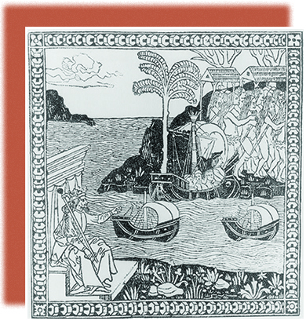

<cnx-pi data-type="cnx.flag.introduction"> class="introduction" </cnx-pi>

* Portuguese Exploration and Spanish Conquest
* Religious Upheavals in the Developing Atlantic World
* Challenges to Spain’s Supremacy
* New Worlds in the Americas: Labor, Commerce, and the Columbian Exchange

<cnx-pi data-type="cnx.eoc">class="summary" title="Summary"</cnx-pi>

<cnx-pi data-type="cnx.eoc">class="review-questions" title="Review Questions"</cnx-pi>

<cnx-pi data-type="cnx.eoc">class="critical-thinking" title="Critical Thinking Questions"</cnx-pi>

<cnx-pi data-type="cnx.eoc">class="references" title="References"</cnx-pi>

 {: #CNX_History_02_00_Ferdinand}

The story of the Atlantic World is the story of global migration, a migration driven in large part by the actions and aspirations of the ruling heads of Europe. Columbus is hardly visible in this illustration of his ships making landfall on the Caribbean island of Hispaniola ([\[link\]](#CNX_History_02_00_Ferdinand)). Instead, Ferdinand II of Spain (in the foreground) sits on his throne and points toward Columbus’s landing. As the ships arrive, the Arawak people tower over the Spanish, suggesting the native population density of the islands.

This historic moment in 1492 sparked new rivalries among European powers as they scrambled to create New World colonies, fueled by the quest for wealth and power as well as by religious passions. Almost continuous war resulted. Spain achieved early preeminence, creating a far-flung empire and growing rich with treasures from the Americas. Native Americans who confronted the newcomers from Europe suffered unprecedented losses of life, however, as previously unknown diseases sliced through their populations. They also were victims of the arrogance of the Europeans, who viewed themselves as uncontested masters of the New World, sent by God to bring Christianity to the “Indians.”

