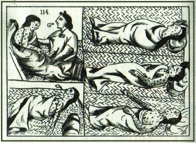

By the end of this section, you will be able to:
* Describe how Europeans solved their labor problems
* Describe the theory of mercantilism and the process of commodification
* Analyze the effects of the Columbian Exchange

European promoters of colonization claimed the Americas overflowed with a wealth of treasures. Burnishing national glory and honor became entwined with carving out colonies, and no nation wanted to be left behind. However, the realities of life in the Americas—violence, exploitation, and particularly the need for workers—were soon driving the practice of slavery and forced labor. Everywhere in America a stark contrast existed between freedom and slavery. The Columbian Exchange, in which Europeans transported plants, animals, and diseases across the Atlantic in both directions, also left a lasting impression on the Americas.

# LABOR SYSTEMS

Physical power—to work the fields, build villages, process raw materials—is a necessity for maintaining a society. During the sixteenth and seventeenth centuries, humans could derive power only from the wind, water, animals, or other humans. Everywhere in the Americas, a crushing demand for labor bedeviled Europeans because there were not enough colonists to perform the work necessary to keep the colonies going. Spain granted ***encomiendas***{: data-type="term"}—legal rights to native labor—to conquistadors who could prove their service to the crown. This system reflected the Spanish view of colonization: the king rewarded successful conquistadors who expanded the empire. Some native peoples who had sided with the conquistadors, like the Tlaxcalan, also gained *encomiendas*; Malintzin, the Nahua woman who helped Cortés defeat the Mexica, was granted one.

The Spanish believed native peoples would work for them by right of conquest, and, in return, the Spanish would bring them Catholicism. In theory the relationship consisted of reciprocal obligations, but in practice the Spaniards ruthlessly exploited it, seeing native people as little more than beasts of burden. Convinced of their right to the land and its peoples, they sought both to control native labor and to impose what they viewed as correct religious beliefs upon the land’s inhabitants. Native peoples everywhere resisted both the labor obligations and the effort to change their ancient belief systems. Indeed, many retained their religion or incorporated only the parts of Catholicism that made sense to them.

The system of *encomiendas* was accompanied by a great deal of violence ([\[link\]](#CNX_History_02_04_Encomienda)). One Spaniard, Bartolomé de Las Casas , denounced the brutality of Spanish rule. A Dominican friar, Las Casas had been one of the earliest Spanish settlers in the Spanish West Indies. In his early life in the Americas, he owned Indian slaves and was the recipient of an *encomienda*. However, after witnessing the savagery with which *encomenderos* (recipients of *encomiendas*) treated the native people, he reversed his views. In 1515, Las Casas released his native slaves, gave up his *encomienda*, and began to advocate for humane treatment of native peoples. He lobbied for new legislation, eventually known as the New Laws, which would eliminate slavery and the *encomienda* system.

 , a well-dressed Spaniard is shown pulling the hair of a bleeding, severely injured native. The drawing was part of a complaint about Spanish abuses of their encomiendas."){: #CNX_History_02_04_Encomienda}

Las Casas’s writing about the Spaniards’ horrific treatment of Indians helped inspire the so-called **Black Legend**{: data-type="term"}, the idea that the Spanish were bloodthirsty conquerors with no regard for human life. Perhaps not surprisingly, those who held this view of the Spanish were Spain’s imperial rivals. English writers and others seized on the idea of Spain’s ruthlessness to support their own colonization projects. By demonizing the Spanish, they justified their own efforts as more humane. All European colonizers, however, shared a disregard for Indians.

Bartolomé de Las Casas on the Mistreatment of Indians

Bartolomé de Las Casas’s *A Short Account of the Destruction of the Indies*, written in 1542 and published ten years later, detailed for Prince Philip II of Spain how Spanish colonists had been mistreating natives.

\> Into and among these gentle sheep, endowed by their Maker and Creator with all the qualities aforesaid, did creep the Spaniards, who no sooner had knowledge of these people than they became like fierce wolves and tigers and lions who have gone many days without food or nourishment. And no other thing have they done for forty years until this day, and still today see fit to do, but dismember, slay, perturb, afflict, torment, and destroy the Indians by all manner of cruelty—new and divers and most singular manners such as never before seen or read or heard of—some few of which shall be recounted below, and they do this to such a degree that on the Island of Hispaniola, of the above three millions souls that we once saw, today there be no more than two hundred of those native people remaining. . . .

\> Two principal and general customs have been employed by those, calling themselves Christians, who have passed this way, in extirpating and striking from the face of the earth those suffering nations. The first being unjust, cruel, bloody, and tyrannical warfare. The other—after having slain all those who might yearn toward or suspire after or think of freedom, or consider escaping from the torments that they are made to suffer, by which I mean all the native-born lords and adult males, for it is the Spaniards’ custom in their wars to allow only young boys and females to live—being to oppress them with the hardest, harshest, and most heinous bondage to which men or beasts might ever be bound into.

How might these writings have been used to promote the “black legend” against Spain as well as subsequent English exploration and colonization?

Indians were not the only source of cheap labor in the Americas; by the middle of the sixteenth century, Africans formed an important element of the labor landscape, producing the cash crops of sugar and tobacco for European markets. Europeans viewed Africans as non-Christians, which they used as a justification for enslavement. Denied control over their lives, slaves endured horrendous conditions. At every opportunity, they resisted enslavement, and their resistance was met with violence. Indeed, physical, mental, and sexual violence formed a key strategy among European slaveholders in their effort to assert mastery and impose their will. The Portuguese led the way in the evolving transport of slaves across the Atlantic; slave “factories” on the west coast of Africa, like Elmina Castle in Ghana, served as holding pens for slaves brought from Africa’s interior. In time, other European imperial powers would follow in the footsteps of the Portuguese by constructing similar outposts on the coast of West Africa.

The Portuguese traded or sold slaves to Spanish, Dutch, and English colonists in the Americas, particularly in South America and the Caribbean, where sugar was a primary export. Thousands of African slaves found themselves growing, harvesting, and processing **sugarcane**{: data-type="term"} in an arduous routine of physical labor. Slaves had to cut the long cane stalks by hand and then bring them to a mill, where the cane juice was extracted. They boiled the extracted cane juice down to a brown, crystalline sugar, which then had to be cured in special curing houses to have the molasses drained from it. The result was refined sugar, while the leftover molasses could be distilled into rum. Every step was labor-intensive and often dangerous.

Las Casas estimated that by 1550, there were fifty thousand slaves on Hispaniola. However, it is a mistake to assume that during the very early years of European exploration all Africans came to America as slaves; some were free men who took part in expeditions, for example, serving as conquistadors alongside Cortés in his assault on Tenochtitlán. Nonetheless, African slavery was one of the most tragic outcomes in the emerging Atlantic World.

  
Browse the PBS collection [Africans in America: Part 1][1] to see information and primary sources for the period 1450 through 1750.

# COMMERCE IN THE NEW WORLD

The economic philosophy of **mercantilism**{: data-type="term"} shaped European perceptions of wealth from the 1500s to the late 1700s. Mercantilism held that only a limited amount of wealth, as measured in gold and silver bullion, existed in the world. In order to gain power, nations had to amass wealth by mining these precious raw materials from their colonial possessions. During the age of European exploration, nations employed conquest, colonization, and trade as ways to increase their share of the bounty of the New World. Mercantilists did not believe in free trade, arguing instead that the nation should control trade to create wealth. In this view, colonies existed to strengthen the colonizing nation. Mercantilists argued against allowing their nations to trade freely with other nations.

Spain’s mercantilist ideas guided its economic policy. Every year, slaves or native workers loaded shipments of gold and silver aboard Spanish treasure fleets that sailed from Cuba for Spain. These ships groaned under the sheer weight of bullion, for the Spanish had found huge caches of silver and gold in the New World. In South America, for example, Spaniards discovered rich veins of silver ore in the mountain called Potosí and founded a settlement of the same name there. Throughout the sixteenth century, Potosí was a boom town, attracting settlers from many nations as well as native people from many different cultures.

Colonial mercantilism, which was basically a set of protectionist policies designed to benefit the nation, relied on several factors: colonies rich in raw materials, cheap labor, colonial loyalty to the home government, and control of the shipping trade. Under this system, the colonies sent their raw materials, harvested by slaves or native workers, back to their mother country. The mother country sent back finished materials of all sorts: textiles, tools, clothing. The colonists could purchase these goods *only* from their mother country; trade with other countries was forbidden.

The 1500s and early 1600s also introduced the process of **commodification**{: data-type="term"} to the New World. American silver, tobacco, and other items, which were used by native peoples for ritual purposes, became European commodities with a monetary value that could be bought and sold. Before the arrival of the Spanish, for example, the **Inca**{: data-type="term" .no-emphasis} people of the Andes consumed *chicha*, a corn beer, for ritual purposes only. When the Spanish discovered chicha, they bought and traded for it, turning it into a commodity instead of a ritual substance. Commodification thus recast native economies and spurred the process of early commercial capitalism. New World resources, from plants to animal pelts, held the promise of wealth for European imperial powers.

# THE COLUMBIAN EXCHANGE

As Europeans traversed the Atlantic, they brought with them plants, animals, and diseases that changed lives and landscapes on both sides of the ocean. These two-way exchanges between the Americas and Europe/Africa are known collectively as the **Columbian Exchange**{: data-type="term"} ([\[link\]](#CNX_History_02_04_Columbian)).

 {: #CNX_History_02_04_Columbian}

Of all the commodities in the Atlantic World, sugar proved to be the most important. Indeed, sugar carried the same economic importance as oil does today. European rivals raced to create sugar plantations in the Americas and fought wars for control of some of the best sugar production areas. Although refined sugar was available in the Old World, Europe’s harsher climate made sugarcane difficult to grow, and it was not plentiful. Columbus brought sugar to Hispaniola in 1493, and the new crop was growing there by the end of the 1490s. By the first decades of the 1500s, the Spanish were building sugar mills on the island. Over the next century of colonization, Caribbean islands and most other tropical areas became centers of sugar production.

Though of secondary importance to sugar, tobacco achieved great value for Europeans as a cash crop as well. Native peoples had been growing it for medicinal and ritual purposes for centuries before European contact, smoking it in pipes or powdering it to use as snuff. They believed tobacco could improve concentration and enhance wisdom. To some, its use meant achieving an entranced, altered, or divine state; entering a spiritual place.

Tobacco was unknown in Europe before 1492, and it carried a negative stigma at first. The early Spanish explorers considered natives’ use of tobacco to be proof of their savagery and, because of the fire and smoke produced in the consumption of tobacco, evidence of the Devil’s sway in the New World. Gradually, however, European colonists became accustomed to and even took up the habit of smoking, and they brought it across the Atlantic. As did the Indians, Europeans ascribed medicinal properties to tobacco, claiming that it could cure headaches and skin irritations. Even so, Europeans did not import tobacco in great quantities until the 1590s. At that time, it became the first truly global commodity; English, French, Dutch, Spanish, and Portuguese colonists all grew it for the world market.

Native peoples also introduced Europeans to chocolate, made from cacao seeds and used by the Aztec in Mesoamerica as currency. Mesoamerican Indians consumed unsweetened chocolate in a drink with chili peppers, vanilla, and a spice called achiote. This chocolate drink—*xocolatl*—was part of ritual ceremonies like marriage and an everyday item for those who could afford it. Chocolate contains theobromine, a stimulant, which may be why native people believed it brought them closer to the sacred world.

Spaniards in the New World considered drinking chocolate a vile practice; one called chocolate “the Devil’s vomit.” In time, however, they introduced the beverage to Spain. At first, chocolate was available only in the Spanish court, where the elite mixed it with sugar and other spices. Later, as its availability spread, chocolate gained a reputation as a love potion.

  
Visit [Nature Transformed][2] for a collection of scholarly essays on the environment in American history.

The crossing of the Atlantic by plants like cacao and tobacco illustrates the ways in which the discovery of the New World changed the habits and behaviors of Europeans. Europeans changed the New World in turn, not least by bringing Old World animals to the Americas. On his second voyage, Christopher Columbus brought pigs, horses, cows, and chickens to the islands of the Caribbean. Later explorers followed suit, introducing new animals or reintroducing ones that had died out (like horses). With less vulnerability to disease, these animals often fared better than humans in their new home, thriving both in the wild and in domestication.

Europeans encountered New World animals as well. Because European Christians understood the world as a place of warfare between God and Satan, many believed the Americas, which lacked Christianity, were home to the Devil and his minions. The exotic, sometimes bizarre, appearances and habits of animals in the Americas that were previously unknown to Europeans, such as manatees, sloths, and poisonous snakes, confirmed this association. Over time, however, they began to rely more on observation of the natural world than solely on scripture. This shift—from seeing the Bible as the source of all received wisdom to trusting observation or empiricism—is one of the major outcomes of the era of early globalization.

Travelers between the Americas, Africa, and Europe also included microbes: silent, invisible life forms that had profound and devastating consequences. Native peoples had no immunity to diseases from across the Atlantic, to which they had never been exposed. European explorers unwittingly brought with them chickenpox, measles, mumps, and **smallpox**{: data-type="term"}, which ravaged native peoples despite their attempts to treat the diseases, decimating some populations and wholly destroying others ([\[link\]](#CNX_History_02_04_Smallpox)).

 {: #CNX_History_02_04_Smallpox}

In eastern North America, some native peoples interpreted death from disease as a hostile act. Some groups, including the Iroquois, engaged in raids or “**mourning wars**{: data-type="term"},” taking enemy prisoners in order to assuage their grief and replace the departed. In a special ritual, the prisoners were “requickened”—assigned the identity of a dead person—and adopted by the bereaved family to take the place of their dead. As the toll from disease rose, mourning wars intensified and expanded.

# Section Summary

In the minds of European rulers, colonies existed to create wealth for imperial powers. Guided by mercantilist ideas, European rulers and investors hoped to enrich their own nations and themselves, in order to gain the greatest share of what was believed to be a limited amount of wealth. In their own individual quest for riches and preeminence, European colonizers who traveled to the Americas blazed new and disturbing paths, such as the *encomienda* system of forced labor and the use of tens of thousands of Africans as slaves.

All native inhabitants of the Americas who came into contact with Europeans found their worlds turned upside down as the new arrivals introduced their religions and ideas about property and goods. Europeans gained new foods, plants, and animals in the Columbian Exchange, turning whatever they could into a commodity to be bought and sold, and Indians were introduced to diseases that nearly destroyed them. At every turn, however, Indians placed limits on European colonization and resisted the newcomers’ ways.

# Review Questions

How could Spaniards obtain *encomiendas*?  by serving the Spanish crown by buying them from other Spaniards by buying them from native chiefs by inheriting them 

A

Which of the following best describes the Columbian Exchange?  the letters Columbus and other conquistadors exchanged with the Spanish crown an exchange of plants, animals, and diseases between Europe and the Americas a form of trade between the Spanish and natives the way in which explorers exchanged information about new lands to conquer 

B

Why did diseases like smallpox affect Indians so badly?  Indians were less robust than Europeans. Europeans deliberately infected Indians. Indians had no immunity to European diseases. Conditions in the Americas were so harsh that Indians and Europeans alike were devastated by disease. 

C

# Critical Thinking Questions

What were the consequences of the religious upheavals of the sixteenth and seventeenth centuries?

What types of labor systems were used in the Americas? Did systems of unfree labor serve more than an economic function?

What is meant by the Columbian Exchange? Who was affected the most by the exchange?

What were the various goals of the colonial European powers in the expansion of their empires? To what extent were they able to achieve these goals? Where did they fail?

On the whole, what was the impact of early European explorations on the New World? What was the impact of the New World on Europeans?

[1]: http://openstaxcollege.org/l/afinam
[2]: http://openstaxcollege.org/l/naturetrans
