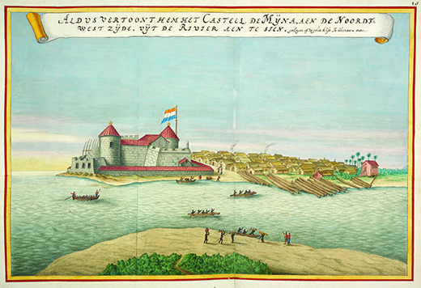
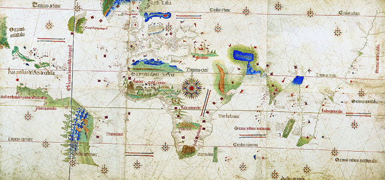

By the end of this section, you will be able to:
* Describe Portuguese exploration of the Atlantic and Spanish exploration of the Americas, and the importance of these voyages to the developing Atlantic World
* Explain the importance of Spanish exploration of the Americas in the expansion of Spain’s empire and the development of Spanish Renaissance culture

 ![A timeline shows important events of the era. In 1492, Christopher Columbus lands on Hispaniola. In 1494, the Treaty of Tordesillas divides the Americas between the Portuguese and the Spanish; the Cantino world map is shown. In 1517, Martin Luther publishes The Ninety-Five Theses; a portrait of Martin Luther is shown. In 1521, Hern&#xE1;n Cort&#xE9;s conquers Tenochtitl&#xE1;n. In 1530, John Calvin strengthens Protestantism; a portrait of John Calvin is shown. In 1534, Henry VIII breaks with the Catholic Church and establishes the Church of England; a portrait of Henry VIII is shown. From 1584 to 1590, English efforts to colonize Roanoke fail; a map of the region is shown. In 1603, Samuel de Champlain founds New France. In 1607, the first permanent English settlement begins at Jamestown; a map of the region is shown. In 1624, the Dutch found New Amsterdam on Manhattan Island; a print of Dutch settlers meeting local Indians is shown.](../resources/CNX_History_02_01_Timeline.jpg){: #CNX_History_02_01_Timeline}

Portuguese colonization of Atlantic islands in the 1400s inaugurated an era of aggressive European expansion across the Atlantic. In the 1500s, Spain surpassed Portugal as the dominant European power. This age of exploration and the subsequent creation of an Atlantic World marked the earliest phase of **globalization**{: data-type="term" .no-emphasis}, in which previously isolated groups—Africans, Native Americans, and Europeans—first came into contact with each other, sometimes with disastrous results.

### PORTUGUESE EXPLORATION

Portugal’s Prince Henry the Navigator spearheaded his country’s exploration of Africa and the Atlantic in the 1400s. With his support, Portuguese mariners successfully navigated an eastward route to Africa, establishing a foothold there that became a foundation of their nation’s trade empire in the fifteenth and sixteenth centuries.

Portuguese mariners built an Atlantic empire by colonizing the Canary, Cape Verde, and Azores Islands, as well as the island of Madeira. Merchants then used these Atlantic outposts as debarkation points for subsequent journeys. From these strategic points, Portugal spread its empire down the western coast of Africa to the Congo, along the western coast of India, and eventually to Brazil on the eastern coast of South America. It also established trading posts in China and Japan. While the Portuguese didn’t rule over an immense landmass, their strategic holdings of islands and coastal ports gave them almost unrivaled control of nautical trade routes and a global empire of trading posts during the 1400s.

The travels of Portuguese traders to western Africa introduced them to the African slave trade, already brisk among African states. Seeing the value of this source of labor in growing the profitable crop of sugar on their Atlantic islands, the Portuguese soon began exporting African slaves along with African ivory and gold. Sugar fueled the Atlantic slave trade, and the Portuguese islands quickly became home to sugar plantations. The Portuguese also traded these slaves, introducing much-needed human capital to other European nations. In the following years, as European exploration spread, slavery spread as well. In time, much of the Atlantic World would become a gargantuan sugar-plantation complex in which Africans labored to produce the highly profitable commodity for European consumers.

Elmina Castle

In 1482, Portuguese traders built Elmina Castle (also called São Jorge da Mina, or Saint George’s of the Mine) in present-day Ghana, on the west coast of Africa ([\[link\]](#CNX_History_02_01_Elmina)). A fortified trading post, it had mounted cannons facing out to sea, not inland toward continental Africa; the Portuguese had greater fear of a naval attack from other Europeans than of a land attack from Africans. Portuguese traders soon began to settle around the fort and established the town of Elmina.

{: #CNX_History_02_01_Elmina}

Although the Portuguese originally used the fort primarily for trading gold, by the sixteenth century they had shifted their focus. The dungeon of the fort now served as a holding pen for African slaves from the interior of the continent, while on the upper floors Portuguese traders ate, slept, and prayed in a chapel. Slaves lived in the dungeon for weeks or months until ships arrived to transport them to Europe or the Americas. For them, the dungeon of Elmina was their last sight of their home country.

### SPANISH EXPLORATION AND CONQUEST

The Spanish established the first European settlements in the Americas, beginning in the Caribbean and, by 1600, extending throughout Central and South America. Thousands of Spaniards flocked to the Americas seeking wealth and status. The most famous of these Spanish adventurers are Christopher Columbus (who, though Italian himself, explored on behalf of the Spanish monarchs), Hernán Cortés, and Francisco Pizarro.

The history of Spanish exploration begins with the history of Spain itself. During the fifteenth century, Spain hoped to gain advantage over its rival, Portugal. The marriage of Ferdinand of Aragon and Isabella of Castile in 1469 unified Catholic Spain and began the process of building a nation that could compete for worldwide power. Since the 700s, much of Spain had been under Islamic rule, and King Ferdinand II and Queen Isabella I, arch-defenders of the Catholic Church against Islam, were determined to defeat the Muslims in Granada, the last Islamic stronghold in Spain. In 1492, they completed the Reconquista: the centuries-long Christian conquest of the Iberian Peninsula. The Reconquista marked another step forward in the process of making Spain an imperial power, and Ferdinand and Isabella were now ready to look further afield.

Their goals were to expand Catholicism and to gain a commercial advantage over Portugal. To those ends, Ferdinand and Isabella sponsored extensive Atlantic exploration. Spain’s most famous explorer, Christopher Columbus, was actually from Genoa, Italy. He believed that, using calculations based on other mariners’ journeys, he could chart a westward route to India, which could be used to expand European trade and spread Christianity. Starting in 1485, he approached Genoese, Venetian, Portuguese, English, and Spanish monarchs, asking for ships and funding to explore this westward route. All those he petitioned—including Ferdinand and Isabella at first—rebuffed him; their nautical experts all concurred that Columbus’s estimates of the width of the Atlantic Ocean were far too low. However, after three years of entreaties, and, more important, the completion of the Reconquista, Ferdinand and Isabella agreed to finance Columbus’s expedition in 1492, supplying him with three ships: the *Nina*, the *Pinta*, and the *Santa Maria*. The Spanish monarchs knew that Portuguese mariners had reached the southern tip of Africa and sailed the Indian Ocean. They understood that the Portuguese would soon reach Asia and, in this competitive race to reach the Far East, the Spanish rulers decided to act.

Columbus held erroneous views that shaped his thinking about what he would encounter as he sailed west. He believed the earth to be much smaller than its actual size and, since he did not know of the existence of the Americas, he fully expected to land in Asia. On October 12, 1492, however, he made landfall on an island in the Bahamas. He then sailed to an island he named **Hispaniola**{: data-type="term"} (present-day Dominican Republic and Haiti) ([\[link\]](#CNX_History_02_01_Hispaniola)). Believing he had landed in the East Indies, Columbus called the native Taínos he found there “Indios,” giving rise to the term “Indian” for any native people of the New World. Upon Columbus’s return to Spain, the Spanish crown bestowed on him the title of Admiral of the Ocean Sea and named him governor and viceroy of the lands he had discovered. As a devoted Catholic, Columbus had agreed with Ferdinand and Isabella prior to sailing west that part of the expected wealth from his voyage would be used to continue the fight against Islam.

 . Note the various fanciful elements, such as the large-scale ships and sea creatures, and consider what the creator of this map hoped to convey. In addition to navigation, what purpose would such a map have served?"){: #CNX_History_02_01_Hispaniola}

Columbus’s 1493 letter—or ***probanza de mérito***{: data-type="term"} (proof of merit)—describing his “discovery” of a New World did much to inspire excitement in Europe. *Probanzas de méritos* were reports and letters written by Spaniards in the New World to the Spanish crown, designed to win royal patronage. Today they highlight the difficult task of historical work; while the letters are primary sources, historians need to understand the context and the culture in which the conquistadors, as the Spanish adventurers came to be called, wrote them and distinguish their bias and subjective nature. While they are filled with distortions and fabrications, *probanzas de méritos* are still useful in illustrating the expectation of wealth among the explorers as well as their view that native peoples would not pose a serious obstacle to colonization.

In 1493, Columbus sent two copies of a *probanza de mérito* to the Spanish king and queen and their minister of finance, Luis de Santángel. Santángel had supported Columbus’s voyage, helping him to obtain funding from Ferdinand and Isabella. Copies of the letter were soon circulating all over Europe, spreading news of the wondrous new land that Columbus had “discovered.” Columbus would make three more voyages over the next decade, establishing Spain’s first settlement in the New World on the island of Hispaniola. Many other Europeans followed in Columbus’s footsteps, drawn by dreams of winning wealth by sailing west. Another Italian, Amerigo Vespucci, sailing for the Portuguese crown, explored the South American coastline between 1499 and 1502. Unlike Columbus, he realized that the Americas were not part of Asia but lands unknown to Europeans. Vespucci’s widely published accounts of his voyages fueled speculation and intense interest in the New World among Europeans. Among those who read Vespucci’s reports was the German mapmaker Martin Waldseemuller. Using the explorer’s first name as a label for the new landmass, Waldseemuller attached “America” to his map of the New World in 1507, and the name stuck.

Columbus’s *Probanza de mérito* of 1493

The exploits of the most famous Spanish explorers have provided Western civilization with a narrative of European supremacy and Indian savagery. However, these stories are based on the self-aggrandizing efforts of conquistadors to secure royal favor through the writing of *probanzas de méritos* (proofs of merit). Below are excerpts from Columbus’s 1493 letter to Luis de Santángel, which illustrates how fantastic reports from European explorers gave rise to many myths surrounding the Spanish conquest and the New World.

<q>This island, like all the others, is most extensive. It has many ports along the sea-coast excelling any in Christendom—and many fine, large, flowing rivers. The land there is elevated, with many mountains and peaks incomparably higher than in the centre isle. They are most beautiful, of a thousand varied forms, accessible, and full of trees of endless varieties, so high that they seem to touch the sky, and I have been told that they never lose their foliage. . . . There is honey, and there are many kinds of birds, and a great variety of fruits. Inland there are numerous mines of metals and innumerable people. Hispaniola is a marvel. Its hills and mountains, fine plains and open country, are rich and fertile for planting and for pasturage, and for building towns and villages. The seaports there are incredibly fine, as also the magnificent rivers, most of which bear gold. The trees, fruits and grasses differ widely from those in Juana. There are many spices and vast mines of gold and other metals in this island. They have no iron, nor steel, nor weapons, nor are they fit for them, because although they are well-made men of commanding stature, they appear extraordinarily timid. The only arms they have are sticks of cane, cut when in seed, with a sharpened stick at the end, and they are afraid to use these. Often I have sent two or three men ashore to some town to converse with them, and the natives came out in great numbers, and as soon as they saw our men arrive, fled without a moment’s delay although I protected them from all injury.</q>

What does this letter show us about Spanish objectives in the New World? How do you think it might have influenced Europeans reading about the New World for the first time?

The 1492 Columbus landfall accelerated the rivalry between Spain and Portugal, and the two powers vied for domination through the acquisition of new lands. In the 1480s, Pope Sixtus IV had granted Portugal the right to all land south of the Cape Verde islands, leading the Portuguese king to claim that the lands discovered by Columbus belonged to Portugal, not Spain. Seeking to ensure that Columbus’s finds would remain Spanish, Spain’s monarchs turned to the Spanish-born Pope Alexander VI, who issued two papal decrees in 1493 that gave legitimacy to Spain’s Atlantic claims at the expense of Portugal. Hoping to salvage Portugal’s Atlantic holdings, King João II began negotiations with Spain. The resulting Treaty of Tordesillas in 1494 drew a north-to-south line through South America ([\[link\]](#CNX_History_02_01_Tordesilla)); Spain gained territory west of the line, while Portugal retained the lands east of the line, including the east coast of Brazil.

 {: #CNX_History_02_01_Tordesilla}

Columbus’s discovery opened a floodgate of Spanish exploration. Inspired by tales of rivers of gold and timid, malleable natives, later Spanish explorers were relentless in their quest for land and gold. Hernán Cortés hoped to gain hereditary privilege for his family, tribute payments and labor from natives, and an annual pension for his service to the crown. Cortés arrived on Hispaniola in 1504 and took part in the conquest of that island. In anticipation of winning his own honor and riches, Cortés later explored the Yucatán Peninsula. In 1519, he entered Tenochtitlán, the capital of the Aztec (Mexica) Empire. He and his men were astonished by the incredibly sophisticated causeways, gardens, and temples in the city, but they were horrified by the practice of human sacrifice that was part of the Aztec religion. Above all else, the Aztec wealth in gold fascinated the Spanish adventurers.

Hoping to gain power over the city, Cortés took Moctezuma, the Aztec ruler, hostage. The Spanish then murdered hundreds of high-ranking Mexica during a festival to celebrate Huitzilopochtli, the god of war. This angered the people of Tenochtitlán, who rose up against the interlopers in their city. Cortés and his people fled for their lives, running down one of Tenochtitlán’s causeways to safety on the shore. Smarting from their defeat at the hands of the Aztec, Cortés slowly created alliances with native peoples who resented Aztec rule. It took nearly a year for the Spanish and the tens of thousands of native allies who joined them to defeat the Mexica in Tenochtitlán, which they did by laying siege to the city. Only by playing upon the disunity among the diverse groups in the Aztec Empire were the Spanish able to capture the grand city of Tenochtitlán. In August 1521, having successfully fomented civil war as well as fended off rival Spanish explorers, Cortés claimed Tenochtitlán for Spain and renamed it Mexico City.

The traditional European narrative of exploration presents the victory of the Spanish over the Aztec as an example of the superiority of the Europeans over the savage Indians. However, the reality is far more complex. When Cortés explored central Mexico, he encountered a region simmering with native conflict. Far from being unified and content under Aztec rule, many peoples in Mexico resented it and were ready to rebel. One group in particular, the Tlaxcalan, threw their lot in with the Spanish, providing as many as 200,000 fighters in the siege of Tenochtitlán. The Spanish also brought smallpox into the valley of Mexico. The disease took a heavy toll on the people in Tenochtitlán, playing a much greater role in the city’s demise than did Spanish force of arms.

Cortés was also aided by a Nahua woman called Malintzin (also known as La Malinche or Doña Marina, her Spanish name), whom the natives of Tabasco gave him as tribute. Malintzin translated for Cortés in his dealings with Moctezuma and, whether willingly or under pressure, entered into a physical relationship with him. Their son, Martín, may have been the first mestizo (person of mixed indigenous American and European descent). Malintzin remains a controversial figure in the history of the Atlantic World; some people view her as a traitor because she helped Cortés conquer the Aztecs, while others see her as a victim of European expansion. In either case, she demonstrates one way in which native peoples responded to the arrival of the Spanish. Without her, Cortés would not have been able to communicate, and without the language bridge, he surely would have been less successful in destabilizing the Aztec Empire. By this and other means, native people helped shape the conquest of the Americas.

Spain’s acquisitiveness seemingly knew no bounds as groups of its explorers searched for the next trove of instant riches. One such explorer, Francisco Pizarro, made his way to the Spanish Caribbean in 1509, drawn by the promise of wealth and titles. He participated in successful expeditions in Panama before following rumors of Inca wealth to the south. Although his first efforts against the Inca Empire in the 1520s failed, Pizarro captured the Inca emperor Atahualpa in 1532 and executed him one year later. In 1533, Pizarro founded Lima, Peru. Like Cortés, Pizarro had to combat not only the natives of the new worlds he was conquering, but also competitors from his own country; a Spanish rival assassinated him in 1541.

Spain’s drive to enlarge its empire led other hopeful conquistadors to push further into the Americas, hoping to replicate the success of Cortés and Pizarro. Hernando de Soto had participated in Pizarro’s conquest of the Inca, and from 1539 to 1542 he led expeditions to what is today the southeastern United States, looking for gold. He and his followers explored what is now Florida, Georgia, the Carolinas, Tennessee, Alabama, Mississippi, Arkansas, Oklahoma, Louisiana, and Texas. Everywhere they traveled, they brought European diseases, which claimed thousands of native lives as well as the lives of the explorers. In 1542, de Soto himself died during the expedition. The surviving Spaniards, numbering a little over three hundred, returned to Mexico City without finding the much-anticipated mountains of gold and silver.

Francisco Vásquez de Coronado was born into a noble family and went to Mexico, then called New Spain, in 1535. He presided as governor over the province of Nueva Galicia, where he heard rumors of wealth to the north: a golden city called Quivira. Between 1540 and 1542, Coronado led a large expedition of Spaniards and native allies to the lands north of Mexico City, and for the next several years, they explored the area that is now the southwestern United States ([\[link\]](#CNX_History_02_01_Coronado)). During the winter of 1540–41, the explorers waged war against the Tiwa in present-day New Mexico. Rather than leading to the discovery of gold and silver, however, the expedition simply left Coronado bankrupt.

 "){: #CNX_History_02_01_Coronado}

### THE SPANISH GOLDEN AGE

The exploits of European explorers had a profound impact both in the Americas and back in Europe. An exchange of ideas, fueled and financed in part by New World commodities, began to connect European nations and, in turn, to touch the parts of the world that Europeans conquered. In Spain, gold and silver from the Americas helped to fuel a golden age, the Siglo de Oro, when Spanish art and literature flourished. Riches poured in from the colonies, and new ideas poured in from other countries and new lands. The Hapsburg dynasty, which ruled a collection of territories including Austria, the Netherlands, Naples, Sicily, and Spain, encouraged and financed the work of painters, sculptors, musicians, architects, and writers, resulting in a blooming of Spanish Renaissance culture. One of this period’s most famous works is the novel *The Ingenious Gentleman Don Quixote of La Mancha*, by Miguel de Cervantes. This two-volume book (1605 and 1618) told a colorful tale of an *hidalgo* (gentleman) who reads so many tales of chivalry and knighthood that he becomes unable to tell reality from fiction. With his faithful sidekick Sancho Panza, Don Quixote leaves reality behind and sets out to revive chivalry by doing battle with what he perceives as the enemies of Spain.

  
Explore the collection at [The Cervantes Project][1] for images, complete texts, and other resources relating to Cervantes’s works.

Spain attracted innovative foreign painters such as El Greco, a Greek who had studied with Italian Renaissance masters like Titian and Michelangelo before moving to Toledo. Native Spaniards created equally enduring works. *Las Meninas (The Maids of Honor)*, painted by Diego Velázquez in 1656, is one of the best-known paintings in history. Velázquez painted himself into this imposingly large royal portrait (he’s shown holding his brush and easel on the left) and boldly placed the viewer where the king and queen would stand in the scene ([\[link\]](#CNX_History_02_01_Meninas)).

 , painted by Diego Vel&#xE1;zquez in 1656, is unique for its time because it places the viewer in the place of King Philip IV and his wife, Queen Mariana."){: #CNX_History_02_01_Meninas}

### Section Summary

Although Portugal opened the door to exploration of the Atlantic World, Spanish explorers quickly made inroads into the Americas. Spurred by Christopher Columbus’s glowing reports of the riches to be found in the New World, throngs of Spanish conquistadors set off to find and conquer new lands. They accomplished this through a combination of military strength and strategic alliances with native peoples. Spanish rulers Ferdinand and Isabella promoted the acquisition of these new lands in order to strengthen and glorify their own empire. As Spain’s empire expanded and riches flowed in from the Americas, the Spanish experienced a golden age of art and literature.

### Review Questions

Which country initiated the era of Atlantic exploration?

1.  France
2.  Spain
3.  England
4.  Portugal
{: type="A"}

D

Which country established the first colonies in the Americas?

1.  England
2.  Portugal
3.  Spain
4.  the Netherlands
{: type="A"}

C

Where did Christopher Columbus first land?

1.  Hispaniola
2.  the Bahamas
3.  Jamestown
4.  Mexico
{: type="A"}

B

Why did the authors of *probanzas de méritos* choose to write in the way that they did? What should we consider when we interpret these documents today?

*Probanzas de méritos* featured glowing descriptions of lands of plenty. The Spanish explorers hoped to find cities of gold, so they made their discoveries sound as wonderful as possible in these letters to convince the Spanish crown to fund more voyages. When we read them now, we need to take the descriptions with a grain of salt. But we can also fact-check these descriptions, whereas the Spanish court could only take them at face value.

### Glossary
{: data-type="glossary-title"}

Hispaniola
: the island in the Caribbean, present-day Haiti and Dominican Republic, where Columbus first landed and established a Spanish colony
^

*probanza de mérito*
: proof of merit: a letter written by a Spanish explorer to the crown to gain royal patronage

[1]: http://openstaxcollege.org/l/cervantes
