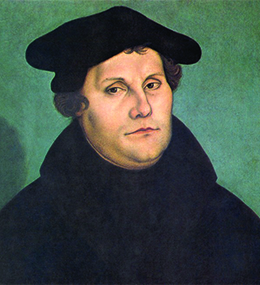
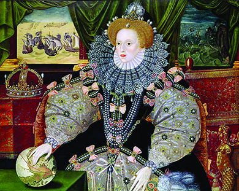

By the end of this section, you will be able to:
* Explain the changes brought by the Protestant Reformation and how it influenced the development of the Atlantic World
* Describe Spain’s response to the Protestant Reformation

Until the 1500s, the Catholic Church provided a unifying religious structure for Christian Europe. The Vatican in Rome exercised great power over the lives of Europeans; it controlled not only learning and scholarship but also finances, because it levied taxes on the faithful. Spain, with its New World wealth, was the bastion of the Catholic faith. Beginning with the reform efforts of Martin Luther in 1517 and John Calvin in the 1530s, however, Catholic dominance came under attack as the **Protestant Reformation**{: data-type="term"}, a split or schism among European Christians, began.

During the sixteenth century, Protestantism spread through northern Europe, and Catholic countries responded by attempting to extinguish what was seen as the Protestant menace. Religious turmoil between Catholics and Protestants influenced the history of the Atlantic World as well, since different nation-states competed not only for control of new territories but also for the preeminence of their religious beliefs there. Just as the history of Spain’s rise to power is linked to the Reconquista, so too is the history of early globalization connected to the history of competing Christian groups in the Atlantic World.

### MARTIN LUTHER

Martin Luther ([\[link\]](#CNX_History_02_02_Luther)) was a German Catholic monk who took issue with the Catholic Church’s practice of selling **indulgences**{: data-type="term"}, documents that absolved sinners of their errant behavior. He also objected to the Catholic Church’s taxation of ordinary Germans and the delivery of Mass in Latin, arguing that it failed to instruct German Catholics, who did not understand the language.

 {: #CNX_History_02_02_Luther}

Many Europeans had called for reforms of the Catholic Church before Martin Luther did, but his protest had the unintended consequence of splitting European Christianity. Luther compiled a list of what he viewed as needed Church reforms, a document that came to be known as *The Ninety-Five Theses*, and nailed it to the door of a church in Wittenberg, Germany, in 1517. He called for the publication of the Bible in everyday language, took issue with the Church’s policy of imposing tithes (a required payment to the Church that appeared to enrich the clergy), and denounced the buying and selling of indulgences. Although he had hoped to reform the Catholic Church while remaining a part of it, Luther’s action instead triggered a movement called the Protestant Reformation that divided the Church in two. The Catholic Church condemned him as a heretic, but a doctrine based on his reforms, called Lutheranism, spread through northern Germany and Scandinavia.

  
Visit Fordham University’s [Internet Medieval Sourcebook][1] for access to many primary sources relating to the Protestant Reformation.

### JOHN CALVIN

Like Luther, the French lawyer John Calvin advocated making the Bible accessible to ordinary people; only by reading scripture and reflecting daily about their spiritual condition, he argued, could believers begin to understand the power of God. In 1535, Calvin fled Catholic France and led the Reformation movement from Geneva, Switzerland.

**Calvinism**{: data-type="term"} emphasized human powerlessness before an omniscient God and stressed the idea of predestination, the belief that God selected a few chosen people for salvation while everyone else was predestined to damnation. Calvinists believed that reading scripture prepared sinners, if they were among the elect, to receive God’s grace. In Geneva, Calvin established a Bible commonwealth, a community of believers whose sole source of authority was their interpretation of the Bible, not the authority of any prince or monarch. Soon Calvin’s ideas spread to the Netherlands and Scotland.

### PROTESTANTISM IN ENGLAND

Protestantism spread beyond the German states and Geneva to England, which had been a Catholic nation for centuries. Luther’s idea that scripture should be available in the everyday language of worshippers inspired English scholar William Tyndale to translate the Bible into English in 1526. The seismic break with the Catholic Church in England occurred in the 1530s, when Henry VIII established a new, Protestant state religion.

A devout Catholic, Henry had initially stood in opposition to the Reformation. Pope Leo X even awarded him the title “Defender of the Faith.” The tides turned, however, when Henry desired a male heir to the Tudor monarchy. When his Spanish Catholic wife, Catherine (the daughter of Ferdinand and Isabella), did not give birth to a boy, the king sought an annulment to their marriage. When the Pope refused his request, Henry created a new national Protestant church, the Church of England, with himself at its head. This left him free to annul his own marriage and marry Anne Boleyn.

Anne Boleyn also failed to produce a male heir, and when she was accused of adultery, Henry had her executed. His third wife, Jane Seymour, at long last delivered a son, Edward, who ruled for only a short time before dying in 1553 at the age of fifteen. Mary, the daughter of Henry VIII and his discarded first wife Catherine, then came to the throne, committed to restoring Catholicism. She earned the nickname “Bloody Mary” for the many executions of Protestants, often by burning alive, that she ordered during her reign.

Religious turbulence in England was finally quieted when Elizabeth, the Protestant daughter of Henry VIII and Anne Boleyn, ascended the throne in 1558. Under Elizabeth, the Church of England again became the state church, retaining the hierarchical structure and many of the rituals of the Catholic Church. However, by the late 1500s, some English members of the Church began to agitate for more reform. Known as **Puritans**{: data-type="term"}, they worked to erase all vestiges of Catholicism from the Church of England. At the time, the term “puritan” was a pejorative one; many people saw Puritans as holier-than-thou frauds who used religion to swindle their neighbors. Worse still, many in power saw Puritans as a security threat because of their opposition to the national church.

Under Elizabeth, whose long reign lasted from 1558 to 1603, Puritans grew steadily in number. After James I died in 1625 and his son Charles I ascended the throne, Puritans became the target of increasing state pressure to conform. Many crossed the Atlantic in the 1620s and 1630s instead to create a New England, a haven for reformed Protestantism where Puritan was no longer a term of abuse. Thus, the religious upheavals that affected England so much had equally momentous consequences for the Americas.

### RELIGIOUS WAR

By the early 1500s, the Protestant Reformation threatened the massive Spanish Catholic empire. As the preeminent Catholic power, Spain would not tolerate any challenge to the Holy Catholic Church. Over the course of the 1500s, it devoted vast amounts of treasure and labor to leading an unsuccessful effort to eradicate Protestantism in Europe.

Spain’s main enemies at this time were the runaway Spanish provinces of the North Netherlands. By 1581, these seven northern provinces had declared their independence from Spain and created the Dutch Republic, also called Holland, where Protestantism was tolerated. Determined to deal a death blow to Protestantism in England and Holland, King Philip of Spain assembled a massive force of over thirty thousand men and 130 ships, and in 1588 he sent this navy, the Spanish Armada, north. But English sea power combined with a maritime storm destroyed the fleet.

The defeat of the Spanish Armada in 1588 was but one part of a larger but undeclared war between Protestant England and Catholic Spain. Between 1585 and 1604, the two rivals sparred repeatedly. England launched its own armada in 1589 in an effort to cripple the Spanish fleet and capture Spanish treasure. However, the foray ended in disaster for the English, with storms, disease, and the strength of the Spanish Armada combining to bring about defeat.

The conflict between Spain and England dragged on into the early seventeenth century, and the newly Protestant nations, especially England and the Dutch Republic, posed a significant challenge to Spain (and also to Catholic France) as imperial rivalries played out in the Atlantic World. Spain retained its mighty American empire, but by the early 1600s, the nation could no longer keep England and other European rivals—the French and Dutch—from colonizing smaller islands in the Caribbean ([\[link\]](#CNX_History_02_02_Elizabeth)).

 {: #CNX_History_02_02_Elizabeth}

Religious intolerance characterized the sixteenth and seventeenth centuries, an age of powerful state religions with the authority to impose and enforce belief systems on the population. In this climate, religious violence was common. One of the most striking examples is the St. Bartholomew’s Day Massacre of 1572, in which French Catholic troops began to kill unarmed French Protestants ([\[link\]](#CNX_History_02_02_Bartholo)). The murders touched off mob violence that ultimately claimed nine thousand lives, a bloody episode that highlights the degree of religious turmoil that gripped Europe in the aftermath of the Protestant Reformation.

 , by Fran&#xE7;ois Dubois, shows the horrific violence of the St. Bartholomew&#x2019;s Day Massacre. In this scene, French Catholic troops slaughter French Protestant Calvinists."){: #CNX_History_02_02_Bartholo}

### Section Summary

The sixteenth century witnessed a new challenge to the powerful Catholic Church. The reformist doctrines of Martin Luther and John Calvin attracted many people dissatisfied with Catholicism, and Protestantism spread across northern Europe, spawning many subgroups with conflicting beliefs. Spain led the charge against Protestantism, leading to decades of undeclared religious wars between Spain and England, and religious intolerance and violence characterized much of the sixteenth and seventeenth centuries. Despite the efforts of the Catholic Church and Catholic nations, however, Protestantism had taken hold by 1600.

### Review Questions

Where did the Protestant Reformation begin?

1.  Northern Europe
2.  Spain
3.  England
4.  the American colonies
{: type="A"}

A

What was the chief goal of the Puritans?

1.  to achieve a lasting peace with the Catholic nations of Spain and France
2.  to eliminate any traces of Catholicism from the Church of England
3.  to assist Henry VIII in his quest for an annulment to his marriage
4.  to create a hierarchy within the Church of England modeled on that of the Catholic Church
{: type="A"}

B

What reforms to the Catholic Church did Martin Luther and John Calvin call for?

Luther was most concerned about indulgences, which allowed the wealthy to purchase their way to forgiveness, and protested the Church’s taxation of ordinary Germans. Both wanted the liturgy to be given in churchgoers’ own language, making scripture more accessible.

### Glossary
{: data-type="glossary-title"}

Calvinism
: a branch of Protestantism started by John Calvin, emphasizing human powerlessness before an omniscient God and stressing the idea of predestination
^

indulgences
: documents for purchase that absolved sinners of their errant behavior
^

Protestant Reformation
: the schism in Catholicism that began with Martin Luther and John Calvin in the early sixteenth century
^

Puritans
: a group of religious reformers in the sixteenth and seventeenth centuries who wanted to “purify” the Church of England by ridding it of practices associated with the Catholic Church and advocating greater purity of doctrine and worship

[1]: http://openstaxcollege.org/l/fordham
