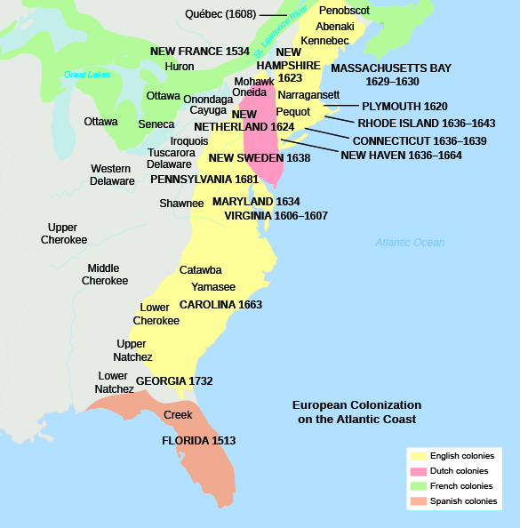
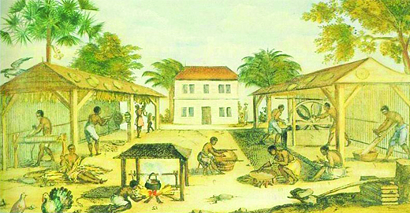
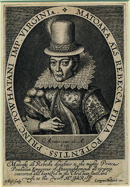
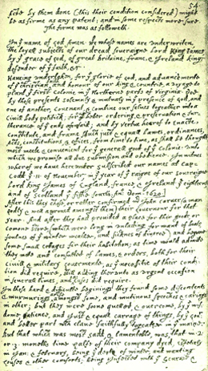
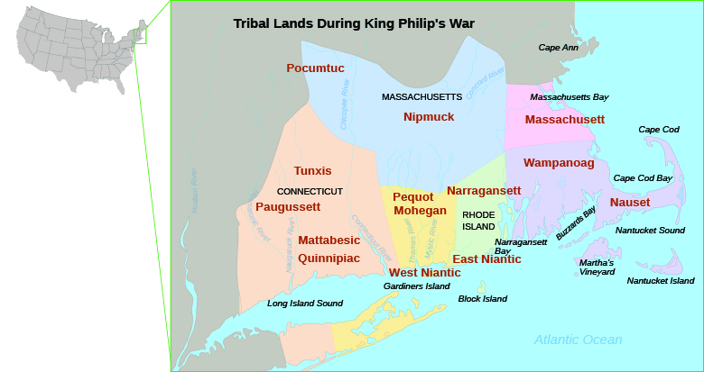

By the end of this section, you will be able to:
* Identify the first English settlements in America
* Describe the differences between the Chesapeake Bay colonies and the New England colonies
* Compare and contrast the wars between native inhabitants and English colonists in both the Chesapeake Bay and New England colonies
* Explain the role of Bacon’s Rebellion in the rise of chattel slavery in Virginia

At the start of the seventeenth century, the English had not established a permanent settlement in the Americas. Over the next century, however, they outpaced their rivals. The English encouraged emigration far more than the Spanish, French, or Dutch. They established nearly a dozen colonies, sending swarms of immigrants to populate the land. England had experienced a dramatic rise in population in the sixteenth century, and the colonies appeared a welcoming place for those who faced overcrowding and grinding poverty at home. Thousands of English migrants arrived in the Chesapeake Bay colonies of Virginia and Maryland to work in the tobacco fields. Another stream, this one of pious Puritan families, sought to live as they believed scripture demanded and established the Plymouth, Massachusetts Bay, New Haven, Connecticut, and Rhode Island colonies of New England ([\[link\]](#CNX_History_03_03_Settlement)).

 {: #CNX_History_03_03_Settlement}

# THE DIVERGING CULTURES OF THE NEW ENGLAND AND CHESAPEAKE COLONIES

Promoters of English colonization in North America, many of whom never ventured across the Atlantic, wrote about the bounty the English would find there. These boosters of colonization hoped to turn a profit—whether by importing raw resources or providing new markets for English goods—and spread Protestantism. The English migrants who actually made the journey, however, had different goals. In Chesapeake Bay, English migrants established Virginia and Maryland with a decidedly commercial orientation. Though the early Virginians at Jamestown hoped to find gold, they and the settlers in Maryland quickly discovered that growing tobacco was the only sure means of making money. Thousands of unmarried, unemployed, and impatient young Englishmen, along with a few Englishwomen, pinned their hopes for a better life on the tobacco fields of these two colonies.

A very different group of English men and women flocked to the cold climate and rocky soil of New England, spurred by religious motives. Many of the Puritans crossing the Atlantic were people who brought families and children. Often they were following their ministers in a migration “beyond the seas,” envisioning a new English Israel where reformed Protestantism would grow and thrive, providing a model for the rest of the Christian world and a counter to what they saw as the Catholic menace. While the English in Virginia and Maryland worked on expanding their profitable tobacco fields, the English in New England built towns focused on the church, where each congregation decided what was best for itself. The Congregational Church is the result of the Puritan enterprise in America. Many historians believe the fault lines separating what later became the North and South in the United States originated in the profound differences between the Chesapeake and New England colonies.

The source of those differences lay in England’s domestic problems. Increasingly in the early 1600s, the English state church—the Church of England, established in the 1530s—demanded conformity, or compliance with its practices, but Puritans pushed for greater reforms. By the 1620s, the Church of England began to see leading Puritan ministers and their followers as outlaws, a national security threat because of their opposition to its power. As the noose of conformity tightened around them, many Puritans decided to remove to New England. By 1640, New England had a population of twenty-five thousand. Meanwhile, many loyal members of the Church of England, who ridiculed and mocked Puritans both at home and in New England, flocked to Virginia for economic opportunity.

The troubles in England escalated in the 1640s when civil war broke out, pitting Royalist supporters of King Charles I and the Church of England against Parliamentarians, the Puritan reformers and their supporters in Parliament. In 1649, the Parliamentarians gained the upper hand and, in an unprecedented move, executed Charles I. In the 1650s, therefore, England became a republic, a state without a king. English colonists in America closely followed these events. Indeed, many Puritans left New England and returned home to take part in the struggle against the king and the national church. Other English men and women in the Chesapeake colonies and elsewhere in the English Atlantic World looked on in horror at the mayhem the Parliamentarians, led by the Puritan insurgents, appeared to unleash in England. The turmoil in England made the administration and imperial oversight of the Chesapeake and New England colonies difficult, and the two regions developed divergent cultures.

# THE CHESAPEAKE COLONIES: VIRGINIA AND MARYLAND

The Chesapeake colonies of Virginia and Maryland served a vital purpose in the developing seventeenth-century English empire by providing tobacco, a cash crop. However, the early history of Jamestown did not suggest the English outpost would survive. From the outset, its settlers struggled both with each other and with the native inhabitants, the powerful Powhatan, who controlled the area. Jealousies and infighting among the English destabilized the colony. One member, John Smith, whose famous map begins this chapter, took control and exercised near-dictatorial powers, which furthered aggravated the squabbling. The settlers’ inability to grow their own food compounded this unstable situation. They were essentially employees of the Virginia Company of London, an English joint-stock company, in which investors provided the capital and assumed the risk in order to reap the profit, and they had to make a profit for their shareholders as well as for themselves. Most initially devoted themselves to finding gold and silver instead of finding ways to grow their own food.

## Early Struggles and the Development of the Tobacco Economy

Poor health, lack of food, and fighting with native peoples took the lives of many of the original Jamestown settlers. The winter of 1609–1610, which became known as “the starving time,” came close to annihilating the colony. By June 1610, the few remaining settlers had decided to abandon the area; only the last-minute arrival of a supply ship from England prevented another failed colonization effort. The supply ship brought new settlers, but only twelve hundred of the seventy-five hundred who came to Virginia between 1607 and 1624 survived.

George Percy on “The Starving Time”

George Percy, the youngest son of an English nobleman, was in the first group of settlers at the Jamestown Colony. He kept a journal describing their experiences; in the excerpt below, he reports on the privations of the colonists’ third winter.

\> Now all of us at James Town, beginning to feel that sharp prick of hunger which no man truly describe but he which has tasted the bitterness thereof, a world of miseries ensued as the sequel will express unto you, in so much that some to satisfy their hunger have robbed the store for the which I caused them to be executed. Then having fed upon horses and other beasts as long as they lasted, we were glad to make shift with vermin as dogs, cats, rats, and mice. All was fish that came to net to satisfy cruel hunger as to eat boots, shoes, or any other leather some could come by, and, those being spent and devoured, some were enforced to search the woods and to feed upon serpents and snakes and to dig the earth for wild and unknown roots, where many of our men were cut off of and slain by the savages. And now famine beginning to look ghastly and pale in every face that nothing was spared to maintain life and to do those things which seem incredible as to dig up dead corpses out of graves and to eat them, and some have licked up the blood which has fallen from their weak fellows.
> * * *
> {: data-type="newline"}
> 
> —George Percy, “A True Relation of the Proceedings and Occurances of Moment which have happened in Virginia from the Time Sir Thomas Gates shipwrecked upon the Bermudes anno 1609 until my departure out of the Country which was in anno Domini 1612,” London 1624

What is your reaction to George Percy’s story? How do you think Jamestown managed to survive after such an experience? What do you think the Jamestown colonists learned?

By the 1620s, Virginia had weathered the worst and gained a degree of permanence. Political stability came slowly, but by 1619, the fledgling colony was operating under the leadership of a governor, a council, and a House of Burgesses. Economic stability came from the lucrative cultivation of tobacco. Smoking tobacco was a long-standing practice among native peoples, and English and other European consumers soon adopted it. In 1614, the Virginia colony began exporting tobacco back to England, which earned it a sizable profit and saved the colony from ruin. A second tobacco colony, Maryland, was formed in 1634, when King Charles I granted its charter to the Calvert family for their loyal service to England. Cecilius Calvert, the second Lord Baltimore, conceived of Maryland as a refuge for English Catholics.

Growing tobacco proved very labor-intensive ([\[link\]](#CNX_History_03_03_Tobacco)), and the Chesapeake colonists needed a steady workforce to do the hard work of clearing the land and caring for the tender young plants. The mature leaf of the plant then had to be cured (dried), which necessitated the construction of drying barns. Once cured, the tobacco had to be packaged in hogsheads (large wooden barrels) and loaded aboard ship, which also required considerable labor.

 {: #CNX_History_03_03_Tobacco}

To meet these labor demands, early Virginians relied on indentured servants. An **indenture**{: data-type="term"} is a labor contract that young, impoverished, and often illiterate Englishmen and occasionally Englishwomen signed in England, pledging to work for a number of years (usually between five and seven) growing tobacco in the Chesapeake colonies. In return, indentured servants received paid passage to America and food, clothing, and lodging. At the end of their indenture servants received “freedom dues,” usually food and other provisions, including, in some cases, land provided by the colony. The promise of a new life in America was a strong attraction for members of England’s underclass, who had few if any options at home. In the 1600s, some 100,000 indentured servants traveled to the Chesapeake Bay. Most were poor young men in their early twenties.

Life in the colonies proved harsh, however. Indentured servants could not marry, and they were subject to the will of the tobacco planters who bought their labor contracts. If they committed a crime or disobeyed their masters, they found their terms of service lengthened, often by several years. Female indentured servants faced special dangers in what was essentially a bachelor colony. Many were exploited by unscrupulous tobacco planters who seduced them with promises of marriage. These planters would then sell their pregnant servants to other tobacco planters to avoid the costs of raising a child.

Nonetheless, those indentured servants who completed their term of service often began new lives as tobacco planters. To entice even more migrants to the New World, the Virginia Company also implemented the **headright system**{: data-type="term"}, in which those who paid their own passage to Virginia received fifty acres plus an additional fifty for each servant or family member they brought with them. The headright system and the promise of a new life for servants acted as powerful incentives for English migrants to hazard the journey to the New World.

  
Visit [Virtual Jamestown][1] to access a database of contracts of indentured servants. Search it by name to find an ancestor or browse by occupation, destination, or county of origin.

## The Anglo-Powhatan Wars

By choosing to settle along the rivers on the banks of the Chesapeake, the English unknowingly placed themselves at the center of the Powhatan Empire, a powerful Algonquian confederacy of thirty native groups with perhaps as many as twenty-two thousand people. The territory of the equally impressive **Susquehannock**{: data-type="term" .no-emphasis} people also bordered English settlements at the north end of the Chesapeake Bay.

Tensions ran high between the English and the Powhatan, and near-constant war prevailed. The First Anglo-Powhatan War (1609–1614) resulted not only from the English colonists’ intrusion onto Powhatan land, but also from their refusal to follow native protocol by giving gifts. English actions infuriated and insulted the Powhatan. In 1613, the settlers captured Pocahontas (also called Matoaka), the daughter of a Powhatan headman named Wahunsonacook, and gave her in marriage to Englishman John Rolfe. Their union, and her choice to remain with the English, helped quell the war in 1614. Pocahontas converted to Christianity, changing her name to Rebecca, and sailed with her husband and several other Powhatan to England where she was introduced to King James I ([\[link\]](#CNX_History_03_03_Pocahontas)). Promoters of colonization publicized Pocahontas as an example of the good work of converting the Powhatan to Christianity.

 {: #CNX_History_03_03_Pocahontas}

  
Explore the interactive exhibit [Changing Images of Pocahontas][2] on PBS’s website to see the many ways artists have portrayed Pocahontas over the centuries.

Peace in Virginia did not last long. The Second Anglo-Powhatan War (1620s) broke out because of the expansion of the English settlement nearly one hundred miles into the interior, and because of the continued insults and friction caused by English activities. The Powhatan attacked in 1622 and succeeded in killing almost 350 English, about a third of the settlers. The English responded by annihilating every Powhatan village around Jamestown and from then on became even more intolerant. The Third Anglo-Powhatan War (1644–1646) began with a surprise attack in which the Powhatan killed around five hundred English colonists. However, their ultimate defeat in this conflict forced the Powhatan to acknowledge King Charles I as their sovereign. The Anglo-Powhatan Wars, spanning nearly forty years, illustrate the degree of native resistance that resulted from English intrusion into the Powhatan confederacy.

## The Rise of Slavery in the Chesapeake Bay Colonies

The transition from indentured servitude to slavery as the main labor source for some English colonies happened first in the West Indies. On the small island of Barbados, colonized in the 1620s, English planters first grew tobacco as their main export crop, but in the 1640s, they converted to sugarcane and began increasingly to rely on African slaves. In 1655, England wrestled control of Jamaica from the Spanish and quickly turned it into a lucrative sugar island, run on slave labor, for its expanding empire. While slavery was slower to take hold in the Chesapeake colonies, by the end of the seventeenth century, both Virginia and Maryland had also adopted chattel slavery—which legally defined Africans as property and not people—as the dominant form of labor to grow tobacco. Chesapeake colonists also enslaved native people.

When the first Africans arrived in Virginia in 1619, slavery—which did not exist in England—had not yet become an institution in colonial America. Many Africans worked as servants and, like their white counterparts, could acquire land of their own. Some Africans who converted to Christianity became free landowners with white servants. The change in the status of Africans in the Chesapeake to that of slaves occurred in the last decades of the seventeenth century.

Bacon’s Rebellion, an uprising of both whites and blacks who believed that the Virginia government was impeding their access to land and wealth and seemed to do little to clear the land of Indians, hastened the transition to African slavery in the Chesapeake colonies. The rebellion takes its name from Nathaniel Bacon, a wealthy young Englishman who arrived in Virginia in 1674. Despite an early friendship with Virginia’s royal governor, William Berkeley, Bacon found himself excluded from the governor’s circle of influential friends and councilors. He wanted land on the Virginia frontier, but the governor, fearing war with neighboring Indian tribes, forbade further expansion. Bacon marshaled others, especially former indentured servants who believed the governor was limiting their economic opportunities and denying them the right to own tobacco farms. Bacon’s followers believed Berkeley’s frontier policy didn’t protect English settlers enough. Worse still in their eyes, Governor Berkeley tried to keep peace in Virginia by signing treaties with various local native peoples. Bacon and his followers, who saw all Indians as an obstacle to their access to land, pursued a policy of extermination.

Tensions between the English and the native peoples in the Chesapeake colonies led to open conflict. In 1675, war broke out when Susquehannock warriors attacked settlements on Virginia’s frontier, killing English planters and destroying English plantations, including one owned by Bacon. In 1676, Bacon and other Virginians attacked the Susquehannock without the governor’s approval. When Berkeley ordered Bacon’s arrest, Bacon led his followers to Jamestown, forced the governor to flee to the safety of Virginia’s eastern shore, and then burned the city. The civil war known as Bacon’s Rebellion, a vicious struggle between supporters of the governor and those who supported Bacon, ensued. Reports of the rebellion traveled back to England, leading Charles II to dispatch both royal troops and English commissioners to restore order in the tobacco colonies. By the end of 1676, Virginians loyal to the governor gained the upper hand, executing several leaders of the rebellion. Bacon escaped the hangman’s noose, instead dying of dysentery. The rebellion fizzled in 1676, but Virginians remained divided as supporters of Bacon continued to harbor grievances over access to Indian land.

Bacon’s Rebellion helped to catalyze the creation of a system of racial slavery in the Chesapeake colonies. At the time of the rebellion, indentured servants made up the majority of laborers in the region. Wealthy whites worried over the presence of this large class of laborers and the relative freedom they enjoyed, as well as the alliance that black and white servants had forged in the course of the rebellion. Replacing indentured servitude with black slavery diminished these risks, alleviating the reliance on white indentured servants, who were often dissatisfied and troublesome, and creating a caste of racially defined laborers whose movements were strictly controlled. It also lessened the possibility of further alliances between black and white workers. Racial slavery even served to heal some of the divisions between wealthy and poor whites, who could now unite as members of a “superior” racial group.

While colonial laws in the tobacco colonies had made slavery a legal institution before Bacon’s Rebellion, new laws passed in the wake of the rebellion severely curtailed black freedom and laid the foundation for racial slavery. Virginia passed a law in 1680 prohibiting free blacks and slaves from bearing arms, banning blacks from congregating in large numbers, and establishing harsh punishments for slaves who assaulted Christians or attempted escape. Two years later, another Virginia law stipulated that all Africans brought to the colony would be slaves for life. Thus, the increasing reliance on slaves in the tobacco colonies—and the draconian laws instituted to control them—not only helped planters meet labor demands, but also served to assuage English fears of further uprisings and alleviate class tensions between rich and poor whites.

Robert Beverley on Servants and Slaves

Robert Beverley was a wealthy Jamestown planter and slaveholder. This excerpt from his *History and Present State of Virginia*, published in 1705, clearly illustrates the contrast between white servants and black slaves.

\> Their Servants, they distinguish by the Names of Slaves for Life, and Servants for a time. Slaves are the Negroes, and their Posterity, following the condition of the Mother, according to the Maxim, partus sequitur ventrem \[status follows the womb\]. They are call’d Slaves, in respect of the time of their Servitude, because it is for Life.
> * * *
> {: data-type="newline"}
> 
> Servants, are those which serve only for a few years, according to the time of their Indenture, or the Custom of the Country. The Custom of the Country takes place upon such as have no Indentures. The Law in this case is, that if such Servants be under Nineteen years of Age, they must be brought into Court, to have their Age adjudged; and from the Age they are judg’d to be of, they must serve until they reach four and twenty: But if they be adjudged upwards of Nineteen, they are then only to be Servants for the term of five Years.
> * * *
> {: data-type="newline"}
> 
> The Male-Servants, and Slaves of both Sexes, are employed together in Tilling and Manuring the Ground, in Sowing and Planting Tobacco, Corn, &amp;c. Some Distinction indeed is made between them in their Cloaths, and Food; but the Work of both, is no other than what the Overseers, the Freemen, and the Planters themselves do.
> * * *
> {: data-type="newline"}
> 
> Sufficient Distinction is also made between the Female-Servants, and Slaves; for a White Woman is rarely or never put to work in the Ground, if she be good for any thing else: And to Discourage all Planters from using any Women so, their Law imposes the heaviest Taxes upon Female Servants working in the Ground, while it suffers all other white Women to be absolutely exempted: Whereas on the other hand, it is a common thing to work a Woman Slave out of Doors; nor does the Law make any Distinction in her Taxes, whether her Work be Abroad, or at Home.

According to Robert Beverley, what are the differences between servants and slaves? What protections did servants have that slaves did not?

# PURITAN NEW ENGLAND

The second major area to be colonized by the English in the first half of the seventeenth century, New England, differed markedly in its founding principles from the commercially oriented Chesapeake tobacco colonies. Settled largely by waves of Puritan families in the 1630s, New England had a religious orientation from the start. In England, reform-minded men and women had been calling for greater changes to the English national church since the 1580s. These reformers, who followed the teachings of John Calvin and other Protestant reformers, were called Puritans because of their insistence on “purifying” the Church of England of what they believed to be un-scriptural, especially Catholic elements that lingered in its institutions and practices.

Many who provided leadership in early New England were learned ministers who had studied at Cambridge or Oxford but who, because they had questioned the practices of the Church of England, had been deprived of careers by the king and his officials in an effort to silence all dissenting voices. Other Puritan leaders, such as the first governor of the Massachusetts Bay Colony, John Winthrop, came from the privileged class of English gentry. These well-to-do Puritans and many thousands more left their English homes not to establish a land of religious freedom, but to practice their own religion without persecution. Puritan New England offered them the opportunity to live as they believed the Bible demanded. In their “New” England, they set out to create a model of reformed Protestantism, a new English Israel.

The conflict generated by Puritanism had divided English society, because the Puritans demanded reforms that undermined the traditional festive culture. For example, they denounced popular pastimes like bear-baiting—letting dogs attack a chained bear—which were often conducted on Sundays when people had a few leisure hours. In the culture where William Shakespeare had produced his masterpieces, Puritans called for an end to the theater, censuring playhouses as places of decadence. Indeed, the Bible itself became part of the struggle between Puritans and James I, who headed the Church of England. Soon after ascending the throne, James commissioned a new version of the Bible in an effort to stifle Puritan reliance on the Geneva Bible, which followed the teachings of John Calvin and placed God’s authority above the monarch’s. The King James Version, published in 1611, instead emphasized the majesty of kings.

During the 1620s and 1630s, the conflict escalated to the point where the state church prohibited Puritan ministers from preaching. In the Church’s view, Puritans represented a national security threat, because their demands for cultural, social, and religious reforms undermined the king’s authority. Unwilling to conform to the Church of England, many Puritans found refuge in the New World. Yet those who emigrated to the Americas were not united. Some called for a complete break with the Church of England, while others remained committed to reforming the national church.

## Plymouth: The First Puritan Colony

The first group of Puritans to make their way across the Atlantic was a small contingent known as the Pilgrims. Unlike other Puritans, they insisted on a complete separation from the Church of England and had first migrated to the Dutch Republic seeking religious freedom. Although they found they could worship without hindrance there, they grew concerned that they were losing their Englishness as they saw their children begin to learn the Dutch language and adopt Dutch ways. In addition, the English Pilgrims (and others in Europe) feared another attack on the Dutch Republic by Catholic Spain. Therefore, in 1620, they moved on to found the Plymouth Colony in present-day Massachusetts. The governor of Plymouth, William Bradford, was a Separatist, a proponent of complete separation from the English state church. Bradford and the other Pilgrim Separatists represented a major challenge to the prevailing vision of a unified English national church and empire. On board the *Mayflower*, which was bound for Virginia but landed on the tip of Cape Cod, Bradford and forty other adult men signed the Mayflower Compact ([\[link\]](#CNX_History_03_03_Mayflower)), which presented a religious (rather than an economic) rationale for colonization. The compact expressed a community ideal of working together. When a larger exodus of Puritans established the Massachusetts Bay Colony in the 1630s, the Pilgrims at Plymouth welcomed them and the two colonies cooperated with each other.

The Mayflower Compact and Its Religious Rationale

The Mayflower Compact, which forty-one Pilgrim men signed on board the *Mayflower* in Plymouth Harbor, has been called the first American governing document, predating the U.S. Constitution by over 150 years. But was the Mayflower Compact a constitution? How much authority did it convey, and to whom?

{: #CNX_History_03_03_Mayflower}

\> In the name of God, Amen. We, whose names are underwritten, the loyal subjects of our dread Sovereign Lord King James, by the Grace of God, of Great Britain, France, and Ireland, King, defender of the Faith, etc.
> * * *
> {: data-type="newline"}
> 
> Having undertaken, for the Glory of God, and advancements of the Christian faith and honor of our King and Country, a voyage to plant the first colony in the Northern parts of Virginia, do by these presents, solemnly and mutually, in the presence of God, and one another, covenant and combine ourselves together into a civil body politic; for our better ordering, and preservation and furtherance of the ends aforesaid; and by virtue hereof to enact, constitute, and frame, such just and equal laws, ordinances, acts, constitutions, and offices, from time to time, as shall be thought most meet and convenient for the general good of the colony; unto which we promise all due submission and obedience.
> * * *
> {: data-type="newline"}
> 
> In witness whereof we have hereunto subscribed our names at Cape Cod the 11th of November, in the year of the reign of our Sovereign Lord King James, of England, France, and Ireland, the eighteenth, and of Scotland the fifty-fourth, 1620

Different labor systems also distinguished early Puritan New England from the Chesapeake colonies. Puritans expected young people to work diligently at their calling, and all members of their large families, including children, did the bulk of the work necessary to run homes, farms, and businesses. Very few migrants came to New England as laborers; in fact, New England towns protected their disciplined homegrown workforce by refusing to allow outsiders in, assuring their sons and daughters of steady employment. New England’s labor system produced remarkable results, notably a powerful maritime-based economy with scores of oceangoing ships and the crews necessary to sail them. New England mariners sailing New England–made ships transported Virginian tobacco and West Indian sugar throughout the Atlantic World.

## “A City upon a Hill”

A much larger group of English Puritans left England in the 1630s, establishing the Massachusetts Bay Colony, the New Haven Colony, the Connecticut Colony, and Rhode Island. Unlike the exodus of young males to the Chesapeake colonies, these migrants were families with young children and their university-trained ministers. Their aim, according to John Winthrop ([\[link\]](#CNX_History_03_03_Seal)), the first governor of Massachusetts Bay, was to create a model of reformed Protestantism—a “city upon a hill,” a new English Israel. The idea of a “city upon a hill” made clear the religious orientation of the New England settlement, and the charter of the Massachusetts Bay Colony stated as a goal that the colony’s people “may be soe religiously, peaceablie, and civilly governed, as their good Life and orderlie Conversacon, maie wynn and incite the Natives of Country, to the Knowledg and Obedience of the onlie true God and Saulor of Mankinde, and the Christian Fayth.” To illustrate this, the seal of the Massachusetts Bay Company ([\[link\]](#CNX_History_03_03_Seal)) shows a half-naked Indian who entreats more of the English to “come over and help us.”

 , an Indian is shown asking colonists to &#x201C;Come over and help us.&#x201D; This seal indicates the religious ambitions of John Winthrop (b), the colony&#x2019;s first governor, for his &#x201C;city upon a hill.&#x201D;"){: #CNX_History_03_03_Seal}

Puritan New England differed in many ways from both England and the rest of Europe. Protestants emphasized literacy so that everyone could read the Bible. This attitude was in stark contrast to that of Catholics, who refused to tolerate private ownership of Bibles in the vernacular. The Puritans, for their part, placed a special emphasis on reading scripture, and their commitment to literacy led to the establishment of the first printing press in English America in 1636. Four years later, in 1640, they published the first book in North America, the Bay Psalm Book. As Calvinists, Puritans adhered to the doctrine of predestination, whereby a few “elect” would be saved and all others damned. No one could be sure whether they were predestined for salvation, but through introspection, guided by scripture, Puritans hoped to find a glimmer of redemptive grace. Church membership was restricted to those Puritans who were willing to provide a conversion narrative telling how they came to understand their spiritual estate by hearing sermons and studying the Bible.

Although many people assume Puritans escaped England to establish religious freedom, they proved to be just as intolerant as the English state church. When dissenters, including Puritan minister Roger Williams and Anne Hutchinson, challenged Governor Winthrop in Massachusetts Bay in the 1630s, they were banished. Roger Williams questioned the Puritans’ taking of Indian land. Williams also argued for a complete separation from the Church of England, a position other Puritans in Massachusetts rejected, as well as the idea that the state could not punish individuals for their beliefs. Although he did accept that nonbelievers were destined for eternal damnation, Williams did not think the state could compel true orthodoxy. Puritan authorities found him guilty of spreading dangerous ideas, but he went on to found Rhode Island as a colony that sheltered dissenting Puritans from their brethren in Massachusetts. In Rhode Island, Williams wrote favorably about native peoples, contrasting their virtues with Puritan New England’s intolerance.

Anne Hutchinson also ran afoul of Puritan authorities for her criticism of the evolving religious practices in the Massachusetts Bay Colony. In particular, she held that Puritan ministers in New England taught a shallow version of Protestantism emphasizing hierarchy and actions—a “covenant of works” rather than a “covenant of grace.” Literate Puritan women like Hutchinson presented a challenge to the male ministers’ authority. Indeed, her major offense was her claim of direct religious revelation, a type of spiritual experience that negated the role of ministers. Because of Hutchinson’s beliefs and her defiance of authority in the colony, especially that of Governor Winthrop, Puritan authorities tried and convicted her of holding false beliefs. In 1638, she was excommunicated and banished from the colony. She went to Rhode Island and later, in 1642, sought safety among the Dutch in New Netherland. The following year, Algonquian warriors killed Hutchinson and her family. In Massachusetts, Governor Winthrop noted her death as the righteous judgment of God against a heretic.

Like many other Europeans, the Puritans believed in the supernatural. Every event appeared to be a sign of God’s mercy or judgment, and people believed that witches allied themselves with the Devil to carry out evil deeds and deliberate harm such as the sickness or death of children, the loss of cattle, and other catastrophes. Hundreds were accused of witchcraft in Puritan New England, including townspeople whose habits or appearance bothered their neighbors or who appeared threatening for any reason. Women, seen as more susceptible to the Devil because of their supposedly weaker constitutions, made up the vast majority of suspects and those who were executed. The most notorious cases occurred in Salem Village in 1692. Many of the accusers who prosecuted the suspected witches had been traumatized by the Indian wars on the frontier and by unprecedented political and cultural changes in New England. Relying on their belief in witchcraft to help make sense of their changing world, Puritan authorities executed nineteen people and caused the deaths of several others.

  
Explore the [Salem Witchcraft Trials][3] to learn more about the prosecution of witchcraft in seventeenth-century New England.

## Puritan Relationships with Native Peoples

Like their Spanish and French Catholic rivals, English Puritans in America took steps to convert native peoples to their version of Christianity. John Eliot, the leading Puritan missionary in New England, urged natives in Massachusetts to live in “praying towns” established by English authorities for converted Indians, and to adopt the Puritan emphasis on the centrality of the Bible. In keeping with the Protestant emphasis on reading scripture, he translated the Bible into the local Algonquian language and published his work in 1663. Eliot hoped that as a result of his efforts, some of New England’s native inhabitants would become preachers.

Tensions had existed from the beginning between the Puritans and the native people who controlled southern New England ([\[link\]](#CNX_History_03_03_TribalDist)). Relationships deteriorated as the Puritans continued to expand their settlements aggressively and as European ways increasingly disrupted native life. These strains led to King Philip’s War (1675–1676), a massive regional conflict that was nearly successful in pushing the English out of New England.

 {: #CNX_History_03_03_TribalDist}

When the Puritans began to arrive in the 1620s and 1630s, local Algonquian peoples had viewed them as potential allies in the conflicts already simmering between rival native groups. In 1621, the Wampanoag, led by Massasoit, concluded a peace treaty with the Pilgrims at Plymouth. In the 1630s, the Puritans in Massachusetts and Plymouth allied themselves with the Narragansett and Mohegan people against the Pequot, who had recently expanded their claims into southern New England. In May 1637, the Puritans attacked a large group of several hundred Pequot along the Mystic River in Connecticut. To the horror of their native allies, the Puritans massacred all but a handful of the men, women, and children they found.

By the mid-seventeenth century, the Puritans had pushed their way further into the interior of New England, establishing outposts along the Connecticut River Valley. There seemed no end to their expansion. Wampanoag leader Metacom or Metacomet, also known as King Philip among the English, was determined to stop the encroachment. The Wampanoag, along with the Nipmuck, Pocumtuck, and Narragansett, took up the hatchet to drive the English from the land. In the ensuing conflict, called King Philip’s War, native forces succeeded in destroying half of the frontier Puritan towns; however, in the end, the English (aided by Mohegans and Christian Indians) prevailed and sold many captives into slavery in the West Indies. (The severed head of King Philip was publicly displayed in Plymouth.) The war also forever changed the English perception of native peoples; from then on, Puritan writers took great pains to vilify the natives as bloodthirsty savages. A new type of racial hatred became a defining feature of Indian-English relationships in the Northeast.

Mary Rowlandson’s Captivity Narrative

Mary Rowlandson was a Puritan woman whom Indian tribes captured and imprisoned for several weeks during King Philip’s War. After her release, she wrote *The Narrative of the Captivity and the Restoration of Mrs. Mary Rowlandson*, which was published in 1682 ([\[link\]](#CNX_History_03_03_Rowlandson)). The book was an immediate sensation that was reissued in multiple editions for over a century.

, after her imprisonment during King Philip&#x2019;s War. In her narrative, she tells of her treatment by the Indians holding her as well as of her meetings with the Wampanoag leader Metacom (b), shown in a contemporary portrait."){: #CNX_History_03_03_Rowlandson}

\> But now, the next morning, I must turn my back upon the town, and travel with them into the vast and desolate wilderness, I knew not whither. It is not my tongue, or pen, can express the sorrows of my heart, and bitterness of my spirit that I had at this departure: but God was with me in a wonderful manner, carrying me along, and bearing up my spirit, that it did not quite fail. One of the Indians carried my poor wounded babe upon a horse; it went moaning all along, “I shall die, I shall die.” I went on foot after it, with sorrow that cannot be expressed. At length I took it off the horse, and carried it in my arms till my strength failed, and I fell down with it. Then they set me upon a horse with my wounded child in my lap, and there being no furniture upon the horse’s back, as we were going down a steep hill we both fell over the horse’s head, at which they, like inhumane creatures, laughed, and rejoiced to see it, though I thought we should there have ended our days, as overcome with so many difficulties. But the Lord renewed my strength still, and carried me along, that I might see more of His power; yea, so much that I could never have thought of, had I not experienced it.

What sustains Rowlandson her during her ordeal? How does she characterize her captors? What do you think made her narrative so compelling to readers?

  
Access the entire text of Mary Rowlandson’s [captivity narrative][4] at the Gutenberg Project.

# Section Summary

The English came late to colonization of the Americas, establishing stable settlements in the 1600s after several unsuccessful attempts in the 1500s. After Roanoke Colony failed in 1587, the English found more success with the founding of Jamestown in 1607 and Plymouth in 1620. The two colonies were very different in origin. The Virginia Company of London founded Jamestown with the express purpose of making money for its investors, while Puritans founded Plymouth to practice their own brand of Protestantism without interference.

Both colonies battled difficult circumstances, including poor relationships with neighboring Indian tribes. Conflicts flared repeatedly in the Chesapeake Bay tobacco colonies and in New England, where a massive uprising against the English in 1675 to 1676—King Philip’s War—nearly succeeded in driving the intruders back to the sea.

# Review Questions

What was the most lucrative product of the Chesapeake colonies? corn tobacco gold and silver slaves 

B

What was the primary cause of Bacon’s Rebellion? former indentured servants wanted more opportunities to expand their territory African slaves wanted better treatment Susquahannock Indians wanted the Jamestown settlers to pay a fair price for their land Jamestown politicians were jockeying for power 

A

The founders of the Plymouth colony were: Puritans Catholics Anglicans Jesuits 

A

Which of the following is *not* true of the Puritan religion? It required close reading of scripture. Church membership required a conversion narrative. Literacy was crucial. Only men could participate. 

D

How did the Chesapeake colonists solve their labor problems?

They encouraged colonization by offering headrights to anyone who could pay his own way to Virginia: fifty acres for each passage. They also used the system of indenture, in which people (usually men) who didn’t have enough money to pay their own passage could work for a set number of years and then gain their own land. Increasingly, they also turned to African slaves as a cheap labor source.

[1]: http://openstaxcollege.org/l/jamestown1
[2]: http://openstaxcollege.org/l/pocahontas
[3]: http://openstaxcollege.org/l/salemwitch
[4]: http://openstaxcollege.org/l/captivenarr
