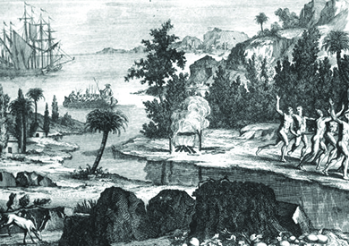
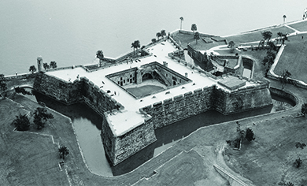

By the end of this section, you will be able to:
* Identify the main Spanish American colonial settlements of the 1500s and 1600s
* Discuss economic, political, and demographic similarities and differences between the Spanish colonies

 ![This is a timeline showing important events of the era. In 1565, the Spanish establish St. Augustine; an aerial photograph of the Spanish fort Castillo de San Marcos is shown. In 1607, the English settle Jamestown. In 1609&#x2013;1645, Jamestown colonists and Powhatan Indians fight the Anglo-Powhatan Wars; a portrait of Pocahontas is shown. In 1610, Spanish explorers establish Santa Fe. In 1620, English Puritans draft the Mayflower Compact and found Plymouth Colony; a transcription of the Mayflower Compact is shown. In 1675&#x2013;1676, King Philip (Metacom) wages war against the Puritan colonies; a drawing of Metacom is shown. In 1676, Nathaniel Bacon leads an armed rebellion against the Virginia governor; a portrait of Bacon is shown. In 1680, Pop&#xE9; leads the Pueblo Revolt in Santa Fe.](../resources/CNX_History_03_01_Timeline.jpg){: #CNX_History_03_01_Timeline}

During the 1500s, Spain expanded its colonial empire to the Philippines in the Far East and to areas in the Americas that later became the United States. The Spanish dreamed of mountains of gold and silver and imagined converting thousands of eager Indians to Catholicism. In their vision of colonial society, everyone would know his or her place. Patriarchy (the rule of men over family, society, and government) shaped the Spanish colonial world. Women occupied a lower status. In all matters, the Spanish held themselves to be atop the social pyramid, with native peoples and Africans beneath them. Both Africans and native peoples, however, contested Spanish claims to dominance. Everywhere the Spanish settled, they brought devastating diseases, such as smallpox, that led to a horrific loss of life among native peoples. European diseases killed far more native inhabitants than did Spanish swords.

The world native peoples had known before the coming of the Spanish was further upset by Spanish colonial practices. The Spanish imposed the *encomienda* system in the areas they controlled. Under this system, authorities assigned Indian workers to mine and plantation owners with the understanding that the recipients would defend the colony and teach the workers the tenets of Christianity. In reality, the *encomienda* system exploited native workers. It was eventually replaced by another colonial labor system, the ***repartimiento***{: data-type="term"}, which required Indian towns to supply a pool of labor for Spanish overlords.

### ST. AUGUSTINE, FLORIDA

Spain gained a foothold in present-day Florida, viewing that area and the lands to the north as a logical extension of their Caribbean empire. In 1513, Juan Ponce de León had claimed the area around today’s St. Augustine for the Spanish crown, naming the land Pascua Florida (Feast of Flowers, or Easter) for the nearest feast day. Ponce de León was unable to establish a permanent settlement there, but by 1565, Spain was in need of an outpost to confront the French and English privateers using Florida as a base from which to attack treasure-laden Spanish ships heading from Cuba to Spain. The threat to Spanish interests took a new turn in 1562 when a group of French Protestants (Huguenots) established a small settlement they called Fort Caroline, north of St. Augustine. With the authorization of King Philip II, Spanish nobleman Pedro Menéndez led an attack on Fort Caroline, killing most of the colonists and destroying the fort. Eliminating Fort Caroline served dual purposes for the Spanish—it helped reduce the danger from French privateers and eradicated the French threat to Spain’s claim to the area. The contest over Florida illustrates how European rivalries spilled over into the Americas, especially religious conflict between Catholics and Protestants.

In 1565, the victorious Menéndez founded St. Augustine, now the oldest European settlement in the Americas. In the process, the Spanish displaced the local **Timucua**{: data-type="term"} Indians from their ancient town of Seloy, which had stood for thousands of years ([\[link\]](#CNX_History_03_01_LeMoyne)). The Timucua suffered greatly from diseases introduced by the Spanish, shrinking from a population of around 200,000 pre-contact to fifty thousand in 1590. By 1700, only one thousand Timucua remained. As in other areas of Spanish conquest, Catholic priests worked to bring about a spiritual conquest by forcing the surviving Timucua, demoralized and reeling from catastrophic losses of family and community, to convert to Catholicism.

 {: #CNX_History_03_01_LeMoyne}

Spanish Florida made an inviting target for Spain’s imperial rivals, especially the English, who wanted to gain access to the Caribbean. In 1586, Spanish settlers in St. Augustine discovered their vulnerability to attack when the English pirate Sir Francis Drake destroyed the town with a fleet of twenty ships and one hundred men. Over the next several decades, the Spanish built more wooden forts, all of which were burnt by raiding European rivals. Between 1672 and 1695, the Spanish constructed a stone fort, Castillo de San Marcos ([\[link\]](#CNX_History_03_01_Castillo)), to better defend St. Augustine against challengers.

 {: #CNX_History_03_01_Castillo}

  
Browse the National Park Service’s [multimedia resources on Castillo de San Marcos][1] to see how the fort and gates have looked throughout history.

### SANTA FE, NEW MEXICO

Farther west, the Spanish in Mexico, intent on expanding their empire, looked north to the land of the Pueblo Indians. Under orders from King Philip II, Juan de Oñate explored the American southwest for Spain in the late 1590s. The Spanish hoped that what we know as New Mexico would yield gold and silver, but the land produced little of value to them. In 1610, Spanish settlers established themselves at Santa Fe—originally named La Villa Real de la Santa Fe de San Francisco de Asís, or “Royal City of the Holy Faith of St. Francis of Assisi”—where many Pueblo villages were located. Santa Fe became the capital of the Kingdom of New Mexico, an outpost of the larger Spanish Viceroyalty of New Spain, which had its headquarters in Mexico City.

As they had in other Spanish colonies, Franciscan **missionaries**{: data-type="term" .no-emphasis} labored to bring about a spiritual conquest by converting the Pueblo to Catholicism. At first, the Pueblo adopted the parts of Catholicism that dovetailed with their own long-standing view of the world. However, Spanish priests insisted that natives discard their old ways entirely and angered the Pueblo by focusing on the young, drawing them away from their parents. This deep insult, combined with an extended period of drought and increased attacks by local Apache and Navajo in the 1670s—troubles that the Pueblo came to believe were linked to the Spanish presence—moved the Pueblo to push the Spanish and their religion from the area. Pueblo leader Popé demanded a return to native ways so the hardships his people faced would end. To him and to thousands of others, it seemed obvious that “when Jesus came, the Corn Mothers went away.” The expulsion of the Spanish would bring a return to prosperity and a pure, native way of life.

In 1680, the Pueblo launched a coordinated rebellion against the Spanish. The Pueblo Revolt killed over four hundred Spaniards and drove the rest of the settlers, perhaps as many as two thousand, south toward Mexico. However, as droughts and attacks by rival tribes continued, the Spanish sensed an opportunity to regain their foothold. In 1692, they returned and reasserted their control of the area. Some of the Spanish explained the Pueblo success in 1680 as the work of the Devil. Satan, they believed, had stirred up the Pueblo to take arms against God’s chosen people—the Spanish—but the Spanish, and their God, had prevailed in the end.

### Section Summary

In their outposts at St. Augustine and Santa Fe, the Spanish never found the fabled mountains of gold they sought. They did find many native people to convert to Catholicism, but their zeal nearly cost them the colony of Santa Fe, which they lost for twelve years after the Pueblo Revolt. In truth, the grand dreams of wealth, conversion, and a social order based on Spanish control never came to pass as Spain envisioned them.

### Review Questions

Which of the following was a goal of the Spanish in their destruction of Fort Caroline?

1.  establishing a foothold from which to battle the Timucua
2.  claiming a safe place to house the New World treasures that would be shipped back to Spain
3.  reducing the threat of French privateers
4.  locating a site for the establishment of Santa Fe
{: type="A"}

C

Why did the Spanish build Castillo de San Marcos?

1.  to protect the local Timucua
2.  to defend against imperial challengers
3.  as a seat for visiting Spanish royalty
4.  to house visiting delegates from rival imperial powers
{: type="A"}

B

How did the Pueblo attempt to maintain their autonomy in the face of Spanish settlement?

As the Spanish tried to convert the Pueblo to Catholicism, the native people tried to fold Christian traditions into their own practices. This was unacceptable to the Spanish, who insisted on complete conversion—especially of the young, whom they took away from their families and tribes. When adaptation failed, native peoples attempted to maintain their autonomy through outright revolt, as with the Pueblo Revolt of 1680. This revolt was successful, and for almost twelve years the Pueblos’ lives returned to normalcy. Their autonomy was short-lived, however, as the Spanish took advantage of continued attacks by the Pueblos’ enemies to reestablish control of the region.

### Glossary
{: data-type="glossary-title"}

*repartimiento*
: a Spanish colonial system requiring Indian towns to supply workers for the colonizers
^

Timucua
: the native people of Florida, whom the Spanish displaced with the founding of St. Augustine, the first Spanish settlement in North America

[1]: http://openstaxcollege.org/l/castillo
