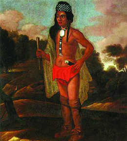
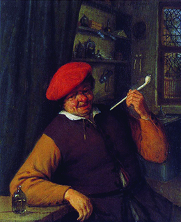

By the end of this section, you will be able to:
* Explain the reasons for the rise of slavery in the American colonies
* Describe changes to Indian life, including warfare and hunting
* Contrast European and Indian views on property
* Assess the impact of European settlement on the environment

As Europeans moved beyond exploration and into colonization of the Americas, they brought changes to virtually every aspect of the land and its people, from trade and hunting to warfare and personal property. European goods, ideas, and diseases shaped the changing continent.

As Europeans established their colonies, their societies also became segmented and divided along religious and racial lines. Most people in these societies were not free; they labored as servants or slaves, doing the work required to produce wealth for others. By 1700, the American continent had become a place of stark contrasts between slavery and freedom, between the haves and the have-nots.

### THE INSTITUTION OF SLAVERY

Everywhere in the American colonies, a crushing demand for labor existed to grow New World cash crops, especially sugar and tobacco. This need led Europeans to rely increasingly on Africans, and after 1600, the movement of Africans across the Atlantic accelerated. The English crown chartered the Royal African Company in 1672, giving the company a monopoly over the transport of African slaves to the English colonies. Over the next four decades, the company transported around 350,000 Africans from their homelands. By 1700, the tiny English sugar island of Barbados had a population of fifty thousand slaves, and the English had encoded the institution of chattel slavery into colonial law.

This new system of African slavery came slowly to the English colonists, who did not have slavery at home and preferred to use servant labor. Nevertheless, by the end of the seventeenth century, the English everywhere in America—and particularly in the Chesapeake Bay colonies—had come to rely on African slaves. While Africans had long practiced slavery among their own people, it had not been based on race. Africans enslaved other Africans as war captives, for crimes, and to settle debts; they generally used their slaves for domestic and small-scale agricultural work, not for growing cash crops on large plantations. Additionally, African slavery was often a temporary condition rather than a lifelong sentence, and, unlike New World slavery, it was typically not heritable (passed from a slave mother to her children).

The growing slave trade with Europeans had a profound impact on the people of West Africa, giving prominence to local chieftains and merchants who traded slaves for European textiles, alcohol, guns, tobacco, and food. Africans also charged Europeans for the right to trade in slaves and imposed taxes on slave purchases. Different African groups and kingdoms even staged large-scale raids on each other to meet the demand for slaves.

Once sold to traders, all slaves sent to America endured the hellish **Middle Passage**{: data-type="term"}, the transatlantic crossing, which took one to two months. By 1625, more than 325,800 Africans had been shipped to the New World, though many thousands perished during the voyage. An astonishing number, some four million, were transported to the Caribbean between 1501 and 1830. When they reached their destination in America, Africans found themselves trapped in shockingly brutal slave societies. In the Chesapeake colonies, they faced a lifetime of harvesting and processing tobacco.

Everywhere, Africans resisted slavery, and running away was common. In Jamaica and elsewhere, runaway slaves created **maroon communities**{: data-type="term"}, groups that resisted recapture and eked a living from the land, rebuilding their communities as best they could. When possible, they adhered to traditional ways, following spiritual leaders such as Vodun priests.

### CHANGES TO INDIAN LIFE

While the Americas remained firmly under the control of native peoples in the first decades of European settlement, conflict increased as colonization spread and Europeans placed greater demands upon the native populations, including expecting them to convert to Christianity (either Catholicism or Protestantism). Throughout the seventeenth century, the still-powerful native peoples and confederacies that retained control of the land waged war against the invading Europeans, achieving a degree of success in their effort to drive the newcomers from the continent.

At the same time, European goods had begun to change Indian life radically. In the 1500s, some of the earliest objects Europeans introduced to Indians were glass beads, copper kettles, and metal utensils. Native people often adapted these items for their own use. For example, some cut up copper kettles and refashioned the metal for other uses, including jewelry that conferred status on the wearer, who was seen as connected to the new European source of raw materials.

As European settlements grew throughout the 1600s, European goods flooded native communities. Soon native people were using these items for the same purposes as the Europeans. For example, many native inhabitants abandoned their animal-skin clothing in favor of European textiles. Similarly, clay cookware gave way to metal cooking implements, and Indians found that European flint and steel made starting fires much easier ([\[link\]](#CNX_History_03_04_Ninigret)).

 {: #CNX_History_03_04_Ninigret}

The abundance of European goods gave rise to new artistic objects. For example, iron awls made the creation of shell beads among the native people of the Eastern Woodlands much easier, and the result was an astonishing increase in the production of **wampum**{: data-type="term"}, shell beads used in ceremonies and as jewelry and currency. Native peoples had always placed goods in the graves of their departed, and this practice escalated with the arrival of European goods. Archaeologists have found enormous caches of European trade goods in the graves of Indians on the East Coast.

Native weapons changed dramatically as well, creating an arms race among the peoples living in European colonization zones. Indians refashioned European brassware into arrow points and turned axes used for chopping wood into weapons. The most prized piece of European weaponry to obtain was a **musket**{: data-type="term"}, or light, long-barreled European gun. In order to trade with Europeans for these, native peoples intensified their harvesting of beaver, commercializing their traditional practice.

The influx of European materials made warfare more lethal and changed traditional patterns of authority among tribes. Formerly weaker groups, if they had access to European metal and weapons, suddenly gained the upper hand against once-dominant groups. The Algonquian, for instance, traded with the French for muskets and gained power against their enemies, the Iroquois. Eventually, native peoples also used their new weapons against the European colonizers who had provided them.

  
Explore the complexity of [Indian-European relationships][1] in the series of primary source documents on the National Humanities Center site.

### ENVIRONMENTAL CHANGES

The European presence in America spurred countless changes in the environment, setting into motion chains of events that affected native animals as well as people. The popularity of beaver-trimmed hats in Europe, coupled with Indians’ desire for European weapons, led to the overhunting of beaver in the Northeast. Soon, beavers were extinct in New England, New York, and other areas. With their loss came the loss of beaver ponds, which had served as habitats for fish as well as water sources for deer, moose, and other animals. Furthermore, Europeans introduced pigs, which they allowed to forage in forests and other wildlands. Pigs consumed the foods on which deer and other indigenous species depended, resulting in scarcity of the game native peoples had traditionally hunted.

European ideas about owning land as private property clashed with natives’ understanding of land use. Native peoples did not believe in private ownership of land; instead, they viewed land as a resource to be held in common for the benefit of the group. The European idea of usufruct—the right to common land use and enjoyment—comes close to the native understanding, but colonists did not practice usufruct widely in America. Colonizers established fields, fences, and other means of demarcating private property. Native peoples who moved seasonally to take advantage of natural resources now found areas off limits, claimed by colonizers because of their insistence on private-property rights.

#### The Introduction of Disease

Perhaps European colonization’s single greatest impact on the North American environment was the introduction of disease. Microbes to which native inhabitants had no immunity led to death everywhere Europeans settled. Along the New England coast between 1616 and 1618, epidemics claimed the lives of 75 percent of the native people. In the 1630s, half the Huron and Iroquois around the Great Lakes died of smallpox. As is often the case with disease, the very young and the very old were the most vulnerable and had the highest mortality rates. The loss of the older generation meant the loss of knowledge and tradition, while the death of children only compounded the trauma, creating devastating implications for future generations.

Some native peoples perceived disease as a weapon used by hostile spiritual forces, and they went to war to exorcise the disease from their midst. These “mourning wars” in eastern North America were designed to gain captives who would either be adopted (“requickened” as a replacement for a deceased loved one) or ritually tortured and executed to assuage the anger and grief caused by loss.

#### The Cultivation of Plants

European expansion in the Americas led to an unprecedented movement of plants across the Atlantic. A prime example is tobacco, which became a valuable export as the habit of smoking, previously unknown in Europe, took hold ([\[link\]](#CNX_History_03_04_Smoker)). Another example is sugar. Columbus brought sugarcane to the Caribbean on his second voyage in 1494, and thereafter a wide variety of other herbs, flowers, seeds, and roots made the transatlantic voyage.

 {: #CNX_History_03_04_Smoker}

Just as pharmaceutical companies today scour the natural world for new drugs, Europeans traveled to America to discover new medicines. The task of cataloging the new plants found there helped give birth to the science of botany. Early botanists included the English naturalist Sir Hans Sloane, who traveled to Jamaica in 1687 and there recorded hundreds of new plants ([\[link\]](#CNX_History_03_04_Sloane)). Sloane also helped popularize the drinking of chocolate, made from the cacao bean, in England.

 {: #CNX_History_03_04_Sloane}

Indians, who possessed a vast understanding of local New World plants and their properties, would have been a rich source of information for those European botanists seeking to find and catalog potentially useful plants. Enslaved Africans, who had a tradition of the use of medicinal plants in their native land, adapted to their new surroundings by learning the use of New World plants through experimentation or from the native inhabitants. Native peoples and Africans employed their knowledge effectively within their own communities. One notable example was the use of the peacock flower to induce abortions: Indian and enslaved African women living in oppressive colonial regimes are said to have used this herb to prevent the birth of children into slavery. Europeans distrusted medical knowledge that came from African or native sources, however, and thus lost the benefit of this source of information.

### Section Summary

The development of the Atlantic slave trade forever changed the course of European settlement in the Americas. Other transatlantic travelers, including diseases, goods, plants, animals, and even ideas like the concept of private land ownership, further influenced life in America during the sixteenth and seventeenth centuries. The exchange of pelts for European goods including copper kettles, knives, and guns played a significant role in changing the material cultures of native peoples. During the seventeenth century, native peoples grew increasingly dependent on European trade items. At the same time, many native inhabitants died of European diseases, while survivors adopted new ways of living with their new neighbors.

### Review Questions

What was the Middle Passage?

1.  the fabled sea route from Europe to the Far East
2.  the land route from Europe to Africa
3.  the transatlantic journey that African slaves made to America
4.  the line between the northern and southern colonies
{: type="A"}

C

Which of the following is *not* an item Europeans introduced to Indians?

1.  wampum
2.  glass beads
3.  copper kettles
4.  metal tools
{: type="A"}

A

How did European muskets change life for native peoples in the Americas?

European guns started an arms race among Indian groups. Tribes with ties to Europeans had a distinct advantage in wars with other tribes because muskets were so much more effective than bows and arrows. Guns changed the balance of power among different groups and tribes and made combat more deadly.

Compare and contrast European and Indian views on property.

Indians didn’t have any concept of owning personal property and believed that land should be held in common, for use by a group. They used land as they needed, often moving from area to area to follow food sources at different times of year. Europeans saw land as something individuals could own, and they used fences and other markers to define their property.

### Critical Thinking Questions

Compare and contrast life in the Spanish, French, Dutch, and English colonies, differentiating between the Chesapeake Bay and New England colonies. Who were the colonizers? What were their purposes in being there? How did they interact with their environments and the native inhabitants of the lands on which they settled?

Describe the attempts of the various European colonists to convert native peoples to their belief systems. How did these attempts compare to one another? What were the results of each effort?

How did chattel slavery differ from indentured servitude? How did the former system come to replace the latter? What were the results of this shift?

What impact did Europeans have on their New World environments—native peoples and their communities as well as land, plants, and animals? Conversely, what impact did the New World’s native inhabitants, land, plants, and animals have on Europeans? How did the interaction of European and Indian societies, together, shape a world that was truly “new”?

### Glossary
{: data-type="glossary-title"}

maroon communities
: groups of runaway slaves who resisted recapture and eked a living from the land
^

Middle Passage
: the perilous, often deadly transatlantic crossing of slave ships from the African coast to the New World
^

musket
: a light, long-barreled European gun
^

wampum
: shell beads used in ceremonies and as jewelry and currency

[1]: http://openstaxcollege.org/l/NHC
