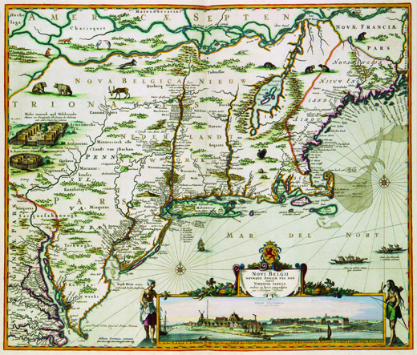

By the end of this section, you will be able to:
* Compare and contrast the development and character of the French and Dutch colonies in North America
* Discuss the economies of the French and Dutch colonies in North America

Seventeenth-century French and Dutch colonies in North America were modest in comparison to Spain’s colossal global empire. New France and New Netherland remained small commercial operations focused on the fur trade and did not attract an influx of migrants. The Dutch in New Netherland confined their operations to Manhattan Island, Long Island, the Hudson River Valley, and what later became New Jersey. Dutch trade goods circulated widely among the native peoples in these areas and also traveled well into the interior of the continent along preexisting native trade routes. French *habitants*, or farmer-settlers, eked out an existence along the St. Lawrence River. French fur traders and missionaries, however, ranged far into the interior of North America, exploring the Great Lakes region and the Mississippi River. These pioneers gave France somewhat inflated imperial claims to lands that nonetheless remained firmly under the dominion of native peoples.

# FUR TRADING IN NEW NETHERLAND

The Dutch Republic emerged as a major commercial center in the 1600s. Its fleets plied the waters of the Atlantic, while other Dutch ships sailed to the Far East, returning with prized spices like pepper to be sold in the bustling ports at home, especially Amsterdam. In North America, Dutch traders established themselves first on Manhattan Island.

One of the Dutch directors-general of the North American settlement, Peter Stuyvesant, served from 1647 to 1664 and expanded the fledgling outpost of New Netherland east to present-day Long Island and for many miles north along the Hudson River. The resulting elongated colony served primarily as a fur-trading post, with the powerful Dutch West India Company controlling all commerce. Fort Amsterdam, on the southern tip of Manhattan Island, defended the growing city of New Amsterdam. In 1655, Stuyvesant took over the small outpost of New Sweden along the banks of the Delaware River in present-day New Jersey, Pennsylvania, and Delaware. He also defended New Amsterdam from Indian attacks by ordering African slaves to build a protective wall on the city’s northeastern border, giving present-day Wall Street its name ([\[link\]](#CNX_History_03_02_Castello)).

 . The line with spikes on the right side of the colony is the northeastern wall for which Wall Street was named."){: #CNX_History_03_02_Castello}

New Netherland failed to attract many Dutch colonists; by 1664, only nine thousand people were living there. Conflict with native peoples, as well as dissatisfaction with the Dutch West India Company’s trading practices, made the Dutch outpost an undesirable place for many migrants. The small size of the population meant a severe labor shortage, and to complete the arduous tasks of early settlement, the **Dutch West India Company**{: data-type="term" .no-emphasis} imported some 450 African slaves between 1626 and 1664. (The company had involved itself heavily in the slave trade and in 1637 captured Elmina, the slave-trading post on the west coast of Africa, from the Portuguese.) The shortage of labor also meant that New Netherland welcomed non-Dutch immigrants, including Protestants from Germany, Sweden, Denmark, and England, and embraced a degree of religious tolerance, allowing Jewish immigrants to become residents beginning in the 1650s. Thus, a wide variety of people lived in New Netherland from the start. Indeed, one observer claimed eighteen different languages could be heard on the streets of New Amsterdam. As new settlers arrived, the colony of New Netherland stretched farther to the north and the west ([\[link\]](#CNX_History_03_02_Map)).

 {: #CNX_History_03_02_Map}

The Dutch West India Company found the business of colonization in New Netherland to be expensive. To share some of the costs, it granted Dutch merchants who invested heavily in it **patroonships**{: data-type="term"}, or large tracts of land and the right to govern the tenants there. In return, the shareholder who gained the patroonship promised to pay for the passage of at least thirty Dutch farmers to populate the colony. One of the largest patroonships was granted to Kiliaen van Rensselaer, one of the directors of the Dutch West India Company; it covered most of present-day Albany and Rensselaer Counties. This pattern of settlement created a yawning gap in wealth and status between the tenants, who paid rent, and the wealthy patroons.

During the summer trading season, Indians gathered at trading posts such as the Dutch site at Beverwijck (present-day Albany), where they exchanged furs for guns, blankets, and alcohol. The furs, especially beaver pelts destined for the lucrative European millinery market, would be sent down the Hudson River to New Amsterdam. There, slaves or workers would load them aboard ships bound for Amsterdam.

  
Explore an [interactive map of New Amsterdam in 1660][1] that shows the city plan and the locations of various structures, including houses, businesses, and public buildings. Rolling over the map reveals relevant historical details, such as street names, the identities of certain buildings and businesses, and the names of residents of the houses (when known).

# COMMERCE AND CONVERSION IN NEW FRANCE

After Jacques Cartier’s voyages of discovery in the 1530s, France showed little interest in creating permanent colonies in North America until the early 1600s, when Samuel de Champlain established Quebec as a French fur-trading outpost. Although the fur trade was lucrative, the French saw Canada as an inhospitable frozen wasteland, and by 1640, fewer than four hundred settlers had made their home there. The sparse French presence meant that colonists depended on the local native Algonquian people; without them, the French would have perished. French fishermen, explorers, and fur traders made extensive contact with the Algonquian. The Algonquian, in turn, tolerated the French because the colonists supplied them with firearms for their ongoing war with the Iroquois. Thus, the French found themselves escalating native wars and supporting the Algonquian against the Iroquois, who received weapons from their Dutch trading partners. These seventeenth-century conflicts centered on the lucrative trade in beaver pelts, earning them the name of the Beaver Wars. In these wars, fighting between rival native peoples spread throughout the Great Lakes region.

A handful of French Jesuit priests also made their way to Canada, intent on converting the native inhabitants to Catholicism. The **Jesuits**{: data-type="term"} were members of the Society of Jesus, an elite religious order founded in the 1540s to spread Catholicism and combat the spread of Protestantism. The first Jesuits arrived in Quebec in the 1620s, and for the next century, their numbers did not exceed forty priests. Like the Spanish Franciscan missionaries, the Jesuits in the colony called New France labored to convert the native peoples to Catholicism. They wrote detailed annual reports about their progress in bringing the faith to the Algonquian and, beginning in the 1660s, to the Iroquois. These documents are known as the *Jesuit Relations* ([\[link\]](#CNX_History_03_02_Jesuit)), and they provide a rich source for understanding both the Jesuit view of the Indians and the Indian response to the colonizers.

One native convert to Catholicism, a Mohawk woman named Katherine Tekakwitha, so impressed the priests with her piety that a Jesuit named Claude Chauchetière attempted to make her a saint in the Church. However, the effort to canonize Tekakwitha faltered when leaders of the Church balked at elevating a “savage” to such a high status; she was eventually canonized in 2012. French colonizers pressured the native inhabitants of New France to convert, but they virtually never saw native peoples as their equals.

A Jesuit Priest on Indian Healing Traditions

The *Jesuit Relations* ([\[link\]](#CNX_History_03_02_Jesuit)) provide incredible detail about Indian life. For example, the 1636 edition, written by the Catholic priest Jean de Brébeuf, addresses the devastating effects of disease on native peoples and the efforts made to combat it.

."){: #CNX_History_03_02_Jesuit}

\> Let us return to the feasts. The *Aoutaerohi* is a remedy which is only for one particular kind of disease, which they call also *Aoutaerohi*, from the name of a little Demon as large as the fist, which they say is in the body of the sick man, especially in the part which pains him. They find out that they are sick of this disease, by means of a dream, or by the intervention of some Sorcerer. . . .
> * * *
> {: data-type="newline"}
> 
> Of three kinds of games especially in use among these Peoples,—namely, the games of crosse \[lacrosse\], dish, and straw,—the first two are, they say, most healing. Is not this worthy of compassion? There is a poor sick man, fevered of body and almost dying, and a miserable Sorcerer will order for him, as a cooling remedy, a game of crosse. Or the sick man himself, sometimes, will have dreamed that he must die unless the whole country shall play crosse for his health; and, no matter how little may be his credit, you will see then in a beautiful field, Village contending against Village, as to who will play crosse the better, and betting against one another Beaver robes and Porcelain collars, so as to excite greater interest.

According to this account, how did Indians attempt to cure disease? Why did they prescribe a game of lacrosse? What benefits might these games have for the sick?

# Section Summary

The French and Dutch established colonies in the northeastern part of North America: the Dutch in present-day New York, and the French in present-day Canada. Both colonies were primarily trading posts for furs. While they failed to attract many colonists from their respective home countries, these outposts nonetheless intensified imperial rivalries in North America. Both the Dutch and the French relied on native peoples to harvest the pelts that proved profitable in Europe.

# Review Questions

What was patroonship?

a Dutch ship used for transporting beaver furs

a Dutch system of patronage that encouraged the arts

a Dutch system of granting tracts of land in New Netherland to encourage colonization

a Dutch style of hat trimmed with beaver fur from New Netherland

C

Which religious order joined the French settlement in Canada and tried to convert the natives to Christianity?

Franciscans

Calvinists

Anglicans

Jesuits

D

How did the French and Dutch colonists differ in their religious expectations? How did both compare to Spanish colonists?

The Dutch allowed the most religious freedoms; they didn’t try to convert native peoples to Christianity, and they allowed Jewish immigrants to join their colony. French Jesuit missionaries tried to convert Indians to Catholicism, but with much more acceptance of their differences than Spanish missionaries.

## Glossary
{: data-type="glossary-title"}

Jesuits
: members of the Society of Jesus, an elite Catholic religious order founded in the 1540s to spread Catholicism and to combat the spread of Protestantism
{: .definition}

patroonships
: large tracts of land and governing rights granted to merchants by the Dutch West India Company in order to encourage colonization
{: .definition}

[1]: http://openstaxcollege.org/l/WNET
