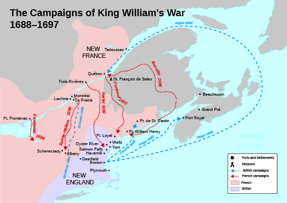
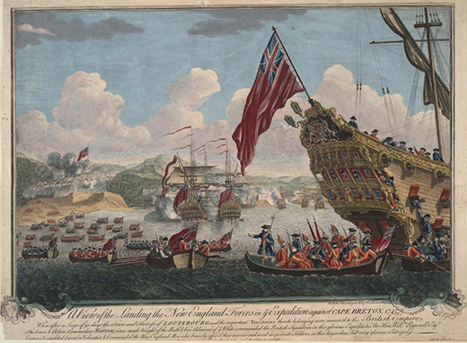
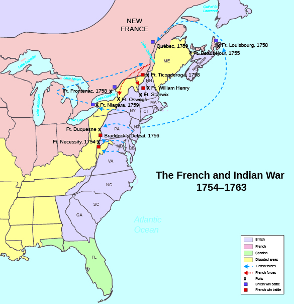

By the end of this section, you will be able to:
* Describe the wars for empire
* Analyze the significance of these conflicts

Wars for empire composed a final link connecting the Atlantic sides of the British Empire. Great Britain fought four separate wars against Catholic France from the late 1600s to the mid-1700s. Another war, the War of Jenkins’ Ear, pitted Britain against Spain. These conflicts for control of North America also helped colonists forge important alliances with native peoples, as different tribes aligned themselves with different European powers.

### GENERATIONS OF WARFARE

Generations of British colonists grew up during a time when much of North America, especially the Northeast, engaged in war. Colonists knew war firsthand. In the eighteenth century, fighting was seasonal. Armies mobilized in the spring, fought in the summer, and retired to winter quarters in the fall. The British army imposed harsh discipline on its soldiers, who were drawn from the poorer classes, to ensure they did not step out of line during engagements. If they did, their officers would kill them. On the battlefield, armies dressed in bright uniforms to advertise their bravery and lack of fear. They stood in tight formation and exchanged volleys with the enemy. They often feared their officers more than the enemy.

  
Read the diary of a provincial soldier who fought in the French and Indian War on the [Captain David Perry Web Site][1] hosted by Rootsweb. David Perry’s journal, which includes a description of the 1758 campaign, provides a glimpse of warfare in the eighteenth century.

Most imperial conflicts had both American and European fronts, leaving us with two names for each war. For instance, King William’s War (1688–1697) is also known as the War of the League of Augsburg. In America, the bulk of the fighting in this conflict took place between New England and New France. The war proved inconclusive, with no clear victor ([\[link\]](#CNX_History_04_05_WilliamWar)).

 {: #CNX_History_04_05_WilliamWar}

Queen Anne’s War (1702–1713) is also known as the War of Spanish Succession. England fought against both Spain and France over who would ascend the Spanish throne after the last of the Hapsburg rulers died. In North America, fighting took place in Florida, New England, and New France. In Canada, the French prevailed but lost Acadia and Newfoundland; however, the victory was again not decisive because the English failed to take Quebec, which would have given them control of Canada.

This conflict is best remembered in the United States for the French and Indian raid against Deerfield, Massachusetts, in 1704. A small French force, combined with a native group made up of Catholic Mohawks and Abenaki (Pocumtucs), attacked the frontier outpost of Deerfield, killing scores and taking 112 prisoners. Among the captives was the seven-year-old daughter of Deerfield’s minister John Williams, named Eunice. She was held by the Mohawks for years as her family tried to get her back, and became assimilated into the tribe. To the horror of the Puritan leaders, when she grew up Eunice married a Mohawk and refused to return to New England.

In North America, possession of Georgia and trade with the interior was the focus of the War of Jenkins’ Ear (1739–1742), a conflict between Britain and Spain over contested claims to the land occupied by the fledgling colony between South Carolina and Florida. The war got its name from an incident in 1731 in which a Spanish Coast Guard captain severed the ear of British captain Robert Jenkins as punishment for raiding Spanish ships in Panama. Jenkins fueled the growing animosity between England and Spain by presenting his ear to Parliament and stirring up British public outrage. More than anything else, the War of Jenkins’ Ear disrupted the Atlantic trade, a situation that hurt both Spain and Britain and was a major reason the war came to a close in 1742. Georgia, founded six years earlier, remained British and a buffer against Spanish Florida.

King George’s War (1744–1748), known in Europe as the War of Austrian Succession (1740–1748), was fought in the northern colonies and New France. In 1745, the British took the massive French fortress at Louisbourg on Cape Breton Island, Nova Scotia ([\[link\]](#CNX_History_04_05_Louisbourg)). However, three years later, under the terms of the Treaty of Aix-la-Chapelle, Britain relinquished control of the fortress to the French. Once again, war resulted in an incomplete victory for both Britain and France.

 {: #CNX_History_04_05_Louisbourg}

### THE FRENCH AND INDIAN WAR

The final imperial war, the **French and Indian War**{: data-type="term"} (1754–1763), known as the Seven Years’ War (1756–1763) in Europe, proved to be the decisive contest between Britain and France in America. It began over rival claims along the frontier in present-day western Pennsylvania. Well-connected planters from Virginia faced stagnant tobacco prices and hoped expanding into these western lands would stabilize their wealth and status. Some of them established the Ohio Company of Virginia in 1748, and the British crown granted the company half a million acres in 1749. However, the French also claimed the lands of the Ohio Company, and to protect the region they established Fort Duquesne in 1754, where the Ohio, Monongahela, and Allegheny Rivers met.

The war began in May 1754 because of these competing claims between Britain and France. Twenty-two-year-old Virginian George Washington, a surveyor whose family helped to found the Ohio Company, gave the command to fire on French soldiers near present-day Uniontown, Pennsylvania. This incident on the Pennsylvania frontier proved to be a decisive event that led to imperial war. For the next decade, fighting took place along the frontier of New France and British America from Virginia to Maine. The war also spread to Europe as France and Britain looked to gain supremacy in the Atlantic World.

The British fared poorly in the first years of the war. In 1754, the French and their native allies forced Washington to surrender at Fort Necessity, a hastily built fort constructed after his attack on the French. In 1755, Britain dispatched General Edward Braddock to the colonies to take Fort Duquesne. The French, aided by the Potawotomis, Ottawas, Shawnees, and Delawares, ambushed the fifteen hundred British soldiers and Virginia militia who marched to the fort. The attack sent panic through the British force, and hundreds of British soldiers and militiamen died, including General Braddock. The campaign of 1755 proved to be a disaster for the British. In fact, the only British victory that year was the capture of Nova Scotia. In 1756 and 1757, Britain suffered further defeats with the fall of Fort Oswego and Fort William Henry ([\[link\]](#CNX_History_04_05_FrenIndian)).

 {: #CNX_History_04_05_FrenIndian}

The war began to turn in favor of the British in 1758, due in large part to the efforts of William Pitt, a very popular member of Parliament. Pitt pledged huge sums of money and resources to defeating the hated Catholic French, and Great Britain spent part of the money on bounties paid to new young recruits in the colonies, helping invigorate the British forces. In 1758, the Iroquois, Delaware, and Shawnee signed the Treaty of Easton, aligning themselves with the British in return for some contested land around Pennsylvania and Virginia. In 1759, the British took Quebec, and in 1760, Montreal. The French empire in North America had crumbled.

The war continued until 1763, when the French signed the **Treaty of Paris**{: data-type="term" .no-emphasis}. This treaty signaled a dramatic reversal of fortune for France. Indeed, New France, which had been founded in the early 1600s, ceased to exist. The British Empire had now gained mastery over North America. The Empire not only gained New France under the treaty; it also acquired French sugar islands in the West Indies, French trading posts in India, and French-held posts on the west coast of Africa. Great Britain’s victory in the French and Indian War meant that it had become a truly global empire. British colonists joyously celebrated, singing the refrain of “Rule, Britannia! / Britannia, rule the waves! / Britons never, never, never shall be slaves!”

In the American colonies, ties with Great Britain were closer than ever. Professional British soldiers had fought alongside Anglo-American militiamen, forging a greater sense of shared identity. With Great Britain’s victory, colonial pride ran high as colonists celebrated their identity as British subjects.

This last of the wars for empire, however, also sowed the seeds of trouble. The war led Great Britain deeply into debt, and in the 1760s and 1770s, efforts to deal with the debt through imperial reforms would have the unintended consequence of causing stress and strain that threatened to tear the Empire apart.

### Section Summary

From 1688 to 1763, Great Britain engaged in almost continuous power struggles with France and Spain. Most of these conflicts originated in Europe, but their engagements spilled over into the colonies. For almost eighty years, Great Britain and France fought for control of eastern North America. During most of that time, neither force was able to win a decisive victory, though each side saw occasional successes with the crucial help of native peoples. It was not until halfway through the French and Indian War (1754–1763), when Great Britain swelled its troops with more volunteers and native allies, that the balance of power shifted toward the British. With the 1763 Treaty of Paris, New France was eliminated, and Great Britain gained control of all the lands north of Florida and east of the Mississippi. British subjects on both sides of the Atlantic rejoiced.

### Review Questions

What was the primary goal of Britain’s wars for empire from 1688 to 1763?

1.  control of North America
2.  control of American Indians
3.  greater power in Europe and the world
4.  defeat of Catholicism
{: type="A"}

C

Who were the main combatants in the French and Indian War?

1.  France against Indians
2.  Great Britain against Indians
3.  Great Britain against France
4.  Great Britain against the French and their Indian allies
{: type="A"}

D

What prompted the French and Indian War?

Virginia planters, pinched by stagnant tobacco prices, wanted to expand westward. However, France contested Britain’s claim to that land and built Fort Duquesne to defend it. The battle over this land sparked the war that eventually ended France’s presence in North America.

### Critical Thinking Questions

How did Pennsylvania’s Quaker beginnings distinguish it from other colonies in British America?

What were the effects of the consumer revolution on the colonies?

How did the ideas of the Enlightenment and the Great Awakening offer opposing outlooks to British Americans? What similarities were there between the two schools of thought?

What was the impact of the wars for empire in North America, Europe, and the world?

What role did Indians play in the wars for empire?

What shared experiences, intellectual currents, and cultural elements drew together British subjects on both sides of the Atlantic during this period? How did these experiences, ideas, and goods serve to strengthen those bonds?

### Glossary
{: data-type="glossary-title"}

French and Indian War
: the last eighteenth-century imperial struggle between Great Britain and France, leading to a decisive British victory; this war lasted from 1754 to 1763 and was also called the Seven Years’ War

[1]: http://openstax.org/l/DPerry
