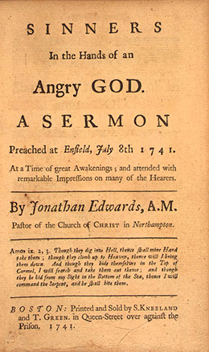
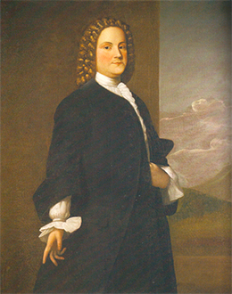

By the end of this section, you will be able to:
* Explain the significance of the Great Awakening
* Describe the genesis, central ideas, and effects of the Enlightenment in British North America

Two major cultural movements further strengthened Anglo-American colonists’ connection to Great Britain: the Great Awakening and the Enlightenment. Both movements began in Europe, but they advocated very different ideas: the Great Awakening promoted a fervent, emotional religiosity, while the Enlightenment encouraged the pursuit of reason in all things. On both sides of the Atlantic, British subjects grappled with these new ideas.

### THE FIRST GREAT AWAKENING

During the eighteenth century, the British Atlantic experienced an outburst of Protestant revivalism known as the **First Great Awakening**{: data-type="term"}. (A Second Great Awakening would take place in the 1800s.) During the First Great Awakening, evangelists came from the ranks of several Protestant denominations: Congregationalists, Anglicans (members of the Church of England), and Presbyterians. They rejected what appeared to be sterile, formal modes of worship in favor of a vigorous emotional religiosity. Whereas Martin Luther and John Calvin had preached a doctrine of predestination and close reading of scripture, new evangelical ministers spread a message of personal and experiential faith that rose above mere book learning. Individuals could bring about their own salvation by accepting Christ, an especially welcome message for those who had felt excluded by traditional Protestantism: women, the young, and people at the lower end of the social spectrum.

The Great Awakening caused a split between those who followed the evangelical message (the “New Lights”) and those who rejected it (the “Old Lights”). The elite ministers in British America were firmly Old Lights, and they censured the new revivalism as chaos. Indeed, the revivals did sometimes lead to excess. In one notorious incident in 1743, an influential New Light minister named James Davenport urged his listeners to burn books. The next day, he told them to burn their clothes as a sign of their casting off the sinful trappings of the world. He then took off his own pants and threw them into the fire, but a woman saved them and tossed them back to Davenport, telling him he had gone too far.

Another outburst of Protestant revivalism began in New Jersey, led by a minister of the Dutch Reformed Church named Theodorus Frelinghuysen. Frelinghuysen’s example inspired other ministers, including Gilbert Tennent, a Presbyterian. Tennant helped to spark a Presbyterian revival in the Middle Colonies (Pennsylvania, New York, and New Jersey), in part by founding a seminary to train other evangelical clergyman. New Lights also founded colleges in Rhode Island and New Hampshire that would later become Brown University and Dartmouth College.

In Northampton, Massachusetts, Jonathan Edwards led still another explosion of evangelical fervor. Edwards’s best-known sermon, “Sinners in the Hands of an Angry God,” used powerful word imagery to describe the terrors of hell and the possibilities of avoiding damnation by personal conversion ([\[link\]](#CNX_History_04_04_Sinners)). One passage reads: “The wrath of God burns against them \[sinners\], their damnation don’t slumber, the pit is prepared, the fire is made ready, the furnace is now hot, ready to receive them, the flames do now rage and glow. The glittering sword is whet, and held over them, and the pit hath opened her mouth under them.” Edwards’s revival spread along the Connecticut River Valley, and news of the event spread rapidly through the frequent reprinting of his famous sermon.

 {: #CNX_History_04_04_Sinners}

The foremost evangelical of the Great Awakening was an Anglican minister named George Whitefield. Like many evangelical ministers, Whitefield was itinerant, traveling the countryside instead of having his own church and congregation. Between 1739 and 1740, he electrified colonial listeners with his brilliant oratory.

Two Opposing Views of George Whitefield

Not everyone embraced George Whitefield and other New Lights. Many established Old Lights decried the way the new evangelical religions appealed to people’s passions, rather than to traditional religious values. The two illustrations below present two very different visions of George Whitefield ([\[link\]](#CNX_History_04_04_Whitefield)).

![Illustration (a) shows George Whitefield preaching, with his hands raised and a neutral facial expression. Cartoon (b) shows George Whitefield preaching, again with his hands raised, surrounded by men and women; he is flanked from above by an angel on one side, a devil on the other. In the surrounding crowd, groups of men seem to be lecturing or harassing people; for example, in the far right corner two men are overturning the table of a woman, perhaps a vendor of some sort. The title reads &#x201C;Dr. Squintum&#x2019;s Exaltation or the Reformation.&#x201D;](../resources/CNX_History_04_04_Whitefield.jpg "In the 1774 portrait of George Whitefield by engraver Elisha Gallaudet (a), Whitefield appears with a gentle expression on his face. Although his hands are raised in exultation or entreaty, he does not look particularly roused or rousing. In the 1763 British political cartoon to the right, &#x201C;Dr. Squintum&#x2019;s Exaltation or the Reformation&#x201D; (b), Whitefield&#x2019;s hands are raised in a similar position, but there the similarities end."){: #CNX_History_04_04_Whitefield}

Compare the two images above. On the left is an illustration for Whitefield’s memoirs, while on the right is a cartoon satirizing the circus-like atmosphere that his preaching seemed to attract (Dr. Squintum was a nickname for Whitefield, who was cross-eyed). How do these two artists portray the same man? What emotions are the illustration for his memoirs intended to evoke? What details can you find in the cartoon that indicate the artist’s distaste for the preacher?

The Great Awakening saw the rise of several Protestant denominations, including Methodists, Presbyterians, and Baptists (who emphasized adult baptism of converted Christians rather than infant baptism). These new churches gained converts and competed with older Protestant groups like Anglicans (members of the Church of England), Congregationalists (the heirs of Puritanism in America), and Quakers. The influence of these older Protestant groups, such as the New England Congregationalists, declined because of the Great Awakening. Nonetheless, the Great Awakening touched the lives of thousands on both sides of the Atlantic and provided a shared experience in the eighteenth-century British Empire.

### THE ENLIGHTENMENT

The **Enlightenment**{: data-type="term"}, or the Age of Reason, was an intellectual and cultural movement in the eighteenth century that emphasized reason over superstition and science over blind faith. Using the power of the press, Enlightenment thinkers like John Locke, Isaac Newton, and Voltaire questioned accepted knowledge and spread new ideas about openness, investigation, and religious tolerance throughout Europe and the Americas. Many consider the Enlightenment a major turning point in Western civilization, an age of light replacing an age of darkness.

Several ideas dominated Enlightenment thought, including rationalism, empiricism, progressivism, and cosmopolitanism. Rationalism is the idea that humans are capable of using their faculty of reason to gain knowledge. This was a sharp turn away from the prevailing idea that people needed to rely on scripture or church authorities for knowledge. Empiricism promotes the idea that knowledge comes from experience and observation of the world. Progressivism is the belief that through their powers of reason and observation, humans could make unlimited, linear progress over time; this belief was especially important as a response to the carnage and upheaval of the English Civil Wars in the seventeenth century. Finally, cosmopolitanism reflected Enlightenment thinkers’ view of themselves as citizens of the world and actively engaged in it, as opposed to being provincial and close-minded. In all, Enlightenment thinkers endeavored to be ruled by reason, not prejudice.

The **Freemasons**{: data-type="term"} were a fraternal society that advocated Enlightenment principles of inquiry and tolerance. Freemasonry originated in London coffeehouses in the early eighteenth century, and Masonic lodges (local units) soon spread throughout Europe and the British colonies. One prominent Freemason, Benjamin Franklin, stands as the embodiment of the Enlightenment in British America ([\[link\]](#CNX_History_04_04_Franklin)). Born in Boston in 1706 to a large Puritan family, Franklin loved to read, although he found little beyond religious publications in his father’s house. In 1718 he was apprenticed to his brother to work in a print shop, where he learned how to be a good writer by copying the style he found in the *Spectator*, which his brother printed. At the age of seventeen, the independent-minded Franklin ran away, eventually ending up in Quaker Philadelphia. There he began publishing the *Pennsylvania Gazette* in the late 1720s, and in 1732 he started his annual publication *Poor Richard: An Almanack*, in which he gave readers much practical advice, such as “Early to bed, early to rise, makes a man healthy, wealthy, and wise.”

 {: #CNX_History_04_04_Franklin}

Franklin subscribed to **deism**{: data-type="term"}, an Enlightenment-era belief in a God who created, but has no continuing involvement in, the world and the events within it. Deists also advanced the belief that personal morality—an individual’s moral compass, leading to good works and actions—is more important than strict church doctrines. Franklin’s deism guided his many philanthropic projects. In 1731, he established a reading library that became the Library Company of Philadelphia. In 1743, he founded the American Philosophical Society to encourage the spirit of inquiry. In 1749, he provided the foundation for the University of Pennsylvania, and in 1751, he helped found Pennsylvania Hospital.

His career as a printer made Franklin wealthy and well-respected. When he retired in 1748, he devoted himself to politics and scientific experiments. His most famous work, on electricity, exemplified Enlightenment principles. Franklin observed that lightning strikes tended to hit metal objects and reasoned that he could therefore direct lightning through the placement of metal objects during an electrical storm. He used this knowledge to advocate the use of lightning rods: metal poles connected to wires directing lightning’s electrical charge into the ground and saving wooden homes in cities like Philadelphia from catastrophic fires. He published his findings in 1751, in *Experiments and Observations on Electricity*.

Franklin also wrote of his “rags to riches” tale, his *Memoir*, in the 1770s and 1780s. This story laid the foundation for the American Dream of upward social mobility.

  
Visit the [Worldly Ways section][1] of PBS’s Benjamin Franklin site to see an interactive map showing Franklin’s overseas travels and his influence around the world. His diplomatic, political, scientific, and business achievements had great effects in many countries.

### THE FOUNDING OF GEORGIA

The reach of Enlightenment thought was both broad and deep. In the 1730s, it even prompted the founding of a new colony. Having witnessed the terrible conditions of debtors’ prison, as well as the results of releasing penniless debtors onto the streets of London, James Oglethorpe, a member of Parliament and advocate of social reform, petitioned King George II for a charter to start a new colony. George II, understanding the strategic advantage of a British colony standing as a buffer between South Carolina and Spanish Florida, granted the charter to Oglethorpe and twenty like-minded proprietors in 1732. Oglethorpe led the settlement of the colony, which was called Georgia in honor of the king. In 1733, he and 113 immigrants arrived on the ship *Anne*. Over the next decade, Parliament funded the migration of twenty-five hundred settlers, making Georgia the only government-funded colonial project.

Oglethorpe’s vision for Georgia followed the ideals of the **Age of Reason**{: data-type="term" .no-emphasis}, seeing it as a place for England’s “worthy poor” to start anew. To encourage industry, he gave each male immigrant fifty acres of land, tools, and a year’s worth of supplies. In Savannah, the Oglethorpe Plan provided for a utopia: “an agrarian model of sustenance while sustaining egalitarian values holding all men as equal.”

Oglethorpe’s vision called for alcohol and slavery to be banned. However, colonists who relocated from other colonies, especially South Carolina, disregarded these prohibitions. Despite its proprietors’ early vision of a colony guided by Enlightenment ideals and free of slavery, by the 1750s, Georgia was producing quantities of rice grown and harvested by slaves.

### Section Summary

The eighteenth century saw a host of social, religious, and intellectual changes across the British Empire. While the Great Awakening emphasized vigorously emotional religiosity, the Enlightenment promoted the power of reason and scientific observation. Both movements had lasting impacts on the colonies. The beliefs of the New Lights of the First Great Awakening competed with the religions of the first colonists, and the religious fervor in Great Britain and her North American colonies bound the eighteenth-century British Atlantic together in a shared, common experience. The British colonist Benjamin Franklin gained fame on both sides of the Atlantic as a printer, publisher, and scientist. He embodied Enlightenment ideals in the British Atlantic with his scientific experiments and philanthropic endeavors. Enlightenment principles even guided the founding of the colony of Georgia, although those principles could not stand up to the realities of colonial life, and slavery soon took hold in the colony.

### Review Questions

What was the First Great Awakening?

1.  a cultural and intellectual movement that emphasized reason and science over superstition and religion
2.  a Protestant revival that emphasized emotional, experiential faith over book learning
3.  a cultural shift that promoted Christianity among slave communities
4.  the birth of an American identity, promoted by Benjamin Franklin
{: type="A"}

B

Which of the following is not a tenet of the Enlightenment?

1.  atheism
2.  empiricism
3.  progressivism
4.  rationalism
{: type="A"}

A

Who were the Freemasons, and why were they significant?

The Freemasons were a fraternal society that originated in London coffeehouses in the early eighteenth century. They advocated Enlightenment principles of inquiry and tolerance. Masonic lodges soon spread throughout Europe and the British colonies, creating a shared experience on both sides of the Atlantic and spreading Enlightenment intellectual currents throughout the British Empire. Benjamin Franklin was a prominent Freemason.

### Glossary
{: data-type="glossary-title"}

deism
: an Enlightenment-era belief in the existence of a supreme being—specifically, a creator who does not intervene in the universe—representing a rejection of the belief in a supernatural deity who interacts with humankind
^

Enlightenment
: an eighteenth-century intellectual and cultural movement that emphasized reason and science over superstition, religion, and tradition
^

First Great Awakening
: an eighteenth-century Protestant revival that emphasized individual, experiential faith over church doctrine and the close study of scripture
^

Freemasons
: a fraternal society founded in the early eighteenth century that advocated Enlightenment principles of inquiry and tolerance

[1]: http://openstax.org/l/bfranklin1
