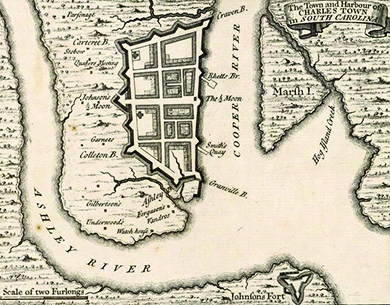
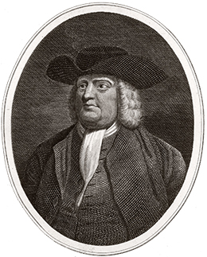

By the end of this section, you will be able to:
* Analyze the causes and consequences of the Restoration
* Identify the Restoration colonies and their role in the expansion of the Empire

 ![A timeline shows important events of the era. In 1660, Charles II ascends the English throne and the Restoration begins; a portrait of Charles II is shown. In 1681, William Penn founds Pennsylvania Colony; a portrait of William Penn is shown. In 1688&#x2013;1689, the Glorious Revolution overthrows King James II; a portrait of King James II is shown. In 1689, the Bill of Rights establishes constitutional monarchy in England; the Bill of Rights is shown. In 1733, James Oglethorpe founds Georgia for the &#x201C;worthy poor&#x201D;; a portrait of James Oglethorpe is shown. In 1739, slaves revolt in the Stono Rebellion. In 1741, suspicious fires lead to the New York Conspiracy Trials. In 1754, the French and Indian War (Seven Years&#x2019; War) begins. In 1763, the Treaty of Paris eliminates New France.](../resources/CNX_History_04_01_Timeline.jpg){: #CNX_History_04_01_Timeline}

When Charles II ascended the throne in 1660, English subjects on both sides of the Atlantic celebrated the restoration of the English monarchy after a decade of living without a king as a result of the English Civil Wars. Charles II lost little time in strengthening England’s global power. From the 1660s to the 1680s, Charles II added more possessions to England’s North American holdings by establishing the Restoration colonies of New York and New Jersey (taking these areas from the Dutch) as well as Pennsylvania and the Carolinas. In order to reap the greatest economic benefit from England’s overseas possessions, Charles II enacted the mercantilist Navigation Acts, although many colonial merchants ignored them because enforcement remained lax.

### CHARLES II

The chronicle of Charles II begins with his father, Charles I. Charles I ascended the English throne in 1625 and soon married a French Catholic princess, Henrietta Maria, who was not well liked by English Protestants because she openly practiced Catholicism during her husband’s reign. The most outspoken Protestants, the Puritans, had a strong voice in Parliament in the 1620s, and they strongly opposed the king’s marriage and his ties to Catholicism. When Parliament tried to contest his edicts, including the king’s efforts to impose taxes without Parliament’s consent, Charles I suspended Parliament in 1629 and ruled without one for the next eleven years.

The ensuing struggle between the king and Parliament led to the outbreak of war. The English Civil War lasted from 1642 to 1649 and pitted the king and his Royalist supporters against Oliver Cromwell and his Parliamentary forces. After years of fighting, the Parliamentary forces gained the upper hand, and in 1649, they charged Charles I with treason and beheaded him. The monarchy was dissolved, and England became a republic: a state without a king. Oliver Cromwell headed the new English Commonwealth, and the period known as the **English interregnum**{: data-type="term"}, or the time between kings, began.

Though Cromwell enjoyed widespread popularity at first, over time he appeared to many in England to be taking on the powers of a military dictator. Dissatisfaction with Cromwell grew. When he died in 1658 and control passed to his son Richard, who lacked the political skills of his father, a majority of the English people feared an alternate hereditary monarchy in the making. They had had enough and asked Charles II to be king. In 1660, they welcomed the son of the executed king Charles I back to the throne to resume the English monarchy and bring the interregnum to an end ([\[link\]](#CNX_History_04_01_Cromwell)). The return of Charles II is known as the Restoration.

 , shown here in a 1656 portrait by Samuel Cooper, appeared to offer England a better mode of government, he assumed broad powers for himself and disregarded cherished English liberties established under Magna Carta in 1215. As a result, the English people welcomed Charles II (b) back to the throne in 1660. This portrait by John Michael Wright was painted ca. 1660&#x2013;1665, soon after the new king gained the throne."){: #CNX_History_04_01_Cromwell}

Charles II was committed to expanding England’s overseas possessions. His policies in the 1660s through the 1680s established and supported the **Restoration colonies**{: data-type="term"}\: the Carolinas, New Jersey, New York, and Pennsylvania. All the Restoration colonies started as **proprietary colonies**{: data-type="term"}, that is, the king gave each colony to a trusted individual, family, or group.

### THE CAROLINAS

Charles II hoped to establish English control of the area between Virginia and Spanish Florida. To that end, he issued a royal charter in 1663 to eight trusted and loyal supporters, each of whom was to be a feudal-style proprietor of a region of the province of Carolina.

These proprietors did not relocate to the colonies, however. Instead, English plantation owners from the tiny Caribbean island of Barbados, already a well-established English sugar colony fueled by slave labor, migrated to the southern part of Carolina to settle there. In 1670, they established Charles Town (later Charleston), named in honor of Charles II, at the junction of the Ashley and Cooper Rivers ([\[link\]](#CNX_History_04_01_Charleston)). As the settlement around Charles Town grew, it began to produce livestock for export to the West Indies. In the northern part of Carolina, settlers turned sap from pine trees into turpentine used to waterproof wooden ships. Political disagreements between settlers in the northern and southern parts of Carolina escalated in the 1710s through the 1720s and led to the creation, in 1729, of two colonies, North and South Carolina. The southern part of Carolina had been producing rice and indigo (a plant that yields a dark blue dye used by English royalty) since the 1700s, and South Carolina continued to depend on these main crops. North Carolina continued to produce items for ships, especially turpentine and tar, and its population increased as Virginians moved there to expand their tobacco holdings. Tobacco was the primary export of both Virginia and North Carolina, which also traded in deerskins and slaves from Africa.

 {: #CNX_History_04_01_Charleston}

Slavery developed quickly in the Carolinas, largely because so many of the early migrants came from Barbados, where slavery was well established. By the end of the 1600s, a very wealthy class of rice planters who relied on slaves had attained dominance in the southern part of the Carolinas, especially around Charles Town. By 1715, South Carolina had a black majority because of the number of slaves in the colony. The legal basis for slavery was established in the early 1700s as the Carolinas began to pass slave laws based on the Barbados slave codes of the late 1600s. These laws reduced Africans to the status of property to be bought and sold as other commodities.

  
Visit the Charleston Museum’s interactive exhibit [The Walled City][1] to learn more about the history of Charleston.

As in other areas of English settlement, native peoples in the Carolinas suffered tremendously from the introduction of European diseases. Despite the effects of disease, Indians in the area endured and, following the pattern elsewhere in the colonies, grew dependent on European goods. Local Yamasee and Creek tribes built up a trade deficit with the English, trading deerskins and captive slaves for European guns. English settlers exacerbated tensions with local Indian tribes, especially the Yamasee, by expanding their rice and tobacco fields into Indian lands. Worse still, English traders took native women captive as payment for debts.

The outrages committed by traders, combined with the seemingly unstoppable expansion of English settlement onto native land, led to the outbreak of the Yamasee War (1715–1718), an effort by a coalition of local tribes to drive away the European invaders. This native effort to force the newcomers back across the Atlantic nearly succeeded in annihilating the Carolina colonies. Only when the Cherokee allied themselves with the English did the coalition’s goal of eliminating the English from the region falter. The Yamasee War demonstrates the key role native peoples played in shaping the outcome of colonial struggles and, perhaps most important, the disunity that existed between different native groups.

### NEW YORK AND NEW JERSEY

Charles II also set his sights on the Dutch colony of New Netherland. The English takeover of New Netherland originated in the imperial rivalry between the Dutch and the English. During the Anglo-Dutch wars of the 1650s and 1660s, the two powers attempted to gain commercial advantages in the Atlantic World. During the Second Anglo-Dutch War (1664–1667), English forces gained control of the Dutch fur trading colony of New Netherland, and in 1664, Charles II gave this colony (including present-day New Jersey) to his brother James, Duke of York (later James II). The colony and city were renamed New York in his honor. The Dutch in New York chafed under English rule. In 1673, during the Third Anglo-Dutch War (1672–1674), the Dutch recaptured the colony. However, at the end of the conflict, the English had regained control ([\[link\]](#CNX_History_04_01_NewAmster)).

 , a watercolor by Johannes Vingboons, was painted during the Anglo-Dutch wars of the 1660s and 1670s. New Amsterdam was officially reincorporated as New York City in 1664, but alternated under Dutch and English rule until 1674."){: #CNX_History_04_01_NewAmster}

The Duke of York had no desire to govern locally or listen to the wishes of local colonists. It wasn’t until 1683, therefore, almost 20 years after the English took control of the colony, that colonists were able to convene a local representative legislature. The assembly’s 1683 Charter of Liberties and Privileges set out the traditional rights of Englishmen, like the right to trial by jury and the right to representative government.

The English continued the Dutch patroonship system, granting large estates to a favored few families. The largest of these estates, at 160,000 acres, was given to Robert Livingston in 1686. The Livingstons and the other manorial families who controlled the Hudson River Valley formed a formidable political and economic force. Eighteenth-century New York City, meanwhile, contained a variety of people and religions—as well as Dutch and English people, it held French Protestants (Huguenots), Jews, Puritans, Quakers, Anglicans, and a large population of slaves. As they did in other zones of colonization, native peoples played a key role in shaping the history of colonial New York. After decades of war in the 1600s, the powerful Five Nations of the Iroquois, composed of the Mohawk, Oneida, Onondaga, Cayuga, and Seneca, successfully pursued a policy of neutrality with both the English and, to the north, the French in Canada during the first half of the 1700s. This native policy meant that the Iroquois continued to live in their own villages under their own government while enjoying the benefits of trade with both the French and the English.

### PENNSYLVANIA

The Restoration colonies also included Pennsylvania, which became the geographic center of British colonial America. Pennsylvania (which means “Penn’s Woods” in Latin) was created in 1681, when Charles II bestowed the largest proprietary colony in the Americas on William Penn ([\[link\]](#CNX_History_04_01_Penn)) to settle the large debt he owed the Penn family. William Penn’s father, Admiral William Penn, had served the English crown by helping take Jamaica from the Spanish in 1655. The king personally owed the Admiral money as well.

 {: #CNX_History_04_01_Penn}

Like early settlers of the New England colonies, Pennsylvania’s first colonists migrated mostly for religious reasons. William Penn himself was a Quaker, a member of a new Protestant denomination called the Society of Friends. George Fox had founded the Society of Friends in England in the late 1640s, having grown dissatisfied with Puritanism and the idea of predestination. Rather, Fox and his followers stressed that everyone had an “inner light” inside him or her, a spark of divinity. They gained the name Quakers because they were said to quake when the inner light moved them. Quakers rejected the idea of worldly rank, believing instead in a new and radical form of social equality. Their speech reflected this belief in that they addressed all others as equals, using “thee” and “thou” rather than terms like “your lordship” or “my lady” that were customary for privileged individuals of the hereditary elite.

The English crown persecuted Quakers in England, and colonial governments were equally harsh; Massachusetts even executed several early Quakers who had gone to proselytize there. To avoid such persecution, Quakers and their families at first created a community on the sugar island of Barbados. Soon after its founding, however, Pennsylvania became the destination of choice. Quakers flocked to Pennsylvania as well as New Jersey, where they could preach and practice their religion in peace. Unlike New England, whose official religion was Puritanism, Pennsylvania did not establish an official church. Indeed, the colony allowed a degree of religious tolerance found nowhere else in English America. To help encourage immigration to his colony, Penn promised fifty acres of land to people who agreed to come to Pennsylvania and completed their term of service. Not surprisingly, those seeking a better life came in large numbers, so much so that Pennsylvania relied on indentured servants more than any other colony.

One of the primary tenets of Quakerism is pacifism, which led William Penn to establish friendly relationships with local native peoples. He formed a covenant of friendship with the Lenni Lenape (Delaware) tribe, buying their land for a fair price instead of taking it by force. In 1701, he also signed a treaty with the Susquehannocks to avoid war. Unlike other colonies, Pennsylvania did not experience war on the frontier with native peoples during its early history.

As an important port city, Philadelphia grew rapidly. Quaker merchants there established contacts throughout the Atlantic world and participated in the thriving African slave trade. Some Quakers, who were deeply troubled by the contradiction between their belief in the “inner light” and the practice of slavery, rejected the practice and engaged in efforts to abolish it altogether. Philadelphia also acted as a magnet for immigrants, who came not only from England, but from all over Europe by the hundreds of thousands. The city, and indeed all of Pennsylvania, appeared to be the best country for poor men and women, many of whom arrived as servants and dreamed of owning land. A very few, like the fortunate Benjamin Franklin, a runaway from Puritan Boston, did extraordinarily well. Other immigrant groups in the colony, most notably Germans and Scotch-Irish (families from Scotland and England who had first lived in Ireland before moving to British America), greatly improved their lot in Pennsylvania. Of course, Africans imported into the colony to labor for white masters fared far worse.

John Wilson Offers Reward for Escaped Prisoners

The *American Weekly Mercury*, published by William Bradford, was Philadelphia’s first newspaper. This advertisement from “John Wilson, *Goaler*” (jailer) offers a reward for anyone capturing several men who escaped from the jail.

<q>*BROKE out of the Common Goal of Philadelphia, the 15th of this Instant February, 1721, the following Persons*\:* * *
{: data-type="newline"}

 John Palmer, also Plumly, *alias* Paine, *Servant to Joseph Jones, run away and was lately taken up at New-York. He is fully described in the* American Mercury, Novem. 23, 1721. *He has a Cinnamon coloured Coat on, a middle sized fresh coloured Man. His Master will give a Pistole Reward to any who Shall Secure him, besides what is here offered.** * *
{: data-type="newline"}

 Daniel Oughtopay, *A Dutchman, aged about 24 Years, Servant to Dr. Johnston in Amboy. He is a thin Spare man, grey Drugget Waistcoat and Breeches and a light-coloured Coat on.** * *
{: data-type="newline"}

 Ebenezor Mallary, *a New-England, aged about 24 Years, is a middle-sized thin Man, having on a Snuff colour’d Coat, and ordinary Ticking Waistcoat and Breeches. He has dark brown strait Hair.** * *
{: data-type="newline"}

 Matthew Dulany, *an Irish Man, down-look’d Swarthy Complexion, and has on an Olive-coloured Cloth Coat and Waistcoat with Cloth Buttons.** * *
{: data-type="newline"}

 John Flemming, *an Irish Lad, aged about 18, belonging to Mr. Miranda, Merchant in this City. He has no Coat, a grey Drugget Waistcoat, and a narrow brim’d Hat on.** * *
{: data-type="newline"}

 John Corbet, *a Shropshire Man, a Runaway Servant from Alexander Faulkner of Maryland, broke out on the 12th Instant. He has got a double-breasted Sailor’s Jacket on lined with red Bays, pretends to be a Sailor, and once taught School at Josephs Collings’s in the Jerseys.** * *
{: data-type="newline"}

 *Whoever takes up and secures all, or any One of these Felons, shall have a Pistole Reward for each of them and reasonable Charges, paid them by* John Wilson, *Goaler** * *
{: data-type="newline"}

 —Advertisement from the *American Weekly Mercury*, 1722</q>

What do the descriptions of the men tell you about life in colonial Philadelphia?

  
Browse a number of [issues of the *American Weekly Mercury*][2] that were digitized by New Jersey’s Stockton University. Read through several to get a remarkable flavor of life in early eighteenth-century Philadelphia.

### THE NAVIGATION ACTS

Creating wealth for the Empire remained a primary goal, and in the second half of the seventeenth century, especially during the Restoration, England attempted to gain better control of trade with the American colonies. The mercantilist policies by which it tried to achieve this control are known as the **Navigation Acts**{: data-type="term"}.

The 1651 Navigation Ordinance, a product of Cromwell’s England, required that only English ships carry goods between England and the colonies, and that the captain and three-fourths of the crew had to be English. The ordinance further listed “enumerated articles” that could be transported only to England or to English colonies, including the most lucrative commodities like sugar and tobacco as well as indigo, rice, molasses, and naval stores such as turpentine. All were valuable goods not produced in England or in demand by the British navy. After ascending the throne, Charles II approved the 1660 Navigation Act, which restated the 1651 act to ensure a monopoly on imports from the colonies.

Other Navigation Acts included the 1663 Staple Act and the 1673 Plantation Duties Act. The Staple Act barred colonists from importing goods that had not been made in England, creating a profitable monopoly for English exporters and manufacturers. The Plantation Duties Act taxed enumerated articles exported from one colony to another, a measure aimed principally at New Englanders, who transported great quantities of molasses from the West Indies, including smuggled molasses from French-held islands, to make into rum.

In 1675, Charles II organized the Lords of Trade and Plantation, commonly known as the Lords of Trade, an administrative body intended to create stronger ties between the colonial governments and the crown. However, the 1696 Navigation Act created the Board of Trade, replacing the Lords of Trade. This act, meant to strengthen enforcement of customs laws, also established vice-admiralty courts where the crown could prosecute customs violators without a jury. Under this act, customs officials were empowered with warrants known as “writs of assistance” to board and search vessels suspected of containing smuggled goods.

Despite the Navigation Acts, however, Great Britain exercised lax control over the English colonies during most of the eighteenth century because of the policies of Prime Minister Robert Walpole. During his long term (1721–1742), Walpole governed according to his belief that commerce flourished best when it was not encumbered with restrictions. Historians have described this lack of strict enforcement of the Navigation Acts as **salutary neglect**{: data-type="term"}. In addition, nothing prevented colonists from building their own fleet of ships to engage in trade. New England especially benefited from both salutary neglect and a vibrant maritime culture made possible by the scores of trading vessels built in the northern colonies. The case of the 1733 Molasses Act illustrates the weaknesses of British mercantilist policy. The 1733 act placed a sixpence-per-gallon duty on raw sugar, rum, and molasses from Britain’s competitors, the French and the Dutch, in order to give an advantage to British West Indian producers. Because the British did not enforce the 1733 law, however, New England mariners routinely smuggled these items from the French and Dutch West Indies more cheaply than they could buy them on English islands.

### Section Summary

After the English Civil War and interregnum, England began to fashion a stronger and larger empire in North America. In addition to wresting control of New York and New Jersey from the Dutch, Charles II established the Carolinas and Pennsylvania as proprietary colonies. Each of these colonies added immensely to the Empire, supplying goods not produced in England, such as rice and indigo. The Restoration colonies also contributed to the rise in population in English America as many thousands of Europeans made their way to the colonies. Their numbers were further augmented by the forced migration of African slaves. Starting in 1651, England pursued mercantilist policies through a series of Navigation Acts designed to make the most of England’s overseas possessions. Nonetheless, without proper enforcement of Parliament’s acts and with nothing to prevent colonial traders from commanding their own fleets of ships, the Navigation Acts did not control trade as intended.

### Review Questions

To what does the term “Restoration” refer?

1.  the restoration of New York to English power
2.  the restoration of Catholicism as the official religion of England
3.  the restoration of Charles II to the English throne
4.  the restoration of Parliamentary power in England
{: type="A"}

C

What was the predominant religion in Pennsylvania?

1.  Quakerism
2.  Puritanism
3.  Catholicism
4.  Protestantism
{: type="A"}

A

What sorts of labor systems were used in the Restoration colonies?

Since the proprietors of the Carolina colonies were absent, English planters from Barbados moved in and gained political power, establishing slave labor as the predominant form of labor. In Pennsylvania, where prospective servants were offered a bounty of fifty acres of land for emigrating and finishing their term of labor, indentured servitude abounded.

### Glossary
{: data-type="glossary-title"}

English interregnum
: the period from 1649 to 1660 when England had no king
^

Navigation Acts
: a series of English mercantilist laws enacted between 1651 and 1696 in order to control trade with the colonies
^

proprietary colonies
: colonies granted by the king to a trusted individual, family, or group
^

Restoration colonies
: the colonies King Charles II established or supported during the Restoration (the Carolinas, New York, New Jersey, and Pennsylvania)
^

salutary neglect
: the laxness with which the English crown enforced the Navigation Acts in the eighteenth century

[1]: http://openstax.org/l/charleston
[2]: http://openstax.org/l/philly1
