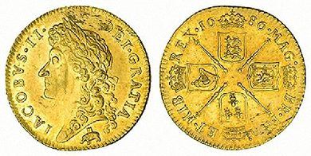
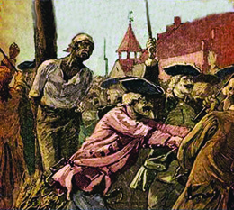
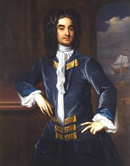
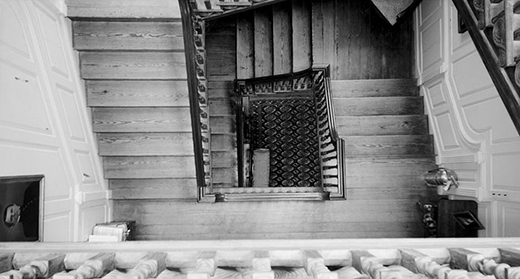

By the end of this section, you will be able to:
* Analyze the role slavery played in the history and economy of the British Empire
* Explain the effects of the 1739 Stono Rebellion and the 1741 New York Conspiracy Trials
* Describe the consumer revolution and its effect on the life of the colonial gentry and other settlers

**Slavery**{: data-type="term" .no-emphasis} formed a cornerstone of the British Empire in the eighteenth century. Every colony had slaves, from the southern rice plantations in Charles Town, South Carolina, to the northern wharves of Boston. Slavery was more than a labor system; it also influenced every aspect of colonial thought and culture. The uneven relationship it engendered gave white colonists an exaggerated sense of their own status. English liberty gained greater meaning and coherence for whites when they contrasted their status to that of the unfree class of black slaves in British America. African slavery provided whites in the colonies with a shared racial bond and identity.

### SLAVERY AND THE STONO REBELLION

The transport of slaves to the American colonies accelerated in the second half of the seventeenth century. In 1660, Charles II created the Royal African Company ([\[link\]](#CNX_History_04_03_Guinea)) to trade in slaves and African goods. His brother, James II, led the company before ascending the throne. Under both these kings, the Royal African Company enjoyed a monopoly to transport slaves to the English colonies. Between 1672 and 1713, the company bought 125,000 captives on the African coast, losing 20 percent of them to death on the Middle Passage, the journey from the African coast to the Americas.

 {: #CNX_History_04_03_Guinea}

The Royal African Company’s monopoly ended in 1689 as a result of the Glorious Revolution. After that date, many more English merchants engaged in the slave trade, greatly increasing the number of slaves being transported. Africans who survived the brutal Middle Passage usually arrived in the West Indies, often in Barbados. From there, they were transported to the mainland English colonies on company ships. While merchants in London, Bristol, and Liverpool lined their pockets, Africans trafficked by the company endured a nightmare of misery, privation, and dislocation.

Slaves strove to adapt to their new lives by forming new communities among themselves, often adhering to traditional African customs and healing techniques. Indeed, the development of families and communities formed the most important response to the trauma of being enslaved. Other slaves dealt with the trauma of their situation by actively resisting their condition, whether by defying their masters or running away. Runaway slaves formed what were called “maroon” communities, groups that successfully resisted recapture and formed their own autonomous groups. The most prominent of these communities lived in the interior of Jamaica, controlling the area and keeping the British away.

Slaves everywhere resisted their exploitation and attempted to gain freedom. They fully understood that rebellions would bring about massive retaliation from whites and therefore had little chance of success. Even so, rebellions occurred frequently. One notable uprising that became known as the Stono Rebellion took place in South Carolina in September 1739. A literate slave named Jemmy led a large group of slaves in an armed insurrection against white colonists, killing several before militia stopped them. The militia suppressed the rebellion after a battle in which both slaves and militiamen were killed, and the remaining slaves were executed or sold to the West Indies.

Jemmy is believed to have been taken from the Kingdom of Kongo, an area where the Portuguese had introduced Catholicism. Other slaves in South Carolina may have had a similar background: Africa-born and familiar with whites. If so, this common background may have made it easier for Jemmy to communicate with the other slaves, enabling them to work together to resist their enslavement even though slaveholders labored to keep slaves from forging such communities.

In the wake of the Stono Rebellion, South Carolina passed a new slave code in 1740 called An Act for the Better Ordering and Governing of Negroes and Other Slaves in the Province, also known as the Negro Act of 1740. This law imposed new limits on slaves’ behavior, prohibiting slaves from assembling, growing their own food, learning to write, and traveling freely.

### THE NEW YORK CONSPIRACY TRIALS OF 1741

Eighteenth-century New York City contained many different ethnic groups, and conflicts among them created strain. In addition, one in five New Yorkers was a slave, and tensions ran high between slaves and the free population, especially in the aftermath of the Stono Rebellion. These tensions burst forth in 1741.

That year, thirteen fires broke out in the city, one of which reduced the colony’s Fort George to ashes. Ever fearful of an uprising among enslaved New Yorkers, the city’s whites spread rumors that the fires were part of a massive slave revolt in which slaves would murder whites, burn the city, and take over the colony. The Stono Rebellion was only a few years in the past, and throughout British America, fears of similar incidents were still fresh. Searching for solutions, and convinced slaves were the principal danger, nervous British authorities interrogated almost two hundred slaves and accused them of conspiracy. Rumors that Roman Catholics had joined the suspected conspiracy and planned to murder Protestant inhabitants of the city only added to the general hysteria. Very quickly, two hundred people were arrested, including a large number of the city’s slave population.

After a quick series of trials at City Hall, known as the New York Conspiracy Trials of 1741, the government executed seventeen New Yorkers. Thirteen black men were publicly burned at the stake, while the others (including four whites) were hanged ([\[link\]](#CNX_History_04_03_NYTrials)). Seventy slaves were sold to the West Indies. Little evidence exists to prove that an elaborate conspiracy, like the one white New Yorkers imagined, actually existed.

 {: #CNX_History_04_03_NYTrials}

The events of 1741 in New York City illustrate the racial divide in British America, where panic among whites spurred great violence against and repression of the feared slave population. In the end, the Conspiracy Trials furthered white dominance and power over enslaved New Yorkers.

  
View the map of [New York in the 1740s][1] at the New York Public Library’s digital gallery, which allows you to zoom in and see specific events. Look closely at numbers 55 and 56 just north of the city limits to see illustrations depicting the executions.

### COLONIAL GENTRY AND THE CONSUMER REVOLUTION

British Americans’ reliance on indentured servitude and slavery to meet the demand for colonial labor helped give rise to a wealthy colonial class—the gentry—in the Chesapeake tobacco colonies and elsewhere. To be “genteel,” that is, a member of the gentry, meant to be refined, free of all rudeness. The British American gentry modeled themselves on the English aristocracy, who embodied the ideal of refinement and gentility. They built elaborate mansions to advertise their status and power. William Byrd II of Westover, Virginia, exemplifies the colonial gentry; a wealthy planter and slaveholder, he is known for founding Richmond and for his diaries documenting the life of a gentleman planter ([\[link\]](#CNX_History_04_03_Byrd)).

 {: #CNX_History_04_03_Byrd}

William Byrd’s Secret Diary

The diary of William Byrd, a Virginia planter, provides a unique way to better understand colonial life on a plantation ([\[link\]](#CNX_History_04_03_ByrdStair)). What does it show about daily life for a gentleman planter? What does it show about slavery?

<q>August 27, 1709* * *
{: data-type="newline"}

 I rose at 5 o’clock and read two chapters in Hebrew and some Greek in Josephus. I said my prayers and ate milk for breakfast. I danced my dance. I had like to have whipped my maid Anaka for her laziness but I forgave her. I read a little geometry. I denied my man G-r-l to go to a horse race because there was nothing but swearing and drinking there. I ate roast mutton for dinner. In the afternoon I played at piquet with my own wife and made her out of humor by cheating her. I read some Greek in Homer. Then I walked about the plantation. I lent John H-ch £7 \[7 English pounds\] in his distress. I said my prayers and had good health, good thoughts, and good humor, thanks be to God Almighty.* * *
{: data-type="newline"}

 September 6, 1709* * *
{: data-type="newline"}

 About one o’clock this morning my wife was happily delivered of a son, thanks be to God Almighty. I was awake in a blink and rose and my cousin Harrison met me on the stairs and told me it was a boy. We drank some French wine and went to bed again and rose at 7 o’clock. I read a chapter in Hebrew and then drank chocolate with the women for breakfast. I returned God humble thanks for so great a blessing and recommended my young son to His divine protection. . . .* * *
{: data-type="newline"}

 September 15, 1710* * *
{: data-type="newline"}

 I rose at 5 o’clock and read two chapters in Hebrew and some Greek in Thucydides. I said my prayers and ate milk and pears for breakfast. About 7 o’clock the negro boy \[*or* Betty\] that ran away was brought home. My wife against my will caused little Jenny to be burned with a hot iron, for which I quarreled with her. . . .</q>

{: #CNX_History_04_03_ByrdStair}

One of the ways in which the gentry set themselves apart from others was through their purchase, consumption, and display of goods. An increased supply of consumer goods from England that became available in the eighteenth century led to a phenomenon called the consumer revolution. These products linked the colonies to Great Britain in real and tangible ways. Indeed, along with the colonial gentry, ordinary settlers in the colonies also participated in the frenzy of consumer spending on goods from Great Britain. Tea, for example, came to be regarded as the drink of the Empire, with or without fashionable tea sets.

The consumer revolution also made printed materials more widely available. Before 1680, for instance, no newspapers had been printed in colonial America. In the eighteenth century, however, a flood of journals, books, pamphlets, and other publications became available to readers on both sides of the Atlantic. This shared trove of printed matter linked members of the Empire by creating a community of shared tastes and ideas.

*Cato’s Letters*, by Englishmen John Trenchard and Thomas Gordon, was one popular series of 144 pamphlets. These Whig circulars were published between 1720 and 1723 and emphasized the glory of England, especially its commitment to liberty. However, the pamphlets cautioned readers to be ever vigilant and on the lookout for attacks upon that liberty. Indeed, *Cato’s Letters* suggested that there were constant efforts to undermine and destroy it.

Another very popular publication was the English gentlemen’s magazine the *Spectator*, published between 1711 and 1714. In each issue, “Mr. Spectator” observed and commented on the world around him. What made the *Spectator* so wildly popular was its style; the essays were meant to persuade, and to cultivate among readers a refined set of behaviors, rejecting deceit and intolerance and focusing instead on the polishing of genteel taste and manners.

Novels, a new type of literature, made their first appearance in the eighteenth century and proved very popular in the British Atlantic. Daniel Defoe’s *Robinson Crusoe* and Samuel Richardson’s *Pamela: Or, Virtue Rewarded* found large and receptive audiences. Reading also allowed female readers the opportunity to interpret what they read without depending on a male authority to tell them what to think. Few women beyond the colonial gentry, however, had access to novels.

### Section Summary

The seventeenth and eighteenth centuries saw the expansion of slavery in the American colonies from South Carolina to Boston. The institution of slavery created a false sense of superiority in whites, while simultaneously fueling fears of slave revolt. White response to such revolts, or even the threat of them, led to gross overreactions and further constraints on slaves’ activities. The development of the Atlantic economy also allowed colonists access to more British goods than ever before. The buying habits of both commoners and the rising colonial gentry fueled the consumer revolution, creating even stronger ties with Great Britain by means of a shared community of taste and ideas.

### Review Questions

The Negro Act of 1740 was a reaction to \_\_\_\_\_\_\_\_.

1.  fears of a slave conspiracy in the setting of thirteen fires in New York City
2.  the Stono Rebellion
3.  the Royal African Company’s monopoly
4.  the growing power of maroon communities
{: type="A"}

B

What was the “conspiracy” of the New York Conspiracy Trials of 1741?

1.  American patriots conspiring to overthrow the royal government
2.  indentured servants conspiring to overthrow their masters
3.  slaves conspiring to burn down the city and take control
4.  Protestants conspiring to murder Catholics
{: type="A"}

C

[1]: http://openstaxcollege.org/l/NY1700s
