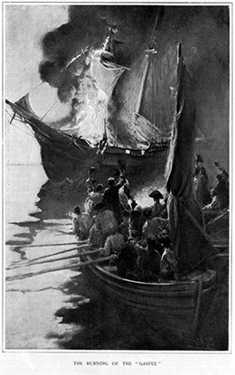

By the end of this section, you will be able to:
* Describe the socio-political environment in the colonies in the early 1770s
* Explain the purpose of the Tea Act of 1773 and discuss colonial reactions to it
* Identify and describe the Coercive Acts

The Tea Act of 1773 triggered a reaction with far more significant consequences than either the 1765 Stamp Act or the 1767 Townshend Acts. Colonists who had joined in protest against those earlier acts renewed their efforts in 1773. They understood that Parliament had again asserted its right to impose taxes without representation, and they feared the Tea Act was designed to seduce them into conceding this important principle by lowering the price of tea to the point that colonists might abandon their scruples. They also deeply resented the East India Company’s monopoly on the sale of tea in the American colonies; this resentment sprang from the knowledge that some members of Parliament had invested heavily in the company.

# SMOLDERING RESENTMENT

Even after the partial repeal of the Townshend duties, however, suspicion of Parliament’s intentions remained high. This was especially true in port cities like Boston and New York, where British customs agents were a daily irritant and reminder of British power. In public houses and squares, people met and discussed politics. Philosopher John Locke’s *Two Treatises of Government*, published almost a century earlier, influenced political thought about the role of government to protect life, liberty, and property. The Sons of Liberty issued propaganda ensuring that colonists remained aware when Parliament overreached itself.

Violence continued to break out on occasion, as in 1772, when Rhode Island colonists boarded and burned the British revenue ship *Gaspée* in Narragansett Bay ([\[link\]](#CNX_US_History_05_03_Gaspee)). Colonists had attacked or burned British customs ships in the past, but after the Gaspée Affair, the British government convened a Royal Commission of Inquiry. This Commission had the authority to remove the colonists, who were charged with treason, to Great Britain for trial. Some colonial protestors saw this new ability as another example of the overreach of British power.

 {: #CNX_US_History_05_03_Gaspee}

Samuel Adams, along with Joseph Warren and James Otis, re-formed the Boston **Committee of Correspondence**{: data-type="term"}, which functioned as a form of shadow government, to address the fear of British overreach. Soon towns all over Massachusetts had formed their own committees, and many other colonies followed suit. These committees, which had between seven and eight thousand members in all, identified enemies of the movement and communicated the news of the day. Sometimes they provided a version of events that differed from royal interpretations, and slowly, the committees began to supplant royal governments as sources of information. They later formed the backbone of communication among the colonies in the rebellion against the Tea Act, and eventually in the revolt against the British crown.

#  THE TEA ACT OF 1773

Parliament did not enact the **Tea Act of 1773**{: data-type="term" .no-emphasis} in order to punish the colonists, assert parliamentary power, or even raise revenues. Rather, the act was a straightforward order of economic protectionism for a British tea firm, the East India Company, that was on the verge of bankruptcy. In the colonies, tea was the one remaining consumer good subject to the hated Townshend duties. Protest leaders and their followers still avoided British tea, drinking smuggled Dutch tea as a sign of patriotism.

The Tea Act of 1773 gave the British East India Company the ability to export its tea directly to the colonies without paying import or export duties and without using middlemen in either Great Britain or the colonies. Even with the Townshend tax, the act would allow the East India Company to sell its tea at lower prices than the smuggled Dutch tea, thus undercutting the smuggling trade.

This act was unwelcome to those in British North America who had grown displeased with the pattern of imperial measures. By granting a monopoly to the East India Company, the act not only cut out colonial merchants who would otherwise sell the tea themselves; it also reduced their profits from smuggled foreign tea. These merchants were among the most powerful and influential people in the colonies, so their dissatisfaction carried some weight. Moreover, because the tea tax that the Townshend Acts imposed remained in place, tea had intense power to symbolize the idea of “no taxation without representation.”

# COLONIAL PROTEST: THE DESTRUCTION OF THE TEA

The 1773 act reignited the worst fears among the colonists. To the Sons and Daughters of Liberty and those who followed them, the act appeared to be proof positive that a handful of corrupt members of Parliament were violating the British Constitution. Veterans of the protest movement had grown accustomed to interpreting British actions in the worst possible light, so the 1773 act appeared to be part of a large conspiracy against liberty.

As they had done to protest earlier acts and taxes, colonists responded to the Tea Act with a boycott. The Committees of Correspondence helped to coordinate resistance in all of the colonial port cities, so up and down the East Coast, British tea-carrying ships were unable to come to shore and unload their wares. In Charlestown, Boston, Philadelphia, and New York, the equivalent of millions of dollars’ worth of tea was held hostage, either locked in storage warehouses or rotting in the holds of ships as they were forced to sail back to Great Britain.

In Boston, Thomas Hutchinson, now the royal governor of Massachusetts, vowed that radicals like Samuel Adams would not keep the ships from unloading their cargo. He urged the merchants who would have accepted the tea from the ships to stand their ground and receive the tea once it had been unloaded. When the *Dartmouth* sailed into Boston Harbor in November 1773, it had twenty days to unload its cargo of tea and pay the duty before it had to return to Great Britain. Two more ships, the *Eleanor* and the *Beaver*, followed soon after. Samuel Adams and the Sons of Liberty tried to keep the captains of the ships from paying the duties and posted groups around the ships to make sure the tea would not be unloaded.

On December 16, just as the *Dartmouth*’s deadline approached, townspeople gathered at the Old South Meeting House determined to take action. From this gathering, a group of Sons of Liberty and their followers approached the three ships. Some were disguised as Mohawks. Protected by a crowd of spectators, they systematically dumped all the tea into the harbor, destroying goods worth almost $1 million in today’s dollars, a very significant loss. This act soon inspired further acts of resistance up and down the East Coast. However, not all colonists, and not even all Patriots, supported the dumping of the tea. The wholesale destruction of property shocked people on both sides of the Atlantic.

  
To learn more about the Boston Tea Party, explore the extensive resources in [ the Boston Tea Party Ships and Museum collection ][1] of articles, photos, and video. At the museum itself, you can board replicas of the *Eleanor* and the *Beaver* and experience a recreation of the dumping of the tea.

# PARLIAMENT RESPONDS: THE COERCIVE ACTS

In London, response to the destruction of the tea was swift and strong. The violent destruction of property infuriated King George III and the prime minister, Lord North ([\[link\]](#CNX_History_05_04_North)), who insisted the loss be repaid. Though some American merchants put forward a proposal for restitution, the Massachusetts Assembly refused to make payments. Massachusetts’s resistance to British authority united different factions in Great Britain against the colonies. North had lost patience with the unruly British subjects in Boston. He declared: “The Americans have tarred and feathered your subjects, plundered your merchants, burnt your ships, denied all obedience to your laws and authority; yet so clement and so long forbearing has our conduct been that it is incumbent on us now to take a different course. Whatever may be the consequences, we must risk something; if we do not, all is over.” Both Parliament and the king agreed that Massachusetts should be forced to both pay for the tea and yield to British authority.

 , painted by Nathaniel Dance, was prime minister at the time of the destruction of the tea and insisted that Massachusetts make good on the loss."){: #CNX_History_05_04_North}

In early 1774, leaders in Parliament responded with a set of four measures designed to punish Massachusetts, commonly known at the **Coercive Acts**{: data-type="term"}. The Boston Port Bill shut down Boston Harbor until the East India Company was repaid. The Massachusetts Government Act placed the colonial government under the direct control of crown officials and made traditional town meetings subject to the governor’s approval. The Administration of Justice Act allowed the royal governor to unilaterally move any trial of a crown officer out of Massachusetts, a change designed to prevent hostile Massachusetts juries from deciding these cases. This act was especially infuriating to John Adams and others who emphasized the time-honored rule of law. They saw this part of the Coercive Acts as striking at the heart of fair and equitable justice. Finally, the Quartering Act encompassed all the colonies and allowed British troops to be housed in occupied buildings.

At the same time, Parliament also passed the Quebec Act, which expanded the boundaries of Quebec westward and extended religious tolerance to Roman Catholics in the province. For many Protestant colonists, especially Congregationalists in New England, this forced tolerance of Catholicism was the most objectionable provision of the act. Additionally, expanding the boundaries of Quebec raised troubling questions for many colonists who eyed the West, hoping to expand the boundaries of their provinces. The Quebec Act appeared gratuitous, a slap in the face to colonists already angered by the Coercive Acts.

American Patriots renamed the Coercive and Quebec measures the **Intolerable Acts**{: data-type="term"}. Some in London also thought the acts went too far; see the cartoon “The Able Doctor, or America Swallowing the Bitter Draught” ([\[link\]](#CNX_History_05_04_Draught)) for one British view of what Parliament was doing to the colonies. Meanwhile, punishments designed to hurt only one colony (Massachusetts, in this case) had the effect of mobilizing all the colonies to its side. The Committees of Correspondence had already been active in coordinating an approach to the Tea Act. Now the talk would turn to these new, intolerable assaults on the colonists’ rights as British subjects.

  targets select members of Parliament as the perpetrators of a devilish scheme to overturn the constitution; this is why Mother Britannia weeps. Note that this cartoon came from a British publication; Great Britain was not united in support of Parliament&#x2019;s policies toward the American colonies."){: #CNX_History_05_04_Draught}

# Section Summary

The colonial rejection of the Tea Act, especially the destruction of the tea in Boston Harbor, recast the decade-long argument between British colonists and the home government as an intolerable conspiracy against liberty and an excessive overreach of parliamentary power. The Coercive Acts were punitive in nature, awakening the worst fears of otherwise loyal members of the British Empire in America.

# Review Questions

Which of the following is true of the Gaspée affair?

1.  Colonists believed that the British response represented an overreach of power.
2.  It was the first time colonists attacked a revenue ship.
3.  It was the occasion of the first official death in the war for independence.
4.  The ship’s owner, John Hancock, was a respectable Boston merchant.
{: data-number-style="upper-alpha"}

A

What was the purpose of the Tea Act of 1773?

1.  to punish the colonists for their boycotting of British tea
2.  to raise revenue to offset the British national debt
3.  to help revive the struggling East India Company
4.  to pay the salaries of royal appointees
{: data-number-style="upper-alpha"}

C

What was the significance of the Committees of Correspondence?

The Committees of Correspondence provided a crucial means of communication among the colonies. They also set the foundation for a colonial government by breaking away from royal governmental structures. Finally, they promoted a sense of colonial unity.

[1]: http://openstaxcollege.org/l/teapartyship
