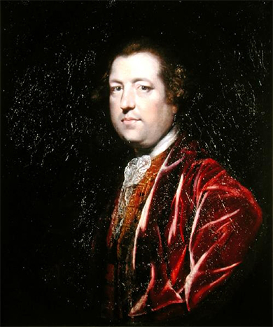

By the end of this section, you will be able to:
* Describe the purpose of the 1767 Townshend Acts
* Explain why many colonists protested the 1767 Townshend Acts and the consequences of their actions

Colonists’ joy over the repeal of the Stamp Act and what they saw as their defense of liberty did not last long. The Declaratory Act of 1766 had articulated Great Britain’s supreme authority over the colonies, and Parliament soon began exercising that authority. In 1767, with the passage of the Townshend Acts, a tax on consumer goods in British North America, colonists believed their liberty as loyal British subjects had come under assault for a second time.

### THE TOWNSHEND ACTS

Lord Rockingham’s tenure as prime minister was not long (1765–1766). Rich landowners feared that if he were not taxing the colonies, Parliament would raise their taxes instead, sacrificing them to the interests of merchants and colonists. George III duly dismissed Rockingham. William Pitt, also sympathetic to the colonists, succeeded him. However, Pitt was old and ill with gout. His chancellor of the exchequer, Charles **Townshend**{: data-type="term" .no-emphasis} ([\[link\]](#CNX_US_History_05_03_Townshend)), whose job was to manage the Empire’s finances, took on many of his duties. Primary among these was raising the needed revenue from the colonies.

 {: #CNX_US_History_05_03_Townshend}

Townshend’s first act was to deal with the unruly New York Assembly, which had voted not to pay for supplies for the garrison of British soldiers that the Quartering Act required. In response, Townshend proposed the Restraining Act of 1767, which disbanded the New York Assembly until it agreed to pay for the garrison’s supplies, which it eventually agreed to do.

The Townshend Revenue Act of 1767 placed duties on various consumer items like paper, paint, lead, tea, and glass. These British goods had to be imported, since the colonies did not have the manufacturing base to produce them. Townshend hoped the new duties would not anger the colonists because they were external taxes, not internal ones like the Stamp Act. In 1766, in arguing before Parliament for the repeal of the Stamp Act, Benjamin Franklin had stated, “I never heard any objection to the right of laying duties to regulate commerce; but a right to lay internal taxes was never supposed to be in parliament, as we are not represented there.”

The Indemnity Act of 1767 exempted tea produced by the British East India Company from taxation when it was imported into Great Britain. When the tea was re-exported to the colonies, however, the colonists had to pay taxes on it because of the Revenue Act. Some critics of Parliament on both sides of the Atlantic saw this tax policy as an example of corrupt politicians giving preferable treatment to specific corporate interests, creating a monopoly. The sense that corruption had become entrenched in Parliament only increased colonists’ alarm.

In fact, the revenue collected from these duties was only nominally intended to support the British army in America. It actually paid the salaries of some royally appointed judges, governors, and other officials whom the colonial assemblies had traditionally paid. Thanks to the Townshend Revenue Act of 1767, however, these officials no longer relied on colonial leadership for payment. This change gave them a measure of independence from the assemblies, so they could implement parliamentary acts without fear that their pay would be withheld in retaliation. The Revenue Act thus appeared to sever the relationship between governors and assemblies, drawing royal officials closer to the British government and further away from the colonial legislatures.

The Revenue Act also gave the customs board greater powers to counteract smuggling. It granted “writs of assistance”—basically, search warrants—to customs commissioners who suspected the presence of contraband goods, which also opened the door to a new level of bribery and trickery on the waterfronts of colonial America. Furthermore, to ensure compliance, Townshend introduced the Commissioners of Customs Act of 1767, which created an American Board of Customs to enforce trade laws. Customs enforcement had been based in Great Britain, but rules were difficult to implement at such a distance, and smuggling was rampant. The new customs board was based in Boston and would severely curtail smuggling in this large colonial seaport.

Townshend also orchestrated the Vice-Admiralty Court Act, which established three more vice-admiralty courts, in Boston, Philadelphia, and Charleston, to try violators of customs regulations without a jury. Before this, the only colonial vice-admiralty court had been in far-off Halifax, Nova Scotia, but with three local courts, smugglers could be tried more efficiently. Since the judges of these courts were paid a percentage of the worth of the goods they recovered, leniency was rare. All told, the Townshend Acts resulted in higher taxes and stronger British power to enforce them. Four years after the end of the French and Indian War, the Empire continued to search for solutions to its debt problem and the growing sense that the colonies needed to be brought under control.

### REACTIONS: THE NON-IMPORTATION MOVEMENT

Like the Stamp Act, the Townshend Acts produced controversy and protest in the American colonies. For a second time, many colonists resented what they perceived as an effort to tax them without representation and thus to deprive them of their liberty. The fact that the revenue the Townshend Acts raised would pay royal governors only made the situation worse, because it took control away from colonial legislatures that otherwise had the power to set and withhold a royal governor’s salary. The Restraining Act, which had been intended to isolate New York without angering the other colonies, had the opposite effect, showing the rest of the colonies how far beyond the British Constitution some members of Parliament were willing to go.

The Townshend Acts generated a number of protest writings, including “Letters from a Pennsylvania Farmer” by John Dickinson. In this influential pamphlet, which circulated widely in the colonies, Dickinson conceded that the Empire could regulate trade but argued that Parliament could not impose either internal taxes, like stamps, on goods or external taxes, like customs duties, on imports.

“Address to the Ladies” Verse from *The Boston Post-Boy and Advertiser*

This verse, which ran in a Boston newspaper in November 1767, highlights how women were encouraged to take political action by boycotting British goods. Notice that the writer especially encourages women to avoid British tea (Bohea and Green Hyson) and linen, and to manufacture their own homespun cloth. Building on the protest of the 1765 Stamp Act by the Daughters of Liberty, the non-importation movement of 1767–1768 mobilized women as political actors.

<q>Young ladies in town, and those that live round,* * *
{: data-type="newline"}

 Let a friend at this season advise you:* * *
{: data-type="newline"}

 Since money’s so scarce, and times growing worse* * *
{: data-type="newline"}

 Strange things may soon hap and surprize you:* * *
{: data-type="newline"}

 First then, throw aside your high top knots of pride* * *
{: data-type="newline"}

 Wear none but your own country linnen;* * *
{: data-type="newline"}

 of economy boast, let your pride be the most* * *
{: data-type="newline"}

 What, if homespun they say is not quite so gay* * *
{: data-type="newline"}

 As brocades, yet be not in a passion,* * *
{: data-type="newline"}

 For when once it is known this is much wore in town,* * *
{: data-type="newline"}

 One and all will cry out, ’tis the fashion!* * *
{: data-type="newline"}

 And as one, all agree that you’ll not married be* * *
{: data-type="newline"}

 To such as will wear London Fact’ry:* * *
{: data-type="newline"}

 But at first sight refuse, tell’em such you do chuse* * *
{: data-type="newline"}

 As encourage our own Manufact’ry.* * *
{: data-type="newline"}

 No more Ribbons wear, nor in rich dress appear,* * *
{: data-type="newline"}

 Love your country much better than fine things,* * *
{: data-type="newline"}

 Begin without passion, ’twill soon be the fashion* * *
{: data-type="newline"}

 To grace your smooth locks with a twine string.* * *
{: data-type="newline"}

 Throw aside your Bohea, and your Green Hyson Tea,* * *
{: data-type="newline"}

 And all things with a new fashion duty;* * *
{: data-type="newline"}

 Procure a good store of the choice Labradore,* * *
{: data-type="newline"}

 For there’ll soon be enough here to suit ye;* * *
{: data-type="newline"}

 These do without fear and to all you’ll appear* * *
{: data-type="newline"}

 Fair, charming, true, lovely, and cleaver;* * *
{: data-type="newline"}

 Tho’ the times remain darkish, young men may be sparkish.* * *
{: data-type="newline"}

 And love you much stronger than ever. !O!</q>

In Massachusetts in 1768, Samuel Adams wrote a letter that became known as the **Massachusetts Circular**{: data-type="term"}. Sent by the Massachusetts House of Representatives to the other colonial legislatures, the letter laid out the unconstitutionality of taxation without representation and encouraged the other colonies to again protest the taxes by boycotting British goods. Adams wrote, “It is, moreover, \[the Massachusetts House of Representatives\] humble opinion, which they express with the greatest deference to the wisdom of the Parliament, that the acts made there, imposing duties on the people of this province, with the sole and express purpose of raising a revenue, are infringements of their natural and constitutional rights; because, as they are not represented in the Parliament, his Majesty’s Commons in Britain, by those acts, grant their property without their consent.” Note that even in this letter of protest, the humble and submissive tone shows the Massachusetts Assembly’s continued deference to parliamentary authority. Even in that hotbed of political protest, it is a clear expression of allegiance and the hope for a restoration of “natural and constitutional rights.”

Great Britain’s response to this threat of disobedience served only to unite the colonies further. The colonies’ initial response to the Massachusetts Circular was lukewarm at best. However, back in Great Britain, the secretary of state for the colonies—Lord Hillsborough—demanded that Massachusetts retract the letter, promising that any colonial assemblies that endorsed it would be dissolved. This threat had the effect of pushing the other colonies to Massachusetts’s side. Even the city of Philadelphia, which had originally opposed the Circular, came around.

The Daughters of Liberty once again supported and promoted the boycott of British goods. Women resumed spinning bees and again found substitutes for British tea and other goods. Many colonial merchants signed non-importation agreements, and the Daughters of Liberty urged colonial women to shop only with those merchants. The Sons of Liberty used newspapers and circulars to call out by name those merchants who refused to sign such agreements; sometimes they were threatened by violence. For instance, a broadside from 1769–1770 reads:

<q>WILLIAM JACKSON,* * *
{: data-type="newline"}

 an IMPORTER;* * *
{: data-type="newline"}

 at the BRAZEN HEAD,* * *
{: data-type="newline"}

 North Side of the TOWN-HOUSE,* * *
{: data-type="newline"}

 and Opposite the Town-Pump, \[in\]* * *
{: data-type="newline"}

 Corn-hill, BOSTON* * *
{: data-type="newline"}

 It is desired that the SONS* * *
{: data-type="newline"}

 and DAUGHTERS of LIBERTY,* * *
{: data-type="newline"}

 would not buy any one thing of* * *
{: data-type="newline"}

 him, for in so doing they will bring* * *
{: data-type="newline"}

 disgrace upon themselves, and their* * *
{: data-type="newline"}

 Posterity, for ever and ever, AMEN.</q>

The boycott in 1768–1769 turned the purchase of consumer goods into a political gesture. It mattered what you consumed. Indeed, the very clothes you wore indicated whether you were a defender of liberty in homespun or a protector of parliamentary rights in superfine British attire.

  
For examples of the types of luxury items that many American colonists favored, visit the [ National Humanities Center ][1] to see pictures and documents relating to home interiors of the wealthy.

### TROUBLE IN BOSTON

The Massachusetts Circular got Parliament’s attention, and in 1768, Lord Hillsborough sent four thousand British troops to Boston to deal with the unrest and put down any potential rebellion there. The troops were a constant reminder of the assertion of British power over the colonies, an illustration of an unequal relationship between members of the same empire. As an added aggravation, British soldiers moonlighted as dockworkers, creating competition for employment. Boston’s labor system had traditionally been closed, privileging native-born laborers over outsiders, and jobs were scarce. Many Bostonians, led by the Sons of Liberty, mounted a campaign of harassment against British troops. The Sons of Liberty also helped protect the smuggling actions of the merchants; smuggling was crucial for the colonists’ ability to maintain their boycott of British goods.

John Hancock was one of Boston’s most successful merchants and prominent citizens. While he maintained too high a profile to work actively with the Sons of Liberty, he was known to support their aims, if not their means of achieving them. He was also one of the many prominent merchants who had made their fortunes by smuggling, which was rampant in the colonial seaports. In 1768, customs officials seized the *Liberty*, one of his ships, and violence erupted. Led by the Sons of Liberty, Bostonians rioted against customs officials, attacking the customs house and chasing out the officers, who ran to safety at Castle William, a British fort on a Boston harbor island. British soldiers crushed the riots, but over the next few years, clashes between British officials and Bostonians became common.

Conflict turned deadly on March 5, 1770, in a confrontation that came to be known as the **Boston Massacre**{: data-type="term"}. On that night, a crowd of Bostonians from many walks of life started throwing snowballs, rocks, and sticks at the British soldiers guarding the customs house. In the resulting scuffle, some soldiers, goaded by the mob who hectored the soldiers as “lobster backs” (the reference to lobster equated the soldiers with bottom feeders, i.e., aquatic animals that feed on the lowest organisms in the food chain), fired into the crowd, killing five people. Crispus Attucks, the first man killed—and, though no one could have known it then, the first official casualty in the war for independence—was of Wampanoag and African descent. The bloodshed illustrated the level of hostility that had developed as a result of Boston’s occupation by British troops, the competition for scarce jobs between Bostonians and the British soldiers stationed in the city, and the larger question of Parliament’s efforts to tax the colonies.

The Sons of Liberty immediately seized on the event, characterizing the British soldiers as murderers and their victims as martyrs. Paul Revere, a silversmith and member of the Sons of Liberty, circulated an engraving that showed a line of grim redcoats firing ruthlessly into a crowd of unarmed, fleeing civilians. Among colonists who resisted British power, this view of the “massacre” confirmed their fears of a tyrannous government using its armies to curb the freedom of British subjects. But to others, the attacking mob was equally to blame for pelting the British with rocks and insulting them.

It was not only British Loyalists who condemned the unruly mob. John Adams, one of the city’s strongest supporters of peaceful protest against Parliament, represented the British soldiers at their murder trial. Adams argued that the mob’s lawlessness required the soldiers’ response, and that without law and order, a society was nothing. He argued further that the soldiers were the tools of a much broader program, which transformed a street brawl into the injustice of imperial policy. Of the eight soldiers on trial, the jury acquitted six, convicting the other two of the reduced charge of manslaughter.

Adams argued: “Facts are stubborn things; and whatever may be our wishes, our inclinations, or the dictates of our passions, they cannot alter the state of facts and evidence: nor is the law less stable than the fact; if an assault was made to endanger their lives, the law is clear, they had a right to kill in their own defense; if it was not so severe as to endanger their lives, yet if they were assaulted at all, struck and abused by blows of any sort, by snow-balls, oyster-shells, cinders, clubs, or sticks of any kind; this was a provocation, for which the law reduces the offence of killing, down to manslaughter, in consideration of those passions in our nature, which cannot be eradicated. To your candour and justice I submit the prisoners and their cause.”

Propaganda and the Sons of Liberty

Long after the British soldiers had been tried and punished, the Sons of Liberty maintained a relentless propaganda campaign against British oppression. Many of them were printers or engravers, and they were able to use public media to sway others to their cause. Shortly after the incident outside the customs house, Paul Revere created “The bloody massacre perpetrated in King Street Boston on March 5th 1770 by a party of the 29th Regt.” ([\[link\]](#CNX_US_History_05_03_Massacre)), based on an image by engraver Henry Pelham. The picture—which represents only the protesters’ point of view—shows the ruthlessness of the British soldiers and the helplessness of the crowd of civilians. Notice the subtle details Revere uses to help convince the viewer of the civilians’ innocence and the soldiers’ cruelty. Although eyewitnesses said the crowd started the fight by throwing snowballs and rocks, in the engraving they are innocently standing by. Revere also depicts the crowd as well dressed and well-to-do, when in fact they were laborers and probably looked quite a bit rougher.

{: #CNX_US_History_05_03_Massacre}

Newspaper articles and pamphlets that the Sons of Liberty circulated implied that the “massacre” was a planned murder. In the *Boston Gazette* on March 12, 1770, an article describes the soldiers as striking first. It goes on to discuss this version of the events: “On hearing the noise, one Samuel Atwood came up to see what was the matter; and entering the alley from dock square, heard the latter part of the combat; and when the boys had dispersed he met the ten or twelve soldiers aforesaid rushing down the alley towards the square and asked them if they intended to murder people? They answered Yes, by God, root and branch! With that one of them struck Mr. Atwood with a club which was repeated by another; and being unarmed, he turned to go off and received a wound on the left shoulder which reached the bone and gave him much pain.”

What do you think most people in the United States think of when they consider the Boston Massacre? How does the propaganda of the Sons of Liberty still affect the way we think of this event?

### PARTIAL REPEAL

As it turned out, the Boston Massacre occurred after Parliament had partially repealed the Townshend Acts. By the late 1760s, the American boycott of British goods had drastically reduced British trade. Once again, merchants who lost money because of the boycott strongly pressured Parliament to loosen its restrictions on the colonies and break the non-importation movement. Charles Townshend died suddenly in 1767 and was replaced by Lord North, who was inclined to look for a more workable solution with the colonists. North convinced Parliament to drop all the Townshend duties except the tax on tea. The administrative and enforcement provisions under the Townshend Acts—the American Board of Customs Commissioners and the vice-admiralty courts—remained in place.

To those who had protested the Townshend Acts for several years, the partial repeal appeared to be a major victory. For a second time, colonists had rescued liberty from an unconstitutional parliamentary measure. The hated British troops in Boston departed. The consumption of British goods skyrocketed after the partial repeal, an indication of the American colonists’ desire for the items linking them to the Empire.

### Section Summary

Like the Stamp Act in 1765, the Townshend Acts led many colonists to work together against what they perceived to be an unconstitutional measure, generating the second major crisis in British Colonial America. The experience of resisting the Townshend Acts provided another shared experience among colonists from diverse regions and backgrounds, while the partial repeal convinced many that liberty had once again been defended. Nonetheless, Great Britain’s debt crisis still had not been solved.

### Review Questions

Which of the following was *not* one of the goals of the Townshend Acts?

1.  higher taxes
2.  greater colonial unity
3.  greater British control over the colonies
4.  reduced power of the colonial governments
{: type="A"}

B

Which event was most responsible for the colonies’ endorsement of Samuel Adams’s Massachusetts Circular?

1.  the Townshend Duties
2.  the Indemnity Act
3.  the Boston Massacre
4.  Lord Hillsborough’s threat to dissolve the colonial assemblies that endorsed the letter
{: type="A"}

D

What factors contributed to the Boston Massacre?

Tensions between colonists and the redcoats had been simmering for some time. British soldiers had been moonlighting as dockworkers, taking needed jobs away from colonists. Many British colonists were also wary of standing armies during peacetime, so skirmishes were common. Finally, the Sons of Liberty promoted tensions with their propaganda.

### Glossary
{: data-type="glossary-title"}

Boston Massacre
: a confrontation between a crowd of Bostonians and British soldiers on March 5, 1770, which resulted in the deaths of five people, including Crispus Attucks, the first official casualty in the war for independence
^

Massachusetts Circular
: a letter penned by Son of Liberty Samuel Adams that laid out the unconstitutionality of taxation without representation and encouraged the other colonies to boycott British goods

[1]: http://openstax.org/l/britlux
