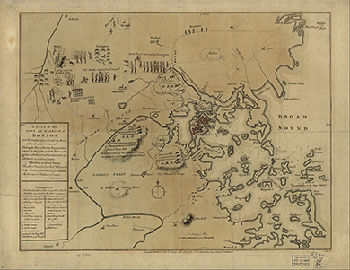
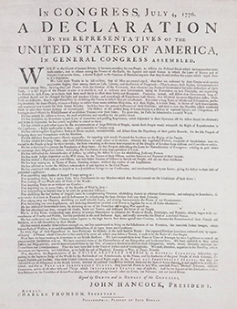

By the end of this section, you will be able to:
* Explain how Great Britain’s response to the destruction of a British shipment of tea in Boston Harbor in 1773 set the stage for the Revolution
* Describe the beginnings of the American Revolution

 ![A timeline shows important events of the era. In 1775, the battles of Lexington and Concord are fought and the British win a costly victory at the Battle of Bunker Hill. In 1776, Thomas Paine publishes Common Sense and the Continental Congress signs the Declaration of Independence in July; a painting depicting the presentation of the Declaration to the Continental Congress is shown. In 1777, American forces defeat General Burgoyne at the Battle of Saratoga; an engraving depicting British troops laying down their arms after their defeat is shown. In 1781, Lord Cornwallis surrenders to American and French forces at Yorktown; a painting of the surrender is shown. In 1783, the United States and Great Britain sign the Treaty of Paris; the signature page of the treaty is shown.](../resources/CNX_History_06_01_Timeline.jpg){: #CNX_History_06_01_Timeline}

Great Britain pursued a policy of law and order when dealing with the crises in the colonies in the late 1760s and 1770s. Relations between the British and many American Patriots worsened over the decade, culminating in an unruly mob destroying a fortune in tea by dumping it into **Boston Harbor**{: data-type="term" .no-emphasis} in December 1773 as a protest against British tax laws. The harsh British response to this act in 1774, which included sending British troops to Boston and closing Boston Harbor, caused tensions and resentments to escalate further. The British tried to disarm the insurgents in Massachusetts by confiscating their weapons and ammunition and arresting the leaders of the patriotic movement. However, this effort faltered on April 19, when Massachusetts militias and British troops fired on each other as British troops marched to Lexington and Concord, an event immortalized by poet Ralph Waldo Emerson as the “shot heard round the world.” The American Revolution had begun.

### ON THE EVE OF REVOLUTION

The decade from 1763 to 1774 was a difficult one for the British Empire. Although Great Britain had defeated the French in the French and Indian War, the debt from that conflict remained a stubborn and seemingly unsolvable problem for both Great Britain and the colonies. Great Britain tried various methods of raising revenue on both sides of the Atlantic to manage the enormous debt, including instituting a tax on tea and other goods sold to the colonies by British companies, but many subjects resisted these taxes. In the colonies, Patriot groups like the Sons of Liberty led boycotts of British goods and took violent measures that stymied British officials.

Boston proved to be the epicenter of protest. In December 1773, a group of Patriots protested the Tea Act passed that year—which, among other provisions, gave the East India Company a monopoly on tea—by boarding British tea ships docked in Boston Harbor and dumping tea worth over $1 million (in current prices) into the water. The destruction of the tea radically escalated the crisis between Great Britain and the American colonies. When the Massachusetts Assembly refused to pay for the tea, Parliament enacted a series of laws called the Coercive Acts, which some colonists called the Intolerable Acts. Parliament designed these laws, which closed the port of Boston, limited the meetings of the colonial assembly, and disbanded all town meetings, to punish Massachusetts and bring the colony into line. However, many British Americans in other colonies were troubled and angered by Parliament’s response to Massachusetts. In September and October 1774, all the colonies except Georgia participated in the First Continental Congress in Philadelphia. The Congress advocated a boycott of all British goods and established the Continental Association to enforce local adherence to the boycott. The Association supplanted royal control and shaped resistance to Great Britain.

Joining the Boycott

Many British colonists in Virginia, as in the other colonies, disapproved of the destruction of the tea in Boston Harbor. However, after the passage of the Coercive Acts, the Virginia House of Burgesses declared its solidarity with Massachusetts by encouraging Virginians to observe a day of fasting and prayer on May 24 in sympathy with the people of Boston. Almost immediately thereafter, Virginia’s colonial governor dissolved the House of Burgesses, but many of its members met again in secret on May 30 and adopted a resolution stating that “the Colony of Virginia will concur with the other Colonies in such Measures as shall be judged most effectual for the preservation of the Common Rights and Liberty of British America.”

After the First Continental Congress in Philadelphia, Virginia’s Committee of Safety ensured that all merchants signed the non-importation agreements that the Congress had proposed. This British cartoon ([\[link\]](#CNX_History_06_01_Williams)) shows a Virginian signing the Continental Association boycott agreement.

, a merchant has to sign a non-importation agreement or risk being covered with the tar and feathers suspended behind him."){: #CNX_History_06_01_Williams}

Note the tar and feathers hanging from the gallows in the background of this image and the demeanor of the people surrounding the signer. What is the message of this engraving? Where are the sympathies of the artist? What is the meaning of the title “The Alternative of Williams-Burg?”

In an effort to restore law and order in Boston, the British dispatched General Thomas Gage to the New England seaport. He arrived in Boston in May 1774 as the new royal governor of the Province of Massachusetts, accompanied by several regiments of British troops. As in 1768, the British again occupied the town. Massachusetts delegates met in a Provincial Congress and published the Suffolk Resolves, which officially rejected the Coercive Acts and called for the raising of colonial militias to take military action if needed. The Suffolk Resolves signaled the overthrow of the royal government in Massachusetts.

Both the British and the rebels in New England began to prepare for conflict by turning their attention to supplies of weapons and gunpowder. General Gage stationed thirty-five hundred troops in Boston, and from there he ordered periodic raids on towns where guns and gunpowder were stockpiled, hoping to impose law and order by seizing them. As Boston became the headquarters of British military operations, many residents fled the city.

Gage’s actions led to the formation of local rebel militias that were able to mobilize in a minute’s time. These **minutemen**{: data-type="term"}, many of whom were veterans of the French and Indian War, played an important role in the war for independence. In one instance, General Gage seized munitions in Cambridge and Charlestown, but when he arrived to do the same in Salem, his troops were met by a large crowd of minutemen and had to leave empty-handed. In New Hampshire, minutemen took over Fort William and Mary and confiscated weapons and cannons there. New England readied for war.

### THE OUTBREAK OF FIGHTING

Throughout late 1774 and into 1775, tensions in New England continued to mount. General Gage knew that a powder magazine was stored in Concord, Massachusetts, and on April 19, 1775, he ordered troops to seize these munitions. Instructions from London called for the arrest of rebel leaders Samuel Adams and John Hancock. Hoping for secrecy, his troops left Boston under cover of darkness, but riders from Boston let the militias know of the British plans. (Paul Revere was one of these riders, but the British captured him and he never finished his ride. Henry Wadsworth Longfellow memorialized Revere in his 1860 poem, “Paul Revere’s Ride,” incorrectly implying that he made it all the way to Concord.) Minutemen met the British troops and skirmished with them, first at Lexington and then at Concord ([\[link\]](#CNX_History_06_01_Doolittle)). The British retreated to Boston, enduring ambushes from several other militias along the way. Over four thousand militiamen took part in these skirmishes with British soldiers. Seventy-three British soldiers and forty-nine Patriots died during the British retreat to Boston. The famous confrontation is the basis for Emerson’s “Concord Hymn” (1836), which begins with the description of the “shot heard round the world.” Although propagandists on both sides pointed fingers, it remains unclear who fired that shot.

 {: #CNX_History_06_01_Doolittle}

After the battles of Lexington and Concord, New England fully mobilized for war. Thousands of militias from towns throughout New England marched to Boston, and soon the city was besieged by a sea of rebel forces ([\[link\]](#CNX_History_06_01_Seige)). In May 1775, Ethan Allen and Colonel Benedict Arnold led a group of rebels against Fort Ticonderoga in New York. They succeeded in capturing the fort, and cannons from Ticonderoga were brought to Massachusetts and used to bolster the Siege of Boston.

 {: #CNX_History_06_01_Seige}

In June, General Gage resolved to take Breed’s Hill and **Bunker Hill**{: data-type="term" .no-emphasis}, the high ground across the Charles River from Boston, a strategic site that gave the rebel militias an advantage since they could train their cannons on the British. In the Battle of Bunker Hill ([\[link\]](#CNX_History_06_01_Bunkers)), on June 17, the British launched three assaults on the hills, gaining control only after the rebels ran out of ammunition. British losses were very high—over two hundred were killed and eight hundred wounded—and, despite his victory, General Gage was unable to break the colonial forces’ siege of the city. In August, King George III declared the colonies to be in a state of rebellion. Parliament and many in Great Britain agreed with their king. Meanwhile, the British forces in Boston found themselves in a terrible predicament, isolated in the city and with no control over the countryside.

  depicts the initial rebellion as an elaborate colonial coiffure. The illustration pokes fun at both the colonial rebellion and the overdone hairstyles for women that had made their way from France and Britain to the American colonies. Despite gaining control of the high ground after the colonial militias ran out of ammunition, General Thomas Gage (b), shown here in a painting made in 1768&#x2013;1769 by John Singleton Copley, was unable to break the siege of the city."){: #CNX_History_06_01_Bunkers}

In the end, General George Washington, commander in chief of the Continental Army since June 15, 1775, used the Fort Ticonderoga cannons to force the evacuation of the British from Boston. Washington had positioned these cannons on the hills overlooking both the fortified positions of the British and Boston Harbor, where the British supply ships were anchored. The British could not return fire on the colonial positions because they could not elevate their cannons. They soon realized that they were in an untenable position and had to withdraw from Boston. On March 17, 1776, the British evacuated their troops to Halifax, Nova Scotia, ending the nearly year-long siege.

By the time the British withdrew from Boston, fighting had broken out in other colonies as well. In May 1775, Mecklenburg County in North Carolina issued the **Mecklenburg Resolves**{: data-type="term"}, stating that a rebellion against Great Britain had begun, that colonists did not owe any further allegiance to Great Britain, and that governing authority had now passed to the Continental Congress. The resolves also called upon the formation of militias to be under the control of the Continental Congress. Loyalists and Patriots clashed in North Carolina in February 1776 at the Battle of Moore’s Creek Bridge.

In Virginia, the royal governor, Lord Dunmore, raised Loyalist forces to combat the rebel colonists and also tried to use the large slave population to put down the rebellion. In November 1775, he issued a decree, known as **Dunmore’s Proclamation**{: data-type="term"}, promising freedom to slaves and indentured servants of rebels who remained loyal to the king and who pledged to fight with the Loyalists against the insurgents. Dunmore’s Proclamation exposed serious problems for both the Patriot cause and for the British. In order for the British to put down the rebellion, they needed the support of Virginia’s landowners, many of whom owned slaves. (While Patriot slaveholders in Virginia and elsewhere proclaimed they acted in defense of liberty, they kept thousands in bondage, a fact the British decided to exploit.) Although a number of slaves did join Dunmore’s side, the proclamation had the unintended effect of galvanizing Patriot resistance to Britain. From the rebels’ point of view, the British looked to deprive them of their slave property and incite a race war. Slaveholders feared a slave uprising and increased their commitment to the cause against Great Britain, calling for independence. Dunmore fled Virginia in 1776.

### COMMON SENSE

With the events of 1775 fresh in their minds, many colonists reached the conclusion in 1776 that the time had come to secede from the Empire and declare independence. Over the past ten years, these colonists had argued that they deserved the same rights as Englishmen enjoyed in Great Britain, only to find themselves relegated to an intolerable subservient status in the Empire. The groundswell of support for their cause of independence in 1776 also owed much to the appearance of an anonymous pamphlet, first published in January 1776, entitled *Common Sense*. Thomas Paine, who had emigrated from England to Philadelphia in 1774, was the author. Arguably the most radical pamphlet of the revolutionary era, *Common Sense* made a powerful argument for independence.

Paine’s pamphlet rejected the monarchy, calling King George III a “royal brute” and questioning the right of an island (England) to rule over America. In this way, Paine helped to channel colonial discontent toward the king himself and not, as had been the case, toward the British Parliament—a bold move that signaled the desire to create a new political order disavowing monarchy entirely. He argued for the creation of an American republic, a state without a king, and extolled the blessings of **republicanism**{: data-type="term"}, a political philosophy that held that elected representatives, not a hereditary monarch, should govern states. The vision of an American republic put forward by Paine included the idea of **popular sovereignty**{: data-type="term"}\: citizens in the republic would determine who would represent them, and decide other issues, on the basis of majority rule. Republicanism also served as a social philosophy guiding the conduct of the Patriots in their struggle against the British Empire. It demanded adherence to a code of virtue, placing the public good and community above narrow self-interest.

Paine wrote *Common Sense* ([\[link\]](#CNX_History_06_01_CommonSens)) in simple, direct language aimed at ordinary people, not just the learned elite. The pamphlet proved immensely popular and was soon available in all **thirteen colonies**{: data-type="term"}, where it helped convince many to reject monarchy and the British Empire in favor of independence and a republican form of government.

  helped convince many colonists of the need for independence from Great Britain. Paine, shown here in a portrait by Laurent Dabos (b), was a political activist and revolutionary best known for his writings on both the American and French Revolutions."){: #CNX_History_06_01_CommonSens}

### THE DECLARATION OF INDEPENDENCE

In the summer of 1776, the Continental Congress met in Philadelphia and agreed to sever ties with Great Britain. Virginian Thomas Jefferson and John Adams of Massachusetts, with the support of the Congress, articulated the justification for liberty in the Declaration of Independence ([\[link\]](#CNX_History_06_01_DeclaIndep)). The Declaration, written primarily by Jefferson, included a long list of grievances against King George III and laid out the foundation of American government as a republic in which the consent of the governed would be of paramount importance.

 {: #CNX_History_06_01_DeclaIndep}

The preamble to the Declaration began with a statement of Enlightenment principles about universal human rights and values: “We hold these Truths to be self-evident, that all Men are created equal, that they are endowed by their Creator with certain unalienable Rights, that among these are Life, Liberty, and the pursuit of Happiness—That to secure these Rights, Governments are instituted among Men, deriving their just Powers from the Consent of the Governed, that whenever any Form of Government becomes destructive of these Ends, it is the Right of the People to alter or abolish it.” In addition to this statement of principles, the document served another purpose: Patriot leaders sent copies to France and Spain in hopes of winning their support and aid in the contest against Great Britain. They understood how important foreign recognition and aid would be to the creation of a new and independent nation.

The Declaration of Independence has since had a global impact, serving as the basis for many subsequent movements to gain independence from other colonial powers. It is part of America’s civil religion, and thousands of people each year make pilgrimages to see the original document in Washington, DC.

The Declaration also reveals a fundamental contradiction of the American Revolution: the conflict between the existence of slavery and the idea that “all men are created equal.” One-fifth of the population in 1776 was enslaved, and at the time he drafted the Declaration, Jefferson himself owned more than one hundred slaves. Further, the Declaration framed equality as existing only among white men; women and nonwhites were entirely left out of a document that referred to native peoples as “merciless Indian savages” who indiscriminately killed men, women, and children. Nonetheless, the promise of equality for all planted the seeds for future struggles waged by slaves, women, and many others to bring about its full realization. Much of American history is the story of the slow realization of the promise of equality expressed in the Declaration of Independence.

  
Visit [Digital History][1] to view “The Female Combatants.” In this 1776 engraving by an anonymous artist, Great Britain is depicted on the left as a staid, stern matron, while America, on the right, is shown as a half-dressed American Indian. Why do you think the artist depicted the two opposing sides this way?

### Section Summary

Until Parliament passed the Coercive Acts in 1774, most colonists still thought of themselves as proud subjects of the strong British Empire. However, the Coercive (or Intolerable) Acts, which Parliament enacted to punish Massachusetts for failing to pay for the destruction of the tea, convinced many colonists that Great Britain was indeed threatening to stifle their liberty. In Massachusetts and other New England colonies, militias like the minutemen prepared for war by stockpiling weapons and ammunition. After the first loss of life at the battles of Lexington and Concord in April 1775, skirmishes continued throughout the colonies. When Congress met in Philadelphia in July 1776, its members signed the Declaration of Independence, officially breaking ties with Great Britain and declaring their intention to be self-governing.

### Review Questions

How did British General Thomas Gage attempt to deal with the uprising in Massachusetts in 1774?

1.  He offered the rebels land on the Maine frontier in return for loyalty to England.
2.  He allowed for town meetings in an attempt to appease the rebels.
3.  He attempted to seize arms and munitions from the colonial insurgents.
4.  He ordered his troops to burn Boston to the ground to show the determination of Britain.
{: type="A"}

C

Which of the following was *not* a result of Dunmore’s Proclamation?

1.  Slaves joined Dunmore to fight for the British.
2.  A majority of slaves in the colonies won their freedom.
3.  Patriot forces increased their commitment to independence.
4.  Both slaveholding and non-slaveholding whites feared a slave rebellion.
{: type="A"}

B

Which of the following is *not* true of a republic?

1.  A republic has no hereditary ruling class.
2.  A republic relies on the principle of popular sovereignty.
3.  Representatives chosen by the people lead the republic.
4.  A republic is governed by a monarch and the royal officials he or she appoints.
{: type="A"}

D

What are the main arguments that Thomas Paine makes in his pamphlet *Common Sense*? Why was this pamphlet so popular?

In *Common Sense*, Paine rejects the monarchy, calling into question both the right of any king to rule any people and Great Britain’s right to rule America. He argues for the creation of an American republic and the adoption of a philosophy of republicanism, which would extend to both the structure of the government—composed of representatives, rather than a monarch—and the conduct of the Patriots, who must place the public good and community above their own self-interest. Paine wrote his pamphlet simply, appealing to the “common sense” of ordinary citizens, which helped to increase its popularity.

### Glossary
{: data-type="glossary-title"}

Dunmore’s Proclamation
: the decree signed by Lord Dunmore, the royal governor of Virginia, which proclaimed that any slaves or indentured servants who fought on the side of the British would be rewarded with their freedom
^

Mecklenburg Resolves
: North Carolina’s declaration of rebellion against Great Britain
^

minutemen
: colonial militias prepared to mobilize and fight the British with a minute’s notice
^

popular sovereignty
: the practice of allowing the citizens of a state or territory to decide issues based on the principle of majority rule
^

republicanism
: a political philosophy that holds that states should be governed by representatives, not a monarch; as a social philosophy, republicanism required civic virtue of its citizens
^

thirteen colonies
: the British colonies in North America that declared independence from Great Britain in 1776, which included Connecticut, Delaware, Georgia, Maryland, the province of Massachusetts Bay, New Hampshire, New Jersey, New York, North Carolina, Pennsylvania, Rhode Island and Providence Plantations, South Carolina, and Virginia

[1]: http://openstaxcollege.org/l/fcombatants
