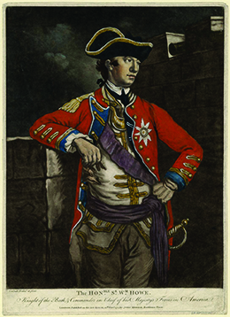
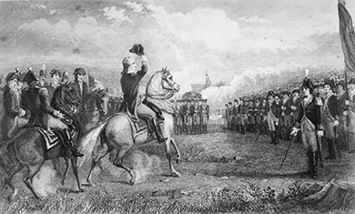
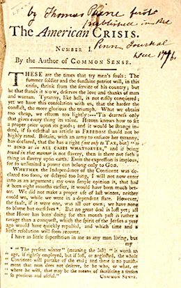
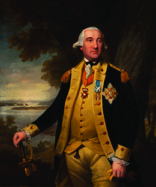
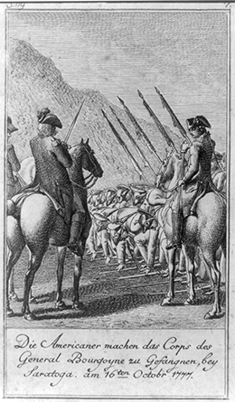

By the end of this section, you will be able to:
* Explain the British and American strategies of 1776 through 1778
* Identify the key battles of the early years of the Revolution

After the British quit Boston, they slowly adopted a strategy to isolate New England from the rest of the colonies and force the insurgents in that region into submission, believing that doing so would end the conflict. At first, British forces focused on taking the principal colonial centers. They began by easily capturing New York City in 1776. The following year, they took over the American capital of Philadelphia. The larger British effort to isolate New England was implemented in 1777. That effort ultimately failed when the British surrendered a force of over five thousand to the Americans in the fall of 1777 at the Battle of Saratoga.

The major campaigns over the next several years took place in the middle colonies of New York, New Jersey, and Pennsylvania, whose populations were sharply divided between Loyalists and Patriots. Revolutionaries faced many hardships as British superiority on the battlefield became evident and the difficulty of funding the war caused strains.

### THE BRITISH STRATEGY IN THE MIDDLE COLONIES

After evacuating Boston in March 1776, British forces sailed to Nova Scotia to regroup. They devised a strategy, successfully implemented in 1776, to take New York City. The following year, they planned to end the rebellion by cutting New England off from the rest of the colonies and starving it into submission. Three British armies were to move simultaneously from New York City, Montreal, and Fort Oswego to converge along the Hudson River; British control of that natural boundary would isolate New England.

General William Howe ([\[link\]](#CNX_History_06_02_Howe)), commander in chief of the British forces in America, amassed thirty-two thousand troops on Staten Island in June and July 1776. His brother, Admiral Richard Howe, controlled New York Harbor. Command of New York City and the Hudson River was their goal. In August 1776, General Howe landed his forces on Long Island and easily routed the American Continental Army there in the Battle of Long Island (August 27). The Americans were outnumbered and lacked both military experience and discipline. Sensing victory, General and Admiral Howe arranged a peace conference in September 1776, where Benjamin Franklin, John Adams, and South Carolinian John Rutledge represented the Continental Congress. Despite the Howes’ hopes, however, the Americans demanded recognition of their independence, which the Howes were not authorized to grant, and the conference disbanded.

 {: #CNX_History_06_02_Howe}

On September 16, 1776, George Washington’s forces held up against the British at the Battle of Harlem Heights. This important American military achievement, a key reversal after the disaster on Long Island, occurred as most of Washington’s forces retreated to New Jersey. A few weeks later, on October 28, General Howe’s forces defeated Washington’s at the Battle of White Plains and New York City fell to the British. For the next seven years, the British made the city the headquarters for their military efforts to defeat the rebellion, which included raids on surrounding areas. In 1777, the British burned Danbury, Connecticut, and in July 1779, they set fire to homes in Fairfield and Norwalk. They held American prisoners aboard ships in the waters around New York City; the death toll was shocking, with thousands perishing in the holds. Meanwhile, New York City served as a haven for Loyalists who disagreed with the effort to break away from the Empire and establish an American republic.

### GEORGE WASHINGTON AND THE CONTINENTAL ARMY

When the Second Continental Congress met in Philadelphia in May 1775, members approved the creation of a professional Continental Army with Washington as commander in chief ([\[link\]](#CNX_History_06_02_Washington)). Although sixteen thousand volunteers enlisted, it took several years for the Continental Army to become a truly professional force. In 1775 and 1776, militias still composed the bulk of the Patriots’ armed forces, and these soldiers returned home after the summer fighting season, drastically reducing the army’s strength.

 {: #CNX_History_06_02_Washington}

That changed in late 1776 and early 1777, when Washington broke with conventional eighteenth-century military tactics that called for fighting in the summer months only. Intent on raising revolutionary morale after the British captured New York City, he launched surprise strikes against British forces in their winter quarters. In Trenton, New Jersey, he led his soldiers across the Delaware River and surprised an encampment of **Hessians**{: data-type="term"}, German mercenaries hired by Great Britain to put down the American rebellion. Beginning the night of December 25, 1776, and continuing into the early hours of December 26, Washington moved on Trenton where the Hessians were encamped. Maintaining the element of surprise by attacking at Christmastime, he defeated them, taking over nine hundred captive. On January 3, 1777, Washington achieved another much-needed victory at the Battle of Princeton. He again broke with eighteenth-century military protocol by attacking unexpectedly after the fighting season had ended.

Thomas Paine on “The American Crisis”

During the American Revolution, following the publication of *Common Sense* in January 1776, Thomas Paine began a series of sixteen pamphlets known collectively as *The American Crisis* ([\[link\]](#CNX_History_06_02_Crisis)). He wrote the first volume in 1776, describing the dire situation facing the revolutionaries at the end of that hard year.

{: #CNX_History_06_02_Crisis}

<q>These are the times that try men’s souls. The summer soldier and the sunshine patriot will, in this crisis, shrink from the service of their country; but he that stands it now, deserves the love and thanks of man and woman. . . . Britain, with an army to enforce her tyranny, has declared that she has a right (not only to tax) but “to bind us in all cases whatsoever,” and if being bound in that manner, is not slavery, then is there not such a thing as slavery upon earth. Even the expression is impious; for so unlimited a power can belong only to God. . . .* * *
{: data-type="newline"}

 I shall conclude this paper with some miscellaneous remarks on the state of our affairs; and shall begin with asking the following question, Why is it that the enemy have left the New England provinces, and made these middle ones the seat of war? The answer is easy: New England is not infested with Tories, and we are. I have been tender in raising the cry against these men, and used numberless arguments to show them their danger, but it will not do to sacrifice a world either to their folly or their baseness. The period is now arrived, in which either they or we must change our sentiments, or one or both must fall. . . .* * *
{: data-type="newline"}

 By perseverance and fortitude we have the prospect of a glorious issue; by cowardice and submission, the sad choice of a variety of evils—a ravaged country—a depopulated city—habitations without safety, and slavery without hope—our homes turned into barracks and bawdy-houses for Hessians, and a future race to provide for, whose fathers we shall doubt of. Look on this picture and weep over it! and if there yet remains one thoughtless wretch who believes it not, let him suffer it unlamented.* * *
{: data-type="newline"}

 —Thomas Paine, “The American Crisis,” December 23, 1776</q>

What topics does Paine address in this pamphlet? What was his purpose in writing? What does he write about Tories (Loyalists), and why does he consider them a problem?

  
Visit [Wikisource][1] to read the rest of Thomas Paine’s first *American Crisis* pamphlet, as well as the other fifteen in the series.

### PHILADELPHIA AND SARATOGA: BRITISH AND AMERICAN VICTORIES

In August 1777, General Howe brought fifteen thousand British troops to Chesapeake Bay as part of his plan to take Philadelphia, where the Continental Congress met. That fall, the British defeated Washington’s soldiers in the Battle of Brandywine Creek and took control of Philadelphia, forcing the Continental Congress to flee. During the winter of 1777–1778, the British occupied the city, and Washington’s army camped at Valley Forge, Pennsylvania.

Washington’s winter at Valley Forge was a low point for the American forces. A lack of supplies weakened the men, and disease took a heavy toll. Amid the cold, hunger, and sickness, soldiers deserted in droves. On February 16, Washington wrote to George Clinton, governor of New York: “For some days past, there has been little less than a famine in camp. A part of the army has been a week without any kind of flesh &amp; the rest three or four days. Naked and starving as they are, we cannot enough admire the incomparable patience and fidelity of the soldiery, that they have not been ere \[before\] this excited by their sufferings to a general mutiny and dispersion.” Of eleven thousand soldiers encamped at Valley Forge, twenty-five hundred died of starvation, malnutrition, and disease. As Washington feared, nearly one hundred soldiers deserted every week. (Desertions continued, and by 1780, Washington was executing recaptured deserters every Saturday.) The low morale extended all the way to Congress, where some wanted to replace Washington with a more seasoned leader.

Assistance came to Washington and his soldiers in February 1778 in the form of the Prussian soldier Friedrich Wilhelm von Steuben ([\[link\]](#CNX_History_06_02_Steuben)). Baron von Steuben was an experienced military man, and he implemented a thorough training course for Washington’s ragtag troops. By drilling a small corps of soldiers and then having them train others, he finally transformed the Continental Army into a force capable of standing up to the professional British and Hessian soldiers. His drill manual—*Regulations for the Order and Discipline of the Troops of the United States*—informed military practices in the United States for the next several decades.

 {: #CNX_History_06_02_Steuben}

  
Explore Friedrich Wilhelm von Steuben’s [Revolutionary War Drill Manual][2] to understand how von Steuben was able to transform the Continental Army into a professional fighting force. Note the tremendous amount of precision and detail in von Steuben’s descriptions.

Meanwhile, the campaign to sever New England from the rest of the colonies had taken an unexpected turn during the fall of 1777. The British had attempted to implement the plan, drawn up by Lord George Germain and Prime Minister Lord North, to isolate New England with the combined forces of three armies. One army, led by General John Burgoyne, would march south from Montreal. A second force, led by Colonel Barry St. Leger and made up of British troops and Iroquois, would march east from Fort Oswego on the banks of Lake Ontario. A third force, led by General Sir Henry Clinton, would march north from New York City. The armies would converge at Albany and effectively cut the rebellion in two by isolating New England. This northern campaign fell victim to competing strategies, however, as General Howe had meanwhile decided to take Philadelphia. His decision to capture that city siphoned off troops that would have been vital to the overall success of the campaign in 1777.

The British plan to isolate New England ended in disaster. St. Leger’s efforts to bring his force of British regulars, Loyalist fighters, and Iroquois allies east to link up with General Burgoyne failed, and he retreated to Quebec. Burgoyne’s forces encountered ever-stiffer resistance as he made his way south from Montreal, down Lake Champlain and the upper Hudson River corridor. Although they did capture Fort Ticonderoga when American forces retreated, Burgoyne’s army found themselves surrounded by a sea of colonial militias in Saratoga, New York. In the meantime, the small British force under Clinton that left New York City to aid Burgoyne advanced slowly up the Hudson River, failing to provide the much-needed support for the troops at Saratoga. On October 17, 1777, Burgoyne surrendered his five thousand soldiers to the Continental Army ([\[link\]](#CNX_History_06_02_Burgoyne)).

 {: #CNX_History_06_02_Burgoyne}

The American victory at the Battle of Saratoga was the major turning point in the war. This victory convinced the French to recognize American independence and form a military alliance with the new nation, which changed the course of the war by opening the door to badly needed military support from France. Still smarting from their defeat by Britain in the Seven Years’ War, the French supplied the United States with gunpowder and money, as well as soldiers and naval forces that proved decisive in the defeat of Great Britain. The French also contributed military leaders, including the Marquis de Lafayette, who arrived in America in 1777 as a volunteer and served as Washington’s aide-de-camp.

The war quickly became more difficult for the British, who had to fight the rebels in North America as well as the French in the Caribbean. Following France’s lead, Spain joined the war against Great Britain in 1779, though it did not recognize American independence until 1783. The Dutch Republic also began to support the American revolutionaries and signed a treaty of commerce with the United States in 1782.

Great Britain’s effort to isolate New England in 1777 failed. In June 1778, the occupying British force in Philadelphia evacuated and returned to New York City in order to better defend that city, and the British then turned their attention to the southern colonies.

### Section Summary

The British successfully implemented the first part of their strategy to isolate New England when they took New York City in the fall of 1776. For the next seven years, they used New York as a base of operations, expanding their control to Philadelphia in the winter of 1777. After suffering through a terrible winter in 1777–1778 in Valley Forge, Pennsylvania, American forces were revived with help from Baron von Steuben, a Prussian military officer who helped transform the Continental Army into a professional fighting force. The effort to cut off New England from the rest of the colonies failed with the General Burgoyne’s surrender at Saratoga in October 1777. After Saratoga, the struggle for independence gained a powerful ally when France agreed to recognize the United States as a new nation and began to send much-needed military support. The entrance of France—Britain’s archrival in the contest of global empire—into the American fight helped to turn the tide of the war in favor of the revolutionaries.

### Review Questions

Which city served as the base for British operations for most of the war?

1.  Boston
2.  New York
3.  Philadelphia
4.  Saratoga
{: type="A"}

B

What battle turned the tide of war in favor of the Americans?

1.  the Battle of Saratoga
2.  the Battle of Brandywine Creek
3.  the Battle of White Plains
4.  the Battle of Valley Forge
{: type="A"}

A

Which term describes German soldiers hired by Great Britain to put down the American rebellion?

1.  Patriots
2.  Royalists
3.  Hessians
4.  Loyalists
{: type="A"}

C

Describe the British strategy in the early years of the war and explain whether or not it succeeded.

The British strategy in the period from 1776 to 1778 was to isolate the New England colonies, where the rebellion was concentrated. They succeeded in the beginning by taking first New York and then Philadelphia. However, they stalled there, and after the British defeat at Saratoga, they were not able to complete their plan to isolate New England.

How did George Washington’s military tactics help him to achieve success?

In the eighteenth century, militaries typically fought only in the summer months. On December 25 and 26, 1776, Washington triumphed over the Hessians encamped at Trenton by surprising them as they celebrated Christmas. Shortly thereafter, he used this same tactic to achieve victory at the Battle of Princeton.

### Glossary
{: data-type="glossary-title"}

Hessians
: German mercenaries hired by Great Britain to put down the American rebellion

[1]: http://openstaxcollege.org/l/amcrisis
[2]: http://openstaxcollege.org/l/steuben
