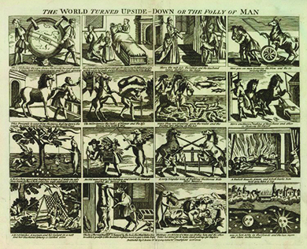

By the end of this section, you will be able to:
* Outline the British southern strategy and its results
* Describe key American victories and the end of the war
* Identify the main terms of the Treaty of Paris (1783)

By 1778, the war had turned into a stalemate. Although some in Britain, including Prime Minister Lord North, wanted peace, King George III demanded that the colonies be brought to obedience. To break the deadlock, the British revised their strategy and turned their attention to the southern colonies, where they could expect more support from Loyalists. The southern colonies soon became the center of the fighting. The **southern strategy**{: data-type="term" .no-emphasis} brought the British success at first, but thanks to the leadership of George Washington and General Nathanael Greene and the crucial assistance of French forces, the Continental Army defeated the British at Yorktown, effectively ending further large-scale operations during the war.

# GEORGIA AND SOUTH CAROLINA

The British architect of the war strategy, Lord George Germain, believed Britain would gain the upper hand with the support of Loyalists, slaves, and Indian allies in the South, and indeed, this southern strategy initially achieved great success. The British began their southern campaign by capturing Savannah, the capital of Georgia, in December 1778. In Georgia, they found support from thousands of slaves who ran to the British side to escape their bondage. As the British regained political control in Georgia, they forced the inhabitants to swear allegiance to the king and formed twenty Loyalist regiments. The Continental Congress had suggested that slaves be given freedom if they joined the Patriot army against the British, but revolutionaries in Georgia and South Carolina refused to consider this proposal. Once again, the Revolution served to further divisions over race and slavery.

After taking Georgia, the British turned their attention to South Carolina. Before the Revolution, South Carolina had been starkly divided between the backcountry, which harbored revolutionary partisans, and the coastal regions, where Loyalists remained a powerful force. Waves of violence rocked the backcountry from the late 1770s into the early 1780s. The Revolution provided an opportunity for residents to fight over their local resentments and antagonisms with murderous consequences. Revenge killings and the destruction of property became mainstays in the savage civil war that gripped the South.

In April 1780, a British force of eight thousand soldiers besieged American forces in Charleston ([\[link\]](#CNX_History_06_03_Charleston)). After six weeks of the Siege of Charleston, the British triumphed. General Benjamin Lincoln, who led the effort for the revolutionaries, had to surrender his entire force, the largest American loss during the entire war. Many of the defeated Americans were placed in jails or in British prison ships anchored in Charleston Harbor. The British established a military government in Charleston under the command of General Sir Henry Clinton. From this base, Clinton ordered General Charles Cornwallis to subdue the rest of South Carolina.

 , which shows details of the Continental defenses, was probably drawn by British engineers in anticipation of the attack on the city. The Siege of Charleston was one of a series of defeats for the Continental forces in the South, which led the Continental Congress to place General Nathanael Greene (b), shown here in a 1783 portrait by Charles Wilson Peale, in command in late 1780. Greene led his troops to two crucial victories."){: #CNX_History_06_03_Charleston}

The disaster at Charleston led the Continental Congress to change leadership by placing General Horatio Gates in charge of American forces in the South. However, General Gates fared no better than General Lincoln; at the Battle of Camden, South Carolina, in August 1780, Cornwallis forced General Gates to retreat into North Carolina. Camden was one of the worst disasters suffered by American armies during the entire Revolutionary War. Congress again changed military leadership, this time by placing General Nathanael Greene ([\[link\]](#CNX_History_06_03_Charleston)) in command in December 1780.

As the British had hoped, large numbers of Loyalists helped ensure the success of the southern strategy, and thousands of slaves seeking freedom arrived to aid Cornwallis’s army. However, the war turned in the Americans’ favor in 1781. General Greene realized that to defeat Cornwallis, he did not have to win a single battle. So long as he remained in the field, he could continue to destroy isolated British forces. Greene therefore made a strategic decision to divide his own troops to wage war—and the strategy worked. American forces under General Daniel Morgan decisively beat the British at the Battle of Cowpens in South Carolina. General Cornwallis now abandoned his strategy of defeating the backcountry rebels in South Carolina. Determined to destroy Greene’s army, he gave chase as Greene strategically retreated north into North Carolina. At the Battle of Guilford Courthouse in March 1781, the British prevailed on the battlefield but suffered extensive losses, an outcome that paralleled the Battle of Bunker Hill nearly six years earlier in June 1775.

# YORKTOWN

In the summer of 1781, Cornwallis moved his army to **Yorktown**{: data-type="term"}, Virginia. He expected the Royal Navy to transport his army to New York, where he thought he would join General Sir Henry Clinton. Yorktown was a tobacco port on a peninsula, and Cornwallis believed the British navy would be able to keep the coast clear of rebel ships. Sensing an opportunity, a combined French and American force of sixteen thousand men swarmed the peninsula in September 1781. Washington raced south with his forces, now a disciplined army, as did the Marquis de Lafayette and the Comte de Rochambeau with their French troops. The French Admiral de Grasse sailed his naval force into Chesapeake Bay, preventing Lord Cornwallis from taking a seaward escape route.

In October 1781, the American forces began the battle for Yorktown, and after a siege that lasted eight days, Lord Cornwallis capitulated on October 19 ([\[link\]](#CNX_History_06_03_Yorktown)). Tradition says that during the surrender of his troops, the British band played “The World Turned Upside Down,” a song that befitted the Empire’s unexpected reversal of fortune.

 {: #CNX_History_06_03_Yorktown}

“The World Turned Upside Down”

“The World Turned Upside Down,” reputedly played during the surrender of the British at Yorktown, was a traditional English ballad from the seventeenth century. It was also the theme of a popular British print that circulated in the 1790s ([\[link\]](#CNX_History_06_03_Upsidedown)).

{: #CNX_History_06_03_Upsidedown}

Why do you think these images were popular in Great Britain in the decade following the Revolutionary War? What would these images imply to Americans?

  
Visit the [Public Domain Review][1] to explore the images in an eighteenth-century British chapbook (a pamphlet for tracts or ballads) titled “The World Turned Upside Down.” The chapbook is illustrated with woodcuts similar to those in the popular print mentioned above.

# THE TREATY OF PARIS

The British defeat at Yorktown made the outcome of the war all but certain. In light of the American victory, the Parliament of Great Britain voted to end further military operations against the rebels and to begin peace negotiations. Support for the war effort had come to an end, and British military forces began to evacuate the former American colonies in 1782. When hostilities had ended, Washington resigned as commander in chief and returned to his Virginia home.

In April 1782, Benjamin Franklin, John Adams, and John Jay had begun informal peace negotiations in Paris. Officials from Great Britain and the United States finalized the treaty in 1783, signing the Treaty of Paris ([\[link\]](#CNX_History_06_03_Paris)) in September of that year. The treaty recognized the independence of the United States; placed the western, eastern, northern, and southern boundaries of the nation at the Mississippi River, the Atlantic Ocean, Canada, and Florida, respectively; and gave New Englanders fishing rights in the waters off Newfoundland. Under the terms of the treaty, individual states were encouraged to refrain from persecuting Loyalists and to return their confiscated property.

 {: #CNX_History_06_03_Paris}

# Section Summary

The British gained momentum in the war when they turned their military efforts against the southern colonies. They scored repeated victories in the coastal towns, where they found legions of supporters, including slaves escaping bondage. As in other colonies, however, control of major seaports did not mean the British could control the interior. Fighting in the southern colonies devolved into a merciless civil war as the Revolution opened the floodgates of pent-up anger and resentment between frontier residents and those along the coastal regions. The southern campaign came to an end at Yorktown when Cornwallis surrendered to American forces.

# Review Questions

Which American general is responsible for improving the American military position in the South? 

John Burgoyne

Nathanael Greene

Wilhelm Frederick von Steuben

Charles Cornwallis

B

Describe the British southern strategy and its results.

The British southern strategy was to move the military theater to the southern colonies where there were more Loyalist colonists. Slaves and Indian allies, the British hoped, would also swell their ranks. This strategy worked at first, allowing the British to take Charleston. However, British fortunes changed after Nathanael Greene took command of the southern Continental Army and scored decisive victories at the battles of Cowpens and Guilford. This set the stage for the final American victory at Yorktown, Virginia. The southern strategy had failed.

## Glossary
{: data-type="glossary-title"}

Yorktown
: the Virginia port where British General Cornwallis surrendered to American forces
{: .definition}

[1]: http://openstaxcollege.org/l/worldupside
