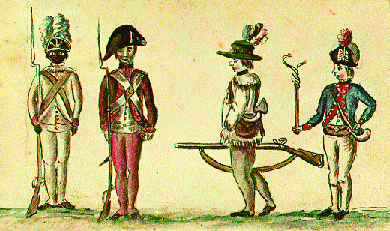

By the end of this section, you will be able to:
* Explain Loyalist and Patriot sentiments
* Identify different groups that participated in the Revolutionary War

The American Revolution in effect created multiple civil wars. Many of the resentments and antagonisms that fed these conflicts predated the Revolution, and the outbreak of war acted as the catalyst they needed to burst forth. In particular, the middle colonies of New York, New Jersey, and Pennsylvania had deeply divided populations. Loyalty to Great Britain came in many forms, from wealthy elites who enjoyed the prewar status quo to runaway slaves who desired the freedom that the British offered.

# LOYALISTS

Historians disagree on what percentage of colonists were Loyalists; estimates range from 20 percent to over 30 percent. In general, however, of British America’s population of 2.5 million, roughly one-third remained loyal to Great Britain, while another third committed themselves to the cause of independence. The remaining third remained apathetic, content to continue with their daily lives as best they could and preferring not to engage in the struggle.

Many Loyalists were royal officials and merchants with extensive business ties to Great Britain, who viewed themselves as the rightful and just defenders of the British constitution. Others simply resented local business and political rivals who supported the Revolution, viewing the rebels as hypocrites and schemers who selfishly used the break with the Empire to increase their fortunes. In New York’s Hudson Valley, animosity among the tenants of estates owned by Revolutionary leaders turned them to the cause of King and Empire.

During the war, all the states passed **confiscation acts**{: data-type="term"}, which gave the new revolutionary governments in the former colonies the right to seize Loyalist land and property. To ferret out Loyalists, revolutionary governments also passed laws requiring the male population to take oaths of allegiance to the new states. Those who refused lost their property and were often imprisoned or made to work for the new local revolutionary order.

William Franklin, Benjamin Franklin’s only surviving son, remained loyal to Crown and Empire and served as royal governor of New Jersey, a post he secured with his father’s help. During the war, revolutionaries imprisoned William in Connecticut; however, he remained steadfast in his allegiance to Great Britain and moved to England after the Revolution. He and his father never reconciled.

As many as nineteen thousand colonists served the British in the effort to put down the rebellion, and after the Revolution, as many as 100,000 colonists left, moving to England or north to Canada rather than staying in the new United States ([\[link\]](#CNX_History_06_04_Loyalists)). Eight thousand whites and five thousand free blacks went to Britain. Over thirty thousand went to Canada, transforming that nation from predominately French to predominantly British. Another sizable group of Loyalists went to the British West Indies, taking their slaves with them.

 {: #CNX_History_06_04_Loyalists}

Hannah Ingraham on Removing to Nova Scotia

Hannah Ingraham was eleven years old in 1783, when her Loyalist family removed from New York to Ste. Anne’s Point in the colony of Nova Scotia. Later in life, she compiled her memories of that time.

\> \[Father\] said we were to go to Nova Scotia, that a ship was ready to take us there, so we made all haste to get ready. . . . Then on Tuesday, suddenly the house was surrounded by rebels and father was taken prisoner and carried away. . . . When morning came, they said he was free to go.
> * * *
> {: data-type="newline"}
> 
> We had five wagon loads carried down the Hudson in a sloop and then we went on board the transport that was to bring us to Saint John. I was just eleven years old when we left our farm to come here. It was the last transport of the season and had on board all those who could not come sooner. The first transports had come in May so the people had all the summer before them to get settled. . . .
> * * *
> {: data-type="newline"}
> 
> We lived in a tent at St. Anne’s until father got a house ready. . . . There was no floor laid, no windows, no chimney, no door, but we had a roof at least. A good fire was blazing and mother had a big loaf of bread and she boiled a kettle of water and put a good piece of butter in a pewter bowl. We toasted the bread and all sat around the bowl and ate our breakfast that morning and mother said: “Thank God we are no longer in dread of having shots fired through our house. This is the sweetest meal I ever tasted for many a day.”

What do these excerpts tell you about life as a Loyalist in New York or as a transplant to Canada?

# SLAVES AND INDIANS

While some slaves who fought for the Patriot cause received their freedom, revolutionary leaders—unlike the British—did not grant such slaves their freedom as a matter of course. Washington, the owner of more than two hundred slaves during the Revolution, refused to let slaves serve in the army, although he did allow free blacks. (In his will, Washington did free his slaves.) In the new United States, the Revolution largely reinforced a racial identity based on skin color. Whiteness, now a national identity, denoted freedom and stood as the key to power. Blackness, more than ever before, denoted servile status. Indeed, despite their class and ethnic differences, white revolutionaries stood mostly united in their hostility to both blacks and Indians.

Boyrereau Brinch and Boston King on the Revolutionary War

In the Revolutionary War, some blacks, both free and enslaved, chose to fight for the Americans ([\[link\]](#CNX_History_06_04_FootSold)). Others chose to fight for the British, who offered them freedom for joining their cause. Read the excerpts below for the perspective of a black veteran from each side of the conflict.

{: #CNX_History_06_04_FootSold}

Boyrereau Brinch was captured in Africa at age sixteen and brought to America as a slave. He joined the Patriot forces and was honorably discharged and emancipated after the war. He told his story to Benjamin Prentiss, who published it as *The Blind African Slave* in 1810.

\> Finally, I was in the battles at Cambridge, White Plains, Monmouth, Princeton, Newark, Frog’s Point, Horseneck where I had a ball pass through my knapsack. All which battels \[sic\] the reader can obtain a more perfect account of in history, than I can give. At last we returned to West Point and were discharged \[1783\], as the war was over. Thus was I, a slave for five years fighting for liberty. After we were disbanded, I returned to my old master at Woodbury \[Connecticut\], with whom I lived one year, my services in the American war, having emancipated me from further slavery, and from being bartered or sold. . . . Here I enjoyed the pleasures of a freeman; my food was sweet, my labor pleasure: and one bright gleam of life seemed to shine upon me.

Boston King was a Charleston-born slave who escaped his master and joined the Loyalists. He made his way to Nova Scotia and later Sierra Leone, where he published his memoirs in 1792. The excerpt below describes his experience in New York after the war.

\> When I arrived at New-York, my friends rejoiced to see me once more restored to liberty, and joined me in praising the Lord for his mercy and goodness. . . . \[In 1783\] the horrors and devastation of war happily terminated, and peace was restored between America and Great Britain, which diffused universal joy among all parties, except us, who had escaped from slavery and taken refuge in the English army; for a report prevailed at New-York, that all the slaves, in number 2000, were to be delivered up to their masters, altho’ some of them had been three or four years among the English. This dreadful rumour filled us all with inexpressible anguish and terror, especially when we saw our old masters coming from Virginia, North-Carolina, and other parts, and seizing upon their slaves in the streets of New-York, or even dragging them out of their beds. Many of the slaves had very cruel masters, so that the thoughts of returning home with them embittered life to us. For some days we lost our appetite for food, and sleep departed from our eyes. The English had compassion upon us in the day of distress, and issued out a Proclamation, importing, That all slaves should be free, who had taken refuge in the British lines, and claimed the sanction and privileges of the Proclamations respecting the security and protection of Negroes. In consequence of this, each of us received a certificate from the commanding officer at New-York, which dispelled all our fears, and filled us with joy and gratitude.

What do these two narratives have in common, and how are they different? How do the two men describe freedom?

For slaves willing to run away and join the British, the American Revolution offered a unique occasion to escape bondage. Of the half a million slaves in the American colonies during the Revolution, twenty thousand joined the British cause. At Yorktown, for instance, thousands of black troops fought with Lord Cornwallis. Slaves belonging to George Washington, Thomas Jefferson, Patrick Henry, and other revolutionaries seized the opportunity for freedom and fled to the British side. Between ten and twenty thousand slaves gained their freedom because of the Revolution; arguably, the Revolution created the largest slave uprising and the greatest emancipation until the Civil War. After the Revolution, some of these African Loyalists emigrated to Sierra Leone on the west coast of Africa. Others removed to Canada and England. It is also true that people of color made heroic contributions to the cause of American independence. However, while the British offered slaves freedom, most American revolutionaries clung to notions of black inferiority.

Powerful Indian peoples who had allied themselves with the British, including the Mohawk and the Creek, also remained loyal to the Empire. A Mohawk named Joseph Brant, whose given name was Thayendanegea ([\[link\]](#CNX_History_06_04_Brant)), rose to prominence while fighting for the British during the Revolution. He joined forces with Colonel Barry St. Leger during the 1777 campaign, which ended with the surrender of General Burgoyne at Saratoga. After the war, Brant moved to the Six Nations reserve in Canada. From his home on the shores of Lake Ontario, he remained active in efforts to restrict white encroachment onto Indian lands. After their defeat, the British did not keep promises they’d made to help their Indian allies keep their territory; in fact, the Treaty of Paris granted the United States huge amounts of supposedly British-owned regions that were actually Indian lands.

  and one by Charles Wilson Peale in 1797 (b)? What are the differences? Why do you think the artists made the specific choices they did?"){: #CNX_History_06_04_Brant}

# PATRIOTS

The American revolutionaries (also called Patriots or Whigs) came from many different backgrounds and included merchants, shoemakers, farmers, and sailors. What is extraordinary is the way in which the struggle for independence brought a vast cross-section of society together, animated by a common cause.

During the war, the revolutionaries faced great difficulties, including massive supply problems; clothing, ammunition, tents, and equipment were all hard to come by. After an initial burst of enthusiasm in 1775 and 1776, the shortage of supplies became acute in 1777 through 1779, as Washington’s difficult winter at Valley Forge demonstrates.

Funding the war effort also proved very difficult. Whereas the British could pay in gold and silver, the American forces relied on paper money, backed by loans obtained in Europe. This first American money was called **Continental currency**{: data-type="term"}; unfortunately, it quickly fell in value. “Not worth a Continental” soon became a shorthand term for something of no value. The new revolutionary government printed a great amount of this paper money, resulting in runaway inflation. By 1781, inflation was such that 146 Continental dollars were worth only one dollar in gold. The problem grew worse as each former colony, now a revolutionary state, printed its own currency.

# WOMEN

In colonial America, women shouldered enormous domestic and child-rearing responsibilities. The war for independence only increased their workload and, in some ways, solidified their roles. Rebel leaders required women to produce articles for war—everything from clothing to foodstuffs—while also keeping their homesteads going. This was not an easy task when their husbands and sons were away fighting. Women were also expected to provide food and lodging for armies and to nurse wounded soldiers.

The Revolution opened some new doors for women, however, as they took on public roles usually reserved for men. The Daughters of Liberty, an informal organization formed in the mid-1760s to oppose British revenue-raising measures, worked tirelessly to support the war effort. Esther DeBerdt Reed of Philadelphia, wife of Governor Joseph Reed, formed the Ladies Association of Philadelphia and led a fundraising drive to provide sorely needed supplies to the Continental Army. In “The Sentiments of an American Woman” (1780), she wrote to other women, “The time is arrived to display the same sentiments which animated us at the beginning of the Revolution, when we renounced the use of teas, however agreeable to our taste, rather than receive them from our persecutors; when we made it appear to them that we placed former necessaries in the rank of superfluities, when our liberty was interested; when our republican and laborious hands spun the flax, prepared the linen intended for the use of our soldiers; when exiles and fugitives we supported with courage all the evils which are the concomitants of war.” Reed and other elite women in Philadelphia raised almost $300,000 in Continental money for the war.

  
Read the entire text of Esther Reed’s [“The Sentiments of an American Woman”][1] on a page hosted by the University of Michigan-Dearborn.

Women who did not share Reed’s elite status nevertheless played key economic roles by producing homespun cloth and food. During shortages, some women formed mobs and wrested supplies from those who hoarded them. Crowds of women beset merchants and demanded fair prices for goods; if a merchant refused, a riot would ensue. Still other women accompanied the army as “camp followers,” serving as cooks, washerwomen, and nurses. A few also took part in combat and proved their equality with men through violence against the hated British.

# Section Summary

The American Revolution divided the colonists as much as it united them, with Loyalists (or Tories) joining the British forces against the Patriots (or revolutionaries). Both sides included a broad cross-section of the population. However, Great Britain was able to convince many slaves to join its forces by promising them freedom, something the southern revolutionaries would not agree to do. The war provided new opportunities, as well as new challenges, for slaves, free blacks, women, and Indians. After the war, many Loyalists fled the American colonies, heading across the Atlantic to England, north to Canada, or south to the West Indies.

# Review Questions

Which of the following statements best represents the division between Patriots and Loyalists?  Most American colonists were Patriots, with only a few traditionalists remaining loyal to the King and Empire. Most American colonists were Loyalists, with only a few firebrand revolutionaries leading the charge for independence. American colonists were divided among those who wanted independence, those who wanted to remain part of the British Empire, and those who were neutral. The vast majority of American colonists were neutral and didn’t take a side between Loyalists and Patriots. 

C

Which of the following is *not* one of the tasks women performed during the Revolution?  holding government offices maintaining their homesteads feeding, quartering, and nursing soldiers raising funds for the war effort 

A

# Critical Thinking Questions

How did the colonists manage to triumph in their battle for independence despite Great Britain’s military might? If any of these factors had been different, how might it have affected the outcome of the war?

How did the condition of certain groups, such as women, blacks, and Indians, reveal a contradiction in the Declaration of Independence?

What was the effect and importance of Great Britain’s promise of freedom to slaves who joined the British side?

How did the Revolutionary War provide both new opportunities and new challenges for slaves and free blacks in America?

Describe the ideology of republicanism. As a political philosophy, how did republicanism compare to the system that prevailed in Great Britain?

Describe the backgrounds and philosophies of Patriots and Loyalists. Why did colonists with such diverse individual interests unite in support of their respective causes? What might different groups of Patriots and Loyalists, depending upon their circumstances, have hoped to achieve by winning the war?

[1]: http://openstaxcollege.org/l/estherreed
