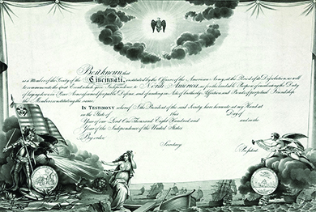

By the end of this section, you will be able to:
* Compare and contrast monarchy and republican government
* Describe the tenets of republicanism

 ![A timeline shows important events of the era. In 1776&#x2013;1780s, the states draft revolutionary constitutions; a state constitution is shown. In 1781, the Continental Congress ratifies the Articles of Confederation; the first page of the Articles of Confederation is shown. In 1784&#x2013;1787, the Northwest Ordinances outline the process for the sale of new lands. In 1786&#x2013;1787, Massachusetts farmers rise up in Shays&#x2019; Rebellion; a woodcut depicting Daniel Shays and Job Shattuck is shown. In 1787, the Philadelphia Constitutional Convention drafts a plan for the federal government; a painting of the Constitutional Convention is shown. In 1787&#x2013;1788, the Constitution is debated across the country.](../resources/CNX_History_07_00_Timeline.jpg){: #CNX_History_07_00_Timeline}

While monarchies dominated eighteenth-century Europe, American revolutionaries were determined to find an alternative to this method of government. Radical pamphleteer Thomas Paine, whose enormously popular essay *Common Sense* was first published in January 1776, advocated a republic: a state without a king. Six months later, Jefferson’s Declaration of Independence affirmed the break with England but did not suggest what form of government should replace monarchy, the only system most English colonists had ever known. In the late eighteenth century, republics were few and far between. Genoa, Venice, and the Dutch Republic provided examples of states without monarchs, but many European Enlightenment thinkers questioned the stability of a republic. Nonetheless, after their break from Great Britain, Americans turned to republicanism for their new government.

### REPUBLICANISM AS A POLITICAL PHILOSOPHY

**Monarchy**{: data-type="term"} rests on the practice of dynastic succession, in which the monarch’s child or other relative inherits the throne. Contested dynastic succession produced chronic conflict and warfare in Europe. In the eighteenth century, well-established monarchs ruled most of Europe and, according to tradition, were obligated to protect and guide their subjects. However, by the mid-1770s, many American colonists believed that George III, the king of Great Britain, had failed to do so. Patriots believed the British monarchy under George III had been corrupted and the king turned into a tyrant who cared nothing for the traditional liberties afforded to members of the British Empire. The disaffection from monarchy explains why a republic appeared a better alternative to the revolutionaries.

American revolutionaries looked to the past for inspiration for their break with the British monarchy and their adoption of a republican form of government. The Roman Republic provided guidance. Much like the Americans in their struggle against Britain, Romans had thrown off monarchy and created a republic in which Roman citizens would appoint or select the leaders who would represent them.

  
Visit the [Metropolitan Museum of Art][1] to see a Roman-style bust of George Washington, complete with toga. In 1791, Italian sculptor Giuseppe Ceracchi visited Philadelphia, hoping the government might commission a monument of his creation. He did not succeed, but the bust of Washington, one of the ones he produced to demonstrate his skill, illustrates the connection between the American and Roman republics that revolutionaries made.

While republicanism offered an alternative to monarchy, it was also an alternative to **democracy**{: data-type="term"}, a system of government characterized by **majority rule**{: data-type="term"}, where the majority of citizens have the power to make decisions binding upon the whole. To many revolutionaries, especially wealthy landowners, merchants, and planters, democracy did not offer a good replacement for monarchy. Indeed, **conservative Whigs**{: data-type="term"} defined themselves in opposition to democracy, which they equated with anarchy. In the tenth in a series of essays later known as *The Federalist Papers*, Virginian James Madison wrote: “Democracies have ever been spectacles of turbulence and contention; have ever been found incompatible with personal security or the rights of property; and have in general been as short in their lives as they have been violent in their deaths.” Many shared this perspective and worked hard to keep democratic tendencies in check. It is easy to understand why democracy seemed threatening: majority rule can easily overpower minority rights, and the wealthy few had reason to fear that a hostile and envious majority could seize and redistribute their wealth.

While many now assume the United States was founded as a democracy, history, as always, is more complicated. Conservative Whigs believed in government by a patrician class, a ruling group composed of a small number of privileged families. **Radical Whigs**{: data-type="term"} favored broadening the popular participation in political life and pushed for democracy. The great debate after independence was secured centered on this question: Who should rule in the new American republic?

### REPUBLICANISM AS A SOCIAL PHILOSOPHY

According to political theory, a republic requires its citizens to cultivate virtuous behavior; if the people are virtuous, the republic will survive. If the people become corrupt, the republic will fall. Whether republicanism succeeded or failed in the United States would depend on civic virtue and an educated citizenry. Revolutionary leaders agreed that the ownership of property provided one way to measure an individual’s virtue, arguing that property holders had the greatest stake in society and therefore could be trusted to make decisions for it. By the same token, non-property holders, they believed, should have very little to do with government. In other words, unlike a democracy, in which the mass of non-property holders could exercise the political right to vote, a republic would limit political rights to property holders. In this way, republicanism exhibited a bias toward the elite, a preference that is understandable given the colonial legacy. During colonial times, wealthy planters and merchants in the American colonies had looked to the British ruling class, whose social order demanded deference from those of lower rank, as a model of behavior. Old habits died hard.

Benjamin Franklin’s Thirteen Virtues for Character Development

In the 1780s, Benjamin Franklin carefully defined thirteen virtues to help guide his countrymen in maintaining a virtuous republic. His choice of thirteen is telling since he wrote for the citizens of the thirteen new American republics. These virtues were:

<q>1. Temperance. Eat not to dullness; drink not to elevation.* * *
{: data-type="newline"}

 2. Silence. Speak not but what may benefit others or yourself; avoid trifling conversation.* * *
{: data-type="newline"}

 3. Order. Let all your things have their places; let each part of your business have its time.* * *
{: data-type="newline"}

 4. Resolution. Resolve to perform what you ought; perform without fail what you resolve.* * *
{: data-type="newline"}

 5. Frugality. Make no expense but to do good to others or yourself; i.e., waste nothing.* * *
{: data-type="newline"}

 6. Industry. Lose no time; be always employ’d in something useful; cut off all unnecessary actions.* * *
{: data-type="newline"}

 7. Sincerity. Use no hurtful deceit; think innocently and justly, and, if you speak, speak accordingly.* * *
{: data-type="newline"}

 8. Justice. Wrong none by doing injuries, or omitting the benefits that are your duty.* * *
{: data-type="newline"}

 9. Moderation. Avoid extremes; forbear resenting injuries so much as you think they deserve.* * *
{: data-type="newline"}

 10. Cleanliness. Tolerate no uncleanliness in body, cloaths, or habitation.* * *
{: data-type="newline"}

 11. Tranquillity. Be not disturbed at trifles, or at accidents common or unavoidable.* * *
{: data-type="newline"}

 12. Chastity. Rarely use venery but for health or offspring, never to dullness, weakness, or the injury of your own or another’s peace or reputation.* * *
{: data-type="newline"}

 13. Humility. Imitate Jesus and Socrates.</q>

Franklin’s thirteen virtues suggest that hard work and good behavior will bring success. What factors does Franklin ignore? How would he likely address a situation in which children inherit great wealth rather than working for it? How do Franklin’s values help to define the notion of republican virtue?

  
Check how well you are demonstrating all thirteen of [Franklin’s virtues][2] on thirteenvirtues.com, where you can register to track your progress.

George Washington served as a role model par excellence for the new republic, embodying the exceptional talent and public virtue prized under the political and social philosophy of republicanism. He did not seek to become the new king of America; instead he retired as commander in chief of the Continental Army and returned to his Virginia estate at Mount Vernon to resume his life among the planter elite. Washington modeled his behavior on that of the Roman aristocrat Cincinnatus, a representative of the patrician or ruling class, who had also retired from public service in the Roman Republic and returned to his estate to pursue agricultural life.

The aristocratic side of republicanism—and the belief that the true custodians of public virtue were those who had served in the military—found expression in the Society of the Cincinnati, of which Washington was the first president general ([\[link\]](#CNX_History_07_01_Cincinnati)). Founded in 1783, the society admitted only officers of the Continental Army and the French forces, not militia members or minutemen. Following the rule of primogeniture, the eldest sons of members inherited their fathers’ memberships. The society still exists today and retains the motto *Omnia relinquit servare rempublicam* (“He relinquished everything to save the Republic”).

 {: #CNX_History_07_01_Cincinnati}

### Section Summary

The guiding principle of republicanism was that the people themselves would appoint or select the leaders who would represent them. The debate over how much democracy (majority rule) to incorporate in the governing of the new United States raised questions about who was best qualified to participate in government and have the right to vote. Revolutionary leaders argued that property holders had the greatest stake in society and favored a republic that would limit political rights to property holders. In this way, republicanism exhibited a bias toward the elite. George Washington served as a role model for the new republic, embodying the exceptional talent and public virtue prized in its political and social philosophy.

### Review Questions

To what form of government did the American revolutionaries turn after the war for independence?

1.  republicanism
2.  monarchy
3.  democracy
4.  oligarchy
{: type="A"}

A

Which of the following was not one of Franklin’s thirteen virtues?

1.  sincerity
2.  temperance
3.  mercy
4.  tranquility
{: type="A"}

C

What defined republicanism as a social philosophy?

Citizenship within a republic meant accepting certain rights and responsibilities as well as cultivating virtuous behavior. This philosophy was based on the notion that the success or failure of the republic depended upon the virtue or corruption of its citizens.

### Glossary
{: data-type="glossary-title"}

conservative Whigs
: the politically and economically elite revolutionary class that wanted to limit political participation to a few powerful families
^

democracy
: a system of government in which the majority rules
^

majority rule
: a fundamental principle of democracy, providing that the majority should have the power to make decisions binding upon the whole
^

monarchy
: a form of government with a monarch at its head
^

radical Whigs
: revolutionaries who favored broadening participation in the political process

[1]: http://openstaxcollege.org/l/ceracchi
[2]: http://openstaxcollege.org/l/13virtues
