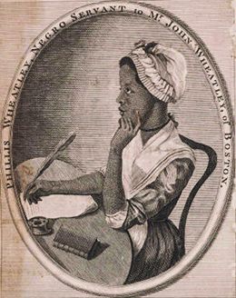
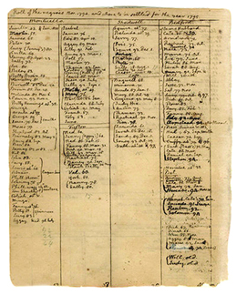
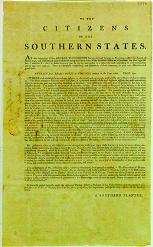

By the end of this section, you will be able to:
* Describe the status of women in the new republic
* Describe the status of nonwhites in the new republic

Elite republican revolutionaries did not envision a completely new society; traditional ideas and categories of race and gender, order and decorum remained firmly entrenched among members of their privileged class. Many Americans rejected the elitist and aristocratic republican order, however, and advocated radical changes. Their efforts represented a groundswell of sentiment for greater equality, a part of the democratic impulse unleashed by the Revolution.

# THE STATUS OF WOMEN

In eighteenth-century America, as in Great Britain, the legal status of married women was defined as **coverture**{: data-type="term"}, meaning a married woman (or *feme covert*) had no legal or economic status independent of her husband. She could not conduct business or buy and sell property. Her husband controlled any property she brought to the marriage, although he could not sell it without her agreement. Married women’s status as *femes covert* did not change as a result of the Revolution, and wives remained economically dependent on their husbands. The women of the newly independent nation did not call for the right to vote, but some, especially the wives of elite republican statesmen, began to agitate for equality under the law between husbands and wives, and for the same educational opportunities as men.

Some women hoped to overturn coverture. From her home in Braintree, Massachusetts, Abigail Adams ([\[link\]](#CNX_History_07_02_AbigailAd)) wrote to her husband, Whig leader John Adams, in 1776, “In the new code of laws which I suppose it will be necessary for you to make, I desire you would remember the ladies and be more generous and favorable to them than your ancestor. Do not put such unlimited power in the husbands. Remember, all men would be tyrants if they could.” Abigail Adams ran the family homestead during the Revolution, but she did not have the ability to conduct business without her husband’s consent. Elsewhere in the famous 1776 letter quoted above, she speaks of the difficulties of running the homestead when her husband is away. Her frustration grew when her husband responded in an April 1776 letter: “As to your extraordinary Code of Laws, I cannot but laugh. We have been told that our Struggle has loosened the bands of Government every where. That Children and Apprentices were disobedient—that schools and Colledges were grown turbulent—that Indians slighted their Guardians and Negroes grew insolent to their Masters. But your Letter was the first Intimation that another Tribe more numerous and powerfull than all the rest were grown discontented. . . . Depend on it, We know better than to repeal our Masculine systems.”

 , shown here in a 1766 portrait by Benjamin Blythe, is best remembered for her eloquent letters to her husband, John Adams (b), who would later become the second president of the United States."){: #CNX_History_07_02_AbigailAd}

Another privileged member of the revolutionary generation, Mercy Otis Warren, also challenged gender assumptions and traditions during the revolutionary era ([\[link\]](#CNX_History_07_02_Murray)). Born in Massachusetts, Warren actively opposed British reform measures before the outbreak of fighting in 1775 by publishing anti-British works. In 1812, she published a three-volume history of the Revolution, a project she had started in the late 1770s. By publishing her work, Warren stepped out of the female sphere and into the otherwise male-dominated sphere of public life.

Inspired by the Revolution, Judith Sargent Murray of Massachusetts advocated women’s economic independence and equal educational opportunities for men and women ([\[link\]](#CNX_History_07_02_Murray)). Murray, who came from a well-to-do family in Gloucester, questioned why boys were given access to education as a birthright while girls had very limited educational opportunities. She began to publish her ideas about educational equality beginning in the 1780s, arguing that God had made the minds of women and men equal.

  and 1763 portrait of Mercy Otis Warren (b) show two of America&#x2019;s earliest advocates for women&#x2019;s rights. Notice how their fine silk dresses telegraph their privileged social status."){: #CNX_History_07_02_Murray}

Murray’s more radical ideas championed woman’s economic independence. She argued that a woman’s education should be extensive enough to allow her to maintain herself—and her family—if there was no male breadwinner. Indeed, Murray was able to make money of her own from her publications. Her ideas were both radical and traditional, however: Murray also believed that women were much better at raising children and maintaining the morality and virtue of the family than men.

Adams, Murray, and Warren all came from privileged backgrounds. All three were fully literate, while many women in the American republic were not. Their literacy and station allowed them to push for new roles for women in the atmosphere of unique possibility created by the Revolution and its promise of change. Female authors who published their work provide evidence of how women in the era of the American Revolution challenged traditional gender roles.

Overall, the Revolution reconfigured women’s roles by undermining the traditional expectations of wives and mothers, including subservience. In the home, the separate domestic sphere assigned to women, women were expected to practice republican virtues, especially frugality and simplicity. Republican motherhood meant that women, more than men, were responsible for raising good children, instilling in them all the virtue necessary to ensure the survival of the republic. The Revolution also opened new doors to educational opportunities for women. Men understood that the republic needed women to play a substantial role in upholding republicanism and ensuring the survival of the new nation. Benjamin Rush, a Whig educator and physician from Philadelphia, strongly advocated for the education of girls and young women as part of the larger effort to ensure that republican virtue and republican motherhood would endure.

# THE MEANING OF RACE

By the time of the Revolution, slavery had been firmly in place in America for over one hundred years. In many ways, the Revolution served to reinforce the assumptions about race among white Americans. They viewed the new nation as a white republic; blacks were slaves, and Indians had no place. Racial hatred of blacks increased during the Revolution because many slaves fled their white masters for the freedom offered by the British. The same was true for Indians who allied themselves with the British; Jefferson wrote in the Declaration of Independence that separation from the Empire was necessary because George III had incited “the merciless Indian savages” to destroy the white inhabitants on the frontier. Similarly, Thomas Paine argued in *Common Sense* that Great Britain was guilty of inciting “the Indians and Negroes to destroy us.” For his part, Benjamin Franklin wrote in the 1780s that, in time, alcoholism would wipe out the Indians, leaving the land free for white settlers.

Phillis Wheatley: “On Being Brought from Africa to America”

Phillis Wheatley ([\[link\]](#CNX_History_07_02_Wheatley)) was born in Africa in 1753 and sold as a slave to the Wheatley family of Boston; her African name is lost to posterity. Although most slaves in the eighteenth century had no opportunities to learn to read and write, Wheatley achieved full literacy and went on to become one of the best-known poets of the time, although many doubted her authorship of her poems because of her race.

{: #CNX_History_07_02_Wheatley}

Wheatley’s poems reflected her deep Christian beliefs. In the poem below, how do her views on Christianity affect her views on slavery?

\> Twas mercy brought me from my Pagan land,
> * * *
> {: data-type="newline"}
> 
> Taught my benighted soul to understand
> * * *
> {: data-type="newline"}
> 
> That there’s a God, that there’s a Saviour too:
> * * *
> {: data-type="newline"}
> 
> Once I redemption neither sought nor knew.
> * * *
> {: data-type="newline"}
> 
> Some view our sable race with scornful eye,
> * * *
> {: data-type="newline"}
> 
> “Their colour is a diabolic dye.”
> * * *
> {: data-type="newline"}
> 
> Remember, Christians, Negroes, black as Cain,
> * * *
> {: data-type="newline"}
> 
> May be refin’d, and join th’ angelic train.
> * * *
> {: data-type="newline"}
> 
> —Phillis Wheatley, “On Being Brought from Africa to America”

## Slavery

Slavery offered the most glaring contradiction between the idea of equality stated in the Declaration of Independence (“all men are created equal”) and the reality of race relations in the late eighteenth century.

Racism shaped white views of blacks. Although he penned the Declaration of Independence, Thomas Jefferson owned more than one hundred slaves, of whom he freed only a few either during his lifetime or in his will ([\[link\]](#CNX_History_07_02_SlavesTJ)). He thought blacks were inferior to whites, dismissing Phillis Wheatley by arguing, “Religion indeed has produced a Phillis Wheatley; but it could not produce a poet.” White slaveholders took their female slaves as mistresses, as most historians agree that Jefferson did with one of his slaves, Sally Hemings. Together, they had several children.

 {: #CNX_History_07_02_SlavesTJ}

  
Browse the [Thomas Jefferson Papers][1] at the Massachusetts Historical Society to examine Jefferson’s “farm books,” in which he kept records of his land holdings, animal husbandry, and slaves, including specific references to Sally Hemings.

Jefferson understood the contradiction fully, and his writings reveal hard-edged racist assumptions. In his *Notes on the State of Virginia* in the 1780s, Jefferson urged the end of slavery in Virginia and the removal of blacks from that state. He wrote: “It will probably be asked, Why not retain and incorporate the blacks into the state, and thus save the expense of supplying, by importation of white settlers, the vacancies they will leave? Deep rooted prejudices entertained by the whites; ten thousand recollections, by the blacks, of the injuries they have sustained; new provocations; the real distinctions which nature has made; and many other circumstances, will divide us into parties, and produce convulsions which will probably never end but in the extermination of the one or the other race. —To these objections, which are political, may be added others, which are physical and moral.” Jefferson envisioned an “empire of liberty” for white farmers and relied on the argument of sending blacks out of the United States, even if doing so would completely destroy the slaveholders’ wealth in their human property.

Southern planters strongly objected to Jefferson’s views on abolishing slavery and removing blacks from America. When Jefferson was a candidate for president in 1796, an anonymous “Southern Planter” wrote, “If this wild project succeeds, under the auspices of Thomas Jefferson, President of the United States, and three hundred thousand slaves are set free in Virginia, farewell to the safety, prosperity, the importance, perhaps the very existence of the Southern States” ([\[link\]](#CNX_History_07_02_Planter)). Slaveholders and many other Americans protected and defended the institution.

 {: #CNX_History_07_02_Planter}

## Freedom

While racial thinking permeated the new country, and slavery existed in all the new states, the ideals of the Revolution generated a movement toward the abolition of slavery. Private **manumissions**{: data-type="term"}, by which slaveholders freed their slaves, provided one pathway from bondage. Slaveholders in Virginia freed some ten thousand slaves. In Massachusetts, the Wheatley family manumitted Phillis in 1773 when she was twenty-one. Other revolutionaries formed societies dedicated to abolishing slavery. One of the earliest efforts began in 1775 in Philadelphia, where Dr. Benjamin Rush and other Philadelphia Quakers formed what became the Pennsylvania Abolition Society. Similarly, wealthy New Yorkers formed the New York Manumission Society in 1785. This society worked to educate black children and devoted funds to protect free blacks from kidnapping.

Slavery persisted in the North, however, and the example of Massachusetts highlights the complexity of the situation. The 1780 Massachusetts constitution technically freed all slaves. Nonetheless, several hundred individuals remained enslaved in the state. In the 1780s, a series of court decisions undermined slavery in Massachusetts when several slaves, citing assault by their masters, successfully sought their freedom in court. These individuals refused to be treated as slaves in the wake of the American Revolution. Despite these legal victories, about eleven hundred slaves continued to be held in the New England states in 1800. The contradictions illustrate the difference between the letter and the spirit of the laws abolishing slavery in Massachusetts. In all, over thirty-six thousand slaves remained in the North, with the highest concentrations in New Jersey and New York. New York only gradually phased out slavery, with the last slaves emancipated in the late 1820s.

## Indians

The 1783 Treaty of Paris, which ended the war for independence, did not address Indians at all. All lands held by the British east of the Mississippi and south of the Great Lakes (except Spanish Florida) now belonged to the new American republic ([\[link\]](#CNX_History_07_02_Treaty)). Though the treaty remained silent on the issue, much of the territory now included in the boundaries of the United States remained under the control of native peoples. Earlier in the eighteenth century, a “middle ground” had existed between powerful native groups in the West and British and French imperial zones, a place where the various groups interacted and accommodated each other. As had happened in the French and Indian War and Pontiac’s Rebellion, the Revolutionary War turned the middle ground into a battle zone that no one group controlled.

 ![A map shows the territorial divisions in North America in 1783. British, French, Spanish, and U.S. Territory are shaded. Louisiana, Florida, and New Spain are labeled within Spanish Territory, which includes most of the present-day U.S. west of the Mississippi as well as Mexico and Central America. Quebec, Newfoundland, and Nova Scotia are labeled within British Territory, which includes much of present-day Canada. The United States of America is labeled within U.S. Territory, which is bordered on the west by the Mississippi River. French Territory is limited to present-day Haiti.](../resources/CNX_History_07_02_Treaty.jpg "The 1783 Treaty of Paris divided North America into territories belonging to the United States and several European countries, but it failed to address Indian lands at all."){: #CNX_History_07_02_Treaty}

During the Revolution, a complex situation existed among Indians. Many villages remained neutral. Some native groups, such as the Delaware, split into factions, with some supporting the British while other Delaware maintained their neutrality. The Iroquois Confederacy, a longstanding alliance of tribes, also split up: the Mohawk, Cayuga, Onondaga, and Seneca fought on the British side, while the Oneida and Tuscarora supported the revolutionaries. Ohio River Valley tribes such as the Shawnee, Miami, and Mungo had been fighting for years against colonial expansion west; these groups supported the British. Some native peoples who had previously allied with the French hoped the conflict between the colonies and Great Britain might lead to French intervention and the return of French rule. Few Indians sided with the American revolutionaries, because almost all revolutionaries in the middle ground viewed them as an enemy to be destroyed. This racial hatred toward native peoples found expression in the American massacre of ninety-six Christian Delawares in 1782. Most of the dead were women and children.

After the war, the victorious Americans turned a deaf ear to Indian claims to what the revolutionaries saw as their hard-won land, and they moved aggressively to assert control over western New York and Pennsylvania. In response, Mohawk leader Joseph Brant helped to form the Western Confederacy, an alliance of native peoples who pledged to resist American intrusion into what was then called the Northwest. The Northwest Indian War (1785–1795) ended with the defeat of the Indians and their claims. Under the Treaty of Greenville (1795), the United States gained dominion over land in Ohio.

# RELIGION AND THE STATE

Prior to the Revolution, several colonies had official, tax-supported churches. After the Revolution, some questioned the validity of state-authorized churches; the limitation of public office-holding to those of a particular faith; and the payment of taxes to support churches. In other states, especially in New England where the older Puritan heritage cast a long shadow, religion and state remained intertwined.

During the colonial era in Virginia, the established church had been the Church of England, which did not tolerate Catholics, Baptists, or followers or other religions. In 1786, as a revolutionary response against the privileged status of the Church of England, Virginia’s lawmakers approved the Virginia Statute for Religious Freedom, which ended the Church of England’s hold and allowed religious liberty. Under the statute, no one could be forced to attend or support a specific church or be prosecuted for his or her beliefs.

Pennsylvania’s original constitution limited officeholders in the state legislature to those who professed a belief in both the Old and the New Testaments. This religious test prohibited Jews from holding that office, as the New Testament is not part of Jewish belief. In 1790, however, Pennsylvania removed this qualification from its constitution.

The New England states were slower to embrace freedom of religion. In the former Puritan colonies, the Congregational Church (established by seventeenth-century Puritans) remained the church of most inhabitants. Massachusetts, Connecticut, and New Hampshire all required the public support of Christian churches. Article III of the Massachusetts constitution blended the goal of republicanism with the goal of promoting Protestant Christianity. It reads:

\> As the happiness of a people, and the good order and preservation of civil government, essentially depend upon piety, religion and morality; and as these cannot be generally diffused through a community, but by the institution of the public worship of GOD, and of public instructions in piety, religion and morality: Therefore, to promote their happiness and to secure the good order and preservation of their government, the people of this Commonwealth have a right to invest their legislature with power to authorize and require, and the legislature shall, from time to time, authorize and require, the several towns, parishes, precincts, and other bodies-politic, or religious societies, to make suitable provision, at their own expense, for the institution of the public worship of GOD, and for the support and maintenance of public protestant teachers of piety, religion and morality, in all cases where such provision shall not be made voluntarily. . . .
> * * *
> {: data-type="newline"}
> 
> And every denomination of Christians, demeaning themselves peaceably, and as good subjects of the Commonwealth, shall be equally under the protection of the law: And no subordination of any one sect or denomination to another shall ever be established by law.

  
Read more about religion and state governments at the [Religion and the Founding of the American Republic][2] exhibition page on the Library of Congress site. What was the meaning of the term “nursing fathers” of the church?

# Section Summary

After the Revolution, the balance of power between women and men and between whites, blacks, and Indians remained largely unchanged. Yet revolutionary principles, including the call for universal equality in the Declaration of Independence, inspired and emboldened many. Abigail Adams and others pressed for greater rights for women, while the Pennsylvania Abolition Society and New York Manumission Society worked toward the abolition of slavery. Nonetheless, for blacks, women, and native peoples, the revolutionary ideals of equality fell far short of reality. In the new republic, full citizenship—including the right to vote—did not extend to nonwhites or to women.

# Review Questions

Which of the following figures did *not* actively challenge the status of women in the early American republic?  Abigail Adams Phillis Wheatley Mercy Otis Warren Judith Sargent Murray 

B

Which state had the clearest separation of church and state?  New Hampshire Pennsylvania Virginia New York 

C

How would you characterize Thomas Jefferson’s ideas on race and slavery?

Although he owned hundreds of slaves in his lifetime and fathered several children with his slave Sally Hemings, Jefferson opposed slavery. He argued that the institution should be abolished and slaves returned to Africa, believing that blacks and whites could not live together in a free society without the result of a race war.

[1]: http://openstaxcollege.org/l/TJefferson
[2]: http://openstaxcollege.org/l/farmbook1
