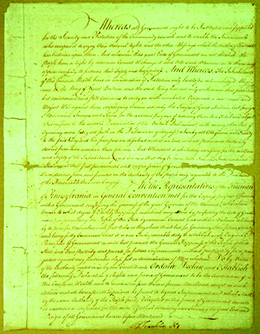
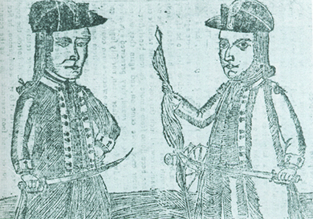

By the end of this section, you will be able to:
* Explain the development of state constitutions
* Describe the features of the Articles of Confederation
* Analyze the causes and consequences of Shays’ Rebellion

The task of creating republican governments in each of the former colonies, now independent states, presented a new opportunity for American revolutionaries to define themselves anew after casting off British control. On the state and national levels, citizens of the new United States debated who would hold the keys to political power. The states proved to be a laboratory for how much democracy, or majority rule, would be tolerated.

### THE STATE CONSTITUTIONS

In 1776, John Adams urged the thirteen independent colonies—soon to be states—to write their own state constitutions. Enlightenment political thought profoundly influenced Adams and other revolutionary leaders seeking to create viable republican governments. The ideas of the French philosopher **Montesquieu**{: data-type="term" .no-emphasis}, who had advocated the separation of powers in government, guided Adams’s thinking. Responding to a request for advice on proper government from North Carolina, Adams wrote *Thoughts on Government*, which influenced many state legislatures. Adams did not advocate democracy; rather, he wrote, “there is no good government but what is republican.” Fearing the potential for tyranny with only one group in power, he suggested a system of **checks and balances**{: data-type="term"} in which three separate branches of government—executive, legislative, and judicial—would maintain a balance of power. He also proposed that each state remain sovereign, as its own republic. The state constitutions of the new United States illustrate different approaches to addressing the question of how much democracy would prevail in the thirteen republics. Some states embraced democratic practices, while others adopted far more aristocratic and republican ones.

  
Visit the [Avalon Project][1] to read the constitutions of the seven states (Virginia, New Jersey, North Carolina, Maryland, Connecticut, Pennsylvania, and Delaware) that had written constitutions by the end of 1776.

The 1776 Pennsylvania constitution and the 1784 New Hampshire constitution both provide examples of democratic tendencies. In Pennsylvania, the requirement to own property in order to vote was eliminated, and if a man was twenty-one or older, had paid taxes, and had lived in the same location for one year, he could vote ([\[link\]](#CNX_History_07_03_Pennsylvan)). This opened voting to most free white male citizens of Pennsylvania. The 1784 New Hampshire constitution allowed every small town and village to send representatives to the state government, making the lower house of the legislature a model of democratic government.

 {: #CNX_History_07_03_Pennsylvan}

Conservative Whigs, who distrusted the idea of majority rule, recoiled from the abolition of property qualifications for voting and office holding in Pennsylvania. Conservative Whig John Adams reacted with horror to the 1776 Pennsylvania constitution, declaring that it was “so democratical that it must produce confusion and every evil work.” In his mind and those of other conservative Whigs, this constitution simply put too much power in the hands of men who had no business exercising the right to vote. Pennsylvania’s constitution also eliminated the executive branch (there was no governor) and the upper house. Instead, Pennsylvania had a one-house—a **unicameral**{: data-type="term"}—legislature.

The Maryland and South Carolina constitutions provide examples of efforts to limit the power of a democratic majority. Maryland’s, written in 1776, restricted office holding to the wealthy planter class. A man had to own at least £5,000 worth of personal property to be the governor of Maryland, and possess an estate worth £1,000 to be a state senator. This latter qualification excluded over 90 percent of the white males in Maryland from political office. The 1778 South Carolina constitution also sought to protect the interests of the wealthy. Governors and lieutenant governors of the state had to have “a settled plantation or freehold in their and each of their own right of the value of at least ten thousand pounds currency, clear of debt.” This provision limited high office in the state to its wealthiest inhabitants. Similarly, South Carolina state senators had to own estates valued at £2,000.

John Adams wrote much of the 1780 Massachusetts constitution, which reflected his fear of too much democracy. It therefore created two legislative chambers, an upper and lower house, and a strong governor with broad veto powers. Like South Carolina, Massachusetts put in place office-holding requirements: To be governor under the new constitution, a candidate had to own an estate worth at least £1,000. To serve in the state senate, a man had to own an estate worth at least £300 and have at least £600 in total wealth. To vote, he had to be worth at least sixty pounds. To further keep democracy in check, judges were appointed, not elected. One final limit was the establishment of the state capitol in the commercial center of Boston, which made it difficult for farmers from the western part of the state to attend legislative sessions.

### THE ARTICLES OF CONFEDERATION

Most revolutionaries pledged their greatest loyalty to their individual states. Recalling the experience of British reform efforts imposed in the 1760s and 1770s, they feared a strong national government and took some time to adopt the **Articles of Confederation**{: data-type="term" .no-emphasis}, the first national constitution. In June 1776, the Continental Congress prepared to announce independence and began to think about the creation of a new government to replace royal authority. Reaching agreement on the Articles of Confederation proved difficult as members of the Continental Congress argued over western land claims. Connecticut, for example, used its colonial charter to assert its claim to western lands in Pennsylvania and the Ohio Territory ([\[link\]](#CNX_History_07_03_CTWestern)).

 {: #CNX_History_07_03_CTWestern}

Members of the Continental Congress also debated what type of representation would be best and tried to figure out how to pay the expenses of the new government. In lieu of creating a new federal government, the Articles of Confederation created a “league of friendship” between the states. Congress readied the Articles in 1777 but did not officially approve them until 1781 ([\[link\]](#CNX_History_07_03_Articles)). The delay of four years illustrates the difficulty of getting the thirteen states to agree on a plan of national government. Citizens viewed their respective states as sovereign republics and guarded their prerogatives against other states.

 {: #CNX_History_07_03_Articles}

The Articles of Confederation authorized a unicameral legislature, a continuation of the earlier Continental Congress. The people could not vote directly for members of the national Congress; rather, state legislatures decided who would represent the state. In practice, the national Congress was composed of state delegations. There was no president or executive office of any kind, and there was no national judiciary (or Supreme Court) for the United States.

Passage of any law under the Articles of Confederation proved difficult. It took the consensus of nine states for any measure to pass, and amending the Articles required the consent of all the states, also extremely difficult to achieve. Further, any acts put forward by the Congress were non-binding; states had the option to enforce them or not. This meant that while the Congress had power over Indian affairs and foreign policy, individual states could choose whether or not to comply.

The Congress did not have the power to tax citizens of the United States, a fact that would soon have serious consequences for the republic. During the Revolutionary War, the Continental Congress had sent requisitions for funds to the individual former colonies (now revolutionary states). These states already had an enormous financial burden because they had to pay for militias as well as supply them. In the end, the states failed to provide even half the funding requested by the Congress during the war, which led to a national debt in the tens of millions by 1784.

By the 1780s, some members of the Congress were greatly concerned about the financial health of the republic, and they argued that the national government needed greater power, especially the power to tax. This required amending the Articles of Confederation with the consent of all the states. Those who called for a stronger federal government were known as nationalists. The nationalist group that pushed for the power to tax included Washington’s chief of staff, Alexander Hamilton; Virginia planter James Madison; Pennsylvania’s wealthy merchant Robert Morris (who served under the Confederation government as superintendent of finance in the early 1780s); and Pennsylvania lawyer James Wilson. Two New Yorkers, Gouverneur Morris and James Duane, also joined the effort to address the debt and the weakness of the Confederation government.

These men proposed a 5 percent tax on imports coming into the United States, a measure that would have yielded enough revenue to clear the debt. However, their proposal failed to achieve unanimous support from the states when Rhode Island rejected it. Plans for a national bank also failed to win unanimous support. The lack of support illustrates the Americans’ deep suspicion of a powerful national government, a suspicion that originated from the unilateral and heavy-handed reform efforts that the British Parliament imposed on the colonies in the 1760s and 1770s. Without revenue, the Congress could not pay back American creditors who had lent it money. However, it did manage to make interest payments to foreign creditors in France and the Dutch Republic, fearful that defaulting on those payments would destroy the republic’s credit and leave it unable to secure loans.

One soldier in the Continental Army, Joseph Plumb Martin, recounted how he received no pay in paper money after 1777 and only one month’s payment in specie, or hard currency, in 1781. Like thousands of other soldiers, Martin had fought valiantly against the British and helped secure independence, but had not been paid for his service. In the 1780s and beyond, men like Martin would soon express their profound dissatisfaction with their treatment. Their anger found expression in armed uprisings and political divisions.

Establishing workable foreign and commercial policies under the Articles of Confederation also proved difficult. Each state could decide for itself whether to comply with treaties between the Congress and foreign countries, and there were no means of enforcement. Both Great Britain and Spain understood the weakness of the Confederation Congress, and they refused to make commercial agreements with the United States because they doubted they would be enforced. Without stable commercial policies, American exporters found it difficult to do business, and British goods flooded U.S. markets in the 1780s, in a repetition of the economic imbalance that existed before the Revolutionary War.

The Confederation Congress under the Articles did achieve success through a series of directives called land ordinances, which established rules for the settlement of western lands in the public domain and the admission of new states to the republic. The ordinances were designed to prepare the land for sale to citizens and raise revenue to boost the failing economy of the republic. In the land ordinances, the Confederation Congress created the Mississippi and Southwest Territories and stipulated that slavery would be permitted there. The system of dividing the vast domains of the United States stands as a towering achievement of the era, a blueprint for American western expansion.

The Ordinance of 1784, written by Thomas Jefferson and the first of what were later called the Northwest Ordinances, directed that new states would be formed from a huge area of land below the Great Lakes, and these new states would have equal standing with the original states. The Ordinance of 1785 called for the division of this land into rectangular plots in order to prepare for the government sale of land. Surveyors would divide the land into townships of six square miles, and the townships would be subdivided into thirty-six plots of 640 acres each, which could be further subdivided. The price of an acre of land was set at a minimum of one dollar, and the land was to be sold at public auction under the direction of the Confederation.

The Ordinance of 1787 officially turned the land into an incorporated territory called the Northwest Territory and prohibited slavery north of the Ohio River ([\[link\]](#CNX_History_07_03_LandOrd)). The map of the 1787 Northwest Territory shows how the public domain was to be divided by the national government for sale. Townships of thirty-six square miles were to be surveyed. Each had land set aside for schools and other civic purposes. Smaller parcels could then be made: a 640-acre section could be divided into quarter-sections of 160 acres, and then again into sixteen sections of 40 acres. The geometric grid pattern established by the ordinance is still evident today on the American landscape. Indeed, much of the western United States, when viewed from an airplane, is composed of an orderly grid system.

 ![A map demonstrating the effects of the Northwest Ordinance is shown. A list of &#x201C;Key Points of the Northwest Ordinance of 1787&#x201D; lists the following points: Territory divided into 3&#x2013;5 states; Eligible for statehood with 60,000 settlers; Religious freedom, the right of trial by jury, free access to the major rivers of the region; Banned slavery north of the Ohio River; Township = six miles square; Six miles square = 36 plots; 1 plot = 640 acres (1 mile square); The Northwest Territory eventually became the states of Ohio, Indiana, Illinois, Michigan, and Wisconsin. A map of the Northwest Territory labels the states of Minnesota, Wisconsin, Illinois, Indiana, Ohio, and Michigan, as well as the Great Lakes, the Ohio River, and the Mississippi River. In Ohio, the grid for a 6-mile-by-6-mile township is shown with the 36 plots it comprises.](../resources/CNX_History_07_03_LandOrd.jpg "The Northwest Ordinance of 1787 created territories and an orderly method for the admission of new states."){: #CNX_History_07_03_LandOrd}

  
Visit [Window Seat][2] to explore aerial views of the grid system established by the Northwest Ordinance of 1787, which is still evident in much of the Midwest.

The land ordinances proved to be the great triumph of the Confederation Congress. The Congress would appoint a governor for the territories, and when the population in the territory reached five thousand free adult settlers, those citizens could create their own legislature and begin the process of moving toward statehood. When the population reached sixty thousand, the territory could become a new state.

### SHAYS’ REBELLION

Despite Congress’s victory in creating an orderly process for organizing new states and territories, land sales failed to produce the revenue necessary to deal with the dire economic problems facing the new country in the 1780s. Each state had issued large amounts of paper money and, in the aftermath of the Revolution, widespread internal devaluation of that currency occurred as many lost confidence in the value of state paper money and the Continental dollar. A period of extreme inflation set in. Added to this dilemma was American citizens’ lack of specie (gold and silver currency) to conduct routine business. Meanwhile, demobilized soldiers, many of whom had spent their formative years fighting rather than learning a peacetime trade, searched desperately for work.

The economic crisis came to a head in 1786 and 1787 in western Massachusetts, where farmers were in a difficult position: they faced high taxes and debts, which they found nearly impossible to pay with the worthless state and Continental paper money. For several years after the peace in 1783, these indebted citizens had petitioned the state legislature for redress. Many were veterans of the Revolutionary War who had returned to their farms and families after the fighting ended and now faced losing their homes.

Their petitions to the state legislature raised economic and political issues for citizens of the new state. How could people pay their debts and state taxes when paper money proved unstable? Why was the state government located in Boston, the center of the merchant elite? Why did the 1780 Massachusetts constitution cater to the interests of the wealthy? To the indebted farmers, the situation in the 1780s seemed hauntingly familiar; the revolutionaries had routed the British, but a new form of seemingly corrupt and self-serving government had replaced them.

In 1786, when the state legislature again refused to address the petitioners’ requests, Massachusetts citizens took up arms and closed courthouses across the state to prevent foreclosure (seizure of land in lieu of overdue loan payments) on farms in debt. The farmers wanted their debts forgiven, and they demanded that the 1780 constitution be revised to address citizens beyond the wealthy elite who could serve in the legislature.

Many of the rebels were veterans of the war for independence, including Captain Daniel Shays from Pelham ([\[link\]](#CNX_History_07_03_Shays)). Although Shays was only one of many former officers in the Continental Army who took part in the revolt, authorities in Boston singled him out as a ringleader, and the uprising became known as Shays’ Rebellion. The Massachusetts legislature responded to the closing of the courthouses with a flurry of legislation, much of it designed to punish the rebels. The government offered the rebels clemency if they took an oath of allegiance. Otherwise, local officials were empowered to use deadly force against them without fear of prosecution. Rebels would lose their property, and if any militiamen refused to defend the state, they would be executed.

 {: #CNX_History_07_03_Shays}

Despite these measures, the rebellion continued. To address the uprising, Governor James Bowdoin raised a private army of forty-four hundred men, funded by wealthy Boston merchants, without the approval of the legislature. The climax of Shays’ Rebellion came in January 1787, when the rebels attempted to seize the federal armory in Springfield, Massachusetts. A force loyal to the state defeated them there, although the rebellion continued into February.

Shays’ Rebellion resulted in eighteen deaths overall, but the uprising had lasting effects. To men of property, mostly conservative Whigs, Shays’ Rebellion strongly suggested the republic was falling into anarchy and chaos. The other twelve states had faced similar economic and political difficulties, and continuing problems seemed to indicate that on a national level, a democratic impulse was driving the population. Shays’ Rebellion convinced George Washington to come out of retirement and lead the convention called for by Alexander Hamilton to amend the Articles of Confederation in order to deal with insurgencies like the one in Massachusetts and provide greater stability in the United States.

### Section Summary

The late 1770s and 1780s witnessed one of the most creative political eras as each state drafted its own constitution. The Articles of Confederation, a weak national league among the states, reflected the dominant view that power should be located in the states and not in a national government. However, neither the state governments nor the Confederation government could solve the enormous economic problems resulting from the long and costly Revolutionary War. The economic crisis led to Shays’ Rebellion by residents of western Massachusetts, and to the decision to revise the Confederation government.

### Review Questions

Which of the following states had the most democratic constitution in the 1780s?

1.  Pennsylvania
2.  Massachusetts
3.  South Carolina
4.  Maryland
{: type="A"}

A

Under the Articles of Confederation, what power did the national Confederation Congress have?

1.  the power to tax
2.  the power to enforce foreign treaties
3.  the power to enforce commercial trade agreements
4.  the power to create land ordinances
{: type="A"}

D

What were the primary causes of Shays’ Rebellion?

A group of farmers in western Massachusetts, including Daniel Shays, rebelled against the Massachusetts government, which they saw as unresponsive to their needs. Many were veterans of the Revolutionary War and faced tremendous debts and high taxes, which they couldn’t pay with their worthless paper money. They felt that they didn’t have a voice in the Massachusetts government, which seemed to cater to wealthy Boston merchants. They wanted their debts to be forgiven and the Massachusetts constitution to be rewritten to address their needs, and when these demands weren’t met, they rebelled.

### Glossary
{: data-type="glossary-title"}

checks and balances
: the system that ensures a balance of power among the branches of government
^

unicameral
: having a single house (of legislative government)

[1]: http://openstaxcollege.org/l/statecons
[2]: http://openstaxcollege.org/l/thescream
