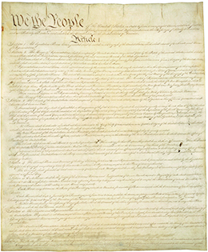

By the end of this section, you will be able to:
* Identify the central issues of the 1787 Constitutional Convention and their solutions
* Describe the conflicts over the ratification of the federal constitution

The economic problems that plagued the thirteen states of the Confederation set the stage for the creation of a strong central government under a federal constitution. Although the original purpose of the convention was to amend the Articles of Confederation, some—though not all—delegates moved quickly to create a new framework for a more powerful national government. This proved extremely controversial. Those who attended the convention split over the issue of robust, centralized government and questions of how Americans would be represented in the federal government. Those who opposed the proposal for a stronger federal government argued that such a plan betrayed the Revolution by limiting the voice of the American people.

# THE CONSTITUTIONAL CONVENTION

There had been earlier efforts to address the Confederation’s perilous state. In early 1786, Virginia’s James Madison advocated a meeting of states to address the widespread economic problems that plagued the new nation. Heeding Madison’s call, the legislature in Virginia invited all thirteen states to meet in Annapolis, Maryland, to work on solutions to the issue of commerce between the states. Eight states responded to the invitation. But the resulting 1786 Annapolis Convention failed to provide any solutions because only five states sent delegates. These delegates did, however, agree to a plan put forward by Alexander Hamilton for a second convention to meet in May 1787 in Philadelphia. Shays’ Rebellion gave greater urgency to the planned convention. In February 1787, in the wake of the uprising in western Massachusetts, the Confederation Congress authorized the Philadelphia convention. This time, all the states except Rhode Island sent delegates to Philadelphia to confront the problems of the day.

The stated purpose of the Philadelphia Convention in 1787 was to amend the Articles of Confederation. Very quickly, however, the attendees decided to create a new framework for a national government. That framework became the United States Constitution, and the Philadelphia convention became known as the Constitutional Convention of 1787. Fifty-five men met in Philadelphia in secret; historians know of the proceedings only because James Madison kept careful notes of what transpired. The delegates knew that what they were doing would be controversial; Rhode Island refused to send delegates, and New Hampshire’s delegates arrived late. Two delegates from New York, Robert Yates and John Lansing, left the convention when it became clear that the Articles were being put aside and a new plan of national government was being drafted. They did not believe the delegates had the authority to create a strong national government.

  
Read [“Reasons for Dissent from the Proposed Constitution”][1] in order to understand why Robert Yates and John Lansing, New York’s delegates to the 1787 Philadelphia Convention, didn’t believe the convention should draft a new plan of national government.

# THE QUESTION OF REPRESENTATION

One issue that the delegates in Philadelphia addressed was the way in which representatives to the new national government would be chosen. Would individual citizens be able to elect representatives? Would representatives be chosen by state legislatures? How much representation was appropriate for each state?

James Madison put forward a proposition known as the **Virginia Plan**{: data-type="term" .no-emphasis}, which called for a strong national government that could overturn state laws ([\[link\]](#CNX_History_07_04_Virgina)). The plan featured a **bicameral**{: data-type="term"} or two-house legislature, with an upper and a lower house. The people of the states would elect the members of the lower house, whose numbers would be determined by the population of the state. State legislatures would send delegates to the upper house. The number of representatives in the upper chamber would also be based on the state’s population. This **proportional representation**{: data-type="term"} gave the more populous states, like Virginia, more political power. The Virginia Plan also called for an executive branch and a judicial branch, both of which were absent under the Articles of Confederation. The lower and upper house together were to appoint members to the executive and judicial branches. Under this plan, Virginia, the most populous state, would dominate national political power and ensure its interests, including slavery, would be safe.

 {: #CNX_History_07_04_Virgina}

The Virginia Plan’s call for proportional representation alarmed the representatives of the smaller states. William Paterson introduced a **New Jersey Plan**{: data-type="term" .no-emphasis} to counter Madison’s scheme, proposing that all states have equal votes in a unicameral national legislature. He also addressed the economic problems of the day by calling for the Congress to have the power to regulate commerce, to raise revenue though taxes on imports and through postage, and to enforce Congressional requisitions from the states.

Roger Sherman from Connecticut offered a compromise to break the deadlock over the thorny question of representation. His **Connecticut Compromise**{: data-type="term"}, also known as the Great Compromise, outlined a different bicameral legislature in which the upper house, the Senate, would have equal representation for all states; each state would be represented by two senators chosen by the state legislatures. Only the lower house, the House of Representatives, would have proportional representation.

# THE QUESTION OF SLAVERY

The question of slavery stood as a major issue at the Constitutional Convention because slaveholders wanted slaves to be counted along with whites, termed “free inhabitants,” when determining a state’s total population. This, in turn, would augment the number of representatives accorded to those states in the lower house. Some northerners, however, such as New York’s Gouverneur Morris, hated slavery and did not even want the term included in the new national plan of government. Slaveholders argued that slavery imposed great burdens upon them and that, because they carried this liability, they deserved special consideration; slaves needed to be counted for purposes of representation.

The issue of counting or not counting slaves for purposes of representation connected directly to the question of taxation. Beginning in 1775, the Second Continental Congress asked states to pay for war by collecting taxes and sending the tax money to the Congress. The amount each state had to deliver in tax revenue was determined by a state’s total population, including both free and enslaved individuals. States routinely fell far short of delivering the money requested by Congress under the plan. In April 1783, the Confederation Congress amended the earlier system of requisition by having slaves count as three-fifths of the white population. In this way, slaveholders gained a significant tax break. The delegates in Philadelphia adopted this same three-fifths formula in the summer of 1787.

Under the **three-fifths compromise**{: data-type="term"} in the 1787 Constitution, each slave would be counted as three-fifths of a white person. Article 1, Section 2 stipulated that “Representatives and direct Taxes shall be apportioned among the several states . . . according to their respective Number, which shall be determined by adding to the whole number of free Persons, including those bound for service for a Term of Years \[white servants\], and excluding Indians not taxed, three fifths of all other persons.” Since representation in the House of Representatives was based on the population of a state, the three-fifths compromise gave extra political power to slave states, although not as much as if the total population, both free and slave, had been used. Significantly, no direct federal income tax was immediately imposed. (The Sixteenth Amendment, ratified in 1913, put in place a federal income tax.) Northerners agreed to the three-fifths compromise because the Northwest Ordinance of 1787, passed by the Confederation Congress, banned slavery in the future states of the northwest. Northern delegates felt this ban balanced political power between states with slaves and those without. The three-fifths compromise gave an advantage to slaveholders; they added three-fifths of their human property to their state’s population, allowing them to send representatives based in part on the number of slaves they held.

# THE QUESTION OF DEMOCRACY

Many of the delegates to the Constitutional Convention had serious reservations about democracy, which they believed promoted anarchy. To allay these fears, the Constitution blunted democratic tendencies that appeared to undermine the republic. Thus, to avoid giving the people too much direct power, the delegates made certain that senators were chosen by the state legislatures, not elected directly by the people (direct elections of senators came with the Seventeenth Amendment to the Constitution, ratified in 1913). As an additional safeguard, the delegates created the **Electoral College**{: data-type="term"}, the mechanism for choosing the president. Under this plan, each state has a certain number of electors, which is its number of senators (two) plus its number of representatives in the House of Representatives. Critics, then as now, argue that this process prevents the direct election of the president.

# THE FIGHT OVER RATIFICATION

The draft constitution was finished in September 1787. The delegates decided that in order for the new national government to be implemented, each state must first hold a special ratifying convention. When nine of the thirteen had approved the plan, the constitution would go into effect.

When the American public learned of the new constitution, opinions were deeply divided, but most people were opposed. To salvage their work in Philadelphia, the architects of the new national government began a campaign to sway public opinion in favor of their blueprint for a strong central government. In the fierce debate that erupted, the two sides articulated contrasting visions of the American republic and of democracy. Supporters of the 1787 Constitution, known as **Federalists**{: data-type="term"}, made the case that a centralized republic provided the best solution for the future. Those who opposed it, known as **Anti-Federalists**{: data-type="term"}, argued that the Constitution would consolidate all power in a national government, robbing the states of the power to make their own decisions. To them, the Constitution appeared to mimic the old corrupt and centralized British regime, under which a far-off government made the laws. Anti-Federalists argued that wealthy aristocrats would run the new national government, and that the elite would not represent ordinary citizens; the rich would monopolize power and use the new government to formulate policies that benefited their class—a development that would also undermine local state elites. They also argued that the Constitution did not contain a bill of rights.

New York’s ratifying convention illustrates the divide between the Federalists and Anti-Federalists. When one Anti-Federalist delegate named Melancton Smith took issue with the scheme of representation as being too limited and not reflective of the people, Alexander Hamilton responded:

\> It has been observed by an honorable gentleman \[Smith\], that a pure democracy, if it were practicable, would be the most perfect government. Experience has proven, that no position in politics is more false than this. The ancient democracies, in which the people themselves deliberated, never possessed one feature of good government. Their very character was tyranny; their figure deformity: When they assembled, the field of debate presented an ungovernable mob, not only incapable of deliberation, but prepared for every enormity. In these assemblies, the enemies of the people brought forward their plans of ambition systematically. They were opposed by their enemies of another party; and it became a matter of contingency, whether the people subjected themselves to be led blindly by one tyrant or by another.

The Federalists, particularly John Jay, Alexander Hamilton, and James Madison, put their case to the public in a famous series of essays known as *The Federalist Papers*. These were first published in New York and subsequently republished elsewhere in the United States.

James Madison on the Benefits of Republicanism

The tenth essay in *The Federalist Papers*, often called Federalist No. 10, is one of the most famous. Written by James Madison ([\[link\]](#CNX_History_07_04_Madison)), it addresses the problems of political parties (“factions”). Madison argued that there were two approaches to solving the problem of political parties: a republican government and a democracy. He argued that a large republic provided the best defense against what he viewed as the tumult of direct democracy. Compromises would be reached in a large republic and citizens would be represented by representatives of their own choosing.

{: #CNX_History_07_04_Madison}

\> From this view of the subject, it may be concluded, that a pure Democracy, by which I mean a Society consisting of a small number of citizens, who assemble and administer the Government in person, can admit of no cure for the mischiefs of faction. A common passion or interest will, in almost every case, be felt by a majority of the whole; a communication and concert result from the form of Government itself; and there is nothing to check the inducements to sacrifice the weaker party, or an obnoxious individual. Hence it is, that such Democracies have ever been spectacles of turbulence and contention; have ever been found incompatible with personal security, or the rights of property; and have in general been as short in their lives, as they have been violent in their deaths. Theoretic politicians, who have patronized this species of Government, have erroneously supposed, that by reducing mankind to a perfect equality in their political rights, they would, at the same time, be perfectly equalized and assimilated in their possessions, their opinions, and their passions.
> * * *
> {: data-type="newline"}
> 
> A Republic, by which I mean a Government in which the scheme of representation takes place, opens a different prospect, and promises the cure for which we are seeking. Let us examine the points in which it varies from pure Democracy, and we shall comprehend both the nature of the cure, and the efficacy which it must derive from the Union.
> * * *
> {: data-type="newline"}
> 
> The two great points of difference, between a Democracy and a Republic, are, first, the delegation of the Government, in the latter, to a small number of citizens elected by the rest: Secondly, the greater number of citizens, and greater sphere of country, over which the latter may be extended.

Does Madison recommend republicanism or democracy as the best form of government? What arguments does he use to prove his point?

  
Read the full text of [Federalist No. 10][2] on Wikisource. What do you think are Madison’s most and least compelling arguments? How would different members of the new United States view his arguments?

Including all the state ratifying conventions around the country, a total of fewer than two thousand men voted on whether to adopt the new plan of government. In the end, the Constitution only narrowly won approval ([\[link\]](#CNX_History_07_04_Constitut)). In New York, the vote was thirty in favor to twenty-seven opposed. In Massachusetts, the vote to approve was 187 to 168, and some claim supporters of the Constitution resorted to bribes in order to ensure approval. Virginia ratified by a vote of eighty-nine to seventy-nine, and Rhode Island by thirty-four to thirty-two. The opposition to the Constitution reflected the fears that a new national government, much like the British monarchy, created too much centralized power and, as a result, deprived citizens in the various states of the ability to make their own decisions.

 {: #CNX_History_07_04_Constitut}

# Section Summary

The economic crisis of the 1780s, shortcomings of the Articles of Confederation, and outbreak of Shays’ Rebellion spurred delegates from twelve of the thirteen states to gather for the Constitutional Convention of 1787. Although the stated purpose of the convention was to modify the Articles of Confederation, their mission shifted to the building of a new, strong federal government. Federalists like James Madison and Alexander Hamilton led the charge for a new United States Constitution, the document that endures as the oldest written constitution in the world, a testament to the work done in 1787 by the delegates in Philadelphia.

# Review Questions

Which plan resolved the issue of representation for the U.S. Constitution? 

the Rhode Island Agreement

the New Jersey Plan

the Connecticut Compromise

the Virginia Plan

C

How was the U.S. Constitution ratified? 

by each state at special ratifying conventions

at the Constitutional Convention of 1787

at the Confederation Convention

by popular referendum in each state

A

Explain the argument that led to the three-fifths rule and the consequences of that rule.

Southern slaveholders wanted slaves to count for the purposes of representation, while people from northern states feared that counting slaves would give the southern states too much power. Their fears were valid; the three-fifths rule, which stated that each slave counted as three-fifths of a white person for purposes of representation, gave the southern states the balance of political power.

# Critical Thinking Questions

Describe the state constitutions that were more democratic and those that were less so. What effect would these different constitutions have upon those states? Who could participate in government, whether by voting or by holding public office? Whose interests were represented, and whose were compromised?

In what ways does the United States Constitution manifest the principles of both republican and democratic forms of government? In what ways does it deviate from those principles?

In this chapter’s discussion of New York’s ratifying convention, Alexander Hamilton takes issue with Anti-Federalist delegate Melancton Smith’s assertion that (as Hamilton says) “a pure democracy, if it were practicable, would be the most perfect government.” What did Smith—and Hamilton—mean by “a pure democracy”? How does this compare to the type of democracy that represents the modern United States?

Describe popular attitudes toward African Americans, women, and Indians in the wake of the Revolution. In what ways did the established social and political order depend upon keeping members of these groups in their circumscribed roles? If those roles were to change, how would American society and politics have had to adjust?

How did the process of creating and ratifying the Constitution, and the language of the Constitution itself, confirm the positions of African Americans, women, and Indians in the new republic? How did these roles compare to the stated goals of the republic?

What were the circumstances that led to Shays’ Rebellion? What was the government’s response? Would this response have confirmed or negated the grievances of the participants in the uprising? Why?

## Glossary
{: data-type="glossary-title"}

Anti-Federalists
: those who opposed the 1787 Constitution and favored stronger individual states
{: .definition}

bicameral
: having two legislative houses, an upper and a lower house
{: .definition}

Connecticut Compromise
: also known as the Great Compromise, Roger Sherman’s proposal at the Constitutional Convention for a bicameral legislature, with the upper house having equal representation for all states and the lower house having proportional representation
{: .definition}

Electoral College
: the mechanism by which electors, based on the number of representatives from each state, choose the president
{: .definition}

Federalists
: those who supported the 1787 Constitution and a strong central government; these advocates of the new national government formed the ruling political party in the 1790s
{: .definition}

proportional representation
: representation that gives more populous states greater political power by allowing them more representatives
{: .definition}

three-fifths compromise
: the agreement at the Constitutional Convention that each slave would count as three-fifths of a white person for purposes of representation
{: .definition}

[1]: http://openstaxcollege.org/l/YatesLansing
[2]: http://openstaxcollege.org/l/federalist10
