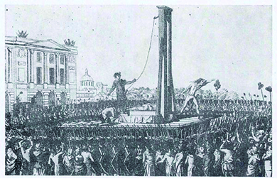
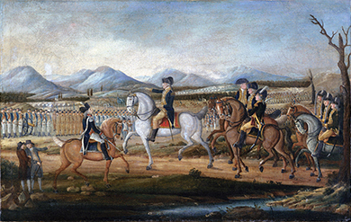

By the end of this section, you will be able to:
* Identify the major foreign and domestic uprisings of the early 1790s
* Explain the effect of these uprisings on the political system of the United States

The colonies’ alliance with France, secured after the victory at Saratoga in 1777, proved crucial in their victory against the British, and during the 1780s France and the new United States enjoyed a special relationship. Together they had defeated their common enemy, Great Britain. But despite this shared experience, American opinions regarding France diverged sharply in the 1790s when France underwent its own revolution. Democratic-Republicans seized on the French revolutionaries’ struggle against monarchy as the welcome harbinger of a larger republican movement around the world. To the Federalists, however, the French Revolution represented pure anarchy, especially after the execution of the French king in 1793. Along with other foreign and domestic uprisings, the French Revolution helped harden the political divide in the United States in the early 1790s.

# THE FRENCH REVOLUTION

The French Revolution, which began in 1789, further split American thinkers into different ideological camps, deepening the political divide between Federalists and their Democratic-Republican foes. At first, in 1789 and 1790, the revolution in France appeared to most in the United States as part of a new chapter in the rejection of corrupt monarchy, a trend inspired by the American Revolution. A constitutional monarchy replaced the absolute monarchy of Louis XVI in 1791, and in 1792, France was declared a republic. Republican liberty, the creed of the United States, seemed to be ushering in a new era in France. Indeed, the American Revolution served as an inspiration for French revolutionaries.

The events of 1793 and 1794 challenged the simple interpretation of the French Revolution as a happy chapter in the unfolding triumph of republican government over monarchy. The French king was executed in January 1793 ([\[link\]](#Figure_08_02_Decapitat)), and the next two years became known as **the Terror**{: data-type="term"}, a period of extreme violence against perceived enemies of the revolutionary government. Revolutionaries advocated direct representative democracy, dismantled Catholicism, replaced that religion with a new philosophy known as the Cult of the Supreme Being, renamed the months of the year, and relentlessly employed the guillotine against their enemies. Federalists viewed these excesses with growing alarm, fearing that the radicalism of the French Revolution might infect the minds of citizens at home. Democratic-Republicans interpreted the same events with greater optimism, seeing them as a necessary evil of eliminating the monarchy and aristocratic culture that supported the privileges of a hereditary class of rulers.

 {: #Figure_08_02_Decapitat}

The controversy in the United States intensified when France declared war on Great Britain and Holland in February 1793. France requested that the United States make a large repayment of the money it had borrowed from France to fund the Revolutionary War. However, Great Britain would judge any aid given to France as a hostile act. Washington declared the United States neutral in 1793, but Democratic-Republican groups denounced neutrality and declared their support of the French republicans. The Federalists used the violence of the French revolutionaries as a reason to attack Democratic-Republicanism in the United States, arguing that Jefferson and Madison would lead the country down a similarly disastrous path.

  
Visit [Liberty, Equality, Fraternity][1] for images, texts, and songs relating to the French Revolution. This momentous event’s impact extended far beyond Europe, influencing politics in the United States and elsewhere in the Atlantic World.

# THE CITIZEN GENÊT AFFAIR AND JAY’S TREATY

In 1793, the revolutionary French government sent Edmond-Charles Genêt to the United States to negotiate an alliance with the U.S. government. France empowered Genêt to issue **letters of marque**{: data-type="term"}—documents authorizing ships and their crews to engage in piracy—to allow him to arm captured British ships in American ports with U.S. soldiers. Genêt arrived in Charleston, South Carolina, amid great Democratic-Republican fanfare. He immediately began commissioning American privateer ships and organizing volunteer American militias to attack Spanish holdings in the Americas, then traveled to Philadelphia, gathering support for the French cause along the way. President Washington and Hamilton denounced Genêt, knowing his actions threatened to pull the United States into a war with Great Britain. The **Citizen Genêt affair**{: data-type="term"}, as it became known, spurred Great Britain to instruct its naval commanders in the West Indies to seize all ships trading with the French. The British captured hundreds of American ships and their cargoes, increasing the possibility of war between the two countries.

In this tense situation, Great Britain worked to prevent a wider conflict by ending its seizure of American ships and offered to pay for captured cargoes. Hamilton saw an opportunity and recommended to Washington that the United States negotiate. Supreme Court Justice John Jay was sent to Britain, instructed by Hamilton to secure compensation for captured American ships; ensure the British leave the Northwest outposts they still occupied despite the 1783 Treaty of Paris; and gain an agreement for American trade in the West Indies. Even though Jay personally disliked slavery, his mission also required him to seek compensation from the British for slaves who left with the British at the end of the Revolutionary War.

The resulting 1794 agreement, known as Jay’s Treaty, fulfilled most of his original goals. The British would turn over the frontier posts in the Northwest, American ships would be allowed to trade freely in the West Indies, and the United States agreed to assemble a commission charged with settling colonial debts U.S. citizens owed British merchants. The treaty did not address the important issue of **impressment**{: data-type="term"}, however—the British navy’s practice of forcing or “impressing” American sailors to work and fight on British warships. Jay’s Treaty led the Spanish, who worried that it signaled an alliance between the United States and Great Britain, to negotiate a treaty of their own—Pinckney’s Treaty—that allowed American commerce to flow through the Spanish port of New Orleans. Pinckney’s Treaty allowed American farmers, who were moving in greater numbers to the Ohio River Valley, to ship their products down the Ohio and Mississippi Rivers to New Orleans, where they could be transported to East Coast markets.

Jay’s Treaty confirmed the fears of Democratic-Republicans, who saw it as a betrayal of republican France, cementing the idea that the Federalists favored aristocracy and monarchy. Partisan American newspapers tried to sway public opinion, while the skillful writing of Hamilton, who published a number of essays on the subject, explained the benefits of commerce with Great Britain.

# THE FRENCH REVOLUTION’S CARIBBEAN LEGACY

Unlike the American Revolution, which ultimately strengthened the institution of slavery and the powers of American slaveholders, the French Revolution inspired slave rebellions in the Caribbean, including a 1791 slave uprising in the French colony of Saint-Domingue (modern-day Haiti). Thousands of slaves joined together to overthrow the brutal system of slavery. They took control of a large section of the island, burning sugar plantations and killing the white planters who had forced them to labor under the lash.

In 1794, French revolutionaries abolished slavery in the French empire, and both Spain and England attacked Saint-Domingue, hoping to add the colony to their own empires. Toussaint L’Ouverture, a former domestic slave, emerged as the leader in the fight against Spain and England to secure a Haiti free of slavery and further European colonialism. Because revolutionary France had abolished slavery, Toussaint aligned himself with France, hoping to keep Spain and England at bay ([\[link\]](#Figure_08_02_Louverture)).

 , mounted and armed in an elaborate uniform."){: #Figure_08_02_Louverture}

Events in Haiti further complicated the partisan wrangling in the United States. White refugee planters from Haiti and other French West Indian islands, along with slaves and free people of color, left the Caribbean for the United States and for Louisiana, which at the time was held by Spain. The presence of these French migrants raised fears, especially among Federalists, that they would bring the contagion of French radicalism to the United States. In addition, the idea that the French Revolution could inspire a successful slave uprising just off the American coastline filled southern whites and slaveholders with horror.

# THE WHISKEY REBELLION

While the wars in France and the Caribbean divided American citizens, a major domestic test of the new national government came in 1794 over the issue of a tax on whiskey, an important part of Hamilton’s financial program. In 1791, Congress had authorized a tax of 7.5 cents per gallon of whiskey and rum. Although most citizens paid without incident, trouble erupted in four western Pennsylvania counties in an uprising known as the Whiskey Rebellion.

Farmers in the western counties of Pennsylvania produced whiskey from their grain for economic reasons. Without adequate roads or other means to transport a bulky grain harvest, these farmers distilled their grains into gin and whiskey, which were more cost-effective to transport. Since these farmers depended on the sale of whiskey, some citizens in western Pennsylvania (and elsewhere) viewed the new tax as further proof that the new national government favored the commercial classes on the eastern seaboard at the expense of farmers in the West. On the other hand, supporters of the tax argued that it helped stabilize the economy and its cost could easily be passed on to the consumer, not the farmer-distiller. However, in the spring and summer months of 1794, angry citizens rebelled against the federal officials in charge of enforcing the federal excise law. Like the Sons of Liberty before the American Revolution, the whiskey rebels used violence and intimidation to protest policies they saw as unfair. They tarred and feathered federal officials, intercepted the federal mail, and intimidated wealthy citizens. The extent of their discontent found expression in their plan to form an independent western commonwealth, and they even began negotiations with British and Spanish representatives, hoping to secure their support for independence from the United States. The rebels also contacted their backcountry neighbors in Kentucky and South Carolina, circulating the idea of secession.

With their emphasis on personal freedoms, the whiskey rebels aligned themselves with the Democratic-Republican Party. They saw the tax as part of a larger Federalist plot to destroy their republican liberty and, in its most extreme interpretation, turn the United States into a monarchy. The federal government lowered the tax, but when federal officials tried to subpoena those distillers who remained intractable, trouble escalated. Washington responded by creating a thirteen-thousand-man militia, drawn from several states, to put down the rebellion ([\[link\]](#Figure_08_02_Whiskey)). This force made it known, both domestically and to the European powers that looked on in anticipation of the new republic’s collapse, that the national government would do everything in its power to ensure the survival of the United States.

 {: #Figure_08_02_Whiskey}

Alexander Hamilton: “Shall the majority govern or be governed?”

Alexander Hamilton frequently wrote persuasive essays under pseudonyms, like “Tully,” as he does here. In this 1794 essay, Hamilton denounces the whiskey rebels and majority rule.

\> It has been observed that the means most likely to be employed to turn the insurrection in the western country to the detriment of the government, would be artfully calculated among other things ‘to divert your attention from the true question to be decided.’
> * * *
> {: data-type="newline"}
> 
> Let us see then what is this question. It is plainly this—shall the majority govern or be governed? shall the nation rule, or be ruled? shall the general will prevail, or the will of a faction? shall there be government, or no government? . . .
> * * *
> {: data-type="newline"}
> 
> The Constitution *you* have ordained for yourselves and your posterity contains this express clause, ‘The Congress *shall have power* to lay and collect taxes, duties, imposts, and *Excises*, to pay the debts, and provide for the common defence and general welfare of the United States.’ You have then, by a solemn and deliberate act, the most important and sacred that a nation can perform, pronounced and decreed, that your Representatives in Congress shall have power to lay Excises. You have done nothing since to reverse or impair that decree. . . .
> * * *
> {: data-type="newline"}
> 
> But the four western counties of Pennsylvania, undertake to rejudge and reverse your decrees, you have said, ‘The Congress *shall have power* to lay *Excises*.’ They say, ‘The Congress *shall not have* this power.’ . . .
> * * *
> {: data-type="newline"}
> 
> There is no road to *despotism* more sure or more to be dreaded than that which begins at *anarchy*.”
> * * *
> {: data-type="newline"}
> 
> —Alexander Hamilton’s “Tully No. II” for the *American Daily Advertiser*, Philadelphia, August 26, 1794

What are the major arguments put forward by Hamilton in this document? Who do you think his audience is?

# WASHINGTON’S INDIAN POLICY

Relationships with Indians were a significant problem for Washington’s administration, but one on which white citizens agreed: Indians stood in the way of white settlement and, as the 1790 Naturalization Act made clear, were not citizens. After the War of Independence, white settlers poured into lands west of the Appalachian Mountains. As a result, from 1785 to 1795, a state of war existed on the frontier between these settlers and the Indians who lived in the Ohio territory. In both 1790 and 1791, the Shawnee and Miami had defended their lands against the whites who arrived in greater and greater numbers from the East. In response, Washington appointed General Anthony Wayne to bring the Western Confederacy—a loose alliance of tribes—to heel. In 1794, at the Battle of Fallen Timbers, Wayne was victorious. With the 1795 Treaty of Greenville ([\[link\]](#Figure_08_02_Greenville)), the Western Confederacy gave up their claims to Ohio.

 {: #Figure_08_02_Greenville}

# Section Summary

Federalists and Democratic-Republicans interpreted the execution of the French monarch and the violent establishment of a French republic in very different ways. Revolutionaries’ excesses in France and the slaves’ revolt in the French colony of Haiti raised fears among Federalists of similar radicalism and slave uprisings on American shores. They looked to better relationships with Great Britain through Jay’s Treaty. Pinckney’s Treaty, which came about as a result of Jay’s Treaty, improved U.S. relations with the Spanish and opened the Spanish port of New Orleans to American commerce. Democratic-Republicans took a more positive view of the French Revolution and grew suspicious of the Federalists when they brokered Jay’s Treaty. Domestically, the partisan divide came to a dramatic head in western Pennsylvania when distillers of whiskey, many aligned with the Democratic-Republicans, took action against the federal tax on their product. Washington led a massive force to put down the uprising, demonstrating Federalist intolerance of mob action. Though divided on many issues, the majority of white citizens agreed on the necessity of eradicating the Indian presence on the frontier.

# Review Questions

Which of the following was *not* true of Jay’s Treaty of 1794?

1.  It gave the United States land rights in the West Indies.
2.  It gave American ships the right to trade in the West Indies.
3.  It hardened differences between the political parties of the United States.
4.  It stipulated that U.S. citizens would repay their debts from the Revolutionary War.
{: data-number-style="upper-alpha"}

A

What was the primary complaint of the rebels in the Whiskey Rebellion?

1.  the ban on alcohol
2.  the lack of political representation for farmers
3.  the need to fight Indians for more land
4.  the tax on whiskey and rum
{: data-number-style="upper-alpha"}

D

How did the French Revolution in the early 1790s influence the evolution of the American political system?

In the United States, the French Revolution hardened differences between the Federalists and the Democratic-Republicans. The Federalists feared the anarchy of the French Revolution and worried that Democratic-Republicanism would bring that kind of disorder to the United States. The Democratic-Republicans supported the goals of the French Revolution, even if they didn’t support the means, and believed that siding with Great Britain instead of France meant a return to a system of monarchy.

## Glossary
{: data-type="glossary-title"}

Citizen Genêt affair
: the controversy over the French representative who tried to involve the United States in France’s war against Great Britain
{: .definition}

impressment
: the practice of capturing sailors and forcing them into military service
{: .definition}

letters of marque
: French warrants allowing ships and their crews to engage in piracy
{: .definition}

the Terror
: a period during the French Revolution characterized by extreme violence and the execution of numerous enemies of the revolutionary government, from 1793 through 1794
{: .definition}

[1]: http://openstaxcollege.org/l/revolution
