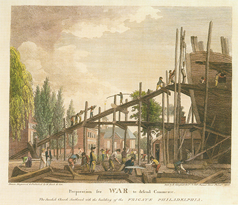
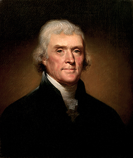

By the end of this section, you will be able to:
* Identify key examples of partisan wrangling between the Federalists and Democratic-Republicans
* Describe how foreign relations affected American politics
* Assess the importance of the Louisiana Purchase

George Washington, who had been reelected in 1792 by an overwhelming majority, refused to run for a third term, thus setting a precedent for future presidents. In the presidential election of 1796, the two parties—Federalist and Democratic-Republican—competed for the first time. Partisan rancor over the French Revolution and the Whiskey Rebellion fueled the divide between them, and Federalist John Adams defeated his Democratic-Republican rival Thomas Jefferson by a narrow margin of only three electoral votes. In 1800, another close election swung the other way, and Jefferson began a long period of Democratic-Republican government.

### THE PRESIDENCY OF JOHN ADAMS

The war between Great Britain and France in the 1790s shaped U.S. foreign policy. As a new and, in comparison to the European powers, extremely weak nation, the American republic had no control over European events, and no real leverage to obtain its goals of trading freely in the Atlantic. To Federalist president John Adams, relations with France posed the biggest problem. After the Terror, the French Directory ruled France from 1795 to 1799. During this time, Napoleon rose to power.

The Art of Ralph Earl

Ralph Earl was an eighteenth-century American artist, born in Massachusetts, who remained loyal to the British during the Revolutionary War. He fled to England in 1778, but he returned to New England in the mid-1780s and began painting portraits of leading Federalists.

His portrait of Connecticut Federalist Oliver Ellsworth and his wife Abigail conveys the world as Federalists liked to view it: an orderly landscape administered by men of property and learning. His portrait of dry goods merchant Elijah Boardman shows Boardman as well-to-do and highly cultivated; his books include the works of Shakespeare and Milton ([\[link\]](#Figure_08_03_OliveBoard)).

 and the 1789 portrait of Elijah Boardman (b)."){: #Figure_08_03_OliveBoard}

What similarities do you see in the two portraits by Ralph Earl? What do the details of each portrait reveal about the sitters? About the artist and the 1790s?

Because France and Great Britain were at war, the French Directory issued decrees stating that any ship carrying British goods could be seized on the high seas. In practice, this meant the French would target American ships, especially those in the West Indies, where the United States conducted a brisk trade with the British. France declared its 1778 treaty with the United States null and void, and as a result, France and the United States waged an undeclared war—or what historians refer to as the Quasi-War—from 1796 to 1800. Between 1797 and 1799, the French seized 834 American ships, and Adams urged the buildup of the U.S. Navy, which consisted of only a single vessel at the time of his election in 1796 ([\[link\]](#Figure_08_03_PrepWar)).

 {: #Figure_08_03_PrepWar}

In 1797, Adams sought a diplomatic solution to the conflict with France and dispatched envoys to negotiate terms. The French foreign minister, Charles-Maurice de Talleyrand, sent emissaries who told the American envoys that the United States must repay all outstanding debts owed to France, lend France 32 million guilders (Dutch currency), and pay a £50,000 bribe before any negotiations could take place. News of the attempt to extract a bribe, known as the **XYZ affair**{: data-type="term"} because the French emissaries were referred to as X, Y, and Z in letters that President Adams released to Congress, outraged the American public and turned public opinion decidedly against France ([\[link\]](#Figure_08_03_XYZ)). In the court of public opinion, Federalists appeared to have been correct in their interpretation of France, while the pro-French Democratic-Republicans had been misled.

 ![A cartoon, titled Property Protected &#xE1; la Fran&#xE7;oise, satirizes the XYZ affair. Five Frenchmen are shown plundering the treasures of a woman representing the United States. One man holds a sword labeled &#x201C;French Argument&#x201D; and a sack of gold and riches labeled &#x201C;National Sack and Diplomatic Perquisites,&#x201D; while the others collect her valuables. A group of other Europeans look on and commiserate that France treated them the same way; one says, &#x201C;aye they left me nothing but my prayer book and Crown, and striped that of its jewels.&#x201D;](../resources/CNX_History_08_03_XYZ.jpg "This anonymous 1798 cartoon, Property Protected &#xE0; la Fran&#xE7;oise, satirizes the XYZ affair. Five Frenchmen are shown plundering the treasures of a woman representing the United States. One man holds a sword labeled &#x201C;French Argument&#x201D; and a sack of gold and riches labeled &#x201C;National Sack and Diplomatic Perquisites,&#x201D; while the others collect her valuables. A group of other Europeans look on and commiserate that France treated them the same way."){: #Figure_08_03_XYZ}

  
Read the “transcript” of the above cartoon in the [America in Caricature, 1765–1865][1] collection at Indiana University’s Lilly Library.

The complicated situation in Haiti, which remained a French colony in the late 1790s, also came to the attention of President Adams. The president, with the support of Congress, had created a U.S. Navy that now included scores of vessels. Most of the American ships cruised the Caribbean, giving the United States the edge over France in the region. In Haiti, the rebellion leader Toussaint, who had to contend with various domestic rivals seeking to displace him, looked to end an U.S. embargo on France and its colonies, put in place in 1798, so that his forces would receive help to deal with the civil unrest. In early 1799, in order to capitalize upon trade in the lucrative West Indies and undermine France’s hold on the island, Congress ended the ban on trade with Haiti—a move that acknowledged Toussaint’s leadership, to the horror of American slaveholders. Toussaint was able to secure an independent black republic in Haiti by 1804.

### THE ALIEN AND SEDITION ACTS

The surge of animosity against France during the Quasi-War led Congress to pass several measures that in time undermined Federalist power. These 1798 war measures, known as the Alien and Sedition Acts, aimed to increase national security against what most had come to regard as the French menace. The Alien Act and the Alien Enemies Act took particular aim at French immigrants fleeing the West Indies by giving the president the power to deport new arrivals who appeared to be a threat to national security. The act expired in 1800 with no immigrants having been deported. The Sedition Act imposed harsh penalties—up to five years’ imprisonment and a massive fine of $5,000 in 1790 dollars—on those convicted of speaking or writing “in a scandalous or malicious” manner against the government of the United States. Twenty-five men, all Democratic-Republicans, were indicted under the act, and ten were convicted. One of these was Congressman Matthew Lyon ([\[link\]](#Figure_08_03_Brawl)), representative from Vermont, who had launched his own newspaper, *The Scourge Of Aristocracy and Repository of Important Political Truth*.

 ![A cartoon, titled &#x201C;Congressional Pugilists,&#x201D; shows Matthew Lyon, a Democratic-Republican representative from Vermont, fighting his opponent, Federalist Roger Griswold, in Congress Hall. A group of congressmen watch as Griswold, armed with a cane, kicks Lyon, who is armed with a massive pair of fireplace tongs and grabs Griswold&#x2019;s arm. Below the scene are the words: &#x201C;He in a trice struck Lyon thrice / Upon his head, enrag&#x2019;d sir, / Who seiz&#x2019;d the tongs to ease his wrongs, / And Griswold thus engag&#x2019;d, sir.&#x201D;](../resources/CNX_History_08_03_Brawl.jpg "This 1798 cartoon, &#x201C;Congressional Pugilists,&#x201D; shows partisan chaos in the U.S. House of Representatives as Matthew Lyon, a Democratic-Republican from Vermont, holds forth against his opponent, Federalist Roger Griswold."){: #Figure_08_03_Brawl}

The Alien and Sedition Acts raised constitutional questions about the freedom of the press provided under the First Amendment. Democratic-Republicans argued that the acts were evidence of the Federalists’ intent to squash individual liberties and, by enlarging the powers of the national government, crush states’ rights. Jefferson and Madison mobilized the response to the acts in the form of statements known as the Virginia and Kentucky Resolutions, which argued that the acts were illegal and unconstitutional. The resolutions introduced the idea of nullification, the right of states to nullify acts of Congress, and advanced the argument of states’ rights. The resolutions failed to rally support in other states, however. Indeed, most other states rejected them, citing the necessity of a strong national government.

The Quasi-War with France came to an end in 1800, when President Adams was able to secure the Treaty of Mortefontaine. His willingness to open talks with France divided the Federalist Party, but the treaty reopened trade between the two countries and ended the French practice of taking American ships on the high seas.

### THE REVOLUTION OF 1800 AND THE PRESIDENCY OF THOMAS JEFFERSON

The **Revolution of 1800**{: data-type="term"} refers to the first transfer of power from one party to another in American history, when the presidency passed to Democratic-Republican Thomas Jefferson ([\[link\]](#Figure_08_03_Jefferson)) in the 1800 election. The peaceful transition calmed contemporary fears about possible violent reactions to a new party’s taking the reins of government. The passing of political power from one political party to another without bloodshed also set an important precedent.

 {: #Figure_08_03_Jefferson}

The election did prove even more divisive than the 1796 election, however, as both the Federalist and Democratic-Republican Parties waged a mudslinging campaign unlike any seen before. Because the Federalists were badly divided, the Democratic-Republicans gained political ground. Alexander Hamilton, who disagreed with President Adams’s approach to France, wrote a lengthy letter, meant for people within his party, attacking his fellow Federalist’s character and judgment and ridiculing his handling of foreign affairs. Democratic-Republicans got hold of and happily reprinted the letter.

Jefferson viewed participatory democracy as a positive force for the republic, a direct departure from Federalist views. His version of participatory democracy only extended, however, to the white yeoman farmers in whom Jefferson placed great trust. While Federalist statesmen, like the architects of the 1787 federal constitution, feared a pure democracy, Jefferson was far more optimistic that the common American farmer could be trusted to make good decisions. He believed in majority rule, that is, that the majority of yeoman should have the power to make decisions binding upon the whole. Jefferson had cheered the French Revolution, even when the French republic instituted the Terror to ensure the monarchy would not return. By 1799, however, he had rejected the cause of France because of his opposition to Napoleon’s seizure of power and creation of a dictatorship.

Over the course of his two terms as president—he was reelected in 1804—Jefferson reversed the policies of the Federalist Party by turning away from urban commercial development. Instead, he promoted agriculture through the sale of western public lands in small and affordable lots. Perhaps Jefferson’s most lasting legacy is his vision of an “empire of liberty.” He distrusted cities and instead envisioned a rural republic of land-owning white men, or yeoman republican farmers. He wanted the United States to be the breadbasket of the world, exporting its agricultural commodities without suffering the ills of urbanization and industrialization. Since American yeomen would own their own land, they could stand up against those who might try to buy their votes with promises of property. Jefferson championed the rights of states and insisted on limited federal government as well as limited taxes. This stood in stark contrast to the Federalists’ insistence on a strong, active federal government. Jefferson also believed in fiscal austerity. He pushed for—and Congress approved—the end of all internal taxes, such as those on whiskey and rum. The most significant trimming of the federal budget came at the expense of the military; Jefferson did not believe in maintaining a costly military, and he slashed the size of the navy Adams had worked to build up. Nonetheless, Jefferson responded to the capture of American ships and sailors by pirates off the coast of North Africa by leading the United States into war against the Muslim Barbary States in 1801, the first conflict fought by Americans overseas.

The slow decline of the Federalists, which began under Jefferson, led to a period of one-party rule in national politics. Historians call the years between 1815 and 1828 the “Era of Good Feelings” and highlight the “Virginia dynasty” of the time, since the two presidents who followed Jefferson—James Madison and James Monroe—both hailed from his home state. Like him, they owned slaves and represented the Democratic-Republican Party. Though Federalists continued to enjoy popularity, especially in the Northeast, their days of prominence in setting foreign and domestic policy had ended.

### PARTISAN ACRIMONY

The earliest years of the nineteenth century were hardly free of problems between the two political parties. Early in Jefferson’s term, controversy swirled over President Adams’s judicial appointments of many Federalists during his final days in office. When Jefferson took the oath of office, he refused to have the commissions for these Federalist justices delivered to the appointed officials.

One of Adams’s appointees, William Marbury, had been selected to be a justice of the peace in the District of Columbia, and when his commission did not arrive, he petitioned the Supreme Court for an explanation from Jefferson’s secretary of state, James Madison. In deciding the case, ***Marbury v. Madison***{: data-type="term"}, in 1803, Chief Justice John Marshall agreed that Marbury had the right to a legal remedy, establishing that individuals had rights even the president of the United States could not abridge. However, Marshall also found that Congress’s Judicial Act of 1789, which would have given the Supreme Court the power to grant Marbury remedy, was unconstitutional because the Constitution did not allow for cases like Marbury’s to come directly before the Supreme Court. Thus, Marshall established the principle of judicial review, which strengthened the court by asserting its power to review (and possibly nullify) the actions of Congress and the president. Jefferson was not pleased, but neither did Marbury get his commission.

The animosity between the political parties exploded into open violence in 1804, when Aaron Burr, Jefferson’s first vice president, and Alexander Hamilton engaged in a duel. When Democratic-Republican Burr lost his bid for the office of governor of New York, he was quick to blame Hamilton, who had long hated him and had done everything in his power to discredit him. On July 11, the two antagonists met in Weehawken, New Jersey, to exchange bullets in a duel in which Burr shot and mortally wounded Hamilton.

### THE LOUISIANA PURCHASE

Jefferson, who wanted to expand the United States to bring about his “empire of liberty,” realized his greatest triumph in 1803 when the United States bought the Louisiana territory from France. For $15 million—a bargain price, considering the amount of land involved—the United States doubled in size. Perhaps the greatest real estate deal in American history, the **Louisiana Purchase**{: data-type="term"} greatly enhanced the Jeffersonian vision of the United States as an agrarian republic in which yeomen farmers worked the land. Jefferson also wanted to bolster trade in the West, seeing the port of New Orleans and the Mississippi River (then the western boundary of the United States) as crucial to American agricultural commerce. In his mind, farmers would send their produce down the Mississippi River to New Orleans, where it would be sold to European traders.

The purchase of Louisiana came about largely because of circumstances beyond Jefferson’s control, though he certainly recognized the implications of the transaction. Until 1801, Spain had controlled New Orleans and had given the United States the right to traffic goods in the port without paying customs duties. That year, however, the Spanish had ceded Louisiana (and New Orleans) to France. In 1802, the United States lost its right to deposit goods free in the port, causing outrage among many, some of whom called for war with France.

Jefferson instructed Robert Livingston, the American envoy to France, to secure access to New Orleans, sending James Monroe to France to add additional pressure. The timing proved advantageous. Because black slaves in the French colony of Haiti had successfully overthrown the brutal plantation regime, Napoleon could no longer hope to restore the empire lost with France’s defeat in the French and Indian War (1754–1763). His vision of Louisiana and the Mississippi Valley as the source for food for Haiti, the most profitable sugar island in the world, had failed. The emperor therefore agreed to the sale in early 1803.

  
Explore the collected maps and documents relating to the Louisiana Purchase and its history at the [Library of Congress][2] site.

The true extent of the United States’ new territory remained unknown ([\[link\]](#Figure_08_03_Louisiana)). Would it provide the long-sought quick access to Asian markets? Geographical knowledge was limited; indeed, no one knew precisely what lay to the west or how long it took to travel from the Mississippi to the Pacific. Jefferson selected two fellow Virginians, Meriwether Lewis and William Clark, to lead an expedition to the new western lands. Their purpose was to discover the commercial possibilities of the new land and, most importantly, potential trade routes. From 1804 to 1806, Lewis and Clark traversed the West.

  shows the territory added to the United States in the Louisiana Purchase of 1803. Compare this depiction to the contemporary map (b). How does the 1804 version differ from what you know of the geography of the United States?"){: #Figure_08_03_Louisiana}

The Louisiana Purchase helped Jefferson win reelection in 1804 by a landslide. Of 176 electoral votes cast, all but 14 were in his favor. The great expansion of the United States did have its critics, however, especially northerners who feared the addition of more slave states and a corresponding lack of representation of their interests in the North. And under a strict interpretation of the Constitution, it remained unclear whether the president had the power to add territory in this fashion. But the vast majority of citizens cheered the increase in the size of the republic. For slaveholders, new western lands would be a boon; for slaves, the Louisiana Purchase threatened to entrench their suffering further.

### Section Summary

Partisan politics dominated the American political scene at the close of the eighteenth century. The Federalists’ and Democratic-Republicans’ views of the role of government were in direct opposition to each other, and the close elections of 1796 and 1801 show how the nation grappled with these opposing visions. The high tide of the Federalist Party came after the election of 1796, when the United States engaged in the Quasi-War with France. The issues arising from the Quasi-War gave Adams and the Federalists license to expand the powers of the federal government. However, the tide turned with the close election of 1800, when Jefferson began an administration based on Democratic-Republican ideals. A major success of Jefferson’s administration was the Louisiana Purchase of 1803, which helped to fulfill his vision of the United States as an agrarian republic.

### Review Questions

What was the primary issue of Adams’s presidency?

1.  war with Spain
2.  relations with the native population
3.  infighting within the Federalist Party
4.  relations with France
{: type="A"}

D

Which of the following events is *not* an example of partisan acrimony?

1.  the jailing of Matthew Lyon
2.  the XYZ affair
3.  the <em>Marbury v. Madison </em>case
4.  the Hamilton-Burr duel
{: type="A"}

B

What was the importance of the Louisiana Purchase?

1.  It gave the United States control of the port of New Orleans for trade.
2.  It opened up the possibility of quick trade routes to Asia.
3.  It gave the United States political leverage against the Spanish.
4.  It provided Napoleon with an impetus to restore France’s empire.
{: type="A"}

A

How did U.S. relations with France influence events at the end of the eighteenth century?

Relations with France were strongly tied to political events in the United States. Whereas the Federalists had roundly condemned the French revolutionaries for their excesses, the Democratic-Republicans applauded the rallying cries of liberty and equality. Relations with the French also led the Federalists to pass the Alien and Sedition Acts during the Adams administration, which many saw as a violation of the First Amendment.

Why do historians refer to the election of Thomas Jefferson as the Revolution of 1800?

The election was considered a revolution because, for the first time in American history, political power passed from one party to another. Jefferson’s presidency was a departure from the Federalist administrations of Washington and Adams, who had favored the commercial class and urban centers of the country. The Democratic-Republican vision increased states’ rights and limited the power of the federal government, lowering taxes and slashing the military, which Adams had built up.

### Glossary
{: data-type="glossary-title"}

Louisiana Purchase
: the U.S. purchase of the large territory of Louisiana from France in 1803
^

*Marbury v. Madison*
: the landmark 1803 case establishing the Supreme Court’s powers of judicial review, specifically the power to review and possibly nullify actions of Congress and the president
^

Revolution of 1800
: the peaceful transfer of power from the Federalists to the Democratic-Republicans with the election of 1800
^

XYZ affair
: the French attempt to extract a bribe from the United States during the Quasi-War of 1798–1800

[1]: http://openstaxcollege.org/l/cartoon
[2]: http://openstaxcollege.org/l/LaPurchase
