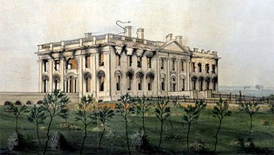

By the end of this section, you will be able to:
* Describe the causes and consequences of the War of 1812
* Identify the important events of the War of 1812 and explain their significance

The origins of the War of 1812, often called the Second War of American Independence, are found in the unresolved issues between the United States and Great Britain. One major cause was the British practice of impressment, whereby American sailors were taken at sea and forced to fight on British warships; this issue was left unresolved by Jay’s Treaty in 1794. In addition, the British in Canada supported Indians in their fight against further U.S. expansion in the Great Lakes region. Though Jefferson wanted to avoid what he called “entangling alliances,” staying neutral proved impossible.

# THE EMBARGO OF 1807

France and England, engaged in the Napoleonic Wars, which raged between 1803 and 1815, both declared open season on American ships, which they seized on the high seas. England was the major offender, since the Royal Navy, following a time-honored practice, “impressed” American sailors by forcing them into its service. The issue came to a head in 1807 when the HMS *Leopard*, a British warship, fired on a U.S. naval ship, the *Chesapeake*, off the coast of Norfolk, Virginia. The British then boarded the ship and took four sailors. Jefferson chose what he thought was the best of his limited options and responded to the crisis through the economic means of a sweeping ban on trade, the **Embargo Act of 1807**{: data-type="term" .no-emphasis}. This law prohibited American ships from leaving their ports until Britain and France stopped seizing them on the high seas. As a result of the embargo, American commerce came to a near-total halt.

The logic behind the embargo was that cutting off all trade would so severely hurt Britain and France that the seizures at sea would end. However, while the embargo did have some effect on the British economy, it was American commerce that actually felt the brunt of the impact ([\[link\]](#Figure_08_04_Ograbme)). The embargo hurt American farmers, who could no longer sell their goods overseas, and seaport cities experienced a huge increase in unemployment and an uptick in bankruptcies. All told, American business activity declined by 75 percent from 1808 to 1809.

  grabs a smuggler in the act of sneaking a barrel of sugar to a British ship. The smuggler cries, &#x201C;Oh, this cursed Ograbme!&#x201D; (&#x201C;Ograbme&#x201D; is &#x201C;embargo&#x201D; spelled backwards.)"){: #Figure_08_04_Ograbme}

Enforcement of the embargo proved very difficult, especially in the states bordering British Canada. Smuggling was widespread; Smugglers’ Notch in Vermont, for example, earned its name from illegal trade with British Canada. Jefferson attributed the problems with the embargo to lax enforcement.

At the very end of his second term, Jefferson signed the Non-Intercourse Act of 1808, lifting the unpopular embargoes on trade except with Britain and France. In the election of 1808, American voters elected another Democratic-Republican, James Madison. Madison inherited Jefferson’s foreign policy issues involving Britain and France. Most people in the United States, especially those in the West, saw Great Britain as the major problem.

# TECUMSEH AND THE WESTERN CONFEDERACY

Another underlying cause of the War of 1812 was British support for native resistance to U.S. western expansion. For many years, white settlers in the American western territories had besieged the Indians living there. Under Jefferson, two Indian policies existed: forcing Indians to adopt American ways of agricultural life, or aggressively driving Indians into debt in order to force them to sell their lands.

In 1809, Tecumseh, a Shawnee war chief, rejuvenated the Western Confederacy. His brother, Tenskwatawa, was a prophet among the Shawnee who urged a revival of native ways and rejection of Anglo-American culture, including alcohol. In 1811, William Henry Harrison, the governor of the Indiana Territory, attempted to eliminate the native presence by attacking Prophetstown, a Shawnee settlement named in honor of Tenskwatawa. In the ensuing Battle of Tippecanoe, U.S. forces led by Harrison destroyed the settlement ([\[link\]](#Figure_08_04_Tippecanoe)). They also found ample evidence that the British had supplied the Western Confederacy with weapons, despite the stipulations of earlier treaties.

 , painted by Charles Bird King in 1820, is a depiction of Shawnee prophet Tenskwatawa. Portrait (b) is Rembrandt Peele&#x2019;s 1813 depiction of William Henry Harrison. What are the significant similarities and differences between the portraits? What was each artist trying to convey?"){: #Figure_08_04_Tippecanoe}

# THE WAR OF 1812

The seizure of American ships and sailors, combined with the British support of Indian resistance, led to strident calls for war against Great Britain. The loudest came from the “war hawks,” led by Henry Clay from Kentucky and John C. Calhoun from South Carolina, who would not tolerate British insults to American honor. Opposition to the war came from Federalists, especially those in the Northeast, who knew war would disrupt the maritime trade on which they depended. In a narrow vote, Congress authorized the president to declare war against Britain in June 1812.

The war went very badly for the United States at first. In August 1812, the United States lost Detroit to the British and their Indian allies, including a force of one thousand men led by Tecumseh. By the end of the year, the British controlled half the Northwest. The following year, however, U.S. forces scored several victories. Captain Oliver Hazard Perry and his naval force defeated the British on Lake Erie. At the Battle of the Thames in Ontario, the United States defeated the British and their native allies, and Tecumseh was counted among the dead. Indian resistance began to ebb, opening the Indiana and Michigan territories for white settlement.

These victories could not turn the tide of the war, however. With the British gaining the upper hand during the Napoleonic Wars and Napoleon’s French army on the run, Great Britain now could divert skilled combat troops from Europe to fight in the United States. In July 1814, forty-five hundred hardened British soldiers sailed up the Chesapeake Bay and burned Washington, DC, to the ground, forcing President Madison and his wife to run for their lives ([\[link\]](#Figure_08_04_Burned)). According to one report, they left behind a dinner the British officers ate. That summer, the British shelled Baltimore, hoping for another victory. However, they failed to dislodge the U.S. forces, whose survival of the bombardment inspired Francis Scott Key to write “The Star-Spangled Banner.”

 {: #Figure_08_04_Burned}

Francis Scott Key’s “In Defense of Fort McHenry”

After the British bombed Baltimore’s Fort McHenry in 1814 but failed to overcome the U.S. forces there, Francis Scott Key was inspired by the sight of the American flag, which remained hanging proudly in the aftermath. He wrote the poem “In Defense of Fort McHenry,” which was later set to the tune of a British song called “The Anacreontic Song” and eventually became the U.S. national anthem, “The Star-Spangled Banner.”

\> Oh, say, can you see, by the dawn’s early light,
> * * *
> {: data-type="newline"}
> 
> What so proudly we hailed at the twilight’s last gleaming?
> * * *
> {: data-type="newline"}
> 
> Whose broad stripes and bright stars, thru the perilous fight,
> * * *
> {: data-type="newline"}
> 
> O’er the ramparts we watched, were so gallantly streaming?
> * * *
> {: data-type="newline"}
> 
> And the rockets’ red glare, the bombs bursting in air,
> * * *
> {: data-type="newline"}
> 
> Gave proof through the night that our flag was still there.
> * * *
> {: data-type="newline"}
> 
> O say, does that star-spangled banner yet wave
> * * *
> {: data-type="newline"}
> 
> O’er the land of the free and the home of the brave?
> * * *
> {: data-type="newline"}
> 
> * * *
> {: data-type="newline"}
> 
> On the shore dimly seen through the mists of the deep,
> * * *
> {: data-type="newline"}
> 
> Where the foe’s haughty host in dread silence reposes,
> * * *
> {: data-type="newline"}
> 
> What is that which the breeze, o’er the towering steep,
> * * *
> {: data-type="newline"}
> 
> As it fitfully blows, half conceals, half discloses?
> * * *
> {: data-type="newline"}
> 
> Now it catches the gleam of the morning’s first beam,
> * * *
> {: data-type="newline"}
> 
> In full glory reflected, now shines on the stream:
> * * *
> {: data-type="newline"}
> 
> Tis the star-spangled banner: O, long may it wave
> * * *
> {: data-type="newline"}
> 
> O’er the land of the free and the home of the brave!
> * * *
> {: data-type="newline"}
> 
> * * *
> {: data-type="newline"}
> 
> And where is that band who so vauntingly swore
> * * *
> {: data-type="newline"}
> 
> That the havoc of war and the battle’s confusion
> * * *
> {: data-type="newline"}
> 
> A home and a country should leave us no more?
> * * *
> {: data-type="newline"}
> 
> Their blood has washed out their foul footsteps’ pollution.
> * * *
> {: data-type="newline"}
> 
> No refuge could save the hireling and slave
> * * *
> {: data-type="newline"}
> 
> From the terror of flight or the gloom of the grave:
> * * *
> {: data-type="newline"}
> 
> And the star-spangled banner in triumph doth wave
> * * *
> {: data-type="newline"}
> 
> O’er the land of the free and the home of the brave.
> * * *
> {: data-type="newline"}
> 
> * * *
> {: data-type="newline"}
> 
> O, thus be it ever when freemen shall stand,
> * * *
> {: data-type="newline"}
> 
> Between their loved home and the war’s desolation!
> * * *
> {: data-type="newline"}
> 
> Blest with victory and peace, may the heav’n-rescued land
> * * *
> {: data-type="newline"}
> 
> Praise the Power that hath made and preserved us a nation!
> * * *
> {: data-type="newline"}
> 
> Then conquer we must, when our cause it is just,
> * * *
> {: data-type="newline"}
> 
> And this be our motto: “In God is our trust”
> * * *
> {: data-type="newline"}
> 
> And the star-spangled banner in triumph shall wave
> * * *
> {: data-type="newline"}
> 
> O’er the land of the free and the home of the brave!
> * * *
> {: data-type="newline"}
> 
> —Francis Scott Key, “In Defense of Fort McHenry,” 1814
> * * *
> {: data-type="newline"}

What images does Key use to describe the American spirit? Most people are familiar with only the first verse of the song; what do you think the last three verses add?

  
Visit the [Smithsonian Institute][1] to explore an interactive feature on the flag that inspired “The Star-Spangled Banner,” where clickable “hot spots” on the flag reveal elements of its history.

With the end of the war in Europe, Britain was eager to end the conflict in the Americas as well. In 1814, British and U.S. diplomats met in Flanders, in northern Belgium, to negotiate the Treaty of Ghent, signed in December. The boundaries between the United States and British Canada remained as they were before the war, an outcome welcome to those in the United States who feared a rupture in the country’s otherwise steady expansion into the West.

The War of 1812 was very unpopular in New England because it inflicted further economic harm on a region dependent on maritime commerce. This unpopularity caused a resurgence of the Federalist Party in New England. Many Federalists deeply resented the power of the slaveholding Virginians (Jefferson and then Madison), who appeared indifferent to their region. The depth of the Federalists’ discontent is illustrated by the proceedings of the December 1814 Hartford Convention, a meeting of twenty-six Federalists in Connecticut, where some attendees issued calls for New England to secede from the United States. These arguments for disunion during wartime, combined with the convention’s condemnation of the government, made Federalists appear unpatriotic. The convention forever discredited the Federalist Party and led to its downfall.

# EPILOGUE: THE BATTLE OF NEW ORLEANS

Due to slow communication, the last battle in the War of 1812 happened after the Treaty of Ghent had been signed ending the war. Andrew Jackson had distinguished himself in the war by defeating the Creek Indians in March 1814 before invading Florida in May of that year. After taking Pensacola, he moved his force of Tennessee fighters to New Orleans to defend the strategic port against British attack.

On January 8, 1815 (despite the official end of the war), a force of battle-tested British veterans of the Napoleonic Wars attempted to take the port. Jackson’s forces devastated the British, killing over two thousand. New Orleans and the vast Mississippi River Valley had been successfully defended, ensuring the future of American settlement and commerce. The **Battle of New Orleans**{: data-type="term" .no-emphasis} immediately catapulted Jackson to national prominence as a war hero, and in the 1820s, he emerged as the head of the new Democratic Party.

# Section Summary

The United States was drawn into its “Second War of Independence” against Great Britain when the British, engaged in the Napoleonic Wars against France, took liberties with the fledgling nation by impressing (capturing) its sailors on the high seas and arming its Indian enemies. The War of 1812 ended with the boundaries of the United Stated remaining as they were before the war. The Indians in the Western Confederacy suffered a significant defeat, losing both their leader Tecumseh and their fight for contested land in the Northwest. The War of 1812 proved to be of great importance because it generated a surge of national pride, with expressions of American identity such as the poem by Francis Scott Key. The United States was unequivocally separate from Britain and could now turn as never before to expansion in the West.

# Review Questions

What prompted the Embargo of 1807?

1.  British soldiers burned the U.S. capitol.
2.  The British supplied arms to Indian insurgents.
3.  The British navy captured American ships on the high seas and impressed their sailors into service for the British.
4.  The British hadn’t abandoned their posts in the Northwest Territory as required by Jay’s Treaty.
{: data-number-style="upper-alpha"}

C

What event inspired “The Star-Spangled Banner”?

1.  Betsy Ross sewing the first American flag raised during a time of war
2.  the British bombardment of Baltimore
3.  the British burning of Washington, DC
4.  the naval battle between the *Leopard* and the *Chesapeake*
{: data-number-style="upper-alpha"}

B

# Critical Thinking Questions

Describe Alexander Hamilton’s plans to address the nation’s financial woes. Which aspects proved most controversial, and why? What elements of the foundation Hamilton laid can still be found in the system today?

Describe the growth of the first party system in the United States. How did these parties come to develop? How did they define themselves, both independently and in opposition to one another? Where did they find themselves in agreement?

What led to the passage of the Alien and Sedition Acts? What made them so controversial?

What was the most significant impact of the War of 1812?

In what ways did the events of this era pose challenges to the U.S. Constitution? What constitutional issues were raised, and how were they addressed?

[1]: http://openstaxcollege.org/l/flag
