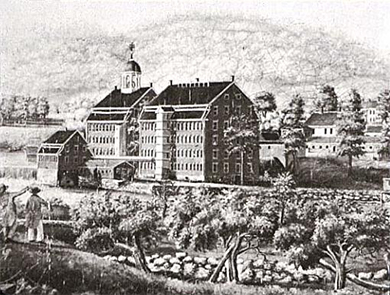
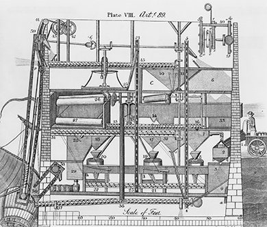

By the end of this section, you will be able to:
* Explain the role of the putting-out system in the rise of industrialization
* Understand industrialization’s impact on the nature of production and work
* Describe the effect of industrialization on consumption
* Identify the goals of workers’ organizations like the Working Men’s Party

 ![A timeline shows important events of the era. In 1807, Robert Fulton builds the first successful steamboat; an illustration of a steamboat traversing a waterway is shown. In 1813, Francis Cabot Lowell founds the Boston Manufacturing Company; an engraving of the Boston Manufacturing Company buildings and environs is shown. In 1819, a bank panic leads to depression. In 1825, the Erie Canal opens; an early nineteenth-century map depicting the western United States is shown. In 1831, Cyrus McCormick invents the mechanical reaper, and the Mohawk and Hudson Railroad begins service; a drawing of McCormick&#x2019;s mechanical reaper is shown. In 1838, Samuel Morse first demonstrates the telegraph; an illustration of a telegraph is shown. In 1841, P. T. Barnum&#x2019;s American Museum opens in New York City.](../resources/CNX_History_09_01_Timeline.jpg "(credit &#x201C;1807 photo&#x201D;: Project Gutenberg Archives)"){: #CNX_History_09_01_Timeline}

Northern industrialization expanded rapidly following the War of 1812. Industrialized manufacturing began in New England, where wealthy merchants built water-powered textile mills (and mill towns to support them) along the rivers of the Northeast. These mills introduced new modes of production centralized within the confines of the mill itself. As never before, production relied on mechanized sources with water power, and later steam, to provide the force necessary to drive machines. In addition to the mechanization and centralization of work in the mills, specialized, repetitive tasks assigned to wage laborers replaced earlier modes of handicraft production done by artisans at home. The operations of these mills irrevocably changed the nature of work by deskilling tasks, breaking down the process of production to its most basic, elemental parts. In return for their labor, the workers, who at first were young women from rural New England farming families, received wages. From its origin in New England, manufacturing soon spread to other regions of the United States.

### FROM ARTISANS TO WAGE WORKERS

During the seventeenth and eighteenth centuries, **artisans**{: data-type="term"}—skilled, experienced craft workers—produced goods by hand. The production of shoes provides a good example. In colonial times, people bought their shoes from master shoemakers, who achieved their status by living and working as apprentices under the rule of an older master artisan. An apprenticeship would be followed by work as a journeyman (a skilled worker without his own shop). After sufficient time as a journeyman, a shoemaker could at last set up his own shop as a master artisan. People came to the shop, usually attached to the back of the master artisan’s house, and there the shoemaker measured their feet in order to cut and stitch together an individualized product for each customer.

In the late eighteenth and early nineteenth century, merchants in the Northeast and elsewhere turned their attention as never before to the benefits of using unskilled wage labor to make a greater profit by reducing labor costs. They used the **putting-out system**{: data-type="term"}, which the British had employed at the beginning of their own Industrial Revolution, whereby they hired farming families to perform specific tasks in the production process for a set wage. In the case of shoes, for instance, American merchants hired one group of workers to cut soles into standardized sizes. A different group of families cut pieces of leather for the uppers, while still another was employed to stitch the standardized parts together.

This process proved attractive because it whittled production costs. The families who participated in the putting-out system were not skilled artisans. They had not spent years learning and perfecting their craft and did not have ambitious journeymen to pay. Therefore, they could not demand—and did not receive—high wages. Most of the year they tended fields and orchards, ate the food that they produced, and sold the surplus. Putting-out work proved a welcome source of extra income for New England farm families who saw their profits dwindle from new competition from midwestern farms with higher-yield lands.

Much of this part-time production was done under contract to merchants. Some farming families engaged in shoemaking (or shoe assemblage), as noted above. Many made brooms, plaited hats from straw or palm leaves (which merchants imported from Cuba and the West Indies), crafted furniture, made pottery, or wove baskets. Some, especially those who lived in Connecticut, made parts for clocks. The most common part-time occupation, however, was the manufacture of textiles. Farm women spun woolen thread and wove fabric. They also wove blankets, made rugs, and knit stockings. All this manufacturing took place on the farm, giving farmers and their wives control over the timing and pace of their labor. Their domestic productivity increased the quantity of goods available for sale in country towns and nearby cities.

### THE RISE OF MANUFACTURING

In the late 1790s and early 1800s, Great Britain boasted the most advanced textile mills and machines in the world, and the United States continued to rely on Great Britain for finished goods. Great Britain hoped to maintain its economic advantage over its former colonies in North America. So, in an effort to prevent the knowledge of advanced manufacturing from leaving the Empire, the British banned the emigration of mechanics, skilled workers who knew how to build and repair the latest textile machines.

Some skilled British mechanics, including Samuel Slater, managed to travel to the United States in the hopes of profiting from their knowledge and experience with advanced textile manufacturing. Slater ([\[link\]](#CNX_History_09_01_Slater)) understood the workings of the latest water-powered textile mills, which British industrialist Richard Arkwright had pioneered. In the 1790s in Pawtucket, Rhode Island, Slater convinced several American merchants, including the wealthy Providence industrialist Moses Brown, to finance and build a water-powered cotton mill based on the British models. Slater’s knowledge of both technology and mill organization made him the founder of the first truly successful cotton mill in the United States.

  was a British migrant who brought plans for English textile mills to the United States and built the nation&#x2019;s first successful water-powered mill in Pawtucket, Massachusetts (b)."){: #CNX_History_09_01_Slater}

The success of Slater and his partners Smith Brown and William Almy, relatives of Moses Brown, inspired others to build additional mills in Rhode Island and Massachusetts. By 1807, thirteen more mills had been established. President Jefferson’s embargo on British manufactured goods from late 1807 to early 1809 (discussed in a previous chapter) spurred more New England merchants to invest in industrial enterprises. By 1812, seventy-eight new textile mills had been built in rural New England towns. More than half turned out woolen goods, while the rest produced cotton cloth.

Slater’s mills and those built in imitation of his were fairly small, employing only seventy people on average. Workers were organized the way that they had been in English factories, in family units. Under the “**Rhode Island system**{: data-type="term" .no-emphasis},” families were hired. The father was placed in charge of the family unit, and he directed the labor of his wife and children. Instead of being paid in cash, the father was given “credit” equal to the extent of his family’s labor that could be redeemed in the form of rent (of company-owned housing) or goods from the company-owned store.

The Embargo of 1807 and the War of 1812 played a pivotal role in spurring industrial development in the United States. Jefferson’s embargo prevented American merchants from engaging in the Atlantic trade, severely cutting into their profits. The War of 1812 further compounded the financial woes of American merchants. The acute economic problems led some New England merchants, including Francis Cabot Lowell, to cast their gaze on manufacturing. Lowell had toured English mills during a stay in Great Britain. He returned to Massachusetts having memorized the designs for the advanced textile machines he had seen in his travels, especially the power loom, which replaced individual hand weavers. Lowell convinced other wealthy merchant families to invest in the creation of new mill towns. In 1813, Lowell and these wealthy investors, known as the Boston Associates, created the Boston Manufacturing Company. Together they raised $400,000 and, in 1814, established a textile mill in Waltham and a second one in the same town shortly thereafter ([\[link\]](#CNX_History_09_01_BostonManf)).

 {: #CNX_History_09_01_BostonManf}

At Waltham, cotton was carded and drawn into coarse strands of cotton fibers called rovings. The rovings were then spun into yarn, and the yarn woven into cotton cloth. Yarn no longer had to be put out to farm families for further processing. All the work was now performed at a central location—the factory.

The work in Lowell’s mills was both mechanized and specialized. Specialization meant the work was broken down into specific tasks, and workers repeatedly did the one task assigned to them in the course of a day. As machines took over labor from humans and people increasingly found themselves confined to the same repetitive step, the process of **deskilling**{: data-type="term"} began.

The Boston Associates’ mills, which each employed hundreds of workers, were located in company towns, where the factories and worker housing were owned by a single company. This gave the owners and their agents control over their workers. The most famous of these company towns was Lowell, Massachusetts. The new town was built on land the Boston Associates purchased in 1821 from the village of East Chelmsford at the falls of the Merrimack River, north of Boston. The mill buildings themselves were constructed of red brick with large windows to let in light. Company-owned boarding houses to shelter employees were constructed near the mills. The mill owners planted flowers and trees to maintain the appearance of a rural New England town and to forestall arguments, made by many, that factory work was unnatural and unwholesome.

In contrast to many smaller mills, the Boston Associates’ enterprises avoided the Rhode Island system, preferring individual workers to families. These employees were not difficult to find. The competition New England farmers faced from farmers now settling in the West, and the growing scarcity of land in population-dense New England, had important implications for farmers’ children. Realizing their chances of inheriting a large farm or receiving a substantial dowry were remote, these teenagers sought other employment opportunities, often at the urging of their parents. While young men could work at a variety of occupations, young women had more limited options. The textile mills provided suitable employment for the daughters of Yankee farm families.

Needing to reassure anxious parents that their daughters’ virtue would be protected and hoping to avoid what they viewed as the problems of industrialization—filth and vice—the Boston Associates established strict rules governing the lives of these young workers. The women lived in company-owned boarding houses to which they paid a portion of their wages. They woke early at the sound of a bell and worked a twelve-hour day during which talking was forbidden. They could not swear or drink alcohol, and they were required to attend church on Sunday. Overseers at the mills and boarding-house keepers kept a close eye on the young women’s behavior; workers who associated with people of questionable reputation or acted in ways that called their virtue into question lost their jobs and were evicted.

Michel Chevalier on Mill Worker Rules and Wages

In the 1830s, the French government sent engineer and economist Michel Chevalier to study industrial and financial affairs in Mexico and the United States. In 1839, he published *Society, Manners, and Politics in the United States*, in which he recorded his impressions of the Lowell textile mills. In the excerpt below, Chevalier describes the rules and wages of the Lawrence Company in 1833.

<q>All persons employed by the Company must devote themselves assiduously to their duty during working-hours. They must be capable of doing the work which they undertake, or use all their efforts to this effect. They must on all occasions, both in their words and in their actions, show that they are penetrated by a laudable love of temperance and virtue, and animated by a sense of their moral and social obligations. The Agent of the Company shall endeavour to set to all a good example in this respect. Every individual who shall be notoriously dissolute, idle, dishonest, or intemperate, who shall be in the practice of absenting himself from divine service, or shall violate the Sabbath, or shall be addicted to gaming, shall be dismissed from the service of the Company. . . . All ardent spirits are banished from the Company’s grounds, except when prescribed by a physician. All games of hazard and cards are prohibited within their limits and in the boarding-houses.* * *
{: data-type="newline"}

 Weekly wages were as follows:* * *
{: data-type="newline"}

 For picking and carding, $2.78 to $3.10* * *
{: data-type="newline"}

 For spinning, $3.00* * *
{: data-type="newline"}

 For weaving, $3.10 to $3.12* * *
{: data-type="newline"}

 For warping and sizing, $3.45 to $4.00* * *
{: data-type="newline"}

 For measuring and folding, $3.12</q>

What kind of world were the factory owners trying to create with these rules? How do you think those who believed all white people were born free and equal would react to them?

  
Visit the [Textile Industry History][1] site to explore the mills of New England through its collection of history, images, and ephemera.

The mechanization of formerly handcrafted goods, and the removal of production from the home to the factory, dramatically increased output of goods. For example, in one nine-month period, the numerous Rhode Island women who spun yarn into cloth on hand looms in their homes produced a total of thirty-four thousand yards of fabrics of different types. In 1855, the women working in just one of Lowell’s mechanized mills produced more than forty-three thousand yards.

The Boston Associates’ cotton mills quickly gained a competitive edge over the smaller mills established by Samuel Slater and those who had imitated him. Their success prompted the Boston Associates to expand. In Massachusetts, in addition to Lowell, they built new mill towns in Chicopee, Lawrence, and Holyoke. In New Hampshire, they built them in Manchester, Dover, and Nashua. And in Maine, they built a large mill in Saco on the Saco River. Other entrepreneurs copied them. By the time of the Civil War, 878 textile factories had been built in New England. All together, these factories employed more than 100,000 people and produced more than 940 million yards of cloth.

Success in New England was repeated elsewhere. Small mills, more like those in Rhode Island than those in northern Massachusetts, New Hampshire, and Maine, were built in New York, Delaware, and Pennsylvania. By midcentury, three hundred textile mills were located in and near Philadelphia. Many produced specialty goods, such as silks and printed fabrics, and employed skilled workers, including people working in their own homes. Even in the South, the region that otherwise relied on slave labor to produce the very cotton that fed the northern factory movement, more than two hundred textile mills were built. Most textiles, however, continued to be produced in New England before the Civil War.

Alongside the production of cotton and woolen cloth, which formed the backbone of the Industrial Revolution in the United States as in Britain, other crafts increasingly became mechanized and centralized in factories in the first half of the nineteenth century. Shoe making, leather tanning, papermaking, hat making, clock making, and gun making had all become mechanized to one degree or another by the time of the Civil War. Flour milling, because of the inventions of Oliver Evans ([\[link\]](#CNX_History_09_01_Evans)), had become almost completely automated and centralized by the early decades of the nineteenth century. So efficient were Evans-style mills that two employees were able to do work that had originally required five, and mills using Evans’s system spread throughout the mid-Atlantic states.

 {: #CNX_History_09_01_Evans}

### THE RISE OF CONSUMERISM

At the end of the eighteenth century, most American families lived in candlelit homes with bare floors and unadorned walls, cooked and warmed themselves over fireplaces, and owned few changes of clothing. All manufactured goods were made by hand and, as a result, were usually scarce and fairly expensive.

The automation of the manufacturing process changed that, making consumer goods that had once been thought of as luxury items widely available for the first time. Now all but the very poor could afford the necessities and some of the small luxuries of life. Rooms were lit by oil lamps, which gave brighter light than candles. Homes were heated by parlor stoves, which allowed for more privacy; people no longer needed to huddle together around the hearth. Iron cookstoves with multiple burners made it possible for housewives to prepare more elaborate meals. Many people could afford carpets and upholstered furniture, and even farmers could decorate their homes with curtains and wallpaper. Clocks, which had once been quite expensive, were now within the reach of most ordinary people.

### THE WORK EXPERIENCE TRANSFORMED

As production became mechanized and relocated to factories, the experience of workers underwent significant changes. Farmers and artisans had controlled the pace of their labor and the order in which things were done. If an artisan wanted to take the afternoon off, he could. If a farmer wished to rebuild his fence on Thursday instead of on Wednesday, he could. They conversed and often drank during the workday. Indeed, journeymen were often promised alcohol as part of their wages. One member of the group might be asked to read a book or a newspaper aloud to the others. In the warm weather, doors and windows might be opened to the outside, and work stopped when it was too dark to see.

Work in factories proved to be quite different. Employees were expected to report at a certain time, usually early in the morning, and to work all day. They could not leave when they were tired or take breaks other than at designated times. Those who arrived late found their pay docked; five minutes’ tardiness could result in several hours’ worth of lost pay, and repeated tardiness could result in dismissal. The monotony of repetitive tasks made days particularly long. Hours varied according to the factory, but most factory employees toiled ten to twelve hours a day, six days a week. In the winter, when the sun set early, oil lamps were used to light the factory floor, and employees strained their eyes to see their work and coughed as the rooms filled with smoke from the lamps. In the spring, as the days began to grow longer, factories held “blowing-out” celebrations to mark the extinguishing of the oil lamps. These “blow-outs” often featured processions and dancing.

Freedom within factories was limited. Drinking was prohibited. Some factories did not allow employees to sit down. Doors and windows were kept closed, especially in textile factories where fibers could be easily disturbed by incoming breezes, and mills were often unbearably hot and humid in the summer. In the winter, workers often shivered in the cold. In such environments, workers’ health suffered.

The workplace posed other dangers as well. The presence of cotton bales alongside the oil used to lubricate machines made fire a common problem in textile factories. Workplace injuries were also common. Workers’ hands and fingers were maimed or severed when they were caught in machines; in some cases, their limbs or entire bodies were crushed. Workers who didn’t die from such injuries almost certainly lost their jobs, and with them, their income. Corporal punishment of both children and adults was common in factories; where abuse was most extreme, children sometimes died as a result of injuries suffered at the hands of an overseer.

As the decades passed, working conditions deteriorated in many mills. Workers were assigned more machines to tend, and the owners increased the speed at which the machines operated. Wages were cut in many factories, and employees who had once labored for an hourly wage now found themselves reduced to piecework, paid for the amount they produced and not for the hours they toiled. Owners also reduced compensation for piecework. Low wages combined with regular periods of unemployment to make the lives of workers difficult, especially for those with families to support. In New York City in 1850, for example, the average male worker earned $300 a year; it cost approximately $600 a year to support a family of five.

### WORKERS AND THE LABOR MOVEMENT

Many workers undoubtedly enjoyed some of the new wage opportunities factory work presented. For many of the young New England women who ran the machines in Waltham, Lowell, and elsewhere, the experience of being away from the family was exhilarating and provided a sense of solidarity among them. Though most sent a large portion of their wages home, having even a small amount of money of their own was a liberating experience, and many used their earnings to purchase clothes, ribbons, and other consumer goods for themselves.

The long hours, strict discipline, and low wages, however, soon led workers to organize to protest their working conditions and pay. In 1821, the young women employed by the Boston Manufacturing Company in Waltham went on strike for two days when their wages were cut. In 1824, workers in Pawtucket struck to protest reduced pay rates and longer hours, the latter of which had been achieved by cutting back the amount of time allowed for meals. Similar strikes occurred at Lowell and in other mill towns like Dover, New Hampshire, where the women employed by the Cocheco Manufacturing Company ceased working in December 1828 after their wages were reduced. In the 1830s, female mill operatives in Lowell formed the Lowell Factory Girls Association to organize strike activities in the face of wage cuts ([\[link\]](#CNX_History_09_01_Factory)) and, later, established the Lowell Female Labor Reform Association to protest the twelve-hour workday. Even though strikes were rarely successful and workers usually were forced to accept reduced wages and increased hours, work stoppages as a form of labor protest represented the beginnings of the labor movement in the United States.

 . When management proposed rent increases for those living in company boarding houses, female textile workers in Lowell responded by forming the Lowell Factory Girls Association&#x2014;its constitution is shown in image (b)&#x2014;in 1836 and organizing a &#x201C;turn-out&#x201D; or strike."){: #CNX_History_09_01_Factory}

Critics of industrialization blamed it for the increased concentration of wealth in the hands of the few: the factory owners made vast profits while the workers received only a small fraction of the revenue from what they produced. Under the **labor theory of value**{: data-type="term"}, said critics, the value of a product should accurately reflect the labor needed to produce it. Profits from the sale of goods produced by workers should be distributed so laborers recovered in the form of wages the value their effort had added to the finished product. While factory owners, who contributed the workspace, the machinery, and the raw materials needed to create a product, should receive a share of the profits, their share should not be greater than the value of their contribution. Workers should thus receive a much larger portion of the profits than they currently did, and factory owners should receive less.

In Philadelphia, New York, and Boston—all cities that experienced dizzying industrial growth during the nineteenth century—workers united to form political parties. Thomas Skidmore, from Connecticut, was the outspoken organizer of the **Working Men’s Party**{: data-type="term"}, which lodged a radical protest against the exploitation of workers that accompanied industrialization. Skidmore took his cue from Thomas Paine and the American Revolution to challenge the growing inequity in the United States. He argued that inequality originated in the unequal distribution of property through inheritance laws. In his 1829 treatise, *The Rights of Man to Property*, Skidmore called for the abolition of inheritance and the redistribution of property. The Working Men’s Party also advocated the end of imprisonment for debt, a common practice whereby the debtor who could not pay was put in jail and his tools and property, if any, were confiscated. Skidmore’s vision of radical equality extended to all; women and men, no matter their race, should be allowed to vote and receive property, he believed. Skidmore died in 1832 when a cholera epidemic swept New York City, but the state of New York did away with imprisonment for debt in the same year.

Worker activism became less common in the late 1840s and 1850s. As German and Irish immigrants poured into the United States in the decades preceding the Civil War, native-born laborers found themselves competing for jobs with new arrivals who were willing to work longer hours for less pay. In Lowell, Massachusetts, for example, the daughters of New England farmers encountered competition from the daughters of Irish farmers suffering the effects of the potato famine; these immigrant women were willing to work for far less and endure worse conditions than native-born women. Many of these native-born “daughters of freemen,” as they referred to themselves, left the factories and returned to their families. Not all wage workers had this luxury, however. Widows with children to support and girls from destitute families had no choice but to stay and accept the faster pace and lower pay. Male German and Irish immigrants competed with native-born men. Germans, many of whom were skilled workers, took jobs in furniture making. The Irish provided a ready source of unskilled labor needed to lay railroad track and dig canals. American men with families to support grudgingly accepted low wages in order to keep their jobs. As work became increasingly deskilled, no worker was irreplaceable, and no one’s job was safe.

### Section Summary

Industrialization led to radical changes in American life. New industrial towns, like Waltham, Lowell, and countless others, dotted the landscape of the Northeast. The mills provided many young women an opportunity to experience a new and liberating life, and these workers relished their new freedom. Workers also gained a greater appreciation of the value of their work and, in some instances, began to question the basic fairness of the new industrial order. The world of work had been fundamentally reorganized.

### Review Questions

How were the New England textile mills planned and built?

1.  Experienced British builders traveled to the United States to advise American merchants.
2.  New England merchants paid French and German mechanics to design factories for them.
3.  New England merchants and British migrants memorized plans from British mills.
4.  Textile mills were a purely American creation, invented by Francis Cabot Lowell in 1813.
{: type="A"}

C

Which is the best characterization of textile mill workers in the early nineteenth century?

1.  male and female indentured servants from Great Britain who worked hard to win their freedom
2.  young men who found freedom in the rowdy lifestyle of mill work
3.  experienced artisans who shared their knowledge in exchange for part ownership in the company
4.  young farm women whose behavior was closely monitored
{: type="A"}

D

What effect did industrialization have on consumers?

Industrialization made manufactured goods more abundant and more widely available. All but the poorest Americans were able to equip their homes with cookstoves, parlor stoves, upholstered furniture, and decorations such as wallpaper and window curtains. Even such formerly expensive goods as clocks were now affordable for most.

### Glossary
{: data-type="glossary-title"}

artisan
: skilled, experienced worker who produces specialized goods by hand
^

deskilling
: breaking an artisanal production process into smaller steps that unskilled workers can perform
^

labor theory of value
: an economic theory holding that profits from the sale of the goods produced by workers should be equitably distributed to those workers
^

putting-out system
: a labor system whereby a merchant hired different families to perform specific tasks in a production process
^

Working Men’s Party
: a political group that radically opposed what they viewed as the exploitation of workers

[1]: https://sites.textiles.ncsu.edu/history/
