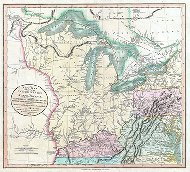
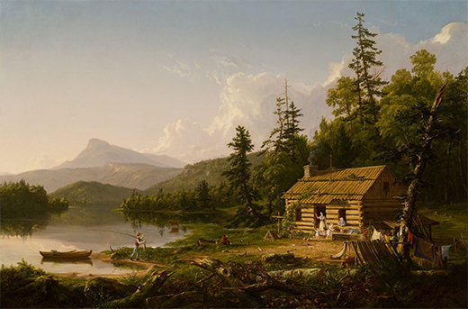
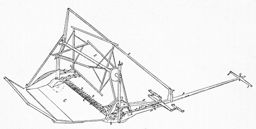

By the end of this section, you will be able to:
* Explain the process of selling western land
* Discuss the causes of the Panic of 1819
* Identify key American innovators and inventors

By the 1840s, the United States economy bore little resemblance to the import-and-export economy of colonial days. It was now a market economy, one in which the production of goods, and their prices, were unregulated by the government. Commercial centers, to which job seekers flocked, mushroomed. New York City’s population skyrocketed. In 1790, it was 33,000; by 1820, it had reached 200,000; and by 1825, it had swelled to 270,000. New opportunities for wealth appeared to be available to anyone.

However, the expansion of the American economy made it prone to the boom-and-bust cycle. Market economies involve fluctuating prices for labor, raw materials, and consumer goods and depend on credit and financial instruments—any one of which can be the source of an imbalance and an economic downturn in which businesses and farmers default, wage workers lose their employment, and investors lose their assets. This happened for the first time in the United States in 1819, when waves of enthusiastic speculation (expectations of rapidly rising prices) in land and commodities gave way to drops in prices.

# THE LAND OFFICE BUSINESS

In the early nineteenth century, people poured into the territories west of the long-settled eastern seaboard. Among them were speculators seeking to buy cheap parcels from the federal government in anticipation of a rise in prices. The Ohio Country in the Northwest Territory appeared to offer the best prospects for many in the East, especially New Englanders. The result was “Ohio fever,” as thousands traveled there to reap the benefits of settling in this newly available territory ([\[link\]](#CNX_History_09_02_Northwest)).

 {: #CNX_History_09_02_Northwest}

The federal government oversaw the orderly transfer of public land to citizens at public auctions. The Land Law of 1796 applied to the territory of Ohio after it had been wrested from Indians. Under this law, the United States would sell a minimum parcel of 640 acres for $2 an acre. The Land Law of 1800 further encouraged land sales in the Northwest Territory by reducing the minimum parcel size by half and enabling sales on credit, with the goal of stimulating settlement by ordinary farmers. The government created **land offices**{: data-type="term"} to handle these sales and established them in the West within easy reach of prospective landowners. They could thus purchase land directly from the government, at the price the government had set. Buyers were given low interest rates, with payments that could be spread over four years. Surveyors marked off the parcels in straight lines, creating a landscape of checkerboard squares.

The future looked bright for those who turned their gaze on the land in the West. Surveying, settling, and farming, turning the wilderness into a profitable commodity, gave purchasers a sense of progress. A uniquely American story of settling the land developed: hardy individuals wielding an axe cleared it, built a log cabin, and turned the frontier into a farm that paved the way for mills and towns ([\[link\]](#CNX_History_09_02_Cole)).

 {: #CNX_History_09_02_Cole}

A New Englander Heads West

A native of Vermont, Gershom Flagg was one of thousands of New Englanders who caught “Ohio fever.” In this letter to his brother, Azariah Flagg, dated August 3, 1817, he describes the hustle and bustle of the emerging commercial town of Cincinnati.

\> DEAR BROTHER,
> * * *
> {: data-type="newline"}
> 
> Cincinnati is an incorporated City. It contained in 1815, 1,100 buildings of different descriptions among which are above 20 of Stone 250 of brick &amp; 800 of Wood. The population in 1815 was 6,500. There are about 60 Mercantile stores several of which are wholesale. Here are a great share of Mechanics of all kinds.
> * * *
> {: data-type="newline"}
> 
> Here is one Woolen Factory four Cotton factories but not now in operation. A most stupendously large building of Stone is likewise erected immediately on the bank of the River for a steam Mill. It is nine stories high at the Waters edge &amp; is 87 by 62 feet. It drives four pair of Stones besides various other Machinery as Wool carding &amp;c &amp;c. There is also a valuable Steam Saw Mill driving four saws also an inclined Wheel ox Saw Mill with two saws, one Glass Factory. The town is Rapidly increasing in Wealth &amp; population. Here is a Branch of the United States Bank and three other banks &amp; two Printing offices. The country around is rich. . . .
> * * *
> {: data-type="newline"}
> 
> That you may all be prospered in the world is the anxious wish of your affectionate Brother
> * * *
> {: data-type="newline"}
> 
> GERSHOM FLAGG

What caught Flagg’s attention? From your reading of this letter and study of the engraving below ([\[link\]](#CNX_History_09_02_Cincinnati)), what impression can you take away of Cincinnati in 1817?

, by Jervis Cutler, presents a view of Cincinnati as it may have looked to Gershom Flagg."){: #CNX_History_09_02_Cincinnati}

  
Learn more about settlement of and immigration to the Northwest Territory by exploring the National Park Service’s [Historic Resource Study][1] related to the Lincoln Boyhood National Memorial. According to the guide’s maps, what lands were available for purchase?

# THE PANIC OF 1819

The first major economic crisis in the United States after the War of 1812 was due, in large measure, to factors in the larger Atlantic economy. It was made worse, however, by land speculation and poor banking practices at home. British textile mills voraciously consumed American cotton, and the devastation of the Napoleonic Wars made Europe reliant on other American agricultural commodities such as wheat. This drove up both the price of American agricultural products and the value of the land on which staples such as cotton, wheat, corn, and tobacco were grown.

Many Americans were struck with “**land fever**{: data-type="term" .no-emphasis}.” Farmers strove to expand their acreage, and those who lived in areas where unoccupied land was scarce sought holdings in the West. They needed money to purchase this land, however. Small merchants and factory owners, hoping to take advantage of this boom time, also sought to borrow money to expand their businesses. When existing banks refused to lend money to small farmers and others without a credit history, state legislatures chartered new banks to meet the demand. In one legislative session, Kentucky chartered forty-six. As loans increased, paper money from new state banks flooded the country, creating inflation that drove the price of land and goods still higher. This, in turn, encouraged even more people to borrow money with which to purchase land or to expand or start their own businesses. Speculators took advantage of this boom in the sale of land by purchasing property not to live on, but to buy cheaply and resell at exorbitant prices.

During the War of 1812, the Bank of the United States had suspended payments in **specie**{: data-type="term"}, “hard money” usually in the form of gold and silver coins. When the war ended, the bank continued to issue only paper banknotes and to redeem notes issued by state banks with paper only. The newly chartered banks also adopted this practice, issuing banknotes in excess of the amount of specie in their vaults. This shaky economic scheme worked only so long as people were content to conduct business with paper money and refrain from demanding that banks instead give them the gold and silver that was supposed to back it. If large numbers of people, or banks that had loaned money to other banks, began to demand specie payments, the banking system would collapse, because there was no longer enough specie to support the amount of paper money the banks had put into circulation. So terrified were bankers that customers would demand gold and silver that an irate bank employee in Ohio stabbed a customer who had the audacity to ask for specie in exchange for the banknotes he held.

In an effort to bring stability to the nation’s banking system, Congress chartered the Second Bank of the United States (a revival of Alexander Hamilton’s national bank) in 1816. But this new institution only compounded the problem by making risky loans, opening branches in the South and West where land fever was highest, and issuing a steady stream of Bank of the United States notes, a move that increased inflation and speculation.

The inflated economic bubble burst in 1819, resulting in a prolonged economic depression or severe downturn in the economy called the Panic of 1819. It was the first economic depression experienced by the American public, who panicked as they saw the prices of agricultural products fall and businesses fail. Prices had already begun falling in 1815, at the end of the Napoleonic Wars, when Britain began to “dump” its surplus manufactured goods, the result of wartime overproduction, in American ports, where they were sold for low prices and competed with American-manufactured goods. In 1818, to make the economic situation worse, prices for American agricultural products began to fall both in the United States and in Europe; the overproduction of staples such as wheat and cotton coincided with the recovery of European agriculture, which reduced demand for American crops. Crop prices tumbled by as much 75 percent.

This dramatic decrease in the value of agricultural goods left farmers unable to pay their debts. As they defaulted on their loans, banks seized their property. However, because the drastic fall in agricultural prices had greatly reduced the value of land, the banks were left with farms they were unable to sell. Land speculators lost the value of their investments. As the countryside suffered, hard-hit farmers ceased to purchase manufactured goods. Factories responded by cutting wages or firing employees.

In 1818, the Second Bank of the United States needed specie to pay foreign investors who had loaned money to the United States to enable the country to purchase Louisiana. The bank began to call in the loans it had made and required that state banks pay their debts in gold and silver. State banks that could not collect loan payments from hard-pressed farmers could not, in turn, meet their obligations to the Second Bank of the United States. Severe consequences followed as banks closed their doors and businesses failed. Three-quarters of the work force in Philadelphia was unemployed, and charities were swamped by thousands of newly destitute people needing assistance. In states with imprisonment for debt, the prison population swelled. As a result, many states drafted laws to provide relief for debtors. Even those at the top of the social ladder were affected by the Panic of 1819. Thomas Jefferson, who had cosigned a loan for a friend, nearly lost Monticello when his acquaintance defaulted, leaving Jefferson responsible for the debt.

In an effort to stimulate the economy in the midst of the economic depression, Congress passed several acts modifying land sales. The Land Law of 1820 lowered the price of land to $1.25 per acre and allowed small parcels of eighty acres to be sold. The Relief Act of 1821 allowed Ohioans to return land to the government if they could not afford to keep it. The money they received in return was credited toward their debt. The act also extended the credit period to eight years. States, too, attempted to aid those faced with economic hard times by passing laws to prevent mortgage foreclosures so buyers could keep their homes. Americans made the best of the opportunities presented in business, in farming, or on the frontier, and by 1823 the Panic of 1819 had ended. The recovery provided ample evidence of the vibrant and resilient nature of the American people.

# ENTREPRENEURS AND INVENTORS

The volatility of the U.S. economy did nothing to dampen the creative energies of its citizens in the years before the Civil War. In the 1800s, a frenzy of entrepreneurship and invention yielded many new products and machines. The republic seemed to be a laboratory of innovation, and technological advances appeared unlimited.

One of the most influential advancements of the early nineteenth century was the cotton engine or gin, invented by Eli Whitney and patented in 1794. Whitney, who was born in Massachusetts, had spent time in the South and knew that a device to speed up the production of cotton was desperately needed so cotton farmers could meet the growing demand for their crop. He hoped the cotton gin would render slavery obsolete. Whitney’s seemingly simple invention cleaned the seeds from the raw cotton far more quickly and efficiently than could slaves working by hand ([\[link\]](#CNX_History_09_02_Gin)). The raw cotton with seeds was placed in the cotton gin, and with the use of a hand crank, the seeds were extracted through a carding device that aligned the cotton fibers in strands for spinning.

 "){: #CNX_History_09_02_Gin}

Whitney also worked on **machine tools**{: data-type="term"}, devices that cut and shaped metal to make standardized, interchangeable parts for other mechanical devices like clocks and guns. Whitney’s machine tools to manufacture parts for muskets enabled guns to be manufactured and repaired by people other than skilled gunsmiths. His creative genius served as a source of inspiration for many other American inventors.

Another influential new technology of the early 1800s was the steamship engine, invented by Robert Fulton in 1807. Fulton’s first steamship, the *Clermont*, used paddle wheels to travel the 150 miles from New York City to Albany in a record time of only thirty-two hours ([\[link\]](#CNX_History_09_02_Clermont)). Soon, a fleet of steamboats was traversing the Hudson River and New York Harbor, later expanding to travel every major American river including the mighty Mississippi. By the 1830s there were over one thousand of these vessels, radically changing water transportation by ending its dependence on the wind. Steamboats could travel faster and more cheaply than sailing vessels or keelboats, which floated downriver and had to be poled or towed upriver on the return voyage. Steamboats also arrived with much greater dependability. The steamboat facilitated the rapid economic development of the massive Mississippi River Valley and the settlement of the West.

 "){: #CNX_History_09_02_Clermont}

Virginia-born Cyrus McCormick wanted to replace the laborious process of using a scythe to cut and gather wheat for harvest. In 1831, he and the slaves on his family’s plantation tested a horse-drawn mechanical reaper, and over the next several decades, he made constant improvements to it ([\[link\]](#CNX_History_09_02_Reaper)). More farmers began using it in the 1840s, and greater demand for the McCormick reaper led McCormick and his brother to establish the McCormick Harvesting Machine Company in Chicago, where labor was more readily available. By the 1850s, McCormick’s mechanical reaper had enabled farmers to vastly increase their output. McCormick—and also John Deere, who improved on the design of plows—opened the prairies to agriculture. McCormick’s bigger machine could harvest grain faster, and Deere’s plow could cut through the thick prairie sod. Agriculture north of the Ohio River became the pantry that would lower food prices and feed the major cities in the East. In short order, Ohio, Indiana, and Illinois all become major agricultural states.

 {: #CNX_History_09_02_Reaper}

Samuel Morse added the telegraph to the list of American innovations introduced in the years before the Civil War. Born in Massachusetts in 1791, Morse first gained renown as a painter before turning his attention to the development of a method of rapid communication in the 1830s. In 1838, he gave the first public demonstration of his method of conveying electric pulses over a wire, using the basis of what became known as Morse code. In 1843, Congress agreed to help fund the new technology by allocating $30,000 for a telegraph line to connect Washington, DC, and Baltimore along the route of the Baltimore and Ohio Railroad. In 1844, Morse sent the first telegraph message on the new link. Improved communication systems fostered the development of business, economics, and politics by allowing for dissemination of news at a speed previously unknown.

# Section Summary

The selling of the public domain was one of the key features of the early nineteenth century in the United States. Thousands rushed west to take part in the bounty. In the wild frenzy of land purchases and speculation in land, state banks advanced risky loans and created unstable paper money not backed by gold or silver, ultimately leading to the Panic of 1819. The ensuing economic depression was the first in U.S. history. Recovery came in the 1820s, followed by a period of robust growth. In this age of entrepreneurship, in which those who invested their money wisely in land, business ventures, or technological improvements reaped vast profits, inventors produced new wonders that transformed American life.

# Review Questions

Most people who migrated within the United States in the early nineteenth century went \_\_\_\_\_\_\_\_.  north toward Canada west toward Ohio south toward Georgia east across the Mississippi River 

B

Which of the following was *not* a cause of the Panic of 1819?  The Second Bank of the United States made risky loans. States chartered too many banks. Prices for American commodities dropped. Banks hoarded gold and silver. 

D

Robert Fulton is known for inventing \_\_\_\_\_\_\_\_.  the cotton gin the mechanical reaper the steamship engine machine tools 

C

What did federal and state governments do to help people who were hurt in the Panic of 1819?

The federal government passed laws allowing people to sell back land they could not pay for and use the money to pay their debt. States made it more difficult to foreclose on mortgages and tried to make it easier for people to declare bankruptcy.

[1]: http://openstaxcollege.org/l/15LincMemorial
