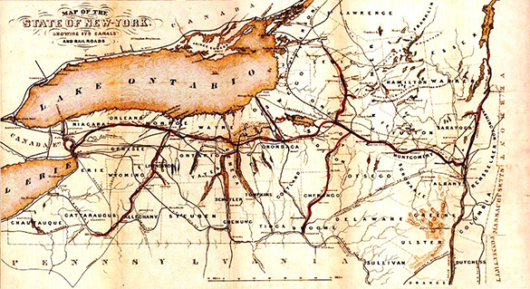

By the end of this section, you will be able to:
* Describe the development of improved methods of nineteenth-century domestic transportation
* Identify the ways in which roads, canals, and railroads impacted Americans’ lives in the nineteenth century

Americans in the early 1800s were a people on the move, as thousands left the eastern coastal states for opportunities in the West. Unlike their predecessors, who traveled by foot or wagon train, these settlers had new transport options. Their trek was made possible by the construction of roads, canals, and railroads, projects that required the funding of the federal government and the states.

New technologies, like the steamship and railroad lines, had brought about what historians call the transportation revolution. States competed for the honor of having the most advanced transport systems. People celebrated the transformation of the wilderness into an orderly world of improvement demonstrating the steady march of progress and the greatness of the republic. In 1817, John C. Calhoun of South Carolina looked to a future of rapid internal improvements, declaring, “Let us . . . bind the Republic together with a perfect system of roads and canals.” Americans agreed that internal transportation routes would promote progress. By the eve of the Civil War, the United States had moved beyond roads and canals to a well-established and extensive system of railroads.

### ROADS AND CANALS

One key part of the transportation revolution was the widespread building of roads and turnpikes. In 1811, construction began on the **Cumberland Road**{: data-type="term"}, a national highway that provided thousands with a route from Maryland to Illinois. The federal government funded this important artery to the West, beginning the creation of a transportation infrastructure for the benefit of settlers and farmers. Other entities built turnpikes, which (as today) charged fees for use. New York State, for instance, chartered turnpike companies that dramatically increased the miles of state roads from one thousand in 1810 to four thousand by 1820. New York led the way in building turnpikes.

Canal mania swept the United States in the first half of the nineteenth century. Promoters knew these artificial rivers could save travelers immense amounts of time and money. Even short waterways, such as the two-and-a-half-mile canal going around the rapids of the Ohio River near Louisville, Kentucky, proved a huge leap forward, in this case by opening a water route from Pittsburgh to New Orleans. The preeminent example was the **Erie Canal**{: data-type="term"} ([\[link\]](#CNX_History_09_03_ErieCanal)), which linked the Hudson River, and thus New York City and the Atlantic seaboard, to the Great Lakes and the Mississippi River Valley.

With its central location, large harbor, and access to the hinterland via the Hudson River, New York City already commanded the lion’s share of commerce. Still, the city’s merchants worried about losing ground to their competitors in Philadelphia and Baltimore. Their search for commercial advantage led to the dream of creating a water highway connecting the city’s Hudson River to Lake Erie and markets in the West. The result was the Erie Canal. Chartered in 1817 by the state of New York, the canal took seven years to complete. When it opened in 1825, it dramatically decreased the cost of shipping while reducing the time to travel to the West. Soon $15 million worth of goods (more than $200 million in today’s money) was being transported on the 363-mile waterway every year.

 , George Harvey portrays it in a pastoral, natural setting. Why do you think the painter chose to portray the canal this way?"){: #CNX_History_09_03_ErieCanal}

  
Explore the Erie Canal on [ErieCanal.org][1] via an interactive map. Click throughout the map for images of and artifacts from this historic waterway.

The success of the Erie Canal led to other, similar projects. The Wabash and Erie Canal, which opened in the early 1840s, stretched over 450 miles, making it the longest canal in North America ([\[link\]](#CNX_History_09_03_Wabash)). Canals added immensely to the country’s sense of progress. Indeed, they appeared to be the logical next step in the process of transforming wilderness into civilization.

  shows the route taken by the Wabash and Erie Canal through the state of Indiana. The canal began operation in 1843 and boats operated on it until the 1870s. Sections have since been restored, as shown in this 2007 photo (b) from Delphi, Indiana."){: #CNX_History_09_03_Wabash}

  
Visit [Southern Indiana Trails][2] to see historic photographs of the Wabash and Erie Canal:

As with highway projects such as the Cumberland Road, many canals were federally sponsored, especially during the presidency of John Quincy Adams in the late 1820s. Adams, along with Secretary of State Henry Clay, championed what was known as the American System, part of which included plans for a broad range of internal transportation improvements. Adams endorsed the creation of roads and canals to facilitate commerce and develop markets for agriculture as well as to advance settlement in the West.

### RAILROADS

Starting in the late 1820s, steam locomotives began to compete with horse-drawn locomotives. The railroads with steam locomotives offered a new mode of transportation that fascinated citizens, buoying their optimistic view of the possibilities of technological progress. The **Mohawk and Hudson Railroad**{: data-type="term"} was the first to begin service with a steam locomotive. Its inaugural train ran in 1831 on a track outside Albany and covered twelve miles in twenty-five minutes. Soon it was traveling regularly between Albany and Schenectady.

Toward the middle of the century, railroad construction kicked into high gear, and eager investors quickly formed a number of railroad companies. As a railroad grid began to take shape, it stimulated a greater demand for coal, iron, and steel. Soon, both railroads and canals crisscrossed the states ([\[link\]](#CNX_History_09_03_Erie)), providing a transportation infrastructure that fueled the growth of American commerce. Indeed, the transportation revolution led to development in the coal, iron, and steel industries, providing many Americans with new job opportunities.

 {: #CNX_History_09_03_Erie}

### AMERICANS ON THE MOVE

The expansion of roads, canals, and railroads changed people’s lives. In 1786, it had taken a minimum of four days to travel from Boston, Massachusetts, to Providence, Rhode Island. By 1840, the trip took half a day on a train. In the twenty-first century, this may seem intolerably slow, but people at the time were amazed by the railroad’s speed. Its average of twenty miles per hour was twice as fast as other available modes of transportation.

By 1840, more than three thousand miles of canals had been dug in the United States, and thirty thousand miles of railroad track had been laid by the beginning of the Civil War. Together with the hundreds of steamboats that plied American rivers, these advances in transportation made it easier and less expensive to ship agricultural products from the West to feed people in eastern cities, and to send manufactured goods from the East to people in the West. Without this ability to transport goods, the market revolution would not have been possible. Rural families also became less isolated as a result of the transportation revolution. Traveling circuses, menageries, peddlers, and itinerant painters could now more easily make their way into rural districts, and people in search of work found cities and mill towns within their reach.

### Section Summary

A transportation infrastructure rapidly took shape in the 1800s as American investors and the government began building roads, turnpikes, canals, and railroads. The time required to travel shrank vastly, and people marveled at their ability to conquer great distances, enhancing their sense of the steady advance of progress. The transportation revolution also made it possible to ship agricultural and manufactured goods throughout the country and enabled rural people to travel to towns and cities for employment opportunities.

### Review Questions

Which of the following was *not* a factor in the transportation revolution?

1.  the steam-powered locomotive
2.  the canal system
3.  the combustion engine
4.  the government-funded road system
{: type="A"}

C

What was the significance of the Cumberland Road?

1.  It gave settlers a quicker way to move west.
2.  It reduced the time it took to move goods from New York Harbor to Lake Erie.
3.  It improved trade from the Port of New Orleans.
4.  It was the first paved road.
{: type="A"}

A

What were the benefits of the transportation revolution?

The Cumberland Road made transportation to the West easier for new settlers. The Erie Canal facilitated trade with the West by connecting the Hudson River to Lake Erie. Railroads shortened transportation times throughout the country, making it easier and less expensive to move people and goods.

### Glossary
{: data-type="glossary-title"}

Cumberland Road
: a national highway that provided thousands with a route from Maryland to Illinois
^

Erie Canal
: a canal that connected the Hudson River to Lake Erie and markets in the West
^

Mohawk and Hudson Railroad
: the first steam-powered locomotive railroad in the United States

[1]: http://openstax.org/l/15ErieCanal
[2]: http://openstax.org/l/15WabashEire
