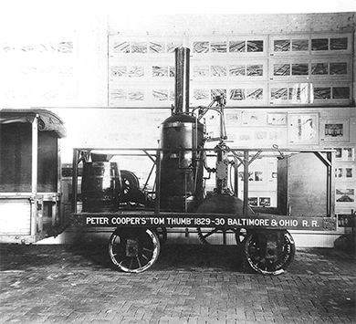

By the end of this section, you will be able to:
* Identify the shared perceptions and ideals of each social class
* Assess different social classes’ views of slavery

The profound economic changes sweeping the United States led to equally important social and cultural transformations. The formation of distinct classes, especially in the rapidly industrializing North, was one of the most striking developments. The unequal distribution of newly created wealth spurred new divisions along class lines. Each class had its own specific culture and views on the issue of slavery.

### THE ECONOMIC ELITE

Economic elites gained further social and political ascendance in the United States due to a fast-growing economy that enhanced their wealth and allowed distinctive social and cultural characteristics to develop among different economic groups. In the major northern cities of Boston, New York, and Philadelphia, leading merchants formed an industrial capitalist elite. Many came from families that had been deeply engaged in colonial trade in tea, sugar, pepper, slaves, and other commodities and that were familiar with trade networks connecting the United States with Europe, the West Indies, and the Far East. These colonial merchants had passed their wealth to their children.

After the War of 1812, the new generation of merchants expanded their economic activities. They began to specialize in specific types of industry, spearheading the development of industrial capitalism based on factories they owned and on specific commercial services such as banking, insurance, and shipping. Junius Spencer Morgan ([\[link\]](#CNX_History_09_04_Morgan)), for example, rose to prominence as a banker. His success began in Boston, where he worked in the import business in the 1830s. He then formed a partnership with a London banker, George Peabody, and created Peabody, Morgan &amp; Co. In 1864, he renamed the enterprise J. S. Morgan &amp; Co. His son, J. P. Morgan, became a noted financier in the later nineteenth and early twentieth century.

 "){: #CNX_History_09_04_Morgan}

  
Visit the [Internet Archive][1] to see scanned pages from *Hunt’s Merchant’s Magazine and Commercial Review*. This monthly business review provided the business elite with important information about issues pertaining to trade and finance: commodity prices, new laws affecting business, statistics regarding imports and exports, and similar content. Choose three articles and decide how they might have been important to the northern business elite.

Members of the northern business elite forged close ties with each other to protect and expand their economic interests. Marriages between leading families formed a crucial strategy to advance economic advantage, and the homes of the northern elite became important venues for solidifying social bonds. Exclusive neighborhoods started to develop as the wealthy distanced themselves from the poorer urban residents, and cities soon became segregated by class.

Industrial elites created chambers of commerce to advance their interests; by 1858 there were ten in the United States. These networking organizations allowed top bankers and merchants to stay current on the economic activities of their peers and further strengthen the bonds among themselves. The elite also established social clubs to forge and maintain ties. The first of these, the Philadelphia Club, came into being in 1834. Similar clubs soon formed in other cities and hosted a range of social activities designed to further bind together the leading economic families. Many northern elites worked hard to ensure the transmission of their inherited wealth from one generation to the next. Politically, they exercised considerable power in local and state elections. Most also had ties to the cotton trade, so they were strong supporters of slavery.

The Industrial Revolution led some former artisans to reinvent themselves as manufacturers. These enterprising leaders of manufacturing differed from the established commercial elite in the North and South because they did not inherit wealth. Instead, many came from very humble working-class origins and embodied the dream of achieving upward social mobility through hard work and discipline. As the beneficiaries of the economic transformations sweeping the republic, these newly established manufacturers formed a new economic elite that thrived in the cities and cultivated its own distinct sensibilities. They created a culture that celebrated hard work, a position that put them at odds with southern planter elites who prized leisure and with other elite northerners who had largely inherited their wealth and status.

Peter Cooper provides one example of the new northern manufacturing class. Ever inventive, Cooper dabbled in many different moneymaking enterprises before gaining success in the glue business. He opened his Manhattan glue factory in the 1820s and was soon using his profits to expand into a host of other activities, including iron production. One of his innovations was the steam locomotive, which he invented in 1827 ([\[link\]](#CNX_History_09_04_Cooper)). Despite becoming one of the wealthiest men in New York City, Cooper lived simply. Rather than buying an ornate bed, for example, he built his own. He believed respectability came through hard work, not family pedigree.

 {: #CNX_History_09_04_Cooper}

Those who had inherited their wealth derided self-made men like Cooper, and he and others like him were excluded from the social clubs established by the merchant and financial elite of New York City. Self-made northern manufacturers, however, created their own organizations that aimed to promote upward mobility. The Providence Association of Mechanics and Manufacturers was formed in 1789 and promoted both industrial arts and education as a pathway to economic success. In 1859, Peter Cooper established the Cooper Union for the Advancement of Science and Art, a school in New York City dedicated to providing education in technology. Merit, not wealth, mattered most according to Cooper, and admission to the school was based solely on ability; race, sex, and family connections had no place. The best and brightest could attend Cooper Union tuition-free, a policy that remained in place until 2014.

### THE MIDDLE CLASS

Not all enterprising artisans were so successful that they could rise to the level of the elite. However, many artisans and small merchants, who owned small factories and stores, did manage to achieve and maintain respectability in an emerging middle class. Lacking the protection of great wealth, members of the middle class agonized over the fear that they might slip into the ranks of wage laborers; thus they strove to maintain or improve their middle-class status and that of their children.

To this end, the middle class valued cleanliness, discipline, morality, hard work, education, and good manners. Hard work and education enabled them to rise in life. Middle-class children, therefore, did not work in factories. Instead they attended school and in their free time engaged in “self-improving” activities, such as reading or playing the piano, or they played with toys and games that would teach them the skills and values they needed to succeed in life. In the early nineteenth century, members of the middle class began to limit the number of children they had. Children no longer contributed economically to the household, and raising them “correctly” required money and attention. It therefore made sense to have fewer of them.

Middle-class women did not work for wages. Their job was to care for the children and to keep the house in a state of order and cleanliness, often with the help of a servant. They also performed the important tasks of cultivating good manners among their children and their husbands and of purchasing consumer goods; both activities proclaimed to neighbors and prospective business partners that their families were educated, cultured, and financially successful.

Northern business elites, many of whom owned or had invested in businesses like cotton mills that profited from slave labor, often viewed the institution of slavery with ambivalence. Most members of the middle class took a dim view of it, however, since it promoted a culture of leisure. Slavery stood as the antithesis of the middle-class view that dignity and respectability were achieved through work, and many members of this class became active in efforts to end it.

This class of upwardly mobile citizens promoted temperance, or abstinence from alcohol. They also gave their support to Protestant ministers like Charles Grandison Finney, who preached that all people possessed **free moral agency**{: data-type="term"}, meaning they could change their lives and bring about their own salvation, a message that resonated with members of the middle class, who already believed their worldly efforts had led to their economic success.

### THE WORKING CLASS

The Industrial Revolution in the United States created a new class of wage workers, and this working class also developed its own culture. They formed their own neighborhoods, living away from the oversight of bosses and managers. While industrialization and the market revolution brought some improvements to the lives of the working class, these sweeping changes did not benefit laborers as much as they did the middle class and the elites. The working class continued to live an often precarious existence. They suffered greatly during economic slumps, such as the Panic of 1819.

Although most working-class men sought to emulate the middle class by keeping their wives and children out of the work force, their economic situation often necessitated that others besides the male head of the family contribute to its support. Thus, working-class children might attend school for a few years or learn to read and write at Sunday school, but education was sacrificed when income was needed, and many working-class children went to work in factories. While the wives of wage laborers usually did not work for wages outside the home, many took in laundry or did piecework at home to supplement the family’s income.

Although the urban working class could not afford the consumer goods that the middle class could, its members did exercise a great deal of influence over popular culture. Theirs was a festive public culture of release and escape from the drudgery of factory work, catered to by the likes of Phineas Taylor Barnum, the celebrated circus promoter and showman. Taverns also served an important function as places to forget the long hours and uncertain wages of the factories. Alcohol consumption was high among the working class, although many workers did take part in the temperance movement. It is little wonder that middle-class manufacturers attempted to abolish alcohol.

P. T. Barnum and the Feejee Mermaid

The Connecticut native P. T. Barnum catered to the demand for escape and cheap amusements among the working class. His American Museum in New York City opened in 1841 and achieved great success. Millions flocked to see Barnum’s exhibits, which included a number of fantastic human and animal oddities, almost all of which were hoaxes. One exhibit in the 1840s featured the “Feejee Mermaid,” which Barnum presented as proof of the existence of the mythical mermaids of the deep ([\[link\]](#CNX_History_09_04_Barnum)). In truth, the mermaid was a half-monkey, half-fish stitched together.

 from P. T. Barnum&#x2019;s American Museum in New York City (b) drew throngs of working-class wage earners in the middle of the nineteenth century."){: #CNX_History_09_04_Barnum}

  
Visit [The Lost Museum][2] to take a virtual tour of P. T. Barnum’s incredible museum.

Wage workers in the North were largely hostile to the abolition of slavery, fearing it would unleash more competition for jobs from free blacks. Many were also hostile to immigration. The pace of immigration to the United States accelerated in the 1840s and 1850s as Europeans were drawn to the promise of employment and land in the United States. Many new members of the working class came from the ranks of these immigrants, who brought new foods, customs, and religions. The Roman Catholic population of the United States, fairly small before this period, began to swell with the arrival of the Irish and the Germans.

### Section Summary

The creation of distinctive classes in the North drove striking new cultural developments. Even among the wealthy elites, northern business families, who had mainly inherited their money, distanced themselves from the newly wealthy manufacturing leaders. Regardless of how they had earned their money, however, the elite lived and socialized apart from members of the growing middle class. The middle class valued work, consumption, and education and dedicated their energies to maintaining or advancing their social status. Wage workers formed their own society in industrial cities and mill villages, though lack of money and long working hours effectively prevented the working class from consuming the fruits of their labor, educating their children, or advancing up the economic ladder.

### Review Questions

Which of the following groups supported the abolition of slavery?

1.  northern business elites
2.  southern planter elites
3.  wage workers
4.  middle-class northerners
{: type="A"}

D

Which social class was most drawn to amusements like P. T. Barnum’s museum?

1.  wage workers
2.  middle-class northerners
3.  southern planter elites
4.  northern business elites
{: type="A"}

A

What did Peter Cooper envision for the United States, and how did he work to bring his vision to life?

A successful northern manufacturer and inventor, Cooper valued hard work, thrift, and simplicity. He lived according to these values, choosing utilitarian, self-made furnishings rather than luxurious goods. Cooper’s vision of hard work leading to respectability led him to found the Cooper Union for the Advancement of Science and Art; admission to this college, which was dedicated to the pursuit of technology, was based solely on merit.

### Critical Thinking Questions

Industrialization in the Northeast produced great benefits and also major problems. What were they? Who benefited and who suffered? Did the benefits outweigh the problems, or vice versa?

What factors led to the Panic of 1819? What government regulations might have prevented it?

Would the Industrial Revolution have been possible without the use of slave labor? Why or why not?

What might have been the advantages and disadvantages of railroads for the people who lived along the routes or near the stations?

What were the values of the middle class? How did they differ from the values of those above and below them on the socioeconomic ladder? In what ways are these values similar to or different from those held by the middle class today?

### Glossary
{: data-type="glossary-title"}

free moral agency
: the freedom to change one’s own life and bring about one’s own salvation

[1]: http://openstaxcollege.org/l/15Hunts
[2]: http://openstaxcollege.org/l/15LostMuseum
