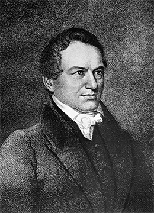

By the end of this section, you will be able to:
* Explain the factors that contributed to the Nullification Crisis
* Discuss the origins and creation of the Whig Party

The crisis over the Tariff of 1828 continued into the 1830s and highlighted one of the currents of democracy in the Age of Jackson: namely, that many southerners believed a democratic majority could be harmful to their interests. These southerners saw themselves as an embattled minority and claimed the right of states to nullify federal laws that appeared to threaten state sovereignty. Another undercurrent was the resentment and anger of the majority against symbols of elite privilege, especially powerful financial institutions like the Second Bank of the United States.

### THE NULLIFICATION CRISIS

The Tariff of 1828 had driven Vice President Calhoun to pen his “South Carolina Exposition and Protest,” in which he argued that if a national majority acted against the interest of a regional minority, then individual states could void—or nullify—federal law. By the early 1830s, the battle over the tariff took on new urgency as the price of cotton continued to fall. In 1818, cotton had been thirty-one cents per pound. By 1831, it had sunk to eight cents per pound. While production of cotton had soared during this time and this increase contributed to the decline in prices, many southerners blamed their economic problems squarely on the tariff for raising the prices they had to pay for imported goods while their own income shrank.

Resentment of the tariff was linked directly to the issue of slavery, because the tariff demonstrated the use of federal power. Some southerners feared the federal government would next take additional action against the South, including the abolition of slavery. The theory of **nullification**{: data-type="term"}, or the voiding of unwelcome federal laws, provided wealthy slaveholders, who were a minority in the United States, with an argument for resisting the national government if it acted contrary to their interests. James Hamilton, who served as governor of South Carolina in the early 1830s, denounced the “despotic majority that oppresses us.” Nullification also raised the specter of secession; aggrieved states at the mercy of an aggressive majority would be forced to leave the Union.

On the issue of nullification, South Carolina stood alone. Other southern states backed away from what they saw as the extremism behind the idea. President Jackson did not make the repeal of the 1828 tariff a priority and denied the nullifiers’ arguments. He and others, including former President Madison, argued that Article 1, Section 8 of the Constitution gave Congress the power to “lay and collect taxes, duties, imposts, and excises.” Jackson pledged to protect the Union against those who would try to tear it apart over the tariff issue. “The union shall be preserved,” he declared in 1830.

To deal with the crisis, Jackson advocated a reduction in tariff rates. The Tariff of 1832, passed in the summer, lowered the rates on some products like imported goods, a move designed to calm southerners. It did not have the desired effect, however, and Calhoun’s nullifiers still claimed their right to override federal law. In November, South Carolina passed the Ordinance of Nullification, declaring the 1828 and 1832 tariffs null and void in the Palmetto State. Jackson responded, however, by declaring in the December 1832 Nullification Proclamation that a state did not have the power to void a federal law.

With the states and the federal government at an impasse, civil war seemed a real possibility. The next governor of South Carolina, Robert Hayne, called for a force of ten thousand volunteers ([\[link\]](#CNX_History_10_03_Hayne)) to defend the state against any federal action. At the same time, South Carolinians who opposed the nullifiers told Jackson that eight thousand men stood ready to defend the Union. Congress passed the Force Bill of 1833, which gave the federal government the right to use federal troops to ensure compliance with federal law. The crisis—or at least the prospect of armed conflict in South Carolina—was defused by the Compromise Tariff of 1833, which reduced tariff rates considerably. Nullifiers in South Carolina accepted it, but in a move that demonstrated their inflexibility, they nullified the Force Bill.

 {: #CNX_History_10_03_Hayne}

The Nullification Crisis illustrated the growing tensions in American democracy: an aggrieved minority of elite, wealthy slaveholders taking a stand against the will of a democratic majority; an emerging sectional divide between South and North over slavery; and a clash between those who believed in free trade and those who believed in protective tariffs to encourage the nation’s economic growth. These tensions would color the next three decades of politics in the United States.

### THE BANK WAR

Congress established the Bank of the United States in 1791 as a key pillar of Alexander Hamilton’s financial program, but its twenty-year charter expired in 1811. Congress, swayed by the majority’s hostility to the bank as an institution catering to the wealthy elite, did not renew the charter at that time. In its place, Congress approved a new national bank—the Second Bank of the United States—in 1816. It too had a twenty-year charter, set to expire in 1836.

The Second Bank of the United States was created to stabilize the banking system. More than two hundred banks existed in the United States in 1816, and almost all of them issued paper money. In other words, citizens faced a bewildering welter of paper money with no standard value. In fact, the problem of paper money had contributed significantly to the Panic of 1819.

In the 1820s, the national bank moved into a magnificent new building in Philadelphia. However, despite Congress’s approval of the Second Bank of the United States, a great many people continued to view it as tool of the wealthy, an anti-democratic force. President Jackson was among them; he had faced economic crises of his own during his days speculating in land, an experience that had made him uneasy about paper money. To Jackson, hard currency—that is, gold or silver—was the far better alternative. The president also personally disliked the bank’s director, Nicholas Biddle.

A large part of the allure of mass democracy for politicians was the opportunity to capture the anger and resentment of ordinary Americans against what they saw as the privileges of a few. One of the leading opponents of the bank was Thomas Hart Benton, a senator from Missouri, who declared that the bank served “to make the rich richer, and the poor poorer.” The self-important statements of Biddle, who claimed to have more power that President Jackson, helped fuel sentiments like Benton’s.

In the reelection campaign of 1832, Jackson’s opponents in Congress, including Henry Clay, hoped to use their support of the bank to their advantage. In January 1832, they pushed for legislation that would re-charter it, even though its charter was not scheduled to expire until 1836. When the bill for re-chartering passed and came to President Jackson, he used his executive authority to veto the measure.

The defeat of the Second Bank of the United States demonstrates Jackson’s ability to focus on the specific issues that aroused the democratic majority. Jackson understood people’s anger and distrust toward the bank, which stood as an emblem of special privilege and big government. He skillfully used that perception to his advantage, presenting the bank issue as a struggle of ordinary people against a rapacious elite class who cared nothing for the public and pursued only their own selfish ends. As Jackson portrayed it, his was a battle for small government and ordinary Americans. His stand against what bank opponents called the “**monster bank**{: data-type="term"}” proved very popular, and the Democratic press lionized him for it ([\[link\]](#CNX_History_10_03_Monster)). In the election of 1832, Jackson received nearly 53 percent of the popular vote against his opponent Henry Clay.

 , the artist, Henry R. Robinson, depicts President Jackson using a cane marked &#x201C;Veto&#x201D; to battle a many-headed snake representing state banks, which supported the national bank. Battling alongside Martin Van Buren and Jack Downing, Jackson addresses the largest head, that of Nicholas Biddle, the director of the national bank: &#x201C;Biddle thou Monster Avaunt [go away]!! . . .&#x201D;"){: #CNX_History_10_03_Monster}

Jackson’s veto was only one part of the war on the “monster bank.” In 1833, the president removed the deposits from the national bank and placed them in state banks. Biddle, the bank’s director, retaliated by restricting loans to the state banks, resulting in a reduction of the money supply. The financial turmoil only increased when Jackson issued an executive order known as the Specie Circular, which required that western land sales be conducted using gold or silver only. Unfortunately, this policy proved a disaster when the Bank of England, the source of much of the hard currency borrowed by American businesses, dramatically cut back on loans to the United States. Without the flow of hard currency from England, American depositors drained the gold and silver from their own domestic banks, making hard currency scarce. Adding to the economic distress of the late 1830s, cotton prices plummeted, contributing to a financial crisis called the Panic of 1837. This economic panic would prove politically useful for Jackson’s opponents in the coming years and Van Buren, elected president in 1836, would pay the price for Jackson’s hard-currency preferences.

### WHIGS

Jackson’s veto of the bank and his Specie Circular helped galvanize opposition forces into a new political party, the **Whigs**{: data-type="term"}, a faction that began to form in 1834. The name was significant; opponents of Jackson saw him as exercising tyrannical power, so they chose the name Whig after the eighteenth-century political party that resisted the monarchical power of King George III. One political cartoon dubbed the president “King Andrew the First” and displayed Jackson standing on the Constitution, which has been ripped to shreds ([\[link\]](#CNX_History_10_03_KingAndrew)).

 ![Political caricature (a) represents President Andrew Jackson as a despotic ruler in robes and a crown, holding a scepter in one hand and a veto in the other. The border of the drawing reads &#x201C;King Andrew the First. Of Veto Memory. Born to Command. Had I Been Consulted.&#x201D; Cartoon (b) shows Jackson overseeing a scene of uncontrollable chaos. He wields a broom as rats with human heads, representing some of his cabinet members, run around on the floor. A pedestal labeled &#x201C;Altar of Reform&#x201D; topples over, while Jackson falls from a collapsing chair labeled &#x201C;The Hickory Chair coming to pieces at last.&#x201D;](../resources/CNX_History_10_03_KingAndrew.jpg "This anonymous 1833 political caricature (a) represents President Andrew Jackson as a despotic ruler, holding a scepter in one hand and a veto in the other. Contrast the image of &#x201C;King Andrew&#x201D; with a political cartoon from 1831 (b) of Jackson overseeing a scene of uncontrollable chaos as he falls from a hickory chair &#x201C;coming to pieces at last.&#x201D;"){: #CNX_History_10_03_KingAndrew}

Whigs championed an active federal government committed to internal improvements, including a national bank. They made their first national appearance in the presidential election of 1836, a contest that pitted Jackson’s handpicked successor, Martin Van Buren, against a field of several Whig candidates. Indeed, the large field of Whig candidates indicated the new party’s lack of organization compared to the Democrats. This helped Van Buren, who carried the day in the Electoral College. As the effects of the Panic of 1837 continued to be felt for years afterward, the Whig press pinned the blame for the economic crisis on Van Buren and the Democrats.

  
Explore a [Library of Congress][1] collection of 1830s political cartoons from the pages of *Harper’s Weekly* to learn more about how Andrew Jackson was viewed by the public in that era.

### Section Summary

Andrew Jackson’s election in 1832 signaled the rise of the Democratic Party and a new style of American politics. Jackson understood the views of the majority, and he skillfully used the popular will to his advantage. He adroitly navigated through the Nullification Crisis and made headlines with what his supporters viewed as his righteous war against the bastion of money, power, and entrenched insider interests, the Second Bank of the United States. His actions, however, stimulated opponents to fashion an opposition party, the Whigs.

### Review Questions

South Carolina threatened to nullify which federal act?

1.  the abolition of slavery
2.  the expansion of the transportation infrastructure
3.  the protective tariff on imported goods
4.  the rotation in office that expelled several federal officers
{: type="A"}

C

How did President Jackson respond to Congress’s re-chartering of the Second Bank of the United States?

1.  He vetoed it.
2.  He gave states the right to implement it or not.
3.  He signed it into law.
4.  He wrote a counterproposal.
{: type="A"}

A

Why did the Second Bank of the United States make such an inviting target for President Jackson?

Many people saw the Second Bank of the United States, the “monster bank,” as a tool for the privileged few, not for the public good. To Jackson, who saw himself as a spokesman for the common people against a powerful minority elite, it represented the elites’ self-serving policies. Fighting to dismantle the bank increased his popularity among many American voters.

What were the philosophies and policies of the new Whig Party?

Whigs opposed what they viewed as the tyrannical rule of Andrew Jackson. For this reason, they named themselves after the eighteenth-century British-American Whigs, who stood in opposition to King George. Whigs believed in an active federal government committed to internal improvements, including the establishment of a national bank.

### Glossary
{: data-type="glossary-title"}

monster bank
: the term Democratic opponents used to denounce the Second Bank of the United States as an emblem of special privilege and big government
^

nullification
: the theory, advocated in response to the Tariff of 1828, that states could void federal law at their discretion
^

Whigs
: a political party that emerged in the early 1830s to oppose what members saw as President Andrew Jackson’s abuses of power

[1]: http://openstax.org/l/15PolPrints
