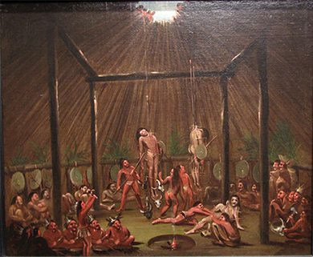
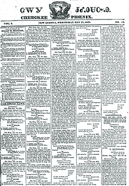

By the end of this section, you will be able to:
* Explain the legal wrangling that surrounded the Indian Removal Act
* Describe how depictions of Indians in popular culture helped lead to Indian removal

Pro-Jackson newspapers touted the president as a champion of opening land for white settlement and moving native inhabitants beyond the boundaries of “American civilization.” In this effort, Jackson reflected majority opinion: most Americans believed Indians had no place in the white republic. Jackson’s animosity toward Indians ran deep. He had fought against the Creek in 1813 and against the Seminole in 1817, and his reputation and popularity rested in large measure on his firm commitment to remove Indians from states in the South. The 1830 Indian Removal Act and subsequent displacement of the Creek, Choctaw, Chickasaw, Seminole, and Cherokee tribes of the Southeast fulfilled the vision of a white nation and became one of the identifying characteristics of the Age of Jackson.

# INDIANS IN POPULAR CULTURE

Popular culture in the first half of the nineteenth century reflected the aversion to Indians that was pervasive during the Age of Jackson. Jackson skillfully played upon this racial hatred to engage the United States in a policy of ethnic cleansing, eradicating the Indian presence from the land to make way for white civilization.

In an age of mass democracy, powerful anti-Indian sentiments found expression in mass culture, shaping popular perceptions. James Fenimore Cooper’s very popular historical novel, *The Last of the Mohicans*, published in 1826 as part of his Leatherstocking series, told the tale of Nathaniel “Natty” Bumppo (aka Hawkeye), who lived among Indians but had been born to white parents. Cooper provides a romantic version of the French and Indian War in which Natty helps the British against the French and the feral, bloodthirsty Huron. Natty endures even as his Indian friends die, including the noble Uncas, the last Mohican, in a narrative that dovetailed with most people’s approval of Indian removal.

Indians also made frequent appearances in art. George Catlin produced many paintings of native peoples, which he offered as true representations despite routinely emphasizing their supposed savage nature. *The Cutting Scene, Mandan O-kee-pa Ceremony* ([\[link\]](#CNX_History_10_04_Cutting)) is one example. Scholars have long questioned the accuracy of this portrayal of a rite of passage among the Mandan people. Accuracy aside, the painting captured the imaginations of white viewers, reinforcing their disgust at the savagery of Indians.

 {: #CNX_History_10_04_Cutting}

The Paintings of George Catlin

George Catlin seized upon the public fascination with the supposedly exotic and savage Indian, seeing an opportunity to make money by painting them in a way that conformed to popular white stereotypes ([\[link\]](#CNX_History_10_04_Catlin)). In the late 1830s, he toured major cities with his Indian Gallery, a collection of paintings of native peoples. Though he hoped his exhibition would be profitable, it did not bring him financial security.

, painted in 1844, Catlin focused on the Indians&#x2019; own vanishing culture, while in Wi-j&#xFA;n-jon, Pigeon&#x2019;s Egg Head (The Light) Going To and Returning From Washington (b), painted in 1837&#x2013;1839, he contrasted their ways with those of whites by showing an Assiniboine chief transformed by a visit to Washington, DC."){: #CNX_History_10_04_Catlin}

Catlin routinely painted Indians in a supposedly aboriginal state. In *Attacking the Grizzly Bear*, the hunters do not have rifles and instead rely on spears. Such a portrayal stretches credibility as native peoples had long been exposed to and adopted European weapons. Indeed, the painting’s depiction of Indians riding horses, which were introduced by the Spanish, makes clear that, as much as Catlin and white viewers wanted to believe in the primitive and savage native, the reality was otherwise.

In *Wi-jún-jon, Pigeon\'s Egg Head (The Light) Going To and Returning From Washington*, the viewer is shown a before and after portrait of Wi-jún-jon, who tried to emulate white dress and manners after going to Washington, DC. What differences do you see between these two representations of Wi-jún-jon? Do you think his attempt to imitate whites was successful? Why or why not? What do you think Catlin was trying to convey with this depiction of Wi-jún-jon’s assimilation?

# THE INDIAN REMOVAL ACT

In his first message to Congress, Jackson had proclaimed that Indian groups living independently within states, as sovereign entities, presented a major problem for state sovereignty. This message referred directly to the situation in Georgia, Mississippi, and Alabama, where the Creek, Choctaw, Chickasaw, Seminole, and Cherokee peoples stood as obstacles to white settlement. These groups were known as the **Five Civilized Tribes**{: data-type="term"}, because they had largely adopted Anglo-American culture, speaking English and practicing Christianity. Some held slaves like their white counterparts.

Whites especially resented the Cherokee in Georgia, coveting the tribe’s rich agricultural lands in the northern part of the state. The impulse to remove the Cherokee only increased when gold was discovered on their lands. Ironically, while whites insisted the Cherokee and other native peoples could never be good citizens because of their savage ways, the Cherokee had arguably gone farther than any other indigenous group in adopting white culture. The *Cherokee Phoenix*, the newspaper of the Cherokee, began publication in 1828 ([\[link\]](#CNX_History_10_04_Cherokee)) in English and the Cherokee language. Although the Cherokee followed the lead of their white neighbors by farming and owning property, as well as embracing Christianity and owning their own slaves, this proved of little consequence in an era when whites perceived all Indians as incapable of becoming full citizens of the republic.

 {: #CNX_History_10_04_Cherokee}

Jackson’s anti-Indian stance struck a chord with a majority of white citizens, many of whom shared a hatred of nonwhites that spurred Congress to pass the 1830 **Indian Removal Act**{: data-type="term" .no-emphasis}. The act called for the removal of the Five Civilized Tribes from their home in the southeastern United States to land in the West, in present-day Oklahoma. Jackson declared in December 1830, “It gives me pleasure to announce to Congress that the benevolent policy of the Government, steadily pursued for nearly thirty years, in relation to the removal of the Indians beyond the white settlements is approaching to a happy consummation. Two important tribes have accepted the provision made for their removal at the last session of Congress, and it is believed that their example will induce the remaining tribes also to seek the same obvious advantages.”

The Cherokee decided to fight the federal law, however, and took their case to the Supreme Court. Their legal fight had the support of anti-Jackson members of Congress, including Henry Clay and Daniel Webster, and they retained the legal services of former attorney general William Wirt. In *Cherokee Nation v. Georgia*, Wirt argued that the Cherokee constituted an independent foreign nation, and that an injunction (a stop) should be placed on Georgia laws aimed at eradicating them. In 1831, the Supreme Court found the Cherokee did not meet the criteria for being a foreign nation.

Another case involving the Cherokee also found its way to the highest court in the land. This legal struggle—*Worcester v. Georgia*—asserted the rights of non-natives to live on Indian lands. Samuel Worcester was a Christian missionary and federal postmaster of New Echota, the capital of the Cherokee nation. A Congregationalist, he had gone to live among the Cherokee in Georgia to further the spread of Christianity, and he strongly opposed Indian removal.

By living among the Cherokee, Worcester had violated a Georgia law forbidding whites, unless they were agents of the federal government, to live in Indian territory. Worcester was arrested, but because his federal job as postmaster gave him the right to live there, he was released. Jackson supporters then succeeded in taking away Worcester’s job, and he was re-arrested. This time, a court sentenced him and nine others for violating the Georgia state law banning whites from living on Indian land. Worcester was sentenced to four years of hard labor. When the case of *Worcester v. Georgia* came before the Supreme Court in 1832, Chief Justice John Marshall ruled in favor of Worcester, finding that the Cherokee constituted “distinct political communities” with sovereign rights to their own territory.

Chief Justice John Marshall’s Ruling in *Worcester v. Georgia*

In 1832, Chief Justice of the Supreme Court John Marshall ruled in favor of Samuel Worcester in *Worcester v. Georgia*. In doing so, he established the principle of tribal sovereignty. Although this judgment contradicted *Cherokee Nation v. Georgia*, it failed to halt the Indian Removal Act. In his opinion, Marshall wrote the following:

\> From the commencement of our government Congress has passed acts to regulate trade and intercourse with the Indians; which treat them as nations, respect their rights, and manifest a firm purpose to afford that protection which treaties stipulate. All these acts, and especially that of 1802, which is still in force, manifestly consider the several Indian nations as distinct political communities, having territorial boundaries, within which their authority is exclusive, and having a right to all the lands within those boundaries, which is not only acknowledged, but guaranteed by the United States. . . .
> * * *
> {: data-type="newline"}
> 
> The Cherokee Nation, then, is a distinct community, occupying its own territory, with boundaries accurately described, in which the laws of Georgia can have no force, and which the citizens of Georgia have no right to enter but with the assent of the Cherokees themselves or in conformity with treaties and with the acts of Congress. The whole intercourse between the United States and this nation is, by our Constitution and laws, vested in the government of the United States.
> * * *
> {: data-type="newline"}
> 
> The act of the State of Georgia under which the plaintiff in error was prosecuted is consequently void, and the judgment a nullity. . . . The Acts of Georgia are repugnant to the Constitution, laws, and treaties of the United States.

How does this opinion differ from the outcome of *Cherokee Nation v. Georgia* just one year earlier? Why do you think the two outcomes were different?

The Supreme Court did not have the power to enforce its ruling in *Worcester v. Georgia*, however, and it became clear that the Cherokee would be compelled to move. Those who understood that the only option was removal traveled west, but the majority stayed on their land. In order to remove them, the president relied on the U.S. military. In a series of forced marches, some fifteen thousand Cherokee were finally relocated to Oklahoma. This forced migration, known as the **Trail of Tears**{: data-type="term"}, caused the deaths of as many as four thousand Cherokee ([\[link\]](#CNX_History_10_04_Trail)). The Creek, Choctaw, Chickasaw, and Seminole peoples were also compelled to go. The removal of the Five Civilized Tribes provides an example of the power of majority opinion in a democracy.

 , marching them along the routes shown here."){: #CNX_History_10_04_Trail}

  
Explore the interactive [Trail of Tears map][1] at PBS.org to see the routes the Five Civilized Tribes traveled when they were expelled from their lands. Then listen to a collection of [Cherokee oral histories][2] including verses of a Cherokee-language song about the Trail of Tears. What do you think is the importance of oral history in documenting the Cherokee experience?

# BLACK HAWK’S WAR

The policy of removal led some Indians to actively resist. In 1832, the Fox and the Sauk, led by Sauk chief Black Hawk (Makataimeshekiakiah), moved back across the Mississippi River to reclaim their ancestral home in northern Illinois. A brief war in 1832, Black Hawk’s War, ensued. White settlers panicked at the return of the native peoples, and militias and federal troops quickly mobilized. At the Battle of Bad Axe (also known as the Bad Axe Massacre), they killed over two hundred men, women, and children. Some seventy white settlers and soldiers also lost their lives in the conflict ([\[link\]](#CNX_History_10_04_BadAxe)). The war, which lasted only a matter of weeks, illustrates how much whites on the frontier hated and feared Indians during the Age of Jackson.

 , depicts the Sauk chief who led the Fox and Sauk peoples in an ill-fated effort to return to their native lands in northern Illinois. This engraving depicting the Battle of Bad Axe (b) shows U.S. soldiers on a steamer firing on Indians aboard a raft. (credit b: modification of work by Library of Congress)"){: #CNX_History_10_04_BadAxe}

# Section Summary

Popular culture in the Age of Jackson emphasized the savagery of the native peoples and shaped domestic policy. Popular animosity found expression in the Indian Removal Act. Even the U.S. Supreme Court’s ruling in favor of the Cherokee in Georgia offered no protection against the forced removal of the Five Civilized Tribes from the Southeast, mandated by the 1830 Indian Removal Act and carried out by the U.S. military.

# Review Questions

How did most whites in the United States view Indians in the 1820s? 

as savages

as being in touch with nature

as slaves

as shamans

A

The 1830 Indian Removal Act is best understood as \_\_\_\_\_\_\_\_. 

an example of President Jackson forcing Congress to pursue an unpopular policy

an illustration of the widespread hatred of Indians during the Age of Jackson

an example of laws designed to integrate Indians into American life

an effort to deprive the Cherokee of their slave property

B

What was the Trail of Tears?

The Trail of Tears was the route of the forced removal of the Cherokee and other Indian tribes from their ancestral lands in the southeastern United States to what is now Oklahoma. The expulsion was carried out by the U.S. military, and thousands of Indians perished on the way.

## Glossary
{: data-type="glossary-title"}

Five Civilized Tribes
: the five tribes—Cherokee, Seminole, Creek, Choctaw, and Chickasaw—who had most thoroughly adopted Anglo-American culture; they also happened to be the tribes that were believed to stand in the way of western settlement in the South
{: .definition}

Trail of Tears
: the route of the forced removal of the Cherokee and other tribes from the southeastern United States to the territory that is now Oklahoma
{: .definition}

[1]: http://openstaxcollege.org/l/15NativeAm
[2]: http://openstaxcollege.org/l/15NativeAm2
