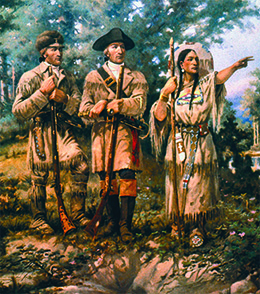

By the end of this section, you will be able to:
* Explain the significance of the Louisiana Purchase
* Describe the terms of the Adams-Onís Treaty
* Describe the role played by the filibuster in American expansion

 ![A timeline shows important events of the era. In 1803, Thomas Jefferson brokers the Louisiana Purchase. In 1805, Lewis and Clark&#x2019;s expedition reaches the Pacific Ocean; a map tracing Lewis and Clark&#x2019;s path is shown. In 1819, the U.S. acquires Florida under the Adams-On&#xED;s Treaty; a portrait of John Quincy Adams is shown. In 1820, the Missouri Compromise divides the Louisiana Purchase into &#x201C;slave&#x201D; and &#x201C;free&#x201D; states; the first page of a letter from Thomas Jefferson defending his position on the Missouri Compromise is shown. In 1845, the United States annexes Texas. In 1846, the U.S. declares war on Mexico, and Great Britain cedes Oregon territory to the United States; the seal of the Oregon territory is shown. In 1848, the Mexican Cession adds vast new territory to the United States; a map of Mexico in 1847 is shown. In 1849, the California Gold Rush begins; a promotional poster beckoning Americans to book their passage via steamship is shown. In 1850, Henry Clay brokers the Compromise of 1850.](../resources/CNX_History_11_01_Timeline.jpg){: #CNX_History_11_01_Timeline}

For centuries Europeans had mistakenly believed an all-water route across the North American continent existed. This “**Northwest Passage**{: data-type="term"}” would afford the country that controlled it not only access to the interior of North America but also—more importantly—a relatively quick route to the Pacific Ocean and to trade with Asia. The Spanish, French, and British searched for years before American explorers took up the challenge of finding it. Indeed, shortly before Lewis and Clark set out on their expedition for the U.S. government, Alexander Mackenzie, an officer of the British North West Company, a fur trading outfit, had attempted to discover the route. Mackenzie made it to the Pacific and even believed (erroneously) he had discovered the headwaters of the Columbia River, but he could not find an easy water route with a minimum of difficult portages, that is, spots where boats must be carried overland.

Many Americans also dreamed of finding a Northwest Passage and opening the Pacific to American commerce and influence, including President Thomas Jefferson. In April 1803, Jefferson achieved his goal of purchasing the Louisiana Territory from France, effectively doubling the size of the United States. The purchase was made possible due to events outside the nation’s control. With the success of the Haitian Revolution, an uprising of slaves against the French, France’s Napoleon abandoned his quest to re-establish an extensive French Empire in America. As a result, he was amenable to selling off the vast Louisiana territory. President Jefferson quickly set out to learn precisely what he had bought and to assess its potential for commercial exploitation. Above all else, Jefferson wanted to exert U.S. control over the territory, an area already well known to French and British explorers. It was therefore vital for the United States to explore and map the land to pave the way for future white settlement.

### JEFFERSON’S CORPS OF DISCOVERY HEADS WEST

To head the expedition into the Louisiana territory, Jefferson appointed his friend and personal secretary, twenty-nine-year-old army captain Meriwether Lewis, who was instructed to form a **Corps of Discovery**{: data-type="term"}. Lewis in turn selected William Clark, who had once been his commanding officer, to help him lead the group ([\[link\]](#CNX_History_11_01_LewisClark)).

  and Meriwether Lewis (b) in 1810 and 1807, respectively, after they returned from their expedition west."){: #CNX_History_11_01_LewisClark}

Jefferson wanted to improve the ability of American merchants to access the ports of China. Establishing a river route from St. Louis to the Pacific Ocean was crucial to capturing a portion of the fur trade that had proven so profitable to Great Britain. He also wanted to legitimize American claims to the land against rivals, such as Great Britain and Spain. Lewis and Clark were thus instructed to map the territory through which they would pass and to explore all tributaries of the Missouri River. This part of the expedition struck fear into Spanish officials, who believed that Lewis and Clark would encroach on New Mexico, the northern part of New Spain. Spain dispatched four unsuccessful expeditions from Santa Fe to intercept the explorers. Lewis and Clark also had directives to establish friendly relationships with the western tribes, introducing them to American trade goods and encouraging warring groups to make peace. Establishing an overland route to the Pacific would bolster U.S. claims to the Pacific Northwest, first established in 1792 when Captain Robert Gray sailed his ship *Columbia* into the mouth of the river that now bears his vessel’s name and forms the present-day border between Oregon and Washington. Finally, Jefferson, who had a keen interest in science and nature, ordered Lewis and Clark to take extensive notes on the geography, plant life, animals, and natural resources of the region into which they would journey.

After spending the winter of 1803–1804 encamped at the mouth of the Missouri River while the men prepared for their expedition, the corps set off in May 1804. Although the thirty-three frontiersmen, boatmen, and hunters took with them Alexander Mackenzie’s account of his explorations and the best maps they could find, they did not have any real understanding of the difficulties they would face. Fierce storms left them drenched and freezing. Enormous clouds of gnats and mosquitos swarmed about their heads as they made their way up the Missouri River. Along the way they encountered (and killed) a variety of animals including elk, buffalo, and grizzly bears. One member of the expedition survived a rattlesnake bite. As the men collected minerals and specimens of plants and animals, the overly curious Lewis sampled minerals by tasting them and became seriously ill at one point. What they did not collect, they sketched and documented in the journals they kept. They also noted the customs of the Indian tribes who controlled the land and attempted to establish peaceful relationships with them in order to ensure that future white settlement would not be impeded.

  
Read the journals of Lewis and Clark on the [University of Virginia][1] website or on the [University of Nebraska–Lincoln][2] website, which also has footnotes, maps, and commentary. According to their writings, what challenges did the explorers confront?

The corps spent their first winter in the wilderness, 1804–1805, in a Mandan village in what is now North Dakota. There they encountered a reminder of France’s former vast North American empire when they met a French fur trapper named Toussaint Charbonneau. When the corps left in the spring of 1805, Charbonneau accompanied them as a guide and interpreter, bringing his teenage Shoshone wife Sacagawea and their newborn son. Charbonneau knew the land better than the Americans, and Sacagawea proved invaluable in many ways, not least of which was that the presence of a young woman and her infant convinced many groups that the men were not a war party and meant no harm ([\[link\]](#CNX_History_11_01_Sacagawea)).

 {: #CNX_History_11_01_Sacagawea}

The corps set about making friends with native tribes while simultaneously attempting to assert American power over the territory. Hoping to overawe the people of the land, Lewis would let out a blast of his air rifle, a relatively new piece of technology the Indians had never seen. The corps also followed native custom by distributing gifts, including shirts, ribbons, and kettles, as a sign of goodwill. The explorers presented native leaders with medallions, many of which bore Jefferson’s image, and invited them to visit their new “ruler” in the East. These medallions or peace medals were meant to allow future explorers to identify friendly native groups. Not all efforts to assert U.S. control went peacefully; some Indians rejected the explorers’ intrusion onto their land. An encounter with the Blackfoot turned hostile, for example, and members of the corps killed two Blackfoot men.

After spending eighteen long months on the trail and nearly starving to death in the Bitterroot Mountains of Montana, the Corps of Discovery finally reached the Pacific Ocean in 1805 and spent the winter of 1805–1806 in Oregon. They returned to St. Louis later in 1806 having lost only one man, who had died of appendicitis. Upon their return, Meriwether Lewis was named governor of the Louisiana Territory. Unfortunately, he died only three years later in circumstances that are still disputed, before he could write a complete account of what the expedition had discovered.

Although the Corps of Discovery failed to find an all-water route to the Pacific Ocean (for none existed), it nevertheless accomplished many of the goals Jefferson had set. The men traveled across the North American continent and established relationships with many Indian tribes, paving the way for fur traders like John Jacob Astor who later established trading posts solidifying U.S. claims to Oregon. Delegates of several tribes did go to Washington to meet the president. Hundreds of plant and animal specimens were collected, several of which were named for Lewis and Clark in recognition of their efforts. And the territory was now more accurately mapped and legally claimed by the United States. Nonetheless, most of the vast territory, home to a variety of native peoples, remained unknown to Americans ([\[link\]](#CNX_History_11_01_LCTrack)).

 {: #CNX_History_11_01_LCTrack}

A Selection of Hats for the Fashionable Gentleman

Beaver hats ([\[link\]](#CNX_History_11_01_Beaver)) were popular apparel in the eighteenth and nineteenth centuries in both Europe and the United States because they were naturally waterproof and bore a glossy sheen. Demand for beaver pelts (and for the pelts of sea otters, foxes, and martens) by hat makers, dressmakers, and tailors led many fur trappers into the wilderness in pursuit of riches. Beaver hats fell out of fashion in the 1850s when silk hats became the rage and beaver became harder to find. In some parts of the West, the animals had been hunted nearly to extinction.

![An illustration titled &#x201C;Modifications of the Beaver Hat&#x201D; shows eight styles of beaver hat. The hats are labeled &#x201C;&#x2018;Continental&#x2019; Cocked Hat (1776)&#x201D;; &#x201C;&#x2018;Navy&#x2019; Cocked Hat (1800)&#x201D;; &#x201C;Army (1837)&#x201D;; &#x201C;Clerical (Eighteenth Century)&#x201D;; &#x201C;(The Wellington) (1812)&#x201D;; &#x201C;(The Paris Beau) (1815)&#x201D;; &#x201C;(The D&#x2019;Orsay) (1820)&#x201D;; and &#x201C;(The Regent) (1825).&#x201D; The label &#x201C;Civil&#x201D; appears between &#x201C;The Wellington&#x201D; and &#x201C;The Paris Beau.&#x201D;](../resources/CNX_History_11_01_Beaver.jpg "This illustration from Castrologia, Or, The History and Traditions of the Canadian Beaver shows a variety of beaver hat styles. Beaver pelts were also used to trim women&#x2019;s bonnets."){: #CNX_History_11_01_Beaver}

Are there any contemporary fashions or fads that likewise promise to alter the natural world?

### SPANISH FLORIDA AND THE ADAMS-ONÍS TREATY

Despite the Lewis and Clark expedition, the boundaries of the Louisiana Purchase remained contested. Expansionists chose to believe the purchase included vast stretches of land, including all of Spanish Texas. The Spanish government disagreed, however. The first attempt to resolve this issue took place in February 1819 with the signing of the Adams-Onís Treaty, which was actually intended to settle the problem of Florida.

Spanish Florida had presented difficulties for its neighbors since the settlement of the original North American colonies, first for England and then for the United States. By 1819, American settlers no longer feared attack by Spanish troops garrisoned in Florida, but hostile tribes like the Creek and Seminole raided Georgia and then retreated to the relative safety of the Florida wilderness. These tribes also sheltered runaway slaves, often intermarrying with them and making them members of their tribes. Sparsely populated by Spanish colonists and far from both Mexico City and Madrid, the frontier in Florida proved next to impossible for the Spanish government to control.

In March 1818, General Andrew Jackson, frustrated by his inability to punish Creek and Seminole raiders, pursued them across the international border into Spanish Florida. Under Jackson’s command, U.S. troops defeated the Creek and Seminole, occupied several Florida settlements, and executed two British citizens accused of acting against the United States. Outraged by the U.S. invasion of its territory, the Spanish government demanded that Jackson and his troops withdraw. In agreeing to the withdrawal, however, U.S. Secretary of State John Quincy Adams also offered to purchase the colony. Realizing that conflict between the United States and the Creeks and Seminoles would continue, Spain opted to cede the Spanish colony to its northern neighbor. The Adams-Onís Treaty, named for Adams and the Spanish ambassador, Luís de Onís, made the cession of Florida official while also setting the boundary between the United States and Mexico at the Sabine River ([\[link\]](#CNX_History_11_01_AdamsOnis)). In exchange, Adams gave up U.S. claims to lands west of the Sabine and forgave Spain’s $5 million debt to the United States.

 {: #CNX_History_11_01_AdamsOnis}

The Adams-Onís Treaty upset many American expansionists, who criticized Adams for not laying claim to all of Texas, which they believed had been included in the Louisiana Purchase. In the summer of 1819, James Long, a planter from Natchez, Mississippi, became a **filibuster**{: data-type="term"}, or a private, unauthorized military adventurer, when he led three hundred men on an expedition across the Sabine River to take control of Texas. Long’s men succeeded in capturing Nacogdoches, writing a Declaration of Independence (see below), and setting up a republican government. Spanish troops drove them out a month later. Returning in 1820 with a much smaller force, Long was arrested by the Spanish authorities, imprisoned, and killed. Long was but one of many nineteenth-century American filibusters who aimed at seizing territory in the Caribbean and Central America.

The Long Expedition’s Declaration of Independence

The Long Expedition’s short-lived Republic of Texas was announced with the drafting of a Declaration of Independence in 1819. The declaration named settlers’ grievances against the limits put on expansion by the Adams-Onís treaty and expressed their fears of Spain:

<q>The citizens of Texas have long indulged the hope, that in the adjustment of the boundaries of the Spanish possessions in America, and of the territories of the United States, that they should be included within the limits of the latter. The claims of the United States, long and strenuously urged, encouraged the hope. The recent \[Adams-Onís\] treaty between Spain and the United States of America has dissipated an illusion too long fondly cherished, and has roused the citizens of Texas . . . They have seen themselves . . . literally abandoned to the dominion of the crown of Spain and left a prey . . . to all those exactions which Spanish rapacity is fertile in devising. The citizens of Texas would have proved themselves unworthy of the age . . . unworthy of their ancestry, of the kindred of the republics of the American continent, could they have hesitated in this emergency . . . Spurning the fetters of colonial vassalage, disdaining to submit to the most atrocious despotism that ever disgraced the annals of Europe, they have resolved under the blessing of God to be free. </q>

How did the filibusters view Spain? What do their actions say about the nature of American society and of U.S. expansion?

### Section Summary

In 1803, Thomas Jefferson appointed Meriwether Lewis to organize an expedition into the Louisiana Territory to explore and map the area but also to find an all-water route from the Missouri River to the Pacific Coast. The Louisiana Purchase and the journey of Lewis and Clark’s Corps of Discovery captured the imagination of many, who dedicated themselves to the economic exploitation of the western lands and the expansion of American influence and power. In the South, the Adams-Onís treaty legally secured Florida for the United States, though it did nothing to end the resistance of the Seminoles against American expansionists. At the same time, the treaty frustrated those Americans who considered Texas a part of the Louisiana Purchase. Taking matters into their own hands, some American settlers tried to take Texas by force.

### Review Questions

As a result of the Adams-Onís Treaty, the United States gained which territory from Spain?

1.  Florida
2.  New Mexico
3.  California
4.  Nevada
{: type="A"}

A

The Long Expedition established a short-lived republic in Texas known as \_\_\_\_\_\_\_\_.

1.  the Lone Star Republic
2.  the Republic of Texas
3.  Columbiana
4.  the Republic of Fredonia
{: type="A"}

B

For what purposes did Thomas Jefferson send Lewis and Clark to explore the Louisiana Territory? What did he want them to accomplish?

Jefferson wanted Lewis and Clark to find an all-water route to the Pacific Ocean, strengthen U.S. claims to the Pacific Northwest by reaching it through an overland route, explore and map the territory, make note of its natural resources and wildlife, and make contact with Indian tribes with the intention of establishing trade with them.

### Glossary
{: data-type="glossary-title"}

Corps of Discovery
: the group led by Meriwether Lewis and William Clark on the expedition to explore and map the territory acquired in the Louisiana Purchase
^

filibuster
: a person who engages in an unofficial military operation intended to seize land from foreign countries or foment revolution there
^

Northwest Passage
: the nonexistent all-water route across the North American continent sought by European and American explorers

[1]: http://openstax.org/l/15LandClark
[2]: http://openstax.org/l/15LandClark1
