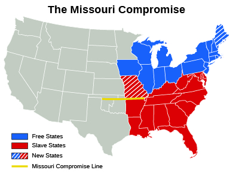

By the end of this section, you will be able to:
* Explain why the North and South differed over the admission of Missouri as a state
* Explain how the admission of new states to the Union threatened to upset the balance between free and slave states in Congress

Another stage of U.S. expansion took place when inhabitants of Missouri began petitioning for statehood beginning in 1817. The Missouri territory had been part of the Louisiana Purchase and was the first part of that vast acquisition to apply for statehood. By 1818, tens of thousands of settlers had flocked to Missouri, including slaveholders who brought with them some ten thousand slaves. When the status of the Missouri territory was taken up in earnest in the U.S. House of Representatives in early 1819, its admission to the Union proved to be no easy matter, since it brought to the surface a violent debate over whether slavery would be allowed in the new state.

Politicians had sought to avoid the issue of slavery ever since the 1787 Constitutional Convention arrived at an uneasy compromise in the form of the “three-fifths clause.” This provision stated that the entirety of a state’s free population and 60 percent of its enslaved population would be counted in establishing the number of that state’s members in the House of Representatives and the size of its federal tax bill. Although slavery existed in several northern states at the time, the compromise had angered many northern politicians because, they argued, the “extra” population of slaves would give southern states more votes than they deserved in both the House and the Electoral College. Admitting Missouri as a slave state also threatened the tenuous balance between free and slave states in the Senate by giving slave states a two-vote advantage.

The debate about representation shifted to the morality of slavery itself when New York representative James Tallmadge, an opponent of slavery, attempted to amend the statehood bill in the House of Representatives. Tallmadge proposed that Missouri be admitted as a free state, that no more slaves be allowed to enter Missouri after it achieved statehood, and that all enslaved children born there after its admission be freed at age twenty-five. The amendment shifted the terms of debate by presenting slavery as an evil to be stopped.

Northern representatives supported the **Tallmadge Amendment**{: data-type="term"}, denouncing slavery as immoral and opposed to the nation’s founding principles of equality and liberty. Southerners in Congress rejected the amendment as an attempt to gradually abolish slavery—not just in Missouri but throughout the Union—by violating the property rights of slaveholders and their freedom to take their property wherever they wished. Slavery’s apologists, who had long argued that slavery was a necessary evil, now began to perpetuate the idea that slavery was a positive good for the United States. They asserted that it generated wealth and left white men free to exercise their true talents instead of toiling in the soil, as the descendants of Africans were better suited to do. Slaves were cared for, supporters argued, and were better off exposed to the teachings of Christianity as slaves than living as free heathens in uncivilized Africa. Above all, the United States had a destiny, they argued, to create an empire of slavery throughout the Americas. These proslavery arguments were to be made repeatedly and forcefully as expansion to the West proceeded.

Most disturbing for the unity of the young nation, however, was that debaters divided along sectional lines, not party lines. With only a few exceptions, northerners supported the Tallmadge Amendment regardless of party affiliation, and southerners opposed it despite having party differences on other matters. It did not pass, and the crisis over Missouri led to strident calls of disunion and threats of civil war.

Congress finally came to an agreement, called the **Missouri Compromise**{: data-type="term"}, in 1820. Missouri and Maine (which had been part of Massachusetts) would enter the Union at the same time, Maine as a free state, Missouri as a slave state. The Tallmadge Amendment was narrowly rejected, the balance between free and slave states was maintained in the Senate, and southerners did not have to fear that Missouri slaveholders would be deprived of their human property. To prevent similar conflicts each time a territory applied for statehood, a line coinciding with the southern border of Missouri (at latitude 36° 30\') was drawn across the remainder of the Louisiana Territory ([\[link\]](#CNX_History_11_02_Missouri)). Slavery could exist south of this line but was forbidden north of it, with the obvious exception of Missouri.

 {: #CNX_History_11_02_Missouri}

Thomas Jefferson on the Missouri Crisis

On April 22, 1820, Thomas Jefferson wrote to John Holmes to express his reaction to the Missouri Crisis, especially the open threat of disunion and war:

\> I thank you, Dear Sir, for the copy you have been so kind as to send me of the letter to your constituents on the Missouri question. it is a perfect justification to them. I had for a long time ceased to read the newspapers or pay any attention to public affairs, confident they were in good hands, and content to be a passenger in our bark to the shore from which I am not distant. but this momentous question \[over slavery in Missouri\], like a fire bell in the night, awakened and filled me with terror. I considered it at once as the knell of the Union. it is hushed indeed for the moment. but this is a reprieve only, not a final sentence. a geographical line, coinciding with a marked principle, moral and political, once concieved \[sic\] and held up to the angry passions of men, will never be obliterated; and every new irritation will mark it deeper and deeper. I can say with conscious truth that there is not a man on earth who would sacrifice more than I would, to relieve us from this heavy reproach, in any practicable way. . . .
> * * *
> {: data-type="newline"}
> 
> I regret that I am now to die in the belief that the useless sacrifice of themselves, by the generation of 76. to acquire self government and happiness to their country, is to be thrown away by the unwise and unworthy passions of their sons, and that my only consolation is to be that I live not to weep over it. if they would but dispassionately weigh the blessings they will throw away against an abstract principle more likely to be effected by union than by scission, they would pause before they would perpetuate this act of suicide themselves and of treason against the hopes of the world. to yourself as the faithful advocate of union I tender the offering of my high esteem and respect.
> * * *
> {: data-type="newline"}
> 
> Th. Jefferson

How would you characterize the former president’s reaction? What do you think he means by writing that the Missouri Compromise line “is a reprieve only, not a final sentence”?

  
Access a collection of primary documents relating to the Missouri Compromise, including Missouri’s application for admission into the Union and Jefferson’s correspondence on the Missouri question, at the [Library of Congress][1] website.

# Section Summary

The Missouri Crisis created a division over slavery that profoundly and ominously shaped sectional identities and rivalries as never before. Conflict over the uneasy balance between slave and free states in Congress came to a head when Missouri petitioned to join the Union as a slave state in 1819, and the debate broadened from simple issues of representation to a critique of the morality of slavery. The debates also raised the specter of disunion and civil war, leading many, including Thomas Jefferson, to fear for the future of the republic. Under the Missouri Compromise, Missouri and Maine entered the Union at the same time, Maine as a free state, Missouri as a slave state, and a line was drawn across the remainder of the Louisiana territory north of which slavery was forbidden.

# Review Questions

A proposal to prohibit the importation of slaves to Missouri following its admission to the United States was made by \_\_\_\_\_\_\_\_. 

John C. Calhoun

Henry Clay

James Tallmadge

John Quincy Adams

C

To balance votes in the Senate, \_\_\_\_\_\_\_\_ was admitted to the Union as a free state at the same time that Missouri was admitted as a slave state. 

Florida

Maine

New York

Arkansas

B

Why did the Missouri Crisis trigger threats of disunion and war? Identify the positions of both southern slaveholders and northern opponents of the spread of slavery.

Northern politicians disliked the terms of the Missouri Compromise because it allowed the expansion of slavery into the lands acquired in the Louisiana Purchase. They feared this would lead to the West being dominated by slaveholders. Southerners disliked the compromise because it prohibited people from taking their slaves into the territory north of 36° 30' latitude, which they believed was a violation of their property rights.

## Glossary
{: data-type="glossary-title"}

Missouri Compromise
: an agreement reached in Congress in 1820 that allowed Missouri to enter the Union as a slave state, brought Maine into the Union as a free state, and prohibited slavery north of 36° 30\' latitude
{: .definition}

Tallmadge Amendment
: an amendment (which did not pass) proposed by representative James Tallmadge in 1819 that called for Missouri to be admitted as a free state and for all slaves there to be gradually emancipated
{: .definition}

[1]: http://openstaxcollege.org/l/15MOComp
