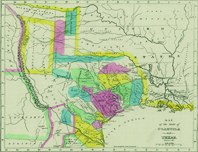

By the end of this section, you will be able to:
* Explain why American settlers in Texas sought independence from Mexico
* Discuss early attempts to make Texas independent of Mexico
* Describe the relationship between Anglo-Americans and Tejanos in Texas before and after independence

As the incursions of the earlier filibusters into Texas demonstrated, American expansionists had desired this area of Spain’s empire in America for many years. After the 1819 Adams-Onís treaty established the boundary between Mexico and the United States, more American expansionists began to move into the northern portion of Mexico’s province of Coahuila y Texas. Following Mexico’s independence from Spain in 1821, American settlers immigrated to Texas in even larger numbers, intent on taking the land from the new and vulnerable Mexican nation in order to create a new American slave state.

### AMERICAN SETTLERS MOVE TO TEXAS

After the 1819 Adams-Onís Treaty defined the U.S.-Mexico boundary, Spain began actively encouraging Americans to settle their northern province. Texas was sparsely settled, and the few Mexican farmers and ranchers who lived there were under constant threat of attack by hostile Indian tribes, especially the **Comanche**{: data-type="term" .no-emphasis}, who supplemented their hunting with raids in pursuit of horses and cattle.

To increase the non-Indian population in Texas and provide a buffer zone between its hostile tribes and the rest of Mexico, Spain began to recruit *empresarios*. An ***empresario***{: data-type="term"} was someone who brought settlers to the region in exchange for generous grants of land. Moses Austin, a once-prosperous entrepreneur reduced to poverty by the **Panic of 1819**{: data-type="term" .no-emphasis}, requested permission to settle three hundred English-speaking American residents in Texas. Spain agreed on the condition that the resettled people convert to Roman Catholicism.

On his deathbed in 1821, Austin asked his son Stephen to carry out his plans, and Mexico, which had won independence from Spain the same year, allowed Stephen to take control of his father’s grant. Like Spain, Mexico also wished to encourage settlement in the state of Coahuila y Texas and passed colonization laws to encourage immigration. Thousands of Americans, primarily from slave states, flocked to Texas and quickly came to outnumber the **Tejanos**{: data-type="term"}, the Mexican residents of the region. The soil and climate offered good opportunities to expand slavery and the cotton kingdom. Land was plentiful and offered at generous terms. Unlike the U.S. government, Mexico allowed buyers to pay for their land in installments and did not require a minimum purchase. Furthermore, to many whites, it seemed not only their God-given right but also their patriotic duty to populate the lands beyond the Mississippi River, bringing with them American slavery, culture, laws, and political traditions ([\[link\]](#CNX_History_11_03_EagleMap)).

  remained outside the U.S. border."){: #CNX_History_11_03_EagleMap}

### THE TEXAS WAR FOR INDEPENDENCE

Many Americans who migrated to Texas at the invitation of the Mexican government did not completely shed their identity or loyalty to the United States. They brought American traditions and expectations with them (including, for many, the right to own slaves). For instance, the majority of these new settlers were Protestant, and though they were not required to attend the Catholic mass, Mexico’s prohibition on the public practice of other religions upset them and they routinely ignored it.

Accustomed to representative democracy, jury trials, and the defendant’s right to appear before a judge, the Anglo-American settlers in Texas also disliked the Mexican legal system, which provided for an initial hearing by an ***alcalde***{: data-type="term"}, an administrator who often combined the duties of mayor, judge, and law enforcement officer. The *alcalde* sent a written record of the proceeding to a judge in Saltillo, the state capital, who decided the outcome. Settlers also resented that at most two Texas representatives were allowed in the state legislature.

Their greatest source of discontent, though, was the Mexican government’s 1829 abolition of slavery. Most American settlers were from southern states, and many had brought slaves with them. Mexico tried to accommodate them by maintaining the fiction that the slaves were indentured servants. But American slaveholders in Texas distrusted the Mexican government and wanted Texas to be a new U.S. slave state. The dislike of most for Roman Catholicism (the prevailing religion of Mexico) and a widely held belief in American racial superiority led them generally to regard Mexicans as dishonest, ignorant, and backward.

Belief in their own superiority inspired some Texans to try to undermine the power of the Mexican government. When *empresario* Haden Edwards attempted to evict people who had settled his land grant before he gained title to it, the Mexican government nullified its agreement with him. Outraged, Edwards and a small party of men took prisoner the *alcalde* of Nacogdoches. The Mexican army marched to the town, and Edwards and his troop then declared the formation of the **Republic of Fredonia**{: data-type="term" .no-emphasis} between the Sabine and Rio Grande Rivers. To demonstrate loyalty to their adopted country, a force led by Stephen Austin hastened to Nacogdoches to support the Mexican army. Edwards’s revolt collapsed, and the revolutionaries fled Texas.

The growing presence of American settlers in Texas, their reluctance to abide by Mexican law, and their desire for independence caused the Mexican government to grow wary. In 1830, it forbade future U.S. immigration and increased its military presence in Texas. Settlers continued to stream illegally across the long border; by 1835, after immigration resumed, there were twenty thousand Anglo-Americans in Texas ([\[link\]](#CNX_History_11_03_LandGrants)).

 {: #CNX_History_11_03_LandGrants}

Fifty-five delegates from the Anglo-American settlements gathered in 1831 to demand the suspension of customs duties, the resumption of immigration from the United States, better protection from Indian tribes, the granting of promised land titles, and the creation of an independent state of Texas separate from Coahuila. Ordered to disband, the delegates reconvened in early April 1833 to write a constitution for an independent Texas. Surprisingly, General Antonio Lopez de Santa Anna, Mexico’s new president, agreed to all demands, except the call for statehood ([\[link\]](#CNX_History_11_03_SantaAnna)). Coahuila y Texas made provisions for jury trials, increased Texas’s representation in the state legislature, and removed restrictions on commerce.

 {: #CNX_History_11_03_SantaAnna}

Texans’ hopes for independence were quashed in 1834, however, when Santa Anna dismissed the Mexican Congress and abolished all state governments, including that of Coahuila y Texas. In January 1835, reneging on earlier promises, he dispatched troops to the town of Anahuac to collect customs duties. Lawyer and soldier William B. Travis and a small force marched on Anahuac in June, and the fort surrendered. On October 2, Anglo-American forces met Mexican troops at the town of Gonzales; the Mexican troops fled and the Americans moved on to take San Antonio. Now more cautious, delegates to the Consultation of 1835 at San Felipe de Austin voted against declaring independence, instead drafting a statement, which became known as the Declaration of Causes, promising continued loyalty if Mexico returned to a constitutional form of government. They selected Henry Smith, leader of the Independence Party, as governor of Texas and placed Sam Houston, a former soldier who had been a congressman and governor of Tennessee, in charge of its small military force.

The Consultation delegates met again in March 1836. They declared their independence from Mexico and drafted a constitution calling for an American-style judicial system and an elected president and legislature. Significantly, they also established that slavery would not be prohibited in Texas. Many wealthy Tejanos supported the push for independence, hoping for liberal governmental reforms and economic benefits.

### REMEMBER THE ALAMO!

Mexico had no intention of losing its northern province. Santa Anna and his army of four thousand had besieged San Antonio in February 1836. Hopelessly outnumbered, its two hundred defenders, under Travis, fought fiercely from their refuge in an old mission known as the Alamo ([\[link\]](#CNX_History_11_03_Alamo)). After ten days, however, the mission was taken and all but a few of the defenders were dead, including Travis and James Bowie, the famed frontiersman who was also a land speculator and slave trader. A few male survivors, possibly including the frontier legend and former Tennessee congressman Davy Crockett, were led outside the walls and executed. The few women and children inside the mission were allowed to leave with the only adult male survivor, a slave owned by Travis who was then freed by the Mexican Army. Terrified, they fled.

{: #CNX_History_11_03_Alamo}

Although hungry for revenge, the Texas forces under Sam Houston nevertheless withdrew across Texas, gathering recruits as they went. Coming upon Santa Anna’s encampment on the banks of San Jacinto River on April 21, 1836, they waited as the Mexican troops settled for an afternoon nap. Assured by Houston that “Victory is certain!” and told to “Trust in God and fear not!” the seven hundred men descended on a sleeping force nearly twice their number with cries of “Remember the Alamo!” Within fifteen minutes the Battle of San Jacinto was over. Approximately half the Mexican troops were killed, and the survivors, including Santa Anna, taken prisoner.

Santa Anna grudgingly signed a peace treaty and was sent to Washington, where he met with President Andrew Jackson and, under pressure, agreed to recognize an independent Texas with the Rio Grande River as its southwestern border. By the time the agreement had been signed, however, Santa Anna had been removed from power in Mexico. For that reason, the Mexican Congress refused to be bound by Santa Anna’s promises and continued to insist that the renegade territory still belonged to Mexico.

  
Visit the official [Alamo][1] website to learn more about the battle of the Alamo and take a virtual tour of the old mission.

### THE LONE STAR REPUBLIC

In September 1836, military hero Sam Houston was elected president of Texas, and, following the relentless logic of U.S. expansion, Texans voted in favor of annexation to the United States. This had been the dream of many settlers in Texas all along. They wanted to expand the United States west and saw Texas as the next logical step. Slaveholders there, such as Sam Houston, William B. Travis and James Bowie (the latter two of whom died at the Alamo), believed too in the destiny of slavery. Mindful of the vicious debates over Missouri that had led to talk of disunion and war, American politicians were reluctant to annex Texas or, indeed, even to recognize it as a sovereign nation. Annexation would almost certainly mean war with Mexico, and the admission of a state with a large slave population, though permissible under the Missouri Compromise, would bring the issue of slavery once again to the fore. Texas had no choice but to organize itself as the independent Lone Star Republic. To protect itself from Mexican attempts to reclaim it, Texas sought and received recognition from France, Great Britain, Belgium, and the Netherlands. The United States did not officially recognize Texas as an independent nation until March 1837, nearly a year after the final victory over the Mexican army at San Jacinto.

Uncertainty about its future did not discourage Americans committed to expansion, especially slaveholders, from rushing to settle in the Lone Star Republic, however. Between 1836 and 1846, its population nearly tripled. By 1840, nearly twelve thousand enslaved Africans had been brought to Texas by American slaveholders. Many new settlers had suffered financial losses in the severe financial depression of 1837 and hoped for a new start in the new nation. According to folklore, across the United States, homes and farms were deserted overnight, and curious neighbors found notes reading only “GTT” (“Gone to Texas”). Many Europeans, especially Germans, also immigrated to Texas during this period.

In keeping with the program of ethnic cleansing and white racial domination, as illustrated by the image at the beginning of this chapter, Americans in Texas generally treated both Tejano and Indian residents with utter contempt, eager to displace and dispossess them. Anglo-American leaders failed to return the support their Tejano neighbors had extended during the rebellion and repaid them by seizing their lands. In 1839, the republic’s militia attempted to drive out the Cherokee and Comanche.

The impulse to expand did not lay dormant, and Anglo-American settlers and leaders in the newly formed Texas republic soon cast their gaze on the Mexican province of New Mexico as well. Repeating the tactics of earlier filibusters, a Texas force set out in 1841 intent on taking Santa Fe. Its members encountered an army of New Mexicans and were taken prisoner and sent to Mexico City. On Christmas Day, 1842, Texans avenged a Mexican assault on San Antonio by attacking the Mexican town of Mier. In August, another Texas army was sent to attack Santa Fe, but Mexican troops forced them to retreat. Clearly, hostilities between Texas and Mexico had not ended simply because Texas had declared its independence.

### Section Summary

The establishment of the Lone Star Republic formed a new chapter in the history of U.S. westward expansion. In contrast to the addition of the Louisiana Territory through diplomacy with France, Americans in Texas employed violence against Mexico to achieve their goals. Orchestrated largely by slaveholders, the acquisition of Texas appeared the next logical step in creating an American empire that included slavery. Nonetheless, with the Missouri Crisis in mind, the United States refused the Texans’ request to enter the United States as a slave state in 1836. Instead, Texas formed an independent republic where slavery was legal. But American settlers there continued to press for more land. The strained relationship between expansionists in Texas and Mexico in the early 1840s hinted of things to come.

### Review Questions

Texas won its independence from Mexico in \_\_\_\_\_\_\_\_.

1.  1821
2.  1830
3.  1836
4.  1845
{: type="A"}

C

Texans defeated the army of General Antonio Lopez de Santa Anna at the battle of \_\_\_\_\_\_\_\_.

1.  the Alamo
2.  San Jacinto
3.  Nacogdoches
4.  Austin
{: type="A"}

B

How did Texas settlers’ view of Mexico and its people contribute to the history of Texas in the 1830s?

American slaveholders in Texas distrusted the Mexican government’s reluctant tolerance of slavery and wanted Texas to be a new U.S. slave state. Most also disliked Mexicans’ Roman Catholicism and regarded them as dishonest, ignorant, and backward. Belief in their own superiority inspired some Texans to try to undermine the power of the Mexican government.

### Glossary
{: data-type="glossary-title"}

*alcalde*
: a Mexican official who often served as combined civil administrator, judge, and law enforcement officer
^

*empresario*
: a person who brought new settlers to Texas in exchange for a grant of land
^

Tejanos
: Mexican residents of Texas

[1]: http://openstaxcollege.org/l/15Alamo
