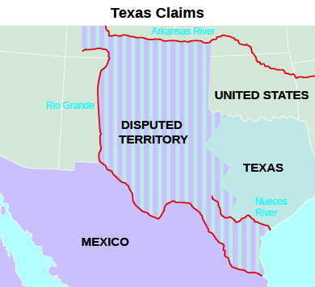

By the end of this section, you will be able to:
* Identify the causes of the Mexican-American War
* Describe the outcomes of the war in 1848, especially the Mexican Cession
* Describe the effect of the California Gold Rush on westward expansion

Tensions between the United States and Mexico rapidly deteriorated in the 1840s as American expansionists eagerly eyed Mexican land to the west, including the lush northern Mexican province of California. Indeed, in 1842, a U.S. naval fleet, incorrectly believing war had broken out, seized Monterey, California, a part of Mexico. Monterey was returned the next day, but the episode only added to the uneasiness with which Mexico viewed its northern neighbor. The forces of expansion, however, could not be contained, and American voters elected James Polk in 1844 because he promised to deliver more lands. President Polk fulfilled his promise by gaining Oregon and, most spectacularly, provoking a war with Mexico that ultimately fulfilled the wildest fantasies of expansionists. By 1848, the United States encompassed much of North America, a republic that stretched from the Atlantic to the Pacific.

# JAMES K. POLK AND THE TRIUMPH OF EXPANSION

A fervent belief in expansion gripped the United States in the 1840s. In 1845, a New York newspaper editor, John O’Sullivan, introduced the concept of “manifest destiny” to describe the very popular idea of the special role of the United States in overspreading the continent—the divine right and duty of white Americans to seize and settle the American West, thus spreading Protestant, democratic values. In this climate of opinion, voters in 1844 elected James K. Polk, a slaveholder from Tennessee, because he vowed to annex Texas as a new slave state and take Oregon.

Annexing Oregon was an important objective for U.S. foreign policy because it appeared to be an area rich in commercial possibilities. Northerners favored U.S. control of Oregon because ports in the Pacific Northwest would be gateways for trade with Asia. Southerners hoped that, in exchange for their support of expansion into the northwest, northerners would not oppose plans for expansion into the southwest.

President Polk—whose campaign slogan in 1844 had been “Fifty-four forty or fight!”—asserted the United States’ right to gain full control of what was known as Oregon Country, from its southern border at 42° latitude (the current boundary with California) to its northern border at 54° 40\' latitude. According to an 1818 agreement, Great Britain and the United States held joint ownership of this territory, but the 1827 Treaty of Joint Occupation opened the land to settlement by both countries. Realizing that the British were not willing to cede all claims to the territory, Polk proposed the land be divided at 49° latitude (the current border between Washington and Canada). The British, however, denied U.S. claims to land north of the Columbia River (Oregon’s current northern border) ([\[link\]](#CNX_History_11_04_OregonMap)). Indeed, the British foreign secretary refused even to relay Polk’s proposal to London. However, reports of the difficulty Great Britain would face defending Oregon in the event of a U.S. attack, combined with concerns over affairs at home and elsewhere in its empire, quickly changed the minds of the British, and in June 1846, Queen Victoria’s government agreed to a division at the forty-ninth parallel.

 ![A map of the Oregon territory during the period of joint occupation by the United States and Great Britain shows the area whose ownership was contested by the two powers. The uppermost region is labeled &#x201C;Rupert&#x2019;s Land (British),&#x201D; which lies in between the &#x201C;54&#xB0; 40&#x2032;- Extreme U.S. Claim&#x201D; and &#x201C;49&#xB0;&#x201D; lines. The central region, which lies in between the &#x201C;49&#xB0;&#x201D; and &#x201C;42&#xB0; - Extreme British Claim&#x201D; lines, contains Oregon Country. Beneath the &#x201C;42&#xB0; - Extreme British Claim&#x201D; line lies Mexico.](../resources/CNX_History_11_04_OregonMap.jpg "This map of the Oregon territory during the period of joint occupation by the United States and Great Britain shows the area whose ownership was contested by the two powers."){: #CNX_History_11_04_OregonMap}

In contrast to the diplomatic solution with Great Britain over Oregon, when it came to Mexico, Polk and the American people proved willing to use force to wrest more land for the United States. In keeping with voters’ expectations, President Polk set his sights on the Mexican state of California. After the mistaken capture of Monterey, negotiations about purchasing the port of San Francisco from Mexico broke off until September 1845. Then, following a revolt in California that left it divided in two, Polk attempted to purchase Upper California and New Mexico as well. These efforts went nowhere. The Mexican government, angered by U.S. actions, refused to recognize the independence of Texas.

Finally, after nearly a decade of public clamoring for the annexation of Texas, in December 1845 Polk officially agreed to the annexation of the former Mexican state, making the Lone Star Republic an additional slave state. Incensed that the United States had annexed Texas, however, the Mexican government refused to discuss the matter of selling land to the United States. Indeed, Mexico refused even to acknowledge Polk’s emissary, John Slidell, who had been sent to Mexico City to negotiate. Not to be deterred, Polk encouraged Thomas O. Larkin, the U.S. consul in Monterey, to assist any American settlers and any **Californios**{: data-type="term"}, the Mexican residents of the state, who wished to proclaim their independence from Mexico. By the end of 1845, having broken diplomatic ties with the United States over Texas and having grown alarmed by American actions in California, the Mexican government warily anticipated the next move. It did not have long to wait.

# WAR WITH MEXICO, 1846–1848

Expansionistic fervor propelled the United States to war against Mexico in 1846. The United States had long argued that the Rio Grande was the border between Mexico and the United States, and at the end of the Texas war for independence Santa Anna had been pressured to agree. Mexico, however, refused to be bound by Santa Anna’s promises and insisted the border lay farther north, at the Nueces River ([\[link\]](#CNX_History_11_04_TXBorder)). To set it at the Rio Grande would, in effect, allow the United States to control land it had never occupied. In Mexico’s eyes, therefore, President Polk violated its sovereign territory when he ordered U.S. troops into the disputed lands in 1846. From the Mexican perspective, it appeared the United States had invaded their nation.

 {: #CNX_History_11_04_TXBorder}

In January 1846, the U.S. force that was ordered to the banks of the Rio Grande to build a fort on the “American” side encountered a Mexican cavalry unit on patrol. Shots rang out, and sixteen U.S. soldiers were killed or wounded. Angrily declaring that Mexico “has invaded our territory and shed American blood upon American soil,” President Polk demanded the United States declare war on Mexico. On May 12, Congress obliged.

The small but vocal antislavery faction decried the decision to go to war, arguing that Polk had deliberately provoked hostilities so the United States could annex more slave territory. Illinois representative Abraham Lincoln and other members of Congress issued the “Spot Resolutions” in which they demanded to know the precise spot on U.S. soil where American blood had been spilled. Many Whigs also denounced the war. Democrats, however, supported Polk’s decision, and volunteers for the army came forward in droves from every part of the country except New England, the seat of abolitionist activity. Enthusiasm for the war was aided by the widely held belief that Mexico was a weak, impoverished country and that the Mexican people, perceived as ignorant, lazy, and controlled by a corrupt Roman Catholic clergy, would be easy to defeat. ([\[link\]](#CNX_History_11_04_Priests)).

 "){: #CNX_History_11_04_Priests}

U.S. military strategy had three main objectives: 1) Take control of northern Mexico, including New Mexico; 2) seize California; and 3) capture Mexico City. General Zachary Taylor and his Army of the Center were assigned to accomplish the first goal, and with superior weapons they soon captured the Mexican city of Monterrey. Taylor quickly became a hero in the eyes of the American people, and Polk appointed him commander of all U.S. forces.

General Stephen Watts Kearny, commander of the Army of the West, accepted the surrender of Santa Fe, New Mexico, and moved on to take control of California, leaving Colonel Sterling Price in command. Despite Kearny’s assurances that New Mexicans need not fear for their lives or their property, and in fact the region’s residents rose in revolt in January 1847 in an effort to drive the Americans away. Although Price managed to put an end to the rebellion, tensions remained high.

Kearny, meanwhile, arrived in California to find it already in American hands through the joint efforts of California settlers, U.S. naval commander John D. Sloat, and John C. Fremont, a former army captain and son-in-law of Missouri senator Thomas Benton. Sloat, at anchor off the coast of Mazatlan, learned that war had begun and quickly set sail for California. He seized the town of Monterey in July 1846, less than a month after a group of American settlers led by William B. Ide had taken control of Sonoma and declared California a republic. A week after the fall of Monterey, the navy took San Francisco with no resistance. Although some Californios staged a short-lived rebellion in September 1846, many others submitted to the U.S. takeover. Thus Kearny had little to do other than take command of California as its governor.

Leading the Army of the South was General Winfield Scott. Both Taylor and Scott were potential competitors for the presidency, and believing—correctly—that whoever seized Mexico City would become a hero, Polk assigned Scott the campaign to avoid elevating the more popular Taylor, who was affectionately known as “Old Rough and Ready.”

Scott captured Veracruz in March 1847, and moving in a northwesterly direction from there (much as Spanish conquistador Hernán Cortés had done in 1519), he slowly closed in on the capital. Every step of the way was a hard-fought victory, however, and Mexican soldiers and civilians both fought bravely to save their land from the American invaders. Mexico City’s defenders, including young military cadets, fought to the end. According to legend, cadet Juan Escutia’s last act was to save the Mexican flag, and he leapt from the city’s walls with it wrapped around his body. On September 14, 1847, Scott entered Mexico City’s central plaza; the city had fallen ([\[link\]](#CNX_History_11_04_Scott)). While Polk and other expansionists called for “all Mexico,” the Mexican government and the United States negotiated for peace in 1848, resulting in the Treaty of Guadalupe Hidalgo.

 , Carl Nebel depicts General Winfield Scott on a white horse entering Mexico City&#x2019;s Plaza de la Constituci&#xF3;n as anxious residents of the city watch. One woman peers furtively from behind the curtain of an upstairs window. On the left, a man bends down to pick up a paving stone to throw at the invaders."){: #CNX_History_11_04_Scott}

The Treaty of Guadalupe Hidalgo, signed in February 1848, was a triumph for American expansionism under which Mexico ceded nearly half its land to the United States. The **Mexican Cession**{: data-type="term"}, as the conquest of land west of the Rio Grande was called, included the current states of California, New Mexico, Arizona, Nevada, Utah, and portions of Colorado and Wyoming. Mexico also recognized the Rio Grande as the border with the United States. Mexican citizens in the ceded territory were promised U.S. citizenship in the future when the territories they were living in became states. In exchange, the United States agreed to assume $3.35 million worth of Mexican debts owed to U.S. citizens, paid Mexico $15 million for the loss of its land, and promised to guard the residents of the Mexican Cession from Indian raids.

As extensive as the Mexican Cession was, some argued the United States should not be satisfied until it had taken all of Mexico. Many who were opposed to this idea were southerners who, while desiring the annexation of more slave territory, did not want to make Mexico’s large mestizo (people of mixed Indian and European ancestry) population part of the United States. Others did not want to absorb a large group of Roman Catholics. These expansionists could not accept the idea of new U.S. territory filled with mixed-race, Catholic populations.

  
Explore the [U.S.-Mexican War][1] at PBS to read about life in the Mexican and U.S. armies during the war and to learn more about the various battles.

# CALIFORNIA AND THE GOLD RUSH

The United States had no way of knowing that part of the land about to be ceded by Mexico had just become far more valuable than anyone could have imagined. On January 24, 1848, James Marshall discovered gold in the millrace of the sawmill he had built with his partner John Sutter on the south fork of California’s **American River**{: data-type="term" .no-emphasis}. Word quickly spread, and within a few weeks all of Sutter’s employees had left to search for gold. When the news reached San Francisco, most of its inhabitants abandoned the town and headed for the American River. By the end of the year, thousands of California’s residents had gone north to the gold fields with visions of wealth dancing in their heads, and in 1849 thousands of people from around the world followed them ([\[link\]](#CNX_History_11_04_GoldRushAd)). The Gold Rush had begun.

 {: #CNX_History_11_04_GoldRushAd}

The fantasy of instant wealth induced a mass exodus to California. Settlers in Oregon and Utah rushed to the American River. Easterners sailed around the southern tip of South America or to Panama’s Atlantic coast, where they crossed the Isthmus of Panama to the Pacific and booked ship’s passage for San Francisco. As California-bound vessels stopped in South American ports to take on food and fresh water, hundreds of Peruvians and Chileans streamed aboard. Easterners who could not afford to sail to California crossed the continent on foot, on horseback, or in wagons. Others journeyed from as far away as Hawaii and Europe. Chinese people came as well, adding to the polyglot population in the California boomtowns ([\[link\]](#CNX_History_11_04_California)).

 ![A lithograph captioned &#x201C;The Way They Go to California&#x201D; shows a dock teeming with men holding picks and shovels. Several reach out or jump from the dock in an attempt to catch a ship that is departing, exclaiming &#x201C;Hold on there. I&#x2019;ve paid my passage and I ain&#x2019;t aboard&#x201D;; &#x201C;Bill, I&#x2019;m afraid we can&#x2019;t get aboard&#x201D;; and &#x201C;I&#x2019;m bound to go anywhere.&#x201D; A man on a rocket ship labeled &#x201C;Rocket Line&#x201D; flies overhead with his hat blowing off, exclaiming &#x201C;My hair!! how the wind blows.&#x201D; Other men fly overhead in an airship, from which one man parachutes holding a pick and shovel.](../resources/CNX_History_11_04_California.jpg "This Currier &amp; Ives lithograph from 1849 imagines the extreme lengths that people might go to in order to be part of the California Gold Rush. In addition to the men with picks and shovels trying to reach the ship from the dock, airships and rocket are shown flying overhead. (credit: Library of Congress)"){: #CNX_History_11_04_California}

Once in California, gathered in camps with names like Drunkard’s Bar, Angel’s Camp, Gouge Eye, and Whiskeytown, the “**forty-niners**{: data-type="term"}” did not find wealth so easy to come by as they had first imagined. Although some were able to find gold by panning for it or shoveling soil from river bottoms into sieve-like contraptions called rockers, most did not. The placer gold, the gold that had been washed down the mountains into streams and rivers, was quickly exhausted, and what remained was deep below ground. Independent miners were supplanted by companies that could afford not only to purchase hydraulic mining technology but also to hire laborers to work the hills. The frustration of many a miner was expressed in the words of Sullivan Osborne. In 1857, Osborne wrote that he had arrived in California “full of high hopes and bright anticipations of the future” only to find his dreams “have long since perished.” Although $550 million worth of gold was found in California between 1849 and 1850, very little of it went to individuals.

Observers in the gold fields also reported abuse of Indians by miners. Some miners forced Indians to work their claims for them; others drove Indians off their lands, stole from them, and even murdered them. Foreigners were generally disliked, especially those from South America. The most despised, however, were the thousands of Chinese migrants. Eager to earn money to send to their families in Hong Kong and southern China, they quickly earned a reputation as frugal men and hard workers who routinely took over diggings others had abandoned as worthless and worked them until every scrap of gold had been found. Many American miners, often spendthrifts, resented their presence and discriminated against them, believing the Chinese, who represented about 8 percent of the nearly 300,000 who arrived, were depriving them of the opportunity to make a living.

  
Visit [The Chinese in California][2] to learn more about the experience of Chinese migrants who came to California in the Gold Rush era.

In 1850, California imposed a tax on foreign miners, and in 1858 it prohibited all immigration from China. Those Chinese who remained in the face of the growing hostility were often beaten and killed, and some Westerners made a sport of cutting off Chinese men’s queues, the long braids of hair worn down their backs ([\[link\]](#CNX_History_11_04_Chivalry)). In 1882, Congress took up the power to restrict immigration by banning the further immigration of Chinese.

 ![An illustration captioned &#x201C;Pacific Chivalry. Encouragement to Chinese Immigration&#x201D; depicts a white man, whose hat is labeled &#x201C;California,&#x201D; preparing to whip a Chinese man; he holds the man by his queue as the man attempts to flee, his characteristic hat having fallen beside him. Beside the railroad tracks running past the pair, a sign reads &#x201C;Courts of Justice Closed to Chinese. Extra Taxes to &#x2018;Yellow Jack.&#x2019;&#x201D; The Pacific landscape is visible in the background.](../resources/CNX_History_11_04_Chivalry.jpg "&#x201C;Pacific Chivalry: Encouragement to Chinese Immigration,&#x201D; which appeared in Harper&#x2019;s Weekly in 1869, depicts a white man attacking a Chinese man with a whip as he holds him by the queue. Americans sometimes forcefully cut off the queues of Chinese immigrants. This could have serious consequences for the victim. Until 1911, all Chinese men were required by their nation&#x2019;s law to wear the queue as a sign of loyalty. Miners returning to China without it could be put to death. (credit: Library of Congress)"){: #CNX_History_11_04_Chivalry}

As people flocked to California in 1849, the population of the new territory swelled from a few thousand to about 100,000. The new arrivals quickly organized themselves into communities, and the trappings of “civilized” life—stores, saloons, libraries, stage lines, and fraternal lodges—began to appear. Newspapers were established, and musicians, singers, and acting companies arrived to entertain the gold seekers. The epitome of these Gold Rush boomtowns was San Francisco, which counted only a few hundred residents in 1846 but by 1850 had reached a population of thirty-four thousand ([\[link\]](#CNX_History_11_04_Francisco)). So quickly did the territory grow that by 1850 California was ready to enter the Union as a state. When it sought admission, however, the issue of slavery expansion and sectional tensions emerged once again.

 "){: #CNX_History_11_04_Francisco}

# Section Summary

President James K. Polk’s administration was a period of intensive expansion for the United States. After overseeing the final details regarding the annexation of Texas from Mexico, Polk negotiated a peaceful settlement with Great Britain regarding ownership of the Oregon Country, which brought the United States what are now the states of Washington and Oregon. The acquisition of additional lands from Mexico, a country many in the United States perceived as weak and inferior, was not so bloodless. The Mexican Cession added nearly half of Mexico’s territory to the United States, including New Mexico and California, and established the U.S.-Mexico border at the Rio Grande. The California Gold Rush rapidly expanded the population of the new territory, but also prompted concerns over immigration, especially from China.

# Review Questions

Which of the following was *not* a reason the United States was reluctant to annex Texas? 

The United States did not want to fight a war with Mexico.

Annexing Texas would add more slave territory to the United States and anger abolitionists.

Texans considered U.S. citizens inferior and did not want to be part of their country.

Adding Texas would upset the balance between free and slave states in Congress.

C

According to treaties signed in 1818 and 1827, with which country did the United States jointly occupy Oregon? 

Great Britain

Spain

Mexico

France

A

During the war between the United States and Mexico, revolts against U.S. control broke out in \_\_\_\_\_\_\_\_. 

Florida and Texas

New Mexico and California

California and Texas

Florida and California

B

Why did whites in California dislike the Chinese so much?

The Chinese were seemingly more disciplined than the majority of the white miners, gaining a reputation for being extremely hard-working and frugal. White miners resented the mining successes that the Chinese earned. They believed the Chinese were unfairly depriving them of the means to earn a living.

## Glossary
{: data-type="glossary-title"}

Californios
: Mexican residents of California
{: .definition}

forty-niners
: the nickname for those who traveled to California in 1849 in hopes of finding gold
{: .definition}

Mexican Cession
: the lands west of the Rio Grande ceded to the United States by Mexico in 1848, including California, Arizona, New Mexico, Nevada, Utah, and parts of Wyoming and Colorado
{: .definition}

[1]: http://openstaxcollege.org/l/15MexAmWar
[2]: http://openstaxcollege.org/l/15ChinaCA
