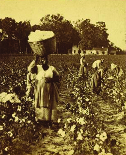

By the end of this section, you will be able to:
* Explain the labor-intensive processes of cotton production
* Describe the importance of cotton to the Atlantic and American antebellum economy

 ![A timeline shows important events of the era. In 1794, Eli Whitney patents the cotton gin; an illustration of slaves using a cotton gin is shown. In 1803, the U.S. purchases Louisiana Territory from France; a painting depicting the raising of the U.S. flag in the main plaza of New Orleans is shown. In 1811, Charles Deslondes leads a slave revolt in Louisiana. In 1831, Nat Turner leads a slave rebellion; an illustration of Nat Turner&#x2019;s capture is shown. In 1845, the United States annexes Texas; a contemporaneous map of the United States is shown. In 1850, John C. Calhoun&#x2019;s &#x201C;Disquisition on Government&#x201D; is published. In 1852, Harriet Beecher Stowe publishes Uncle Tom&#x2019;s Cabin; an illustration from Uncle Tom&#x2019;s Cabin is shown. In 1854, the Ostend Manifesto is made public. In 1855, William Walker conquers Nicaragua and legalizes slavery.](../resources/CNX_History_12_01_Timeline.jpg){: #Figure_12_01_Timeline}

In the **antebellum**{: data-type="term"} era—that is, in the years before the Civil War—American planters in the South continued to grow Chesapeake tobacco and Carolina rice as they had in the colonial era. Cotton, however, emerged as the antebellum South’s major commercial crop, eclipsing tobacco, rice, and sugar in economic importance. By 1860, the region was producing two-thirds of the world’s cotton. In 1793, Eli Whitney revolutionized the production of cotton when he invented the **cotton gin**{: data-type="term"}, a device that separated the seeds from raw cotton. Suddenly, a process that was extraordinarily labor-intensive when done by hand could be completed quickly and easily. American plantation owners, who were searching for a successful staple crop to compete on the world market, found it in cotton.

As a commodity, cotton had the advantage of being easily stored and transported. A demand for it already existed in the industrial textile mills in Great Britain, and in time, a steady stream of slave-grown American cotton would also supply northern textile mills. Southern cotton, picked and processed by American slaves, helped fuel the nineteenth-century Industrial Revolution in both the United States and Great Britain.

### KING COTTON

Almost no cotton was grown in the United States in 1787, the year the federal constitution was written. However, following the War of 1812, a huge increase in production resulted in the so-called **cotton boom**{: data-type="term"}, and by midcentury, cotton became the key **cash crop**{: data-type="term"} (a crop grown to sell rather than for the farmer’s sole use) of the southern economy and the most important American commodity. By 1850, of the 3.2 million slaves in the country’s fifteen slave states, 1.8 million were producing cotton; by 1860, slave labor was producing over two billion pounds of cotton per year. Indeed, American cotton soon made up two-thirds of the global supply, and production continued to soar. By the time of the Civil War, South Carolina politician James Hammond confidently proclaimed that the North could never threaten the South because “cotton is king.”

The crop grown in the South was a hybrid: *Gossypium barbadense*, known as Petit Gulf cotton, a mix of Mexican, Georgia, and Siamese strains. Petit Gulf cotton grew extremely well in different soils and climates. It dominated cotton production in the Mississippi River Valley—home of the new slave states of Louisiana, Mississippi, Arkansas, Tennessee, Kentucky, and Missouri—as well as in other states like Texas. Whenever new slave states entered the Union, white slaveholders sent armies of slaves to clear the land in order to grow and pick the lucrative crop. The phrase “to be sold down the river,” used by Harriet Beecher Stowe in her 1852 novel *Uncle Tom’s Cabin*, refers to this forced migration from the upper southern states to the Deep South, lower on the Mississippi, to grow cotton.

The slaves who built this cotton kingdom with their labor started by clearing the land. Although the Jeffersonian vision of the settlement of new U.S. territories entailed white yeoman farmers single-handedly carving out small independent farms, the reality proved quite different. Entire old-growth forests and cypress swamps fell to the axe as slaves labored to strip the vegetation to make way for cotton. With the land cleared, slaves readied the earth by plowing and planting. To ambitious white planters, the extent of new land available for cotton production seemed almost limitless, and many planters simply leapfrogged from one area to the next, abandoning their fields every ten to fifteen years after the soil became exhausted. Theirs was a world of mobility and restlessness, a constant search for the next area to grow the valuable crop. Slaves composed the vanguard of this American expansion to the West.

Cotton planting took place in March and April, when slaves planted seeds in rows around three to five feet apart. Over the next several months, from April to August, they carefully tended the plants. Weeding the cotton rows took significant energy and time. In August, after the cotton plants had flowered and the flowers had begun to give way to cotton bolls (the seed-bearing capsule that contains the cotton fiber), all the plantation’s slaves—men, women, and children—worked together to pick the crop ([\[link\]](#Figure_12_01_CottonGA)). On each day of cotton picking, slaves went to the fields with sacks, which they would fill as many times as they could. The effort was laborious, and a white “driver” employed the lash to make slaves work as quickly as possible.

 {: #Figure_12_01_CottonGA}

Cotton planters projected the amount of cotton they could harvest based on the number of slaves under their control. In general, planters expected a good “hand,” or slave, to work ten acres of land and pick two hundred pounds of cotton a day. An overseer or master measured each individual slave’s daily yield. Great pressure existed to meet the expected daily amount, and some masters whipped slaves who picked less than expected.

Cotton picking occurred as many as seven times a season as the plant grew and continued to produce bolls through the fall and early winter. During the picking season, slaves worked from sunrise to sunset with a ten-minute break at lunch; many slaveholders tended to give them little to eat, since spending on food would cut into their profits. Other slaveholders knew that feeding slaves could increase productivity and therefore provided what they thought would help ensure a profitable crop. The slaves’ day didn’t end after they picked the cotton; once they had brought it to the gin house to be weighed, they then had to care for the animals and perform other chores. Indeed, slaves often maintained their own gardens and livestock, which they tended after working the cotton fields, in order to supplement their supply of food.

Sometimes the cotton was dried before it was ginned (put through the process of separating the seeds from the cotton fiber). The cotton gin allowed a slave to remove the seeds from fifty pounds of cotton a day, compared to one pound if done by hand. After the seeds had been removed, the cotton was pressed into bales. These bales, weighing about four hundred to five hundred pounds, were wrapped in burlap cloth and sent down the Mississippi River.

  
Visit the [Internet Archive][1] to watch a 1937 WPA film showing cotton bales being loaded onto a steamboat.

As the cotton industry boomed in the South, the Mississippi River quickly became the essential water highway in the United States. Steamboats, a crucial part of the transportation revolution thanks to their enormous freight-carrying capacity and ability to navigate shallow waterways, became a defining component of the cotton kingdom. Steamboats also illustrated the class and social distinctions of the antebellum age. While the decks carried precious cargo, ornate rooms graced the interior. In these spaces, whites socialized in the ship’s saloons and dining halls while black slaves served them ([\[link\]](#Figure_12_01_Saloon)).

 {: #Figure_12_01_Saloon}

Investors poured huge sums into steamships. In 1817, only seventeen plied the waters of western rivers, but by 1837, there were over seven hundred steamships in operation. Major new ports developed at St. Louis, Missouri; Memphis, Tennessee; and other locations. By 1860, some thirty-five hundred vessels were steaming in and out of New Orleans, carrying an annual cargo made up primarily of cotton that amounted to $220 million worth of goods (approximately $6.5 billion in 2014 dollars).

New Orleans had been part of the French empire before the United States purchased it, along with the rest of the Louisiana Territory, in 1803. In the first half of the nineteenth century, it rose in prominence and importance largely because of the cotton boom, steam-powered river traffic, and its strategic position near the mouth of the Mississippi River. Steamboats moved down the river transporting cotton grown on plantations along the river and throughout the South to the port at New Orleans. From there, the bulk of American cotton went to Liverpool, England, where it was sold to British manufacturers who ran the cotton mills in Manchester and elsewhere. This lucrative international trade brought new wealth and new residents to the city. By 1840, New Orleans alone had 12 percent of the nation’s total banking capital, and visitors often commented on the great cultural diversity of the city. In 1835, Joseph Holt Ingraham wrote: “Truly does New-Orleans represent every other city and nation upon earth. I know of none where is congregated so great a variety of the human species.” Slaves, cotton, and the steamship transformed the city from a relatively isolated corner of North America in the eighteenth century to a thriving metropolis that rivaled New York in importance ([\[link\]](#Figure_12_01_Levee)).

  shows the bustling port of New Orleans with bales of cotton waiting to be shipped. The sheer volume of cotton indicates its economic importance throughout the century."){: #Figure_12_01_Levee}

### THE DOMESTIC SLAVE TRADE

The South’s dependence on cotton was matched by its dependence on slaves to harvest the cotton. Despite the rhetoric of the Revolution that “all men are created equal,” slavery not only endured in the American republic but formed the very foundation of the country’s economic success. Cotton and slavery occupied a central—and intertwined—place in the nineteenth-century economy.

In 1807, the U.S. Congress abolished the foreign slave trade, a ban that went into effect on January 1, 1808. After this date, importing slaves from Africa became illegal in the United States. While smuggling continued to occur, the end of the international slave trade meant that domestic slaves were in very high demand. Fortunately for Americans whose wealth depended upon the exploitation of slave labor, a fall in the price of tobacco had caused landowners in the Upper South to reduce their production of this crop and use more of their land to grow wheat, which was far more profitable. While tobacco was a labor-intensive crop that required many people to cultivate it, wheat was not. Former tobacco farmers in the older states of Virginia and Maryland found themselves with “surplus” slaves whom they were obligated to feed, clothe, and shelter. Some slaveholders responded to this situation by freeing slaves; far more decided to sell their excess bondsmen. Virginia and Maryland therefore took the lead in the **domestic slave trade**{: data-type="term"}, the trading of slaves within the borders of the United States.

The domestic slave trade offered many economic opportunities for white men. Those who sold their slaves could realize great profits, as could the slave brokers who served as middlemen between sellers and buyers. Other white men could benefit from the trade as owners of warehouses and pens in which slaves were held, or as suppliers of clothing and food for slaves on the move. Between 1790 and 1859, slaveholders in Virginia sold more than half a million slaves. In the early part of this period, many of these slaves were sold to people living in Kentucky, Tennessee, and North and South Carolina. By the 1820s, however, people in Kentucky and the Carolinas had begun to sell many of their slaves as well. Maryland slave dealers sold at least 185,000 slaves. Kentucky slaveholders sold some seventy-one thousand individuals. Most of the slave traders carried these slaves further south to Alabama, Louisiana, and Mississippi. New Orleans, the hub of commerce, boasted the largest slave market in the United States and grew to become the nation’s fourth-largest city as a result. Natchez, Mississippi, had the second-largest market. In Virginia, Maryland, the Carolinas, and elsewhere in the South, slave auctions happened every day.

All told, the movement of slaves in the South made up one of the largest forced internal migrations in the United States. In each of the decades between 1820 and 1860, about 200,000 people were sold and relocated. The 1800 census recorded over one million African Americans, of which nearly 900,000 were slaves. By 1860, the total number of African Americans increased to 4.4 million, and of that number, 3.95 million were held in bondage. For many slaves, the domestic slave trade incited the terror of being sold away from family and friends.

Solomon Northup Remembers the New Orleans Slave Market

Solomon Northup was a free black man living in Saratoga, New York, when he was kidnapped and sold into slavery in 1841. He later escaped and wrote a book about his experiences: <em>Twelve Years a Slave. Narrative of Solomon Northup, a Citizen of New-York, Kidnapped in Washington City in 1841 and Rescued in 1853 </em>(the basis of a 2013 Academy Award–winning film)*.* This excerpt derives from Northup’s description of being sold in New Orleans, along with fellow slave Eliza and her children Randall and Emily.

<q>One old gentleman, who said he wanted a coachman, appeared to take a fancy to me. . . . * * *
{: data-type="newline"}

The same man also purchased Randall. The little fellow was made to jump, and run across the floor, and perform many other feats, exhibiting his activity and condition. All the time the trade was going on, Eliza was crying aloud, and wringing her hands. She besought the man not to buy him, unless he also bought her self and Emily. . . . Freeman turned round to her, savagely, with his whip in his uplifted hand, ordering her to stop her noise, or he would flog her. He would not have such work—such snivelling; and unless she ceased that minute, he would take her to the yard and give her a hundred lashes. . . . Eliza shrunk before him, and tried to wipe away her tears, but it was all in vain. She wanted to be with her children, she said, the little time she had to live. All the frowns and threats of Freeman, could not wholly silence the afflicted mother.</q>

What does Northup’s narrative tell you about the experience of being a slave? How does he characterize Freeman, the slave trader? How does he characterize Eliza?

### THE SOUTH IN THE AMERICAN AND WORLD MARKETS

The first half of the nineteenth century saw a market revolution in the United States, one in which industrialization brought changes to both the production and the consumption of goods. Some southerners of the time believed that their region’s reliance on a single cash crop and its use of slaves to produce it gave the South economic independence and made it immune from the effects of these changes, but this was far from the truth. Indeed, the production of cotton brought the South more firmly into the larger American and Atlantic markets. Northern mills depended on the South for supplies of raw cotton that was then converted into textiles. But this domestic cotton market paled in comparison to the Atlantic market. About 75 percent of the cotton produced in the United States was eventually exported abroad. Exporting at such high volumes made the United States the undisputed world leader in cotton production. Between the years 1820 and 1860, approximately 80 percent of the global cotton supply was produced in the United States. Nearly all the exported cotton was shipped to Great Britain, fueling its burgeoning textile industry and making the powerful British Empire increasingly dependent on American cotton and southern slavery.

The power of cotton on the world market may have brought wealth to the South, but it also increased its economic dependence on other countries and other parts of the United States. Much of the corn and pork that slaves consumed came from farms in the West. Some of the inexpensive clothing, called “slops,” and shoes worn by slaves were manufactured in the North. The North also supplied the furnishings found in the homes of both wealthy planters and members of the middle class. Many of the trappings of domestic life, such as carpets, lamps, dinnerware, upholstered furniture, books, and musical instruments—all the accoutrements of comfortable living for southern whites—were made in either the North or Europe. Southern planters also borrowed money from banks in northern cities, and in the southern summers, took advantage of the developments in transportation to travel to resorts at Saratoga, New York; Litchfield, Connecticut; and Newport, Rhode Island.

### Section Summary

In the years before the Civil War, the South produced the bulk of the world’s supply of cotton. The Mississippi River Valley slave states became the epicenter of cotton production, an area of frantic economic activity where the landscape changed dramatically as land was transformed from pinewoods and swamps into cotton fields. Cotton’s profitability relied on the institution of slavery, which generated the product that fueled cotton mill profits in the North. When the international slave trade was outlawed in 1808, the domestic slave trade exploded, providing economic opportunities for whites involved in many aspects of the trade and increasing the possibility of slaves’ dislocation and separation from kin and friends. Although the larger American and Atlantic markets relied on southern cotton in this era, the South depended on these other markets for food, manufactured goods, and loans. Thus, the market revolution transformed the South just as it had other regions.

### Review Questions

Which of the following was *not* one of the effects of the cotton boom?

1.  U.S. trade increased with France and Spain.
2.  Northern manufacturing expanded.
3.  The need for slave labor grew.
4.  Port cities like New Orleans expanded.
{: type="A"}

A

The abolition of the foreign slave trade in 1807 led to \_\_\_\_\_\_\_.

1.  a dramatic decrease in the price and demand for slaves
2.  the rise of a thriving domestic slave trade
3.  a reform movement calling for the complete end to slavery in the United States
4.  the decline of cotton production
{: type="A"}

B

Why did some southerners believe their region was immune to the effects of the market revolution? Why was this thinking misguided?

Some southerners believed that their region’s monopoly over the lucrative cotton crop—on which both the larger American and Atlantic markets depended—and their possession of a slave labor force allowed the South to remain independent from the market revolution. However, the very cotton that provided the South with such economic potency also increased its reliance on the larger U.S. and world markets, which supplied—among other things—the food and clothes slaves needed, the furniture and other manufactured goods that defined the southern standard of comfortable living, and the banks from which southerners borrowed needed funds.

### Glossary
{: data-type="glossary-title"}

antebellum
: a term meaning “before the war” and used to describe the decades before the American Civil War began in 1861
^

cash crop
: a crop grown to be sold for profit instead of consumption by the farmer’s family
^

cotton boom
: the upswing in American cotton production during the nineteenth century
^

cotton gin
: a device, patented by Eli Whitney in 1794, that separated the seeds from raw cotton quickly and easily
^

domestic slave trade
: the trading of slaves within the borders of the United States

[1]: http://openstax.org/l/15LoadCotton
