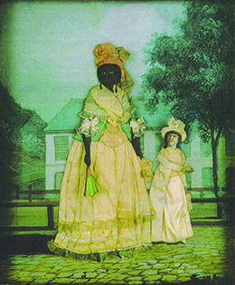

By the end of this section, you will be able to:
* Discuss the similarities and differences in the lives of slaves and free blacks
* Describe the independent culture and customs that slaves developed

In addition to cotton, the great commodity of the antebellum South was human chattel. Slavery was the cornerstone of the southern economy. By 1850, about 3.2 million slaves labored in the United States, 1.8 million of whom worked in the cotton fields. Slaves faced arbitrary power abuses from whites; they coped by creating family and community networks. Storytelling, song, and Christianity also provided solace and allowed slaves to develop their own interpretations of their condition.

# LIFE AS A SLAVE

Southern whites frequently relied upon the idea of **paternalism**{: data-type="term"}—the premise that white slaveholders acted in the best interests of slaves, taking responsibility for their care, feeding, discipline, and even their Christian morality—to justify the existence of slavery. This grossly misrepresented the reality of slavery, which was, by any measure, a dehumanizing, traumatizing, and horrifying human disaster and crime against humanity. Nevertheless, slaves were hardly passive victims of their conditions; they sought and found myriad ways to resist their shackles and develop their own communities and cultures.

Slaves often used the notion of paternalism to their advantage, finding opportunities within this system to engage in acts of resistance and win a degree of freedom and autonomy. For example, some slaves played into their masters’ racism by hiding their intelligence and feigning childishness and ignorance. The slaves could then slow down the workday and sabotage the system in small ways by “accidentally” breaking tools, for example; the master, seeing his slaves as unsophisticated and childlike, would believe these incidents were accidents rather than rebellions. Some slaves engaged in more dramatic forms of resistance, such as poisoning their masters slowly. Other slaves reported rebellious slaves to their masters, hoping to gain preferential treatment. Slaves who informed their masters about planned slave rebellions could often expect the slaveholder’s gratitude and, perhaps, more lenient treatment. Such expectations were always tempered by the individual personality and caprice of the master.

Slaveholders used both psychological coercion and physical violence to prevent slaves from disobeying their wishes. Often, the most efficient way to discipline slaves was to threaten to sell them. The lash, while the most common form of punishment, was effective but not efficient; whippings sometimes left slaves incapacitated or even dead. Slave masters also used punishment gear like neck braces, balls and chains, leg irons, and paddles with holes to produce blood blisters. Slaves lived in constant terror of both physical violence and separation from family and friends ([\[link\]](#Figure_12_02_Punishment)).

 , taken in Baton Rouge, Louisiana, in 1863, reads as follows: &#x201C;Overseer Artayou Carrier whipped me. I was two months in bed sore from the whipping. My master come after I was whipped; he discharged the overseer. The very words of poor Peter, taken as he sat for his picture.&#x201D; Images like this one helped bolster the northern abolitionist message of the inhumanity of slavery. The drawing of an iron mask, collar, leg shackles, and spurs (b) demonstrates the various cruel and painful instruments used to restrain slaves."){: #Figure_12_02_Punishment}

Under southern law, slaves could not marry. Nonetheless, some slaveholders allowed marriages to promote the birth of children and to foster harmony on plantations. Some masters even forced certain slaves to form unions, anticipating the birth of more children (and consequently greater profits) from them. Masters sometimes allowed slaves to choose their own partners, but they could also veto a match. Slave couples always faced the prospect of being sold away from each other, and, once they had children, the horrifying reality that their children could be sold and sent away at any time.

  
Browse a collection of first-hand narratives of slaves and former slaves at the [National Humanities Center][1] to learn more about the experience of slavery.

Slave parents had to show their children the best way to survive under slavery. This meant teaching them to be discreet, submissive, and guarded around whites. Parents also taught their children through the stories they told. Popular stories among slaves included tales of tricksters, sly slaves, or animals like 

NOT\_CONVERTED\_YET: emphasis

<emphasis xmlns="http://cnx.rice.edu/cnxml" data-effect="no-emphasis">Brer Rabbit</emphasis>

, who outwitted their antagonists ([\[link\]](#Figure_12_02_BrerRabbit)). Such stories provided comfort in humor and conveyed the slaves’ sense of the wrongs of slavery. Slaves’ work songs commented on the harshness of their life and often had double meanings—a literal meaning that whites would not find offensive and a deeper meaning for slaves.

  by Joel Chandler Harris, was a trickster who outwitted his opponents."){: #Figure_12_02_BrerRabbit}

African beliefs, including ideas about the spiritual world and the importance of African healers, survived in the South as well. Whites who became aware of non-Christian rituals among slaves labeled such practices as witchcraft. Among Africans, however, the rituals and use of various plants by respected slave healers created connections between the African past and the American South while also providing a sense of community and identity for slaves. Other African customs, including traditional naming patterns, the making of baskets, and the cultivation of certain native African plants that had been brought to the New World, also endured.

African Americans and Christian Spirituals

Many slaves embraced Christianity. Their masters emphasized a scriptural message of obedience to whites and a better day awaiting slaves in heaven, but slaves focused on the uplifting message of being freed from bondage.

The styles of worship in the Methodist and Baptist churches, which emphasized emotional responses to scripture, attracted slaves to those traditions and inspired some to become preachers. Spiritual songs that referenced the Exodus (the biblical account of the Hebrews’ escape from slavery in Egypt), such as “Roll, Jordan, Roll,” allowed slaves to freely express messages of hope, struggle, and overcoming adversity ([\[link\]](#Figure_12_02_RollJordan)).

{: #Figure_12_02_RollJordan}

What imagery might the Jordan River suggest to slaves working in the Deep South? What lyrics in this song suggest redemption and a better world ahead?

  
Listen to a rendition of [“Roll, Jordan, Roll”][2] from the movie based on Solomon Northup’s memoir and life.

# THE FREE BLACK POPULATION

Complicating the picture of the antebellum South was the existence of a large free black population. In fact, more free blacks lived in the South than in the North; roughly 261,000 lived in slave states, while 226,000 lived in northern states without slavery. Most free blacks did not live in the Lower, or Deep South: the states of Alabama, Arkansas, Florida, Georgia, Louisiana, Mississippi, South Carolina, and Texas. Instead, the largest number lived in the upper southern states of Delaware, Maryland, Virginia, North Carolina, and later Kentucky, Missouri, Tennessee, and the District of Columbia.

Part of the reason for the large number of free blacks living in slave states were the many instances of manumission—the formal granting of freedom to slaves—that occurred as a result of the Revolution, when many slaveholders put into action the ideal that “all men are created equal” and freed their slaves. The transition in the Upper South to the staple crop of wheat, which did not require large numbers of slaves to produce, also spurred manumissions. Another large group of free blacks in the South had been free residents of Louisiana before the 1803 Louisiana Purchase, while still other free blacks came from Cuba and Haiti.

Most free blacks in the South lived in cities, and a majority of free blacks were lighter-skinned women, a reflection of the interracial unions that formed between white men and black women. Everywhere in the United States blackness had come to be associated with slavery, the station at the bottom of the social ladder. Both whites and those with African ancestry tended to delineate varying degrees of lightness in skin color in a social hierarchy. In the slaveholding South, different names described one’s distance from blackness or whiteness: mulattos (those with one black and one white parent), quadroons (those with one black grandparent), and octoroons (those with one black great-grandparent) ([\[link\]](#Figure_12_02_Quadroon)). Lighter-skinned blacks often looked down on their darker counterparts, an indication of the ways in which both whites and blacks internalized the racism of the age.

 {: #Figure_12_02_Quadroon}

Some free blacks in the South owned slaves of their own. Andrew Durnford, for example, was born in New Orleans in 1800, three years before the Louisiana Purchase. His father was white, and his mother was a free black. Durnford became an American citizen after the Louisiana Purchase, rising to prominence as a Louisiana sugar planter and slaveholder. William Ellison, another free black who amassed great wealth and power in the South, was born a slave in 1790 in South Carolina. After buying his freedom and that of his wife and daughter, he proceeded to purchase his own slaves, whom he then put to work manufacturing cotton gins. By the eve of the Civil War, Ellison had become one of the richest and largest slaveholders in the entire state.

The phenomenon of free blacks amassing large fortunes within a slave society predicated on racial difference, however, was exceedingly rare. Most free blacks in the South lived under the specter of slavery and faced many obstacles. Beginning in the early nineteenth century, southern states increasingly made manumission of slaves illegal. They also devised laws that divested free blacks of their rights, such as the right to testify against whites in court or the right to seek employment where they pleased. Interestingly, it was in the upper southern states that such laws were the harshest. In Virginia, for example, legislators made efforts to require free blacks to leave the state. In parts of the Deep South, free blacks were able to maintain their rights more easily. The difference in treatment between free blacks in the Deep South and those in the Upper South, historians have surmised, came down to economics. In the Deep South, slavery as an institution was strong and profitable. In the Upper South, the opposite was true. The anxiety of this economic uncertainty manifested in the form of harsh laws that targeted free blacks.

# SLAVE REVOLTS

Slaves resisted their enslavement in small ways every day, but this resistance did not usually translate into mass uprisings. Slaves understood that the chances of ending slavery through rebellion were slim and would likely result in massive retaliation; many also feared the risk that participating in such actions would pose to themselves and their families. White slaveholders, however, constantly feared uprisings and took drastic steps, including torture and mutilation, whenever they believed that rebellions might be simmering. Gripped by the fear of insurrection, whites often imagined revolts to be in the works even when no uprising actually happened.

At least two major slave uprisings did occur in the antebellum South. In 1811, a major rebellion broke out in the sugar parishes of the booming territory of Louisiana. Inspired by the successful overthrow of the white planter class in Haiti, Louisiana slaves took up arms against planters. Perhaps as many five hundred slaves joined the rebellion, led by Charles Deslondes, a mixed-race slave driver on a sugar plantation owned by Manuel Andry.

The revolt began in January 1811 on Andry’s plantation. Deslondes and other slaves attacked the Andry household, where they killed the slave master’s son (although Andry himself escaped). The rebels then began traveling toward New Orleans, armed with weapons gathered at Andry’s plantation. Whites mobilized to stop the rebellion, but not before Deslondes and the other rebelling slaves set fire to three plantations and killed numerous whites. A small white force led by Andry ultimately captured Deslondes, whose body was mutilated and burned following his execution. Other slave rebels were beheaded, and their heads placed on pikes along the Mississippi River.

The second rebellion, led by the slave Nat Turner, occurred in 1831 in Southampton County, Virginia. Turner had suffered not only from personal enslavement, but also from the additional trauma of having his wife sold away from him. Bolstered by Christianity, Turner became convinced that like Christ, he should lay down his life to end slavery. Mustering his relatives and friends, he began the rebellion August 22, killing scores of whites in the county. Whites mobilized quickly and within forty-eight hours had brought the rebellion to an end. Shocked by Nat Turner’s Rebellion, Virginia’s state legislature considered ending slavery in the state in order to provide greater security. In the end, legislators decided slavery would remain and that their state would continue to play a key role in the domestic slave trade.

# SLAVE MARKETS

As discussed above, after centuries of slave trade with West Africa, Congress banned the further importation of slaves beginning in 1808. The domestic slave trade then expanded rapidly. As the cotton trade grew in size and importance, so did the domestic slave trade; the cultivation of cotton gave new life and importance to slavery, increasing the value of slaves. To meet the South’s fierce demand for labor, American smugglers illegally transferred slaves through Florida and later through Texas. Many more slaves arrived illegally from Cuba; indeed, Cubans relied on the smuggling of slaves to prop up their finances. The largest number of slaves after 1808, however, came from the massive, legal internal slave market in which slave states in the Upper South sold enslaved men, women, and children to states in the Lower South. For slaves, the domestic trade presented the full horrors of slavery as children were ripped from their mothers and fathers and families destroyed, creating heartbreak and alienation.

Some slaveholders sought to increase the number of slave children by placing male slaves with fertile female slaves, and slave masters routinely raped their female slaves. The resulting births played an important role in slavery’s expansion in the first half of the nineteenth century, as many slave children were born as a result of rape. One account written by a slave named William J. Anderson captures the horror of sexual exploitation in the antebellum South. Anderson wrote about how a Mississippi slaveholder

\> divested a poor female slave of all wearing apparel, tied her down to stakes, and whipped her with a handsaw until he broke it over her naked body. In process of time he ravished \[raped\] her person, and became the father of a child by her. Besides, he always kept a colored Miss in the house with him. This is another curse of Slavery—concubinage and illegitimate connections—which is carried on to an alarming extent in the far South. A poor slave man who lives close by his wife, is permitted to visit her but very seldom, and other men, both white and colored, cohabit with her. It is undoubtedly the worst place of incest and bigamy in the world. A white man thinks nothing of putting a colored man out to carry the fore row \[front row in field work\], and carry on the same sport with the colored man’s wife at the same time.

Anderson, a devout Christian, recognized and explains in his narrative that one of the evils of slavery is the way it undermines the family. Anderson was not the only critic of slavery to emphasize this point. Frederick Douglass, a Maryland slave who escaped to the North in 1838, elaborated on this dimension of slavery in his 1845 narrative. He recounted how slave masters had to sell their own children whom they had with slave women to appease the white wives who despised their offspring.

The selling of slaves was a major business enterprise in the antebellum South, representing a key part of the economy. White men invested substantial sums in slaves, carefully calculating the annual returns they could expect from a slave as well as the possibility of greater profits through natural increase. The domestic slave trade was highly visible, and like the infamous Middle Passage that brought captive Africans to the Americas, it constituted an equally disruptive and horrifying journey now called the **second middle passage**{: data-type="term"}. Between 1820 and 1860, white American traders sold a million or more slaves in the domestic slave market. Groups of slaves were transported by ship from places like Virginia, a state that specialized in raising slaves for sale, to New Orleans, where they were sold to planters in the Mississippi Valley. Other slaves made the overland trek from older states like North Carolina to new and booming Deep South states like Alabama.

New Orleans had the largest slave market in the United States ([\[link\]](#Figure_12_02_SlaveSale)). Slaveholders brought their slaves there from the East (Virginia, Maryland, and the Carolinas) and the West (Tennessee and Kentucky) to be sold for work in the Mississippi Valley. The slave trade benefited whites in the Chesapeake and Carolinas, providing them with extra income: A healthy young male slave in the 1850s could be sold for $1,000 (approximately $30,000 in 2014 dollars), and a planter who could sell ten such slaves collected a windfall.

  by J. M. Starling, it is clear that slaves are considered property to be auctioned off, just like pictures or other items."){: #Figure_12_02_SlaveSale}

In fact, by the 1850s, the demand for slaves reached an all-time high, and prices therefore doubled. A slave who would have sold for $400 in the 1820s could command a price of $800 in the 1850s. The high price of slaves in the 1850s and the inability of natural increase to satisfy demands led some southerners to demand the reopening of the international slave trade, a movement that caused a rift between the Upper South and the Lower South. Whites in the Upper South who sold slaves to their counterparts in the Lower South worried that reopening the trade would lower prices and therefore hurt their profits.

John Brown on Slave Life in Georgia

A slave named John Brown lived in Virginia, North Carolina, and Georgia before he escaped and moved to England. While there, he dictated his autobiography to someone at the British and Foreign Anti-Slavery Society, who published it in 1855.

\> I really thought my mother would have died of grief at being obliged to leave her two children, her mother, and her relations behind. But it was of no use lamenting, the few things we had were put together that night, and we completed our preparations for being parted for life by kissing one another over and over again, and saying good bye till some of us little ones fell asleep. . . . And here I may as well tell what kind of man our new master was. He was of small stature, and thin, but very strong. He had sandy hair, a very red face, and chewed tobacco. His countenance had a very cruel expression, and his disposition was a match for it. He was, indeed, a very bad man, and used to flog us dreadfully. He would make his slaves work on one meal a day, until quite night, and after supper, set them to burn brush or spin cotton. We worked from four in the morning till twelve before we broke our fast, and from that time till eleven or twelve at night . . . we labored eighteen hours a day.
> * * *
> {: data-type="newline"}
> 
> —John Brown, *Slave Life in Georgia: A Narrative of the Life, Sufferings, and Escape of John Brown, A Fugitive Slave, Now in England*, 1855

What features of the domestic slave trade does Brown’s narrative illuminate? Why do you think he brought his story to an antislavery society? How do you think people responded to this narrative?

  
Read through several narratives at “Born in Slavery,” part of the [American Memory][3] collection at the Library of Congress. Do these narratives have anything in common? What differences can you find between them?

# Section Summary

Slave labor in the antebellum South generated great wealth for plantation owners. Slaves, in contrast, endured daily traumas as the human property of masters. Slaves resisted their condition in a variety of ways, and many found some solace in Christianity and the communities they created in the slave quarters. While some free blacks achieved economic prosperity and even became slaveholders themselves, the vast majority found themselves restricted by the same white-supremacist assumptions upon which the institution of slavery was based.

# Review Questions

Under the law in the antebellum South, slaves were \_\_\_\_\_\_\_\_.

1.  servants
2.  animals
3.  property
4.  indentures
{: data-number-style="upper-alpha"}

C

How did both slaveholders and slaves use the concept of paternalism to their advantage?

Southern whites often used paternalism to justify the institution of slavery, arguing that slaves, like children, needed the care, feeding, discipline, and moral and religious education that they could provide. Slaves often used this misguided notion to their advantage: By feigning ignorance and playing into slaveholders’ paternalistic perceptions of them, slaves found opportunities to resist their condition and gain a degree of freedom and autonomy.

[1]: http://openstaxcollege.org/l/15Enslavement
[2]: http://openstaxcollege.org/l/15RollJordan
[3]: http://openstaxcollege.org/l/15BornSlavery
