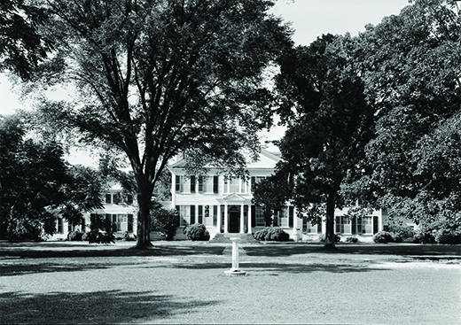
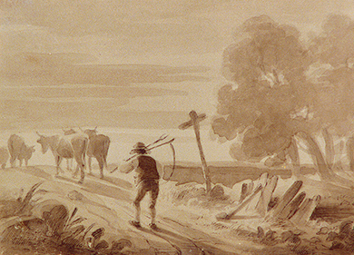
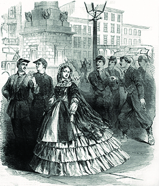
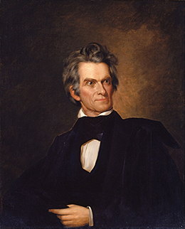

By the end of this section, you will be able to:
* Assess the distribution of wealth in the antebellum South
* Describe the southern culture of honor
* Identify the main proslavery arguments in the years prior to the Civil War

During the antebellum years, wealthy southern planters formed an elite master class that wielded most of the economic and political power of the region. They created their own standards of gentility and honor, defining ideals of southern white manhood and womanhood and shaping the culture of the South. To defend the system of forced labor on which their economic survival and genteel lifestyles depended, elite southerners developed several proslavery arguments that they levied at those who would see the institution dismantled.

# SLAVERY AND THE WHITE CLASS STRUCTURE

The South prospered, but its wealth was very unequally distributed. Upward social mobility did not exist for the millions of slaves who produced a good portion of the nation’s wealth, while poor southern whites envisioned a day when they might rise enough in the world to own slaves of their own. Because of the cotton boom, there were more millionaires per capita in the Mississippi River Valley by 1860 than anywhere else in the United States. However, in that same year, only 3 percent of whites owned more than fifty slaves, and two-thirds of white households in the South did not own any slaves at all ([\[link\]](#Figure_12_03_WhiteClass)). Distribution of wealth in the South became less democratic over time; fewer whites owned slaves in 1860 than in 1840.

 {: #Figure_12_03_WhiteClass}

At the top of southern white society stood the planter elite, which comprised two groups. In the Upper South, an aristocratic gentry, generation upon generation of whom had grown up with slavery, held a privileged place. In the Deep South, an elite group of slaveholders gained new wealth from cotton. Some members of this group hailed from established families in the eastern states (Virginia and the Carolinas), while others came from humbler backgrounds. South Carolinian Nathaniel Heyward, a wealthy rice planter and member of the aristocratic gentry, came from an established family and sat atop the pyramid of southern slaveholders. He amassed an enormous estate; in 1850, he owned more than eighteen hundred slaves. When he died in 1851, he left an estate worth more than $2 million (approximately $63 million in 2014 dollars).

As cotton production increased, new wealth flowed to the cotton planters. These planters became the staunchest defenders of slavery, and as their wealth grew, they gained considerable political power.

One member of the planter elite was Edward Lloyd V, who came from an established and wealthy family of Talbot County, Maryland. Lloyd had inherited his position rather than rising to it through his own labors. His hundreds of slaves formed a crucial part of his wealth. Like many of the planter elite, Lloyd’s plantation was a masterpiece of elegant architecture and gardens ([\[link\]](#Figure_12_03_Lloyd)).

 {: #Figure_12_03_Lloyd}

One of the slaves on Lloyd’s plantation was Frederick Douglass, who escaped in 1838 and became an abolitionist leader, writer, statesman, and orator in the North. In his autobiography, Douglass described the plantation’s elaborate gardens and racehorses, but also its underfed and brutalized slave population. Lloyd provided employment opportunities to other whites in Talbot County, many of whom served as slave traders and the “slave breakers” entrusted with beating and overworking unruly slaves into submission. Like other members of the planter elite, Lloyd himself served in a variety of local and national political offices. He was governor of Maryland from 1809 to 1811, a member of the House of Representatives from 1807 to 1809, and a senator from 1819 to 1826. As a representative and a senator, Lloyd defended slavery as the foundation of the American economy.

Wealthy plantation owners like Lloyd came close to forming an American ruling class in the years before the Civil War. They helped shape foreign and domestic policy with one goal in view: to expand the power and reach of the cotton kingdom of the South. Socially, they cultivated a refined manner and believed whites, especially members of their class, should not perform manual labor. Rather, they created an identity for themselves based on a world of leisure in which horse racing and entertainment mattered greatly, and where the enslavement of others was the bedrock of civilization.

Below the wealthy planters were the yeoman farmers, or small landowners ([\[link\]](#Figure_12_03_Farmer)). Below yeomen were poor, landless whites, who made up the majority of whites in the South. These landless white men dreamed of owning land and slaves and served as slave overseers, drivers, and traders in the southern economy. In fact, owning land and slaves provided one of the only opportunities for upward social and economic mobility. In the South, living the American dream meant possessing slaves, producing cotton, and owning land.

 {: #Figure_12_03_Farmer}

Despite this unequal distribution of wealth, non-slaveholding whites shared with white planters a common set of values, most notably a belief in white supremacy. Whites, whether rich or poor, were bound together by racism. Slavery defused class tensions among them, because no matter how poor they were, white southerners had race in common with the mighty plantation owners. Non-slaveholders accepted the rule of the planters as defenders of their shared interest in maintaining a racial hierarchy. Significantly, all whites were also bound together by the constant, prevailing fear of slave uprisings.

D. R. Hundley on the Southern Yeoman

D. R. Hundley was a well-educated planter, lawyer, and banker from Alabama. Something of an amateur sociologist, he argued against the common northern assumption that the South was made up exclusively of two tiers of white residents: the very wealthy planter class and the very poor landless whites. In his 1860 book, *Social Relations in Our Southern States*, Hundley describes what he calls the “Southern Yeomen,” a social group he insists is roughly equivalent to the middle-class farmers of the North.

\> *But you have no Yeomen in the South, my dear Sir?* Beg your pardon, our dear Sir, but we have—hosts of them. *I thought you had only poor White Trash?* Yes, we dare say as much—and that the moon is made of green cheese! . . . Know, then, that the Poor Whites of the South constitute a separate class to themselves; the Southern Yeomen are as distinct from them as the Southern Gentleman is from the Cotton Snob. Certainly the Southern Yeomen are nearly always poor, at least so far as this world’s goods are to be taken into account. As a general thing they own no slaves; and even in case they do, the wealthiest of them rarely possess more than from ten to fifteen. . . . The Southern Yeoman much resembles in his speech, religious opinions, household arrangements, indoor sports, and family traditions, the middle class farmers of the Northern States. He is fully as intelligent as the latter, and is on the whole much better versed in the lore of politics and the provisions of our Federal and State Constitutions. . . . \[A\]lthough not as a class pecuniarily interested in slave property, the Southern Yeomanry are almost unanimously pro-slavery in sentiment. Nor do we see how any honest, thoughtful person can reasonably find fault with them on this account.
> * * *
> {: data-type="newline"}
> 
> —D. R. Hundley, *Social Relations in Our Southern States*, 1860

What elements of social relations in the South is Hundley attempting to emphasize for his readers? In what respects might his position as an educated and wealthy planter influence his understanding of social relations in the South?

Because race bound all whites together as members of the master race, non-slaveholding whites took part in civil duties. They served on juries and voted. They also engaged in the daily rounds of maintaining slavery by serving on neighborhood patrols to ensure that slaves did not escape and that rebellions did not occur. The practical consequence of such activities was that the institution of slavery, and its perpetuation, became a source of commonality among different economic and social tiers that otherwise were separated by a gulf of difference.

Southern planters exerted a powerful influence on the federal government. Seven of the first eleven presidents owned slaves, and more than half of the Supreme Court justices who served on the court from its inception to the Civil War came from slaveholding states. However, southern white yeoman farmers generally did not support an active federal government. They were suspicious of the state bank and supported President Jackson’s dismantling of the Second Bank of the United States. They also did not support taxes to create internal improvements such as canals and railroads; to them, government involvement in the economic life of the nation disrupted what they perceived as the natural workings of the economy. They also feared a strong national government might tamper with slavery.

Planters operated within a larger capitalist society, but the labor system they used to produce goods—that is, slavery—was similar to systems that existed before capitalism, such as feudalism and serfdom. Under capitalism, free workers are paid for their labor (by owners of capital) to produce commodities; the money from the sale of the goods is used to pay for the work performed. As slaves did not reap any earnings from their forced labor, some economic historians consider the antebellum plantation system a “pre-capitalist” system.

# HONOR IN THE SOUTH

A complicated code of honor among privileged white southerners, dictating the beliefs and behavior of “gentlemen” and “ladies,” developed in the antebellum years. Maintaining appearances and reputation was supremely important. It can be argued that, as in many societies, the concept of honor in the antebellum South had much to do with control over dependents, whether slaves, wives, or relatives. Defending their honor and ensuring that they received proper respect became preoccupations of whites in the slaveholding South. To question another man’s assertions was to call his honor and reputation into question. Insults in the form of words or behavior, such as calling someone a coward, could trigger a rupture that might well end on the dueling ground ([\[link\]](#Figure_12_03_Duel)). Dueling had largely disappeared in the antebellum North by the early nineteenth century, but it remained an important part of the southern code of honor through the Civil War years. Southern white men, especially those of high social status, settled their differences with duels, before which antagonists usually attempted reconciliation, often through the exchange of letters addressing the alleged insult. If the challenger was not satisfied by the exchange, a duel would often result.

 {: #Figure_12_03_Duel}

The dispute between South Carolina’s James Hammond and his erstwhile friend (and brother-in-law) Wade Hampton II illustrates the southern culture of honor and the place of the duel in that culture. A strong friendship bound Hammond and Hampton together. Both stood at the top of South Carolina’s society as successful, married plantation owners involved in state politics. Prior to his election as governor of the state in 1842, Hammond became sexually involved with each of Hampton’s four teenage daughters, who were his nieces by marriage. “\[A\]ll of them rushing on every occasion into my arms,” Hammond confided in his private diary, “covering me with kisses, lolling on my lap, pressing their bodies almost into mine . . . and permitting my hands to stray unchecked.” Hampton found out about these dalliances, and in keeping with the code of honor, could have demanded a duel with Hammond. However, Hampton instead tried to use the liaisons to destroy his former friend politically. This effort proved disastrous for Hampton, because it represented a violation of the southern code of honor. “As matters now stand,” Hammond wrote, “he \[Hampton\] is a convicted dastard who, not having nerve to redress his own wrongs, put forward bullies to do it for him. . . . To challenge me \[to a duel\] would be to throw himself upon my mercy for he knows I am not bound to meet him \[for a duel\].” Because Hampton’s behavior marked him as a man who lacked honor, Hammond was no longer bound to meet Hampton in a duel even if Hampton were to demand one. Hammond’s reputation, though tarnished, remained high in the esteem of South Carolinians, and the governor went on to serve as a U.S. senator from 1857 to 1860. As for the four Hampton daughters, they never married; their names were disgraced, not only by the whispered-about scandal but by their father’s actions in response to it; and no man of honor in South Carolina would stoop so low as to marry them.

# GENDER AND THE SOUTHERN HOUSEHOLD

The antebellum South was an especially male-dominated society. Far more than in the North, southern men, particularly wealthy planters, were patriarchs and sovereigns of their own household. Among the white members of the household, labor and daily ritual conformed to rigid gender delineations. Men represented their household in the larger world of politics, business, and war. Within the family, the patriarchal male was the ultimate authority. White women were relegated to the household and lived under the thumb and protection of the male patriarch. The ideal southern lady conformed to her prescribed gender role, a role that was largely domestic and subservient. While responsibilities and experiences varied across different social tiers, women’s subordinate state in relation to the male patriarch remained the same.

Writers in the antebellum period were fond of celebrating the image of the ideal southern woman ([\[link\]](#Figure_12_03_SouthernBelle)). One such writer, Thomas Roderick Dew, president of Virginia’s College of William and Mary in the mid-nineteenth century, wrote approvingly of the virtue of southern women, a virtue he concluded derived from their natural weakness, piety, grace, and modesty. In his *Dissertation on the Characteristic Differences Between the Sexes*, he writes that southern women derive their power not by

\> leading armies to combat, or of enabling her to bring into more formidable action the physical power which nature has conferred on her. No! It is but the better to perfect all those feminine graces, all those fascinating attributes, which render her the center of attraction, and which delight and charm all those who breathe the atmosphere in which she moves; and, in the language of Mr. Burke, would make ten thousand swords leap from their scabbards to avenge the insult that might be offered to her. By her very meekness and beauty does she subdue all around her.

Such popular idealizations of elite southern white women, however, are difficult to reconcile with their lived experience: in their own words, these women frequently described the trauma of childbirth, the loss of children, and the loneliness of the plantation.

 {: #Figure_12_03_SouthernBelle}

Louisa Cheves McCord’s “Woman’s Progress”

Louisa Cheves McCord was born in Charleston, South Carolina, in 1810. A child of some privilege in the South, she received an excellent education and became a prolific writer. As the excerpt from her poem “Woman’s Progress” indicates, some southern women also contributed to the idealization of southern white womanhood.

\> Sweet Sister! stoop not thou to be a man!
> * * *
> {: data-type="newline"}
> 
> Man has his place as woman hers; and she
> * * *
> {: data-type="newline"}
> 
> As made to comfort, minister and help;
> * * *
> {: data-type="newline"}
> 
> Moulded for gentler duties, ill fulfils
> * * *
> {: data-type="newline"}
> 
> His jarring destinies. Her mission is
> * * *
> {: data-type="newline"}
> 
> To labour and to pray; to help, to heal,
> * * *
> {: data-type="newline"}
> 
> To soothe, to bear; patient, with smiles, to suffer;
> * * *
> {: data-type="newline"}
> 
> And with self-abnegation noble lose
> * * *
> {: data-type="newline"}
> 
> Her private interest in the dearer weal
> * * *
> {: data-type="newline"}
> 
> Of those she loves and lives for. Call not this—
> * * *
> {: data-type="newline"}
> 
> (The all-fulfilling of her destiny;
> * * *
> {: data-type="newline"}
> 
> She the world’s soothing mother)—call it not,
> * * *
> {: data-type="newline"}
> 
> With scorn and mocking sneer, a drudgery.
> * * *
> {: data-type="newline"}
> 
> The ribald tongue profanes Heaven’s holiest things,
> * * *
> {: data-type="newline"}
> 
> But holy still they are. The lowliest tasks
> * * *
> {: data-type="newline"}
> 
> Are sanctified in nobly acting them.
> * * *
> {: data-type="newline"}
> 
> Christ washed the apostles’ feet, not thus cast shame
> * * *
> {: data-type="newline"}
> 
> Upon the God-like in him. Woman lives
> * * *
> {: data-type="newline"}
> 
> Man’s constant prophet. If her life be true
> * * *
> {: data-type="newline"}
> 
> And based upon the instincts of her being,
> * * *
> {: data-type="newline"}
> 
> She is a living sermon of that truth
> * * *
> {: data-type="newline"}
> 
> Which ever through her gentle actions speaks,
> * * *
> {: data-type="newline"}
> 
> That life is given to labour and to love.
> * * *
> {: data-type="newline"}
> 
> —Louisa Susanna Cheves McCord, “Woman’s Progress,” 1853

What womanly virtues does Louisa Cheves McCord emphasize? How might her social status, as an educated southern woman of great privilege, influence her understanding of gender relations in the South?

For slaveholding whites, the male-dominated household operated to protect gendered divisions and prevalent gender norms; for slave women, however, the same system exposed them to brutality and frequent sexual domination. The demands on the labor of slave women made it impossible for them to perform the role of domestic caretaker that was so idealized by southern men. That slaveholders put them out into the fields, where they frequently performed work traditionally thought of as male, reflected little the ideal image of gentleness and delicacy reserved for white women. Nor did the slave woman’s role as daughter, wife, or mother garner any patriarchal protection. Each of these roles and the relationships they defined was subject to the prerogative of a master, who could freely violate enslaved women’s persons, sell off their children, or separate them from their families.

# DEFENDING SLAVERY

With the rise of democracy during the Jacksonian era in the 1830s, slaveholders worried about the power of the majority. If political power went to a majority that was hostile to slavery, the South—and the honor of white southerners—would be imperiled. White southerners keen on preserving the institution of slavery bristled at what they perceived to be northern attempts to deprive them of their livelihood. Powerful southerners like South Carolinian John C. Calhoun ([\[link\]](#Figure_12_03_Calhoun)) highlighted laws like the Tariff of 1828 as evidence of the North’s desire to destroy the southern economy and, by extension, its culture. Such a tariff, he and others concluded, would disproportionately harm the South, which relied heavily on imports, and benefit the North, which would receive protections for its manufacturing centers. The tariff appeared to open the door for other federal initiatives, including the abolition of slavery. Because of this perceived threat to southern society, Calhoun argued that states could nullify federal laws. This belief illustrated the importance of the states’ rights argument to the southern states. It also showed slaveholders’ willingness to unite against the federal government when they believed it acted unjustly against their interests.

 {: #Figure_12_03_Calhoun}

As the nation expanded in the 1830s and 1840s, the writings of abolitionists—a small but vocal group of northerners committed to ending slavery—reached a larger national audience. White southerners responded by putting forth arguments in defense of slavery, their way of life, and their honor. Calhoun became a leading political theorist defending slavery and the rights of the South, which he saw as containing an increasingly embattled minority. He advanced the idea of a **concurrent majority**{: data-type="term"}, a majority of a separate region (that would otherwise be in the minority of the nation) with the power to veto or disallow legislation put forward by a hostile majority.

Calhoun’s idea of the concurrent majority found full expression in his 1850 essay “Disquisition on Government.” In this treatise, he wrote about government as a necessary means to ensure the preservation of society, since society existed to “preserve and protect our race.” If government grew hostile to society, then a concurrent majority had to take action, including forming a new government. “Disquisition on Government” advanced a profoundly anti-democratic argument. It illustrates southern leaders’ intense suspicion of democratic majorities and their ability to effect legislation that would challenge southern interests.

  
Go to the [Internet Archive][1] to read John C. Calhoun’s “Disquisition on Government.” Why do you think he proposed the creation of a concurrent majority?

White southerners reacted strongly to abolitionists’ attacks on slavery. In making their defense of slavery, they critiqued wage labor in the North. They argued that the Industrial Revolution had brought about a new type of slavery—wage slavery—and that this form of “slavery” was far worse than the slave labor used on southern plantations. Defenders of the institution also lashed out directly at abolitionists such as William Lloyd Garrison for daring to call into question their way of life. Indeed, Virginians cited Garrison as the instigator of Nat Turner’s 1831 rebellion.

The Virginian George Fitzhugh contributed to the defense of slavery with his book *Sociology for the South, or the Failure of Free Society* (1854). Fitzhugh argued that laissez-faire capitalism, as celebrated by Adam Smith, benefited only the quick-witted and intelligent, leaving the ignorant at a huge disadvantage. Slaveholders, he argued, took care of the ignorant—in Fitzhugh’s argument, the slaves of the South. Southerners provided slaves with care from birth to death, he asserted; this offered a stark contrast to the wage slavery of the North, where workers were at the mercy of economic forces beyond their control. Fitzhugh’s ideas exemplified southern notions of paternalism.

George Fitzhugh’s Defense of Slavery

George Fitzhugh, a southern writer of social treatises, was a staunch supporter of slavery, not as a necessary evil but as what he argued was a necessary good, a way to take care of slaves and keep them from being a burden on society. He published *Sociology for the South, or the Failure of Free Society* in 1854, in which he laid out what he believed to be the benefits of slavery to both the slaves and society as a whole. According to Fitzhugh:

\> \[I\]t is clear the Athenian democracy would not suit a negro nation, nor will the government of mere law suffice for the individual negro. He is but a grown up child and must be governed as a child . . . The master occupies towards him the place of parent or guardian. . . . The negro is improvident; will not lay up in summer for the wants of winter; will not accumulate in youth for the exigencies of age. He would become an insufferable burden to society. Society has the right to prevent this, and can only do so by subjecting him to domestic slavery.
> * * *
> {: data-type="newline"}
> 
> In the last place, the negro race is inferior to the white race, and living in their midst, they would be far outstripped or outwitted in the chase of free competition. . . . Our negroes are not only better off as to physical comfort than free laborers, but their moral condition is better.

What arguments does Fitzhugh use to promote slavery? What basic premise underlies his ideas? Can you think of a modern parallel to Fitzhugh’s argument?

The North also produced defenders of slavery, including Louis Agassiz, a Harvard professor of zoology and geology. Agassiz helped to popularize **polygenism**{: data-type="term"}, the idea that different human races came from separate origins. According to this formulation, no single human family origin existed, and blacks made up a race wholly separate from the white race. Agassiz’s notion gained widespread popularity in the 1850s with the 1854 publication of George Gliddon and Josiah Nott’s *Types of Mankind* and other books. The theory of polygenism codified racism, giving the notion of black inferiority the lofty mantle of science. One popular advocate of the idea posited that blacks occupied a place in evolution between the Greeks and chimpanzees ([\[link\]](#Figure_12_03_RaceSkulls)).

 ![Two facing pages of illustrations depict the skulls of various humans and animals. On the first page, these include &#x201C;Apollo Belvidere,&#x201D; a Greek statuary head shown beside a skull labeled &#x201C;Greek&#x201D;; beneath this, &#x201C;Negro,&#x201D; a black man&#x2019;s head shown beside a skull labeled &#x201C;Creole Negro&#x201D;; and at the bottom, &#x201C;Young Chimpanzee,&#x201D; a chimpanzee&#x2019;s head shown beside a skull labeled &#x201C;Young Chimpanzee.&#x201D; On the opposite page, various drawings of animals and black humans are labeled &#x201C;Orang-Outan&#x201D;; &#x201C;Hottentot Wagoner&#x2014;Caffre War&#x201D;; &#x201C;Chimpanzee&#x201D;; &#x201C;Hottentot from Somerset&#x201D;; &#x201C;Mobile Negro, 1853&#x201D;; and &#x201C;Negro, 8200 Years Old.&#x201D;](../resources/CNX_History_12_03_RaceSkulls.jpg "This 1857 illustration by an advocate of polygenism indicates that the &#x201C;Negro&#x201D; occupies a place between the Greeks and chimpanzees. What does this image reveal about the methods of those who advocated polygenism?"){: #Figure_12_03_RaceSkulls}

# Section Summary

Although a small white elite owned the vast majority of slaves in the South, and most other whites could only aspire to slaveholders’ wealth and status, slavery shaped the social life of all white southerners in profound ways. Southern culture valued a behavioral code in which men’s honor, based on the domination of others and the protection of southern white womanhood, stood as the highest good. Slavery also decreased class tensions, binding whites together on the basis of race despite their inequalities of wealth. Several defenses of slavery were prevalent in the antebellum era, including Calhoun’s argument that the South’s “concurrent majority” could overrule federal legislation deemed hostile to southern interests; the notion that slaveholders’ care of their chattel made slaves better off than wage workers in the North; and the profoundly racist ideas underlying polygenism.

# Review Questions

The largest group of whites in the South \_\_\_\_\_\_\_.

1.  owned no slaves
2.  owned between one and nine slaves each
3.  owned between ten and ninety-nine slaves each
4.  owned over one hundred slaves each
{: data-number-style="upper-alpha"}

A

John C. Calhoun argued for greater rights for southerners with which idea?

1.  polygenism
2.  nullification
3.  concurrent majority
4.  paternalism
{: data-number-style="upper-alpha"}

C

How did defenders of slavery use the concept of paternalism to structure their ideas?

Defenders of slavery, such as George Fitzhugh, argued that only the clever and the bright could truly benefit within a laissez-faire economy. Premising their argument on the notion that slaves were, by nature, intellectually inferior and less able to compete, such defenders maintained that slaves were better off in the care of paternalistic masters. While northern workers found themselves trapped in wage slavery, they argued, southern slaves’ needs—for food, clothing, and shelter, among other things—were met by their masters’ paternal benevolence.

## Glossary
{: data-type="glossary-title"}

concurrent majority
: a majority of a separate region (that would otherwise be in the minority of the nation) with the power to veto or disallow legislation put forward by a hostile majority
{: .definition}

polygenism
: the idea that blacks and whites come from different origins
{: .definition}

[1]: http://openstaxcollege.org/l/15Disquisition
