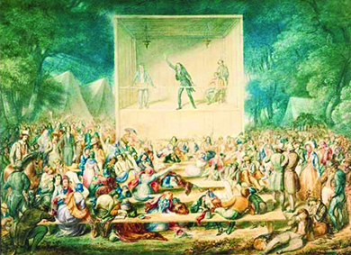
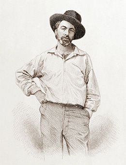

By the end of this section, you will be able to:
* Explain the connection between evangelical Protestantism and the Second Great Awakening
* Describe the message of the transcendentalists

 ![A timeline shows important events of the era. In 1827, the American Temperance Society is formed. In 1830, Joseph Smith founds the Church of the Latter Day Saints. In 1831, Nat Turner leads a slave rebellion; an illustration depicting scenes from the rebellion is shown. In 1833, William Lloyd Garrison founds the American Anti-Slavery society; a photograph of Garrison is shown. In 1841, Ralph Waldo Emerson publishes &#x201C;Self-Reliance&#x201D;; a photograph of Emerson is shown. In 1848, supporters of women&#x2019;s rights gather at Seneca Falls; the official announcement for the convention is shown. In 1854, Henry David Thoreau publishes Walden; Or, Life in the Woods. In 1855, most northeastern states &#x201C;go dry&#x201D; by prohibiting alcohol.](../resources/CNX_History_13_01_Timeline.jpg){: #CNX_History_13_01_Timeline}

Protestantism shaped the views of the vast majority of Americans in the antebellum years. The influence of religion only intensified during the decades before the Civil War, as religious camp meetings spread the word that people could bring about their own salvation, a direct contradiction to the Calvinist doctrine of predestination. Alongside this religious fervor, transcendentalists advocated a more direct knowledge of the self and an emphasis on individualism. The writers and thinkers devoted to transcendentalism, as well as the reactions against it, created a trove of writings, an outpouring that has been termed the American Renaissance.

### THE SECOND GREAT AWAKENING   {#eip-idp172380112}

The reform efforts of the antebellum era sprang from the Protestant revival fervor that found expression in what historians refer to as the **Second Great Awakening**{: data-type="term"}. (The First Great Awakening of evangelical Protestantism had taken place in the 1730s and 1740s.) The Second Great Awakening emphasized an emotional religious style in which sinners grappled with their unworthy nature before concluding that they were born again, that is, turning away from their sinful past and devoting themselves to living a righteous, Christ-centered life. This emphasis on personal salvation, with its rejection of predestination (the Calvinist concept that God selected only a chosen few for salvation), was the religious embodiment of the Jacksonian celebration of the individual. Itinerant ministers preached the message of the awakening to hundreds of listeners at outdoors revival meetings ([\[link\]](#CNX_History_13_01_CampMtg)).

 {: #CNX_History_13_01_CampMtg}

The burst of religious enthusiasm that began in Kentucky and Tennessee in the 1790s and early 1800s among Baptists, Methodists, and Presbyterians owed much to the uniqueness of the early decades of the republic. These years saw swift population growth, broad western expansion, and the rise of participatory democracy. These political and social changes made many people anxious, and the more egalitarian, emotional, and individualistic religious practices of the Second Great Awakening provided relief and comfort for Americans experiencing rapid change. The awakening soon spread to the East, where it had a profound impact on Congregationalists and Presbyterians. The thousands swept up in the movement believed in the possibility of creating a much better world. Many adopted **millennialism**{: data-type="term"}, the fervent belief that the Kingdom of God would be established on earth and that God would reign on earth for a thousand years, characterized by harmony and Christian morality. Those drawn to the message of the Second Great Awakening yearned for stability, decency, and goodness in the new and turbulent American republic.

The Second Great Awakening also brought significant changes to American culture. Church membership doubled in the years between 1800 and 1835. Several new groups formed to promote and strengthen the message of religious revival. The American Bible Society, founded in 1816, distributed Bibles in an effort to ensure that every family had access to the sacred text, while the American Sunday School Union, established in 1824, focused on the religious education of children and published religious materials specifically for young readers. In 1825, the American Tract Society formed with the goal of disseminating the Protestant revival message in a flurry of publications.

Missionaries and **circuit riders**{: data-type="term" .no-emphasis} (ministers without a fixed congregation) brought the message of the awakening across the United States, including into the lives of slaves. The revival spurred many slaveholders to begin encouraging their slaves to become Christians. Previously, many slaveholders feared allowing their slaves to convert, due to a belief that Christians could not be enslaved and because of the fear that slaves might use Christian principles to oppose their enslavement. However, by the 1800s, Americans established a legal foundation for the enslavement of Christians. Also, by this time, slaveholders had come to believe that if slaves learned the “right” (that is, white) form of Christianity, then slaves would be more obedient and hardworking. Allowing slaves access to Christianity also served to ease the consciences of Christian slaveholders, who argued that slavery was divinely ordained, yet it was a faith that also required slaveholders to bring slaves to the “truth.” Also important to this era was the creation of African American forms of worship as well as African American churches such as the African Methodist Episcopal Church, the first independent black Protestant church in the United States. Formed in the 1790s by Richard Allen, the African Methodist Episcopal Church advanced the African American effort to express their faith apart from white Methodists ([\[link\]](#CNX_History_13_01_Ministers)).

  was one of the best-known ministers of the Second Great Awakening. Richard Allen (b) created the first separate African American church, the African Methodist Episcopal Church, in the 1790s."){: #CNX_History_13_01_Ministers}

In the Northeast, Presbyterian minister Charles Grandison Finney rose to prominence as one of the most important evangelicals in the movement ([\[link\]](#CNX_History_13_01_Ministers)). Born in 1792 in western New York, Finney studied to be a lawyer until 1821, when he experienced a religious conversion and thereafter devoted himself to revivals. He led revival meetings in New York and Pennsylvania, but his greatest success occurred after he accepted a ministry in Rochester, New York, in 1830. At the time, Rochester was a boomtown because the Erie Canal had brought a lively shipping business.

The new middle class—an outgrowth of the Industrial Revolution—embraced Finney’s message. It fit perfectly with their understanding of themselves as people shaping their own destiny. Workers also latched onto the message that they too could control their salvation, spiritually and perhaps financially as well. Western New York gained a reputation as the “burned over district,” a reference to the intense flames of religious fervor that swept the area during the Second Great Awakening.

### TRANSCENDENTALISM   {#eip-idp284744368}

Beginning in the 1820s, a new intellectual movement known as **transcendentalism**{: data-type="term"} began to grow in the Northeast. In this context, to transcend means to go beyond the ordinary sensory world to grasp personal insights and gain appreciation of a deeper reality, and transcendentalists believed that all people could attain an understanding of the world that surpassed rational, sensory experience. Transcendentalists were critical of mainstream American culture. They reacted against the age of mass democracy in Jacksonian America—what Tocqueville called the “tyranny of majority”—by arguing for greater individualism against conformity. European romanticism, a movement in literature and art that stressed emotion over cold, calculating reason, also influenced transcendentalists in the United States, especially the transcendentalists’ celebration of the uniqueness of individual feelings.

Ralph Waldo Emerson emerged as the leading figure of this movement ([\[link\]](#CNX_History_13_01_Emerson)). Born in Boston in 1803, Emerson came from a religious family. His father served as a Unitarian minister and, after graduating from Harvard Divinity School in the 1820s, Emerson followed in his father’s footsteps. However, after his wife died in 1831, he left the clergy. On a trip to Europe in 1832, he met leading figures of romanticism who rejected the hyper-rationalism of the Enlightenment, emphasizing instead emotion and the sublime.

 ![Photograph (a) is a portrait of Ralph Waldo Emerson. Document (b) is a letter from Emerson to Walt Whitman. The visible text reads &#x201C;Dear Sir, I am not blind to the worth of the wonderful gift of Leaves of Grass. I find it the most extraordinary piece of wit and wisdom that America has yet contributed. I am very \[remainder of the letter is not visible\].&#x201D;](../resources/CNX_History_13_01_Emerson.jpg "Ralph Waldo Emerson (a), shown here circa 1857, is considered the father of transcendentalism. This letter (b) from Emerson to Walt Whitman, another brilliant writer of the transcendentalist movement, demonstrates the closeness of a number of these writers."){: #CNX_History_13_01_Emerson}

When Emerson returned home the following year, he began giving lectures on his romanticism-influenced ideas. In 1836, he published “Nature,” an essay arguing that humans can find their true spirituality in nature, not in the everyday bustling working world of Jacksonian democracy and industrial transformation. In 1841, Emerson published his essay “Self-Reliance,” which urged readers to think for themselves and reject the mass conformity and mediocrity he believed had taken root in American life. In this essay, he wrote, “Whoso would be a man must be a nonconformist,” demanding that his readers be true to themselves and not blindly follow a herd mentality. Emerson’s ideas dovetailed with those of the French aristocrat, Alexis de Tocqueville, who wrote about the “tyranny of the majority” in his *Democracy in America*. Tocqueville, like Emerson, expressed concern that a powerful majority could overpower the will of individuals.

  
Visit [Emerson Central][1] to read the full text of “Self Reliance” by Ralph Waldo Emerson. How have Emerson’s ideas influenced American society?

Emerson’s ideas struck a chord with a class of literate adults who also were dissatisfied with mainstream American life and searching for greater spiritual meaning. Many writers were drawn to transcendentalism, and they started to express its ideas through new stories, poems, essays, and articles. The ideas of transcendentalism were able to permeate American thought and culture through a prolific print culture, which allowed magazines and journals to be widely disseminated.

Among those attracted to Emerson’s ideas was his friend Henry David Thoreau, whom he encouraged to write about his own ideas. Thoreau placed a special emphasis on the role of nature as a gateway to the transcendentalist goal of greater individualism. In 1848, Thoreau gave a lecture in which he argued that individuals must stand up to governmental injustice, a topic he chose because of his disgust over the Mexican-American War and slavery. In 1849, he published his lecture “Civil Disobedience” and urged readers to refuse to support a government that was immoral. In 1854, he published *Walden; Or, Life in the Woods*, a book about the two years he spent in a small cabin on Walden Pond near Concord, Massachusetts ([\[link\]](#CNX_History_13_01_Walden)). Thoreau had lived there as an experiment in living apart, but not too far apart, from his conformist neighbors.

  argued that men had the right to resist authority if they deemed it unjust. &#x201C;All men recognize the right of revolution; that is, the right to refuse allegiance to, and to resist, the government, when its tyranny or its inefficiency are great and unendurable.&#x201D; Thoreau&#x2019;s Walden; or, Life in the Woods (b) articulated his emphasis on the importance of nature as a gateway to greater individuality."){: #CNX_History_13_01_Walden}

Margaret Fuller also came to prominence as a leading transcendentalist and advocate for women’s equality. Fuller was a friend of Emerson and Thoreau, and other intellectuals of her day. Because she was a woman, she could not attend Harvard, as it was a male-only institution for undergraduate students until 1973. However, she was later granted the use of the library there because of her towering intellect. In 1840, she became the editor of *The Dial*, a transcendentalist journal, and she later found employment as a book reviewer for the *New York Tribune* newspaper. Tragically, in 1850, she died at the age of forty in a shipwreck off Fire Island, New York.

Walt Whitman also added to the transcendentalist movement, most notably with his 1855 publication of twelve poems, entitled *Leaves of Grass*, which celebrated the subjective experience of the individual. One of the poems, “Song of Myself,” amplified the message of individualism, but by uniting the individual with all other people through a transcendent bond.

Walt Whitman’s “Song of Myself”

Walt Whitman ([\[link\]](#CNX_History_13_01_Whitman)) was a poet associated with the transcendentalists. His 1855 poem, “Song of Myself,” shocked many when it was first published, but it has been called one of the most influential poems in American literature.

{: #CNX_History_13_01_Whitman}

<q id="eip-idp3245936">I CELEBRATE myself, and sing myself,* * *
{: data-type="newline"}

 And what I assume you shall assume,* * *
{: data-type="newline"}

 For every atom belonging to me as good belongs to you.* * *
{: data-type="newline"}

 I loafe and invite my soul,* * *
{: data-type="newline"}

 I lean and loafe at my ease observing a spear of summer grass.* * *
{: data-type="newline"}

 My tongue, every atom of my blood, form’d from this soil, this air,* * *
{: data-type="newline"}

 Born here of parents born here from parents the same, and their parents the same,* * *
{: data-type="newline"}

 I, now thirty-seven years old in perfect health begin,* * *
{: data-type="newline"}

 Hoping to cease not till death. . . .* * *
{: data-type="newline"}

 And I say to mankind, Be not curious about God,* * *
{: data-type="newline"}

 For I who am curious about each am not curious about God,* * *
{: data-type="newline"}

 (No array of terms can say how much I am at peace about God and about death.)* * *
{: data-type="newline"}

 I hear and behold God in every object, yet understand God not in the least,* * *
{: data-type="newline"}

 Nor do I understand who there can be more wonderful than myself. . . .* * *
{: data-type="newline"}

 I too am not a bit tamed, I too am untranslatable,* * *
{: data-type="newline"}

 I sound my barbaric yawp over the roofs of the world. . . .* * *
{: data-type="newline"}

 You will hardly know who I am or what I mean,* * *
{: data-type="newline"}

 But I shall be good health to you nevertheless,* * *
{: data-type="newline"}

 And filter and fibre your blood.* * *
{: data-type="newline"}

 Failing to fetch me at first keep encouraged,* * *
{: data-type="newline"}

 Missing me one place search another,* * *
{: data-type="newline"}

 I stop somewhere waiting for you.</q>

What images does Whitman use to describe himself and the world around him? What might have been shocking about this poem in 1855? Why do you think it has endured?

Some critics took issue with transcendentalism’s emphasis on rampant individualism by pointing out the destructive consequences of compulsive human behavior. Herman Melville’s novel *Moby Dick; or, The Whale* emphasized the perils of individual obsession by telling the tale of Captain Ahab’s single-minded quest to kill a white whale, Moby Dick, which had destroyed Ahab’s original ship and caused him to lose one of his legs. Edgar Allan Poe, a popular author, critic, and poet, decried “the so-called poetry of the so-called transcendentalists.” These American writers who questioned transcendentalism illustrate the underlying tension between individualism and conformity in American life.

### Section Summary   {#eip-idp258323680}

Evangelical Protestantism pervaded American culture in the antebellum era and fueled a belief in the possibility of changing society for the better. Leaders of the Second Great Awakening like Charles G. Finney urged listeners to take charge of their own salvation. This religious message dovetailed with the new economic possibilities created by the market and Industrial Revolution, making the Protestantism of the Second Great Awakening, with its emphasis on individual spiritual success, a reflection of the individualistic, capitalist spirit of the age. Transcendentalists took a different approach, but like their religiously oriented brethren, they too looked to create a better existence. These authors, most notably Emerson, identified a major tension in American life between the effort to be part of the democratic majority and the need to remain true to oneself as an individual.

### Review Questions   {#eip-idp282733200}

Which of the following is *not* a characteristic of the Second Great Awakening?

1.  greater emphasis on nature
2.  greater emphasis on religious education of children
3.  greater church attendance
4.  belief in the possibility of a better world
{: type="A"}

A

Transcendentalists were most concerned with \_\_\_\_\_\_\_\_.

1.  the afterlife
2.  predestination
3.  the individual
4.  democracy
{: type="A"}

C

What do the Second Great Awakening and transcendentalism have in common?

They both emphasize the power of the individual over that of the majority. Evangelists of the Second Great Awakening preached the power of personal spirituality, whereas transcendentalists were more concerned with the individual soul.

### Glossary
{: data-type="glossary-title"}

millennialism
: the belief that the Kingdom of God would be established on earth and that God would reign on earth for a thousand years characterized by harmony and Christian morality
^

Second Great Awakening
: a revival of evangelical Protestantism in the early nineteenth century
^

transcendentalism
: the belief that all people can attain an understanding of the world that transcends rational, sensory experience

[1]: http://openstax.org/l/15SelfReliance
