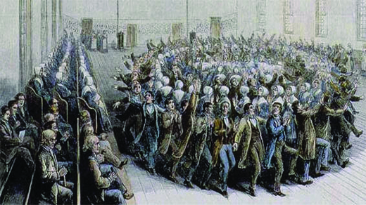
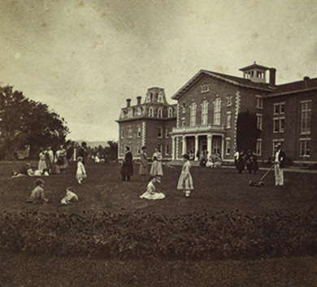

By the end of this section, you will be able to:
* Identify similarities and differences among utopian groups of the antebellum era
* Explain how religious utopian communities differed from nonreligious ones

Prior to 1815, in the years before the market and Industrial Revolution, most Americans lived on farms where they produced much of the foods and goods they used. This largely pre-capitalist culture centered on large family units whose members all lived in the same towns, counties, and parishes.

Economic forces unleashed after 1815, however, forever altered that world. More and more people now bought their food and goods in the thriving market economy, a shift that opened the door to a new way of life. These economic transformations generated various reactions; some people were nostalgic for what they viewed as simpler, earlier times, whereas others were willing to try new ways of living and working. In the early nineteenth century, experimental communities sprang up, created by men and women who hoped not just to create a better way of life but to recast American civilization, so that greater equality and harmony would prevail. Indeed, some of these reformers envisioned the creation of alternative ways of living, where people could attain perfection in human relations. The exact number of these societies is unknown because many of them were so short-lived, but the movement reached its apex in the 1840s.

# RELIGIOUS UTOPIAN SOCIETIES

Most of those attracted to utopian communities had been profoundly influenced by evangelical Protestantism, especially the Second Great Awakening. However, their experience of revivalism had left them wanting to further reform society. The communities they formed and joined adhered to various socialist ideas and were considered radical, because members wanted to create a new social order, not reform the old.

German Protestant migrants formed several **pietistic**{: data-type="term"} societies: communities that stressed transformative individual religious experience or piety over religious rituals and formality. One of the earliest of these, the Ephrata Cloister in Pennsylvania, was founded by a charismatic leader named Conrad Beissel in the 1730s. By the antebellum era, it was the oldest communal experiment in the United States. Its members devoted themselves to spiritual contemplation and a disciplined work regime while they awaited the millennium. They wore homespun rather than buying cloth or premade clothing, and encouraged celibacy. Although the Ephrata Cloister remained small, it served as an early example of the type of community that antebellum reformers hoped to create.

In 1805, a second German religious society, led by George Rapp, took root in Pennsylvania with several hundred members called **Rappites**{: data-type="term" .no-emphasis} who encouraged celibacy and adhered to the socialist principle of holding all goods in common (as opposed to allowing individual ownership). They not only built the town of Harmony but also produced surplus goods to sell to the outside world. In 1815, the group sold its Pennsylvanian holdings and moved to Indiana, establishing New Harmony on a twenty-thousand-acre plot along the Wabash River. In 1825, members returned to Pennsylvania, and established themselves in the town called Economy.

The **Shakers**{: data-type="term"} provide another example of a community established with a religious mission. The Shakers started in England as an outgrowth of the Quaker religion in the middle of the eighteenth century. Ann Lee, a leader of the group in England, emigrated to New York in the 1770s, having experienced a profound religious awakening that convinced her that she was “mother in Christ.” She taught that God was both male and female; Jesus embodied the male side, while Mother Ann (as she came to be known by her followers) represented the female side. To Shakers in both England and the United States, Mother Ann represented the completion of divine revelation and the beginning of the millennium of heaven on earth.

In practice, men and women in Shaker communities were held as equals—a radical departure at the time—and women often outnumbered men. Equality extended to the possession of material goods as well; no one could hold private property. Shaker communities aimed for self-sufficiency, raising food and making all that was necessary, including furniture that emphasized excellent workmanship as a substitute for worldly pleasure.

The defining features of the Shakers were their spiritual mysticism and their prohibition of sexual intercourse, which they held as an example of a lesser spiritual life and a source of conflict between women and men. Rapturous Shaker dances, for which the group gained notoriety, allowed for emotional release ([\[link\]](#CNX_History_13_02_Shaker)). The high point of the Shaker movement came in the 1830s, when about six thousand members populated communities in New England, New York, Ohio, Indiana, and Kentucky.

 {: #CNX_History_13_02_Shaker}

  
Learn more about the [musical heritage][1] of the Shakers, including the well-known song “Simple Gifts,” which has become part of American culture.

Another religious utopian experiment, the Oneida Community, began with the teachings of John Humphrey Noyes, a Vermonter who had graduated from Dartmouth, Andover Theological Seminary, and Yale. The Second Great Awakening exerted a powerful effect on him, and he came to believe in perfectionism, the idea that it is possible to be perfect and free of sin. Noyes claimed to have achieved this state of perfection in 1834.

Noyes applied his idea of perfection to relationships between men and women, earning notoriety for his unorthodox views on marriage and sexuality. Beginning in his home town of Putney, Vermont, he began to advocate what he called “complex marriage:” a form of communal marriage in which women and men who had achieved perfection could engage in sexual intercourse without sin. Noyes also promoted “male continence,” whereby men would not ejaculate, thereby freeing women from pregnancy and the difficulty of determining paternity when they had many partners. Intercourse became fused with spiritual power among Noyes and his followers.

The concept of complex marriage scandalized the townspeople in Putney, so Noyes and his followers removed to Oneida, New York. Individuals who wanted to join the Oneida Community underwent a tough screening process to weed out those who had not reached a state of perfection, which Noyes believed promoted self-control, not out-of-control behavior. The goal was a balance between individuals in a community of love and respect. The perfectionist community Noyes envisioned ultimately dissolved in 1881, although the Oneida Community itself continues to this day ([\[link\]](#CNX_History_13_02_Oneida)).

 {: #CNX_History_13_02_Oneida}

The most successful religious utopian community to arise in the antebellum years was begun by Joseph Smith. Smith came from a large Vermont family that had not prospered in the new market economy and moved to the town of Palmyra, in the “burned over district” of western New York. In 1823, Smith claimed to have to been visited by the angel Moroni, who told him the location of a trove of golden plates or tablets. During the late 1820s, Smith translated the writing on the golden plates, and in 1830, he published his finding as *The Book of Mormon*. That same year, he organized the Church of Christ, the progenitor of the Church of Latter-Day Saints popularly known as **Mormons**{: data-type="term"}. He presented himself as a prophet and aimed to recapture what he viewed as the purity of the primitive Christian church, purity that had been lost over the centuries. To Smith, this meant restoring male leadership.

Smith emphasized the importance of families being ruled by fathers. His vision of a reinvigorated patriarchy resonated with men and women who had not thrived during the market revolution, and his claims attracted those who hoped for a better future. Smith’s new church placed great stress on work and discipline. He aimed to create a New Jerusalem where the church exercised oversight of its members.

Smith’s claims of translating the golden plates antagonized his neighbors in New York. Difficulties with anti-Mormons led him and his followers to move to Kirtland, Ohio, in 1831. By 1838, as the United States experienced continued economic turbulence following the Panic of 1837, Smith and his followers were facing financial collapse after a series of efforts in banking and money-making ended in disaster. They moved to Missouri, but trouble soon developed there as well, as citizens reacted against the Mormons’ beliefs. Actual fighting broke out in 1838, and the ten thousand or so Mormons removed to Nauvoo, Illinois, where they founded a new center of Mormonism.

By the 1840s, Nauvoo boasted a population of thirty thousand, making it the largest utopian community in the United States. Thanks to some important conversions to Mormonism among powerful citizens in Illinois, the Mormons had virtual autonomy in Nauvoo, which they used to create the largest armed force in the state. Smith also received further revelations there, including one that allowed male church leaders to practice polygamy. He also declared that all of North and South America would be the new Zion and announced that he would run for president in the 1844 election.

Smith and the Mormons’ convictions and practices generated a great deal of opposition from neighbors in surrounding towns. Smith was arrested for treason (for destroying the printing press of a newspaper that criticized Mormonism), and while he was in prison, an anti-Mormon mob stormed into his cell and killed him. Brigham Young ([\[link\]](#CNX_History_13_02_Young)) then assumed leadership of the group, which he led to a permanent home in what is now Salt Lake City, Utah.

 . On the basis of these plates, Joseph Smith (b) founded the Church of Latter-Day Saints. Following Smith&#x2019;s death at the hands of a mob in Illinois, Brigham Young took control of the church and led them west to the Salt Lake Valley, which at that time was still part of Mexico."){: #CNX_History_13_02_Young}

# SECULAR UTOPIAN SOCIETIES

Not all utopian communities were prompted by the religious fervor of the Second Great Awakening; some were outgrowths of the intellectual ideas of the time, such as romanticism with its emphasis on the importance of individualism over conformity. One of these, Brook Farm, took shape in West Roxbury, Massachusetts, in the 1840s. It was founded by George Ripley, a transcendentalist from Massachusetts. In the summer of 1841, this utopian community gained support from Boston-area thinkers and writers, an intellectual group that included many important transcendentalists. Brook Farm is best characterized as a community of intensely individualistic personalities who combined manual labor, such as the growing and harvesting food, with intellectual pursuits. They opened a school that specialized in the liberal arts rather than rote memorization and published a weekly journal called *The Harbinger*, which was “Devoted to Social and Political Progress” ([\[link\]](#CNX_History_13_02_Harbinger)). Members of Brook Farm never totaled more than one hundred, but it won renown largely because of the luminaries, such as Emerson and Thoreau, whose names were attached to it. Nathaniel Hawthorne, a Massachusetts writer who took issue with some of the transcendentalists’ claims, was a founding member of Brook Farm, and he fictionalized some of his experiences in his novel *The Blithedale Romance*. In 1846, a fire destroyed the main building of Brook Farm, and already hampered by financial problems, the Brook Farm experiment came to an end in 1847.

  to share its ideals more widely. George Ripley (b), who founded the farm, was burdened with a huge debt several years later when the community collapsed."){: #CNX_History_13_02_Harbinger}

Robert Owen, a British industrialist, helped inspire those who dreamed of a more equitable world in the face of the changes brought about by industrialization. Owen had risen to prominence before he turned thirty by running cotton mills in New Lanark, Scotland; these were considered the most successful cotton mills in Great Britain. Owen was very uneasy about the conditions of workers, and he devoted both his life and his fortune to trying to create cooperative societies where workers would lead meaningful, fulfilled lives. Unlike the founders of many utopian communities, he did not gain inspiration from religion; his vision derived instead from his faith in human reason to make the world better.

When the Rappite community in Harmony, Indiana, decided to sell its holdings and relocate to Pennsylvania, Owen seized the opportunity to put his ideas into action. In 1825, he bought the twenty-thousand-acre parcel in Indiana and renamed it New Harmony ([\[link\]](#CNX_History_13_02_NewHarmony)). After only a few years, however, a series of bad decisions by Owen and infighting over issues like the elimination of private property led to the dissolution of the community. But Owen’s ideas of cooperation and support inspired other “Owenite” communities in the United States, Canada, and Great Britain.

 {: #CNX_History_13_02_NewHarmony}

A French philosopher who advocated the creation of a new type of utopian community, Charles Fourier also inspired American readers, notably Arthur Brisbane, who popularized Fourier’s ideas in the United States. Fourier emphasized collective effort by groups of people or “associations.” Members of the association would be housed in large buildings or “phalanxes,” a type of communal living arrangement. Converts to Fourier’s ideas about a new science of living published and lectured vigorously. They believed labor was a type of capital, and the more unpleasant the job, the higher the wages should be. Fourierists in the United States created some twenty-eight communities between 1841 and 1858, but by the late 1850s, the movement had run its course in the United States.

# Section Summary   {#eip-idp258323680}

Reformers who engaged in communal experiments aimed to recast economic and social relationships by introducing innovations designed to create a more stable and equitable society. Their ideas found many expressions, from early socialist experiments (such as by the Fourierists and the Owenites) to the dreams of the New England intellectual elite (such as Brook Farm). The Second Great Awakening also prompted many religious utopias, like those of the Rappites and Shakers. By any measure, the Mormons emerged as the most successful of these.

# Review Questions

Which religious community focused on the power of patriarchy?

1.  Shakers
2.  Mormons
3.  Owenites
4.  Rappites
{: data-number-style="upper-alpha"}

A

Which community or movement is associated with transcendentalism?

1.  the Oneida Community
2.  the Ephrata Cloister
3.  Brook Farm
4.  Fourierism
{: data-number-style="upper-alpha"}

C

How were the reform communities of the antebellum era treated by the general population?

Many reform communities were shunned, especially those that emphasized different forms of marriage (like the Oneida Community) or a departure from mainstream Protestantism. The Mormons, in particular, were forced to move ever further westward in their attempt to find a place to practice their religion in peace.

## Glossary
{: data-type="glossary-title"}

Mormons
: an American denomination, also known as the Latter-Day Saints, that emphasized patriarchal leadership
{: .definition}

pietistic
: the stressing of stressed transformative individual religious experience or piety over religious rituals and formality
{: .definition}

Shakers
: a religious sect that emphasized communal living and celibacy
{: .definition}

[1]: http://openstaxcollege.org/l/15ShakerMusic
