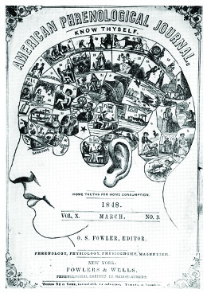

By the end of this section, you will be able to:
* Explain the different reforms aimed at improving the health of the human body
* Describe the various factions and concerns within the temperance movement

Antebellum reform efforts aimed at perfecting the spiritual and social worlds of individuals, and as an outgrowth of those concerns, some reformers moved in the direction of ensuring the health of American citizens. Many Americans viewed drunkenness as a major national problem, and the battle against alcohol and the many problems associated with it led many to join the temperance movement. Other reformers offered plans to increase physical well-being, instituting plans designed to restore vigor. Still others celebrated new sciences that would unlock the mysteries of human behavior and, by doing so, advance American civilization.

# TEMPERANCE

According to many antebellum reformers, intemperance (drunkenness) stood as the most troubling problem in the United States, one that eroded morality, Christianity, and played a starring role in corrupting American democracy. Americans consumed huge quantities of liquor in the early 1800s, including gin, whiskey, rum, and brandy. Indeed, scholars agree that the rate of consumption of these drinks during the first three decades of the 1800s reached levels that have never been equaled in American history.

A variety of reformers created organizations devoted to **temperance**{: data-type="term"}, that is, moderation or self-restraint. Each of these organizations had its own distinct orientation and target audience. The earliest ones were formed in the 1810s in New England. The Massachusetts Society for the Suppression of Intemperance and the Connecticut Society for the Reformation of Morals were both formed in 1813. Protestant ministers led both organizations, which enjoyed support from New Englanders who clung to the ideals of the Federalist Party and later the Whigs. These early temperance societies called on individuals to lead pious lives and avoid sin, including the sin of overindulging in alcohol. They called not for the eradication of drinking but for a more restrained and genteel style of imbibing.

The Drunkard’s Progress

This 1840 temperance illustration ([\[link\]](#CNX_History_13_03_Drunkard)) charts the path of destruction for those who drink. The step-by-step progression reads:

\> Step 1. A glass with a friend.
> * * *
> {: data-type="newline"}
> 
> Step 2. A glass to keep the cold out.
> * * *
> {: data-type="newline"}
> 
> Step 3. A glass too much.
> * * *
> {: data-type="newline"}
> 
> Step 4. Drunk and riotous.
> * * *
> {: data-type="newline"}
> 
> Step 5. The summit attained. Jolly companions. A confirmed drunkard.
> * * *
> {: data-type="newline"}
> 
> Step 6. Poverty and disease.
> * * *
> {: data-type="newline"}
> 
> Step 7. Forsaken by Friends.
> * * *
> {: data-type="newline"}
> 
> Step 8. Desperation and crime.
> * * *
> {: data-type="newline"}
> 
> Step 9. Death by suicide.

![An illustration, The Drunkards Progress. From the First Glass to the Grave, shows a staircase that rises on one side and descends on the other. A scene of a drinking man is depicted on each step, with text describing his progressive downfall through drink: Step 1. A glass with a friend. Step 2. A glass to keep the cold out. Step 3. A glass too much. Step 4. Drunk and riotous. Step 5. The summit attained. Jolly companions. A confirmed drunkard. Step 6. Poverty and disease. Step 7. Forsaken by Friends. Step 8. Desperation and crime. Step 9. Death by suicide.&#x201D; At the bottom is an illustration of a woman with her face in her hand, leading her child from their home.](../resources/CNX_History_13_03_Drunkard.jpg "This 1846 image, The Drunkards Progress. From the First Glass to the Grave, by Nathaniel Currier, shows the destruction that prohibitionists thought could result from drinking alcoholic beverages."){: #CNX_History_13_03_Drunkard}

Who do you think was the intended audience for this engraving? How do you think different audiences (children, drinkers, nondrinkers) would react to the story it tells? Do you think it is an effective piece of propaganda? Why or why not?

In the 1820s, temperance gained ground largely through the work of Presbyterian minister Lyman Beecher. In 1825, Beecher delivered six sermons on temperance that were published the follow year as *Six Sermons on the Nature, Occasions, Signs, Evils, and Remedy of Intemperance*. He urged total abstinence from hard liquor and called for the formation of voluntary associations to bring forth a new day without spirits (whiskey, rum, gin, brandy). Lyman’s work enjoyed a wide readership and support from leading Protestant ministers as well as the emerging middle class; temperance fit well with the middle-class ethic of encouraging hard work and a sober workforce.

In 1826, the American Temperance Society was formed, and by the early 1830s, thousands of similar societies had sprouted across the country. Members originally pledged to shun only hard liquor. By 1836, however, leaders of the temperance movement, including Beecher, called for a more comprehensive approach. Thereafter, most temperance societies advocated total abstinence; no longer would beer and wine be tolerated. Such total abstinence from alcohol is known as **teetotalism**{: data-type="term"}.

Teetotalism led to disagreement within the movement and a loss of momentum for reform after 1836. However, temperance enjoyed a revival in the 1840s, as a new type of reformer took up the cause against alcohol. The engine driving the new burst of enthusiastic temperance reform was the **Washington Temperance Society**{: data-type="term" .no-emphasis} (named in deference to George Washington), which organized in 1840. The leaders of the Washingtonians came not from the ranks of Protestant ministers but from the working class. They aimed their efforts at confirmed alcoholics, unlike the early temperance advocates who mostly targeted the middle class.

Washingtonians welcomed the participation of women and children, as they cast alcohol as the destroyer of families, and those who joined the group took a public pledge of teetotalism. Americans flocked to the Washingtonians; as many as 600,000 had taken the pledge by 1844. The huge surge in membership had much to do with the style of this reform effort. The Washingtonians turned temperance into theater by dramatizing the plight of those who fell into the habit of drunkenness. Perhaps the most famous fictional drama put forward by the temperance movement was *Ten Nights in a Bar-Room* (1853), a novel that became the basis for popular theatrical productions. The Washingtonians also sponsored picnics and parades that drew whole families into the movement. The group’s popularity quickly waned in the late 1840s and early 1850s, when questions arose about the effectiveness of merely taking a pledge. Many who had done so soon relapsed into alcoholism.

Still, by that time, temperance had risen to a major political issue. Reformers lobbied for laws limiting or prohibiting alcohol, and states began to pass the first temperance laws. The earliest, an 1838 law in Massachusetts, prohibited the sale of liquor in quantities less than fifteen gallons, a move designed to make it difficult for ordinary workmen of modest means to buy spirits. The law was repealed in 1840, but Massachusetts towns then took the initiative by passing local laws banning alcohol. In 1845, close to one hundred towns in the state went “dry.”

An 1839 Mississippi law, similar to Massachusetts’ original law, outlawed the sale of less than a gallon of liquor. Mississippi’s law illustrates the national popularity of temperance; regional differences notwithstanding, citizens in northern and southern states agreed on the issue of alcohol. Nonetheless, northern states pushed hardest for outlawing alcohol. Maine enacted the first statewide prohibition law in 1851. New England, New York, and states in the Midwest passed local laws in the 1850s, prohibiting the sale and manufacture of intoxicating beverages.

# REFORMS FOR THE BODY AND THE MIND

Beyond temperance, other reformers looked to ways to maintain and improve health in a rapidly changing world. Without professional medical organizations or standards, health reform went in many different directions; although the American Medical Association was formed in 1847, it did not have much power to oversee medical practices. Too often, quack doctors prescribed regimens and medicines that did far more harm that good.

Sylvester Graham stands out as a leading light among the health reformers in the antebellum years. A Presbyterian minister, Graham began his career as a reformer, lecturing against the evils of strong drink. He combined an interest in temperance with vegetarianism and sexuality into what he called a “Science of Human Life,” calling for a regimented diet of more vegetables, fruits, and grain, and no alcohol, meat, or spices.

Graham advocated baths and cleanliness in general to preserve health; **hydropathy**{: data-type="term" .no-emphasis}, or water cures for various ailments, became popular in the United States in the 1840s and 1850s. He also viewed masturbation and excessive sex as a cause of disease and debility. His ideas led him to create what he believed to be a perfect food that would maintain health: the Graham cracker, which he invented in 1829. Followers of Graham, known as Grahamites, established boardinghouses where lodgers followed the recommended strict diet and sexual regimen.

During the early nineteenth century, reformers also interested themselves in the workings of the mind in an effort to better understand the effects of a rapidly changing world awash with religious revivals and democratic movements. **Phrenology**{: data-type="term"}—the mapping of the cranium to specific human attributes—stands as an early type of science, related to what would become psychology and devoted to understanding how the mind worked. Phrenologists believed that the mind contained thirty-seven “faculties,” the strengths or weaknesses of which could be determined by a close examination of the size and shape of the cranium ([\[link\]](#CNX_History_13_03_Phrenology)).

 {: #CNX_History_13_03_Phrenology}

Initially developed in Europe by Franz Joseph Gall, a German doctor, phrenology first came to the United States in the 1820s. In the 1830s and 1840s, it grew in popularity as lecturers crisscrossed the republic. It was sometimes used as an educational test, and like temperance, it also became a form of popular entertainment.

  
Map the brain! Check out all thirty-seven of [phrenology’s purported faculties][1] of the mind.

The popularity of phrenology offers us some insight into the emotional world of the antebellum United States. Its popularity speaks to the desire of those living in a rapidly changing society, where older ties to community and family were being challenged, to understand one another. It appeared to offer a way to quickly recognize an otherwise-unknown individual as a readily understood set of human faculties.

# Section Summary

Reformers targeted vices that corrupted the human body and society: the individual and the national soul. For many, alcohol appeared to be the most destructive and widespread. Indeed, in the years before the Civil War, the United States appeared to be a republic of drunkenness to many. To combat this national substance abuse problem, reformers created a host of temperance organizations that first targeted the middle and upper classes, and then the working classes. Thanks to Sylvester Graham and other health reformers, exercise and fresh air, combined with a good diet, became fashionable. Phrenologists focused on revealing the secrets of the mind and personality. In a fast-paced world, phrenology offered the possibility of knowing different human characteristics.

# Review Questions

The first temperance laws were enacted by \_\_\_\_\_\_\_\_.

1.  state governments
2.  local governments
3.  the federal government
4.  temperance organizations
{: data-number-style="upper-alpha"}

B

Sylvester Graham’s reformers targeted \_\_\_\_\_\_\_\_.

1.  the human body
2.  nutrition
3.  sexuality
4.  all of the above
{: data-number-style="upper-alpha"}

D

Whom did temperance reformers target?

At first, temperance reformers, who were predominantly led by Presbyterian ministers, targeted the middle and upper classes. When the movement veered toward teetotalism instead of temperance, the movement lost momentum. However, it was reborn with a focus on the working class in the 1840s.

[1]: http://openstaxcollege.org/l/15Phrenology
