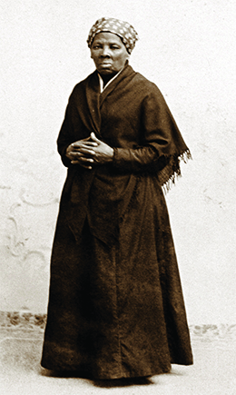
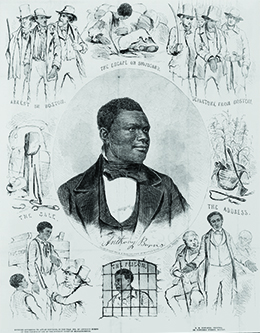
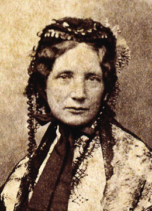

By the end of this section, you will be able to:
* Explain the contested issues that led to the Compromise of 1850
* Describe and analyze the reactions to the 1850 Fugitive Slave Act

 ![A timeline shows important events of the era. In 1850, Henry Clay brokers the Compromise of 1850; a painting of Clay introducing the compromise in the Senate is shown. In 1852, Harriet Beecher Stowe publishes Uncle Tom&#x2019;s Cabin; the cover of Uncle Tom&#x2019;s Cabin is shown. In 1854, antislavery Whigs, Democrats, and Free-Soilers form the Republican Party, and Congress passes the Kansas-Nebraska Act. In 1856, Preston Brooks canes Charles Sumner; a portrait of Preston Brooks is shown. In 1857, the Supreme Court hands down the Dred Scott decision; a portrait of Dred Scott is shown. In 1858, Abraham Lincoln and Stephen Douglas debate in Illinois. In 1859, John Brown raids Harpers Ferry; a portrait of John Brown is shown. In 1860, Lincoln is elected president; a portrait of Lincoln is shown.](../resources/CNX_History_14_01_Timeline.jpg){: #CNX_History_14_01_Timeline}

At the end of the Mexican-American War, the United States gained a large expanse of western territory known as the Mexican Cession. The disposition of this new territory was in question; would the new states be slave states or free-soil states? In the long run, the Mexican-American War achieved what abolitionism alone had failed to do: it mobilized many in the North against slavery.

Antislavery northerners clung to the idea expressed in the 1846 Wilmot Proviso: slavery would not expand into the areas taken, and later bought, from Mexico. Though the proviso remained a proposal and never became a law, it defined the sectional division. The Free-Soil Party, which formed at the conclusion of the Mexican-American War in 1848 and included many members of the failed Liberty Party, made this position the centerpiece of all its political activities, ensuring that the issue of slavery and its expansion remained at the front and center of American political debate. Supporters of the Wilmot Proviso and members of the new Free-Soil Party did not want to abolish slavery in the states where it already existed; rather, Free-Soil advocates demanded that the western territories be kept free of slavery for the benefit of white laborers who might settle there. They wanted to protect white workers from having to compete with slave labor in the West. (Abolitionists, in contrast, looked to destroy slavery everywhere in the United States.) Southern extremists, especially wealthy slaveholders, reacted with outrage at this effort to limit slavery’s expansion. They argued for the right to bring their slave property west, and they vowed to leave the Union if necessary to protect their way of life—meaning the right to own slaves—and ensure that the American empire of slavery would continue to grow.

### BROKERING THE COMPROMISE

The issue of what to do with the western territories added to the republic by the **Mexican Cession**{: data-type="term" .no-emphasis} consumed Congress in 1850. Other controversial matters, which had been simmering over time, complicated the problem further. Chief among these issues were the slave trade in the District of Columbia, which antislavery advocates hoped to end, and the fugitive slave laws, which southerners wanted to strengthen. The border between Texas and New Mexico remained contested because many Texans hoped to enlarge their state further, and, finally, the issue of California had not been resolved. California was the crown jewel of the Mexican Cession, and following the discovery of gold, it was flush with thousands of emigrants. By most estimates, however, it would be a free state, since the former Mexican ban on slavery still remained in force and slavery had not taken root in California. The map below ([\[link\]](#CNX_History_14_01_US1849-50)) shows the disposition of land before the 1850 compromise.

 ![A map shows the states and territories of the United States from March 3, 1849, to September 9, 1850, as well as part of Mexico. States include Maine, New Hampshire, Vermont, Massachusetts, Rhode Island, New York, Connecticut, New Jersey, Pennsylvania, Delaware, Maryland, Virginia, North Carolina, South Carolina, Georgia, Florida, Alabama, Mississippi, Louisiana, Texas, Tennessee, Arkansas, Kentucky, Missouri, Iowa, Illinois, Indiana, Ohio, Michigan, and Wisconsin. Territories include Oregon Territory, Unorganized territory, Minnesota Territory, and Mexican Cession (Unorganized territory).](../resources/CNX_History_14_01_US1849-50.jpg "This map shows the states and territories of the United States as they were in 1849&#x2013;1850. (credit &#x201C;User:Golbez&#x201D;/Wikimedia Commons)"){: #CNX_History_14_01_US1849-50}

The presidential election of 1848 did little to solve the problems resulting from the Mexican Cession. Both the Whigs and the Democrats attempted to avoid addressing the issue of slavery publicly as much as possible. The Democrats nominated Lewis Cass of Michigan, a supporter of the idea of popular sovereignty, or letting the people in the territories decide the issue of whether or not to permit slavery based on majority rule. The Whigs nominated General Zachary Taylor, a slaveholder from Louisiana, who had achieved national prominence as a military hero in the Mexican-American War. Taylor did not take a personal stand on any issue and remained silent throughout the campaign. The fledgling Free-Soil Party put forward former president Martin Van Buren as their candidate. The Free-Soil Party attracted northern Democrats who supported the Wilmot Proviso, northern Whigs who rejected Taylor because he was a slaveholder, former members of the Liberty Party, and other abolitionists.

Both the Whigs and the Democrats ran different campaigns in the North and South. In the North, all three parties attempted to win voters with promises of keeping the territories free of slavery, while in the South, Whigs and Democrats promised to protect slavery in the territories. For southern voters, the slaveholder Taylor appeared the natural choice. In the North, the Free-Soil Party took votes away from Whigs and Democrats and helped to ensure Taylor’s election in 1848.

As president, Taylor sought to defuse the sectional controversy as much as possible, and, above all else, to preserve the Union. Although Taylor was born in Virginia before relocating to Kentucky and owned more than one hundred slaves by the late 1840s, he did not push for slavery’s expansion into the Mexican Cession. However, the California Gold Rush made California’s statehood into an issue demanding immediate attention. In 1849, after California residents adopted a state constitution prohibiting slavery, President Taylor called on Congress to admit California and New Mexico as free states, a move that infuriated southern defenders of slavery who argued for the right to bring their slave property wherever they chose. Taylor, who did not believe slavery could flourish in the arid lands of the Mexican Cession because the climate prohibited plantation-style farming, proposed that the Wilmot Proviso be applied to the entire area.

In Congress, Kentucky senator Henry Clay, a veteran of congressional conflicts, offered a series of resolutions addressing the list of issues related to slavery and its expansion. Clay’s resolutions called for the admission of California as a free state; no restrictions on slavery in the rest of the Mexican Cession (a rejection of the Wilmot Proviso and the Free-Soil Party’s position); a boundary between New Mexico and Texas that did not expand Texas (an important matter, since Texas allowed slavery and a larger Texas meant more opportunities for the expansion of slavery); payment of outstanding Texas debts from the Lone Star Republic days; and the end of the slave trade (but not of slavery) in the nation’s capital, coupled with a more robust federal fugitive slave law. Clay presented these proposals as an omnibus bill, that is, one that would be voted on its totality.

Clay’s proposals ignited a spirited and angry debate that lasted for eight months. The resolution calling for California to be admitted as a free state aroused the wrath of the aged and deathly ill John C. Calhoun, the elder statesman for the proslavery position. Calhoun, too sick to deliver a speech, had his friend Virginia senator James Mason present his assessment of Clay’s resolutions and the current state of sectional strife.

In Calhoun’s eyes, blame for the stalemate fell squarely on the North, which stood in the way of southern and American prosperity by limiting the zones where slavery could flourish. Calhoun called for a vigorous federal law to ensure that runaway slaves were returned to their masters. He also proposed a constitutional amendment specifying a dual presidency—one office that would represent the South and another for the North—a suggestion that hinted at the possibility of disunion. Calhoun’s argument portrayed an embattled South faced with continued northern aggression—a line of reasoning that only furthered the sectional divide.

Several days after Mason delivered Calhoun’s speech, Massachusetts senator Daniel Webster countered Calhoun in his “Seventh of March” speech. Webster called for national unity, famously declaring that he spoke “not as a Massachusetts man, not as a Northern man, but as an American.” Webster asked southerners to end threats of disunion and requested that the North stop antagonizing the South by harping on the Wilmot Proviso. Like Calhoun, Webster also called for a new federal law to ensure the return of runaway slaves.

Webster’s efforts to compromise led many abolitionist sympathizers to roundly denounce him as a traitor. Whig senator William H. Seward, who aspired to be president, declared that slavery—which he characterized as incompatible with the assertion in the Declaration of Independence that “all men are created equal”—would one day be extinguished in the United States. Seward’s speech, in which he invoked the idea of a higher moral law than the Constitution, secured his reputation in the Senate as an advocate of abolition.

The speeches made in Congress were published in the nation’s newspapers, and the American public followed the debates with great interest, anxious to learn how the issues of the day, especially the potential advance of slavery, would be resolved. Colorful reports of wrangling in Congress further piqued public interest. Indeed, it was not uncommon for arguments to devolve into fistfights or worse. One of the most astonishing episodes of the debate occurred in April 1850, when a quarrel erupted between Missouri Democratic senator Thomas Hart Benton, who by the time of the debate had become a critic of slavery (despite owning slaves), and Mississippi Democratic senator Henry S. Foote. When the burly Benton appeared ready to assault Foote, the Mississippi senator drew his pistol ([\[link\]](#CNX_History_14_01_BentonFoot)).

 ![A cartoon shows Henry S. Foote drawing a pistol on Thomas Hart Benton. Benton declares, &#x201C;Get out of the way, and let the assassin fire! let the scoundrel use his weapon! I have no arm&#x2019;s! I did not come here to assassinate!&#x201D; Foote, with several men restraining him, aims the gun at Benton with the response: &#x201C;I only meant to defend myself!&#x201D; In the background, Millard Fillmore wields his gavel, calling for order. Behind Foote, a senator yells, &#x201C;For God&#x2019;s sake Gentlemen Order!&#x201D; To the right of Benton, Henry Clay says, &#x201C;It&#x2019;s a ridiculous matter, I apprehend there is no danger on foot!&#x201D; In the galleries, visitors escape the scene.](../resources/CNX_History_14_01_BentonFoot.jpg "This 1850 print, Scene in Uncle Sam&#x2019;s Senate, depicts Mississippi senator Henry S. Foote taking aim at Missouri senator Thomas Hart Benton. In the print, Benton declares: &#x201C;Get out of the way, and let the assassin fire! let the scoundrel use his weapon! I have no arm&#x2019;s! I did not come here to assassinate!&#x201D; Foote responds, &#x201C;I only meant to defend myself!&#x201D; (credit: Library of Congress)"){: #CNX_History_14_01_BentonFoot}

President Taylor and Henry Clay, whose resolutions had begun the verbal fireworks in the Senate, had no patience for each other. Clay had long harbored ambitions for the White House, and, for his part, Taylor resented Clay and disapproved of his resolutions. With neither side willing to budge, the government stalled on how to resolve the disposition of the Mexican Cession and the other issues of slavery. The drama only increased when on July 4, 1850, President Taylor became gravely ill, reportedly after eating an excessive amount of fruit washed down with milk. He died five days later, and Vice President Millard Fillmore became president. Unlike his predecessor, who many believed would be opposed to a compromise, Fillmore worked with Congress to achieve a solution to the crisis of 1850.

In the end, Clay stepped down as leader of the compromise effort in frustration, and Illinois senator Stephen Douglas pushed five separate bills through Congress, collectively composing the Compromise of 1850. First, as advocated by the South, Congress passed the Fugitive Slave Act, a law that provided federal money—or “bounties”—to slave-catchers. Second, to balance this concession to the South, Congress admitted California as a free state, a move that cheered antislavery advocates and abolitionists in the North. Third, Congress settled the contested boundary between New Mexico and Texas by favoring New Mexico and not allowing for an enlarged Texas, another outcome pleasing to the North. In return, the federal government paid the debts Texas had incurred as an independent republic. Fourth, antislavery advocates welcomed Congress’s ban on the slave trade in Washington, DC, although slavery continued to thrive in the nation’s capital. Finally, on the thorny issue of whether slavery would expand into the territories, Congress avoided making a direct decision and instead relied on the principle of popular sovereignty. This put the onus on residents of the territories to decide for themselves whether to allow slavery. Popular sovereignty followed the logic of American democracy; majorities in each territory would decide the territory’s laws. The compromise, however, further exposed the sectional divide as votes on the bills divided along strict regional lines.

Most Americans breathed a sigh of relief over the deal brokered in 1850, choosing to believe it had saved the Union. Rather than resolving divisions between the North and the South, however, the compromise stood as a truce in an otherwise white-hot sectional conflict. Tensions in the nation remained extremely high; indeed, southerners held several conventions after the compromise to discuss ways to protect the South. At these meetings, extremists who called for secession found themselves in the minority, since most southerners committed themselves to staying in the Union—but only if slavery remained in the states where it already existed, and if no effort was made to block its expansion into areas where citizens wanted it, thereby applying the idea of popular sovereignty ([\[link\]](#CNX_History_14_01_US1850-53)).

 ![A map shows the states and territories of the United States from September 9, 1850, to March 2, 1853, as well as part of Mexico. States include Maine, New Hampshire, Vermont, Massachusetts, Rhode Island, New York, Connecticut, New Jersey, Pennsylvania, Delaware, Maryland, Virginia, North Carolina, South Carolina, Georgia, Florida, Alabama, Mississippi, Louisiana, Texas (with a &#x201C;neutral strip&#x201D; at its northernmost point), Tennessee, Arkansas, Kentucky, Missouri, Iowa, Illinois, Indiana, Ohio, Michigan, and Wisconsin. Territories include Oregon Territory, Unorganized territory, Minnesota Territory, Utah Territory, and New Mexico Territory.](../resources/CNX_History_14_01_US1850-53.jpg "This map shows the states and territories of the United States as they were from 1850 to March 1853. (credit &#x201C;User:Golbez&#x201D;/Wikimedia Commons)"){: #CNX_History_14_01_US1850-53}

### THE FUGITIVE SLAVE ACT AND ITS CONSEQUENCES

The hope that the Compromise of 1850 would resolve the sectional crisis proved short-lived when the Fugitive Slave Act turned into a major source of conflict. The federal law imposed heavy fines and prison sentences on northerners and midwesterners who aided runaway slaves or refused to join posses to catch fugitives. Many northerners felt the law forced them to act as slave-catchers against their will.

The law also established a new group of federal commissioners who would decide the fate of fugitives brought before them. In some instances, slave-catchers even brought in free northern blacks, prompting abolitionist societies to step up their efforts to prevent kidnappings ([\[link\]](#CNX_History_14_01_Caution)). The commissioners had a financial incentive to send fugitives and free blacks to the slaveholding South, since they received ten dollars for every African American sent to the South and only five if they decided the person who came before them was actually free. The commissioners used no juries, and the alleged runaways could not testify in their own defense.

 ![The text of a poster reads &#x201C;CAUTION!! COLORED PEOPLE OF BOSTON, ONE AND ALL, You are hereby respectfully CAUTIONED and advised, to avoid conversing with the Watchmen and Police Officers of Boston, For since the recent ORDER OF THE MAYOR AND ALDERMEN, they are empowered to act as KIDNAPPERS AND Slave Catchers, And they have already been actually employed in KIDNAPPING, CATCHING, AND KEEPING SLAVES. Therefore, if you value your LIBERTY, and the Welfare of the Fugitives among you, Shun them in every possible manner, as so many HOUNDS on the track of the most unfortunate of your race. Keep a Sharp Look Out for KIDNAPPERS, and have TOP EYE open. APRIL 24, 1851.&#x201D;](../resources/CNX_History_14_01_Caution.jpg "This 1851 poster, written by Boston abolitionist Theodore Parker, warned that any black person, free or slave, risked kidnapping by slave-catchers."){: #CNX_History_14_01_Caution}

The operation of the law further alarmed northerners and confirmed for many the existence of a **“Slave Power”**{: data-type="term" .no-emphasis}—that is, a minority of elite slaveholders who wielded a disproportionate amount of power over the federal government, shaping domestic and foreign policies to suit their interests. Despite southerners’ repeated insistence on states’ rights, the Fugitive Slave Act showed that slaveholders were willing to use the power of the federal government to bend people in other states to their will. While rejecting the use of federal power to restrict the expansion of slavery, proslavery southerners turned to the federal government to protect and promote the institution of slavery.

The actual number of runaway slaves who were not captured within a year of escaping remained very low, perhaps no more than one thousand per year in the early 1850s. Most stayed in the South, hiding in plain sight among free blacks in urban areas. Nonetheless, southerners feared the influence of a vast **Underground Railroad**{: data-type="term"}\: the network of northern whites and free blacks who sympathized with runaway slaves and provided safe houses and safe passage from the South. Quakers, who had long been troubled by slavery, were especially active in this network. It is unclear how many slaves escaped through the Underground Railroad, but historians believe that between 50,000 and 100,000 slaves used the network in their bids for freedom. Meanwhile, the 1850 Fugitive Slave Act greatly increased the perils of being captured. For many thousands of fugitives, escaping the United States completely by going to southern Ontario, Canada, where slavery had been abolished, offered the best chance of a better life beyond the reach of slaveholders.

Harriet Tubman, one of the thousands of slaves who made their escape through the Underground Railroad, distinguished herself for her efforts in helping other enslaved men and women escape. Born a slave in Maryland around 1822, Tubman, who suffered greatly under slavery but found solace in Christianity, made her escape in the late 1840s. She returned to the South more than a dozen times to lead other slaves, including her family and friends, along the Underground Railroad to freedom.

Harriet Tubman: An American Moses?

Harriet Tubman ([\[link\]](#CNX_History_14_01_Tubman)) was a legendary figure in her own time and beyond. An escaped slave herself, she returned to the South thirteen times to help over three hundred slaves through the Underground Railroad to liberty in the North. In 1869, printer William J. Moses published Sarah H. Bradford’s *Scenes in the Life of Harriet Tubman*. Bradford was a writer and biographer who had known Tubman’s family for years. The excerpt below is from the beginning of her book, which she updated in 1886 under the title *Harriet, the Moses of Her People*.

{: #CNX_History_14_01_Tubman}

<q>It is proposed in this little book to give a plain and unvarnished account of some scenes and adventures in the life of a woman who, though one of earth’s lowly ones, and of dark-hued skin, has shown an amount of heroism in her character rarely possessed by those of any station in life. Her name (we say it advisedly and without exaggeration) deserves to be handed down to posterity side by side with the names of Joan of Arc, Grace Darling, and Florence Nightingale; for not one of these women has shown more courage and power of endurance in facing danger and death to relieve human suffering, than has this woman in her heroic and successful endeavors to reach and save all whom she might of her oppressed and suffering race, and to pilot them from the land of Bondage to the promised land of Liberty. Well has she been called “Moses,” for she has been a leader and deliverer unto hundreds of her people.* * *
{: data-type="newline"}

 —Sarah H. Bradford, *Scenes in the Life of Harriet Tubman*</q>

How does Bradford characterize Tubman? What language does Bradford use to tie religion into the fight for freedom?

The Fugitive Slave Act provoked widespread reactions in the North. Some abolitionists, such as Frederick Douglass, believed that standing up against the law necessitated violence. In Boston and elsewhere, abolitionists tried to protect fugitives from federal authorities. One case involved Anthony Burns, who had escaped slavery in Virginia in 1853 and made his way to Boston ([\[link\]](#CNX_History_14_01_Burns)). When federal officials arrested Burns in 1854, abolitionists staged a series of mass demonstrations and a confrontation at the courthouse. Despite their best efforts, however, Burns was returned to Virginia when President Franklin Pierce supported the Fugitive Slave Act with federal troops. Boston abolitionists eventually bought Burns’s freedom. For many northerners, however, the Burns incident, combined with Pierce’s response, only amplified their sense of a conspiracy of southern power.

 {: #CNX_History_14_01_Burns}

The most consequential reaction against the Fugitive Slave Act came in the form of a novel, *Uncle Tom’s Cabin*. In it, author Harriet Beecher Stowe, born in Connecticut, made use of slaves’ stories she had heard firsthand after marrying and moving to Ohio, then on the country’s western frontier. Her novel first appeared as a series of stories in a Free-Soil newspaper, the *National Era*, in 1851 and was published as a book the following year. Stowe told the tale of slaves who were sold by their Kentucky master. While Uncle Tom is indeed sold down the river, young Eliza escapes with her baby ([\[link\]](#CNX_History_14_01_Eliza)). The story highlighted the idea that slavery was a sin because it destroyed families, ripping children from their parents and husbands and wives from one another. Stowe also emphasized the ways in which slavery corrupted white citizens. The cruelty of some of the novel’s white slaveholders (who genuinely believe that slaves don’t feel things the way that white people do) and the brutality of the slave dealer Simon Legree, who beats slaves and sexually exploits a slave woman, demonstrate the dehumanizing effect of the institution even on those who benefit from it.

 {: #CNX_History_14_01_Eliza}

Stowe’s novel proved a runaway bestseller and was the most-read novel of the nineteenth century, inspiring multiple theatrical productions and musical compositions. It was translated into sixty languages and remains in print to this day. Its message about the evils of slavery helped convince many northerners of the righteousness of the cause of abolition. The novel also demonstrated the power of women to shape public opinion. Stowe and other American women believed they had a moral obligation to mold the conscience of the United States, even though they could not vote ([\[link\]](#CNX_History_14_01_Stowe)).

 {: #CNX_History_14_01_Stowe}

  
Visit the [Documenting the American South][1] collection on the University of North Carolina at Chapel Hill website to read the memoirs of Levi Coffin, a prominent Quaker abolitionist who was known as the “president” of the Underground Railroad for his active role in helping slaves to freedom. The memoirs include the story of Eliza Harris, which inspired Harriet Beecher Stowe’s famous character.

The backlash against the Fugitive Slave Act, fueled by *Uncle Tom’s Cabin* and well-publicized cases like that of Anthony Burns, also found expression in personal liberty laws passed by eight northern state legislatures. These laws emphasized that the state would provide legal protection to anyone arrested as a fugitive slave, including the right to trial by jury. The personal liberty laws stood as a clear-cut example of the North’s use of states’ rights in opposition to federal power while providing further evidence to southerners that northerners had no respect for the Fugitive Slave Act or slaveholders’ property rights.

  
Go to an archived page from the [Michigan Department of Natural Resources][2] site to read the original text of Michigan’s 1855 personal liberty laws. How do these laws refute the provisions of the federal Fugitive Slave Act of 1850?

### Section Summary

The difficult process of reaching a compromise on slavery in 1850 exposed the sectional fault lines in the United States. After several months of rancorous debate, Congress passed five laws—known collectively as the Compromise of 1850—that people on both sides of the divide hoped had solved the nation’s problems. However, many northerners feared the impact of the Fugitive Slave Act, which made it a crime not only to help slaves escape, but also to fail to help capture them. Many Americans, both black and white, flouted the Fugitive Slave Act by participating in the Underground Railroad, providing safe houses for slaves on the run from the South. Eight northern states passed personal liberty laws to counteract the effects of the Fugitive Slave Act.

### Review Questions

What was President Zachary Taylor’s top priority as president?

1.  preserving the Union
2.  ensuring the recapture of runaway slaves
3.  expanding slavery
4.  enlarging the state of Texas
{: type="A"}

A

Which of the following was *not* a component of the Compromise of 1850?

1.  the passage of the Fugitive Slave Act
2.  the admission of Kansas as a free state
3.  the admission of California as a free state
4.  a ban on the slave trade in Washington, DC
{: type="A"}

B

Why did many in the North resist the Fugitive Slave Act?

This federal law appeared to northerners to be further proof of a “Slave Power” conspiracy and elite slaveholders’ disproportionate influence over U.S. domestic policy. Northerners also resented being compelled to serve as de facto slave-catchers, as the law punished people not only for helping fugitive slaves, but also for failing to aid in efforts to return them. Finally, the law rankled many northerners for the hypocrisy that it exposed, given southerners’ arguments in favor of states’ rights and against the federal government’s meddling in their affairs.

### Glossary
{: data-type="glossary-title"}

Compromise of 1850
: five laws passed by Congress to resolve issues stemming from the Mexican Cession and the sectional crisis
^

Free-Soil Party
: a political party committed to ensuring that white laborers would not have to compete with unpaid slaves in newly acquired territories
^

popular sovereignty
: the principle of letting the people residing in a territory decide whether or not to permit slavery in that area based on majority rule
^

Underground Railroad
: a network of free blacks and northern whites who helped slaves escape bondage through a series of designated routes and safe houses

[1]: http://openstax.org/l/15LeviCoffin
[2]: http://openstax.org/l/15MIPFreedom
