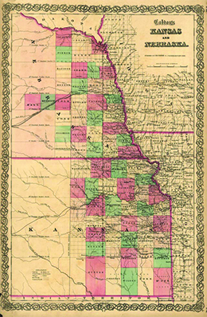
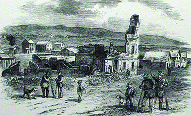

By the end of this section, you will be able to:
* Explain the political ramifications of the Kansas-Nebraska Act
* Describe the founding of the Republican Party

In the early 1850s, the United States’ sectional crisis had abated somewhat, cooled by the Compromise of 1850 and the nation’s general prosperity. In 1852, voters went to the polls in a presidential contest between Whig candidate Winfield Scott and Democratic candidate Franklin Pierce. Both men endorsed the Compromise of 1850. Though it was considered unseemly to hit the campaign trail, Scott did so—much to the benefit of Pierce, as Scott’s speeches focused on forty-year-old battles during the War of 1812 and the weather. In New York, Scott, known as “Old Fuss and Feathers,” talked about a thunderstorm that did not occur and greatly confused the crowd. In Ohio, a cannon firing to herald Scott’s arrival killed a spectator.

Pierce was a supporter of the “Young America” movement of the Democratic Party, which enthusiastically anticipated extending democracy around the world and annexing additional territory for the United States. Pierce did not take a stance on the slavery issue. Helped by Scott’s blunders and the fact that he had played no role in the bruising political battles of the past five years, Pierce won the election. The brief period of tranquility between the North and South did not last long, however; it came to an end in 1854 with the passage of the Kansas-Nebraska Act. This act led to the formation of a new political party, the Republican Party, that committed itself to ending the further expansion of slavery.

# THE KANSAS-NEBRASKA ACT

The relative calm over the sectional issue was broken in 1854 over the issue of slavery in the territory of Kansas. Pressure had been building among northerners to organize the territory west of Missouri and Iowa, which had been admitted to the Union as a free state in 1846. This pressure came primarily from northern farmers, who wanted the federal government to survey the land and put it up for sale. Promoters of a transcontinental railroad were also pushing for this westward expansion.

Southerners, however, had long opposed the Wilmot Proviso’s stipulation that slavery should not expand into the West. By the 1850s, many in the South were also growing resentful of the Missouri Compromise of 1820, which established the 36° 30\' parallel as the geographical boundary of slavery on the north-south axis. Proslavery southerners now contended that popular sovereignty should apply to all territories, not just Utah and New Mexico. They argued for the right to bring their slave property wherever they chose.

Attitudes toward slavery in the 1850s were represented by a variety of regional factions. Throughout the South, slaveholders entrenched themselves in defense of their “way of life,” which depended on the ownership of slaves. Since the 1830s, abolitionists, led by journalist and reformer William Lloyd Garrison, had cast slavery as a national sin and called for its immediate end. For three decades, the abolitionists remained a minority, but they had a significant effect on American society by bringing the evils of slavery into the public consciousness. By the 1850s, some abolitionists advocated the use of violence against those who owned slaves. In 1840, the Liberty Party, whose members came from the ranks of ministers, was founded; this group sought to work within the existing political system, a strategy Garrison and others rejected. Meanwhile, the Free-Soil Party committed itself to ensuring that white laborers would find work in newly acquired territories and not have to compete with unpaid slaves.

It is important to note that, even among those who opposed the expansion of slavery in the West, very different attitudes toward slavery existed. Some antislavery northerners wanted the West to be the best country for poor whites to go and seek opportunity. They did not want white workers to have to compete with slave labor, a contest that they believed demeaned white labor. Radical abolitionists, in contrast, envisioned the end of all slavery, and a society of equality between blacks and whites. Others opposed slavery in principle, but believed that the best approach was colonization; that is, settling freed slaves in a colony in Africa.

The growing political movement to address the issue of slavery stiffened the resolve of southern slaveholders to defend themselves and their society at all costs. Prohibiting slavery’s expansion, they argued, ran counter to basic American property rights. As abolitionists fanned the flames of antislavery sentiment, southerners solidified their defense of their enormous investment in human chattel. Across the country, people of all political stripes worried that the nation’s arguments would cause irreparable rifts in the country ([\[link\]](#CNX_History_14_02_Cartoon)).

 ![A cartoon titled &#x201C;The Hurly-Burly Pot&#x201D; depicts William Lloyd Garrison, David Wilmot, Horace Greeley, and John C. Calhoun standing over a large cauldron in fool&#x2019;s caps. Into the cauldron, they place sacks labeled &#x201C;Free Soil,&#x201D; &#x201C;Abolition,&#x201D; and &#x201C;Fourierism.&#x201D; The cauldron already contains sacks labeled &#x201C;Treason,&#x201D; &#x201C;Anti-Rent,&#x201D; and &#x201C;Blue Laws.&#x201D; Wilmot says &#x201C;Bubble, bubble, toil and trouble! / Boil, Free Soil, / The Union spoil; / Come grief and moan, / Peace be none. / Til we divided be!&#x201D; Garrison says &#x201C;Bubble, bubble, toil and trouble / Abolition / Our condition / Shall be altered by / Niggars strong as goats / Cut your master&#x2019;s throats / Abolition boil! / We divide the spoil.&#x201D; Greeley says &#x201C;Bubble, buble \[sic\], toil and trouble! / Fourierism / War and schism / Till disunion come!&#x201D; In the background, John Calhoun says, &#x201C;For success to the whole mixture, we invoke our great patron Saint Benedict Arnold.&#x201D; Benedict Arnold rises from the flames beneath the pot, saying &#x201C;Well done, good and faithful servants!&#x201D;](../resources/CNX_History_14_02_Cartoon.jpg "In this 1850 political cartoon, the artist takes aim at abolitionists, the Free-Soil Party, Southern states&#x2019; rights activists, and others he believes risk the health of the Union."){: #CNX_History_14_02_Cartoon}

As these different factions were agitating for the settlement of Kansas and Nebraska, leaders of the Democratic Party in 1853 and 1854 sought to bind their party together in the aftermath of intraparty fights over the distribution of patronage jobs. Illinois Democratic senator Stephen Douglas believed he had found a solution—the **Kansas-Nebraska bill**{: data-type="term" .no-emphasis}—that would promote party unity and also satisfy his colleagues from the South, who detested the Missouri Compromise line. In January 1854, Douglas introduced the bill ([\[link\]](#CNX_History_14_02_KansNeb)). The act created two territories: Kansas, directly west of Missouri; and Nebraska, west of Iowa. The act also applied the principle of popular sovereignty, dictating that the people of these territories would decide for themselves whether to adopt slavery. In a concession crucial to many southerners, the proposed bill would also repeal the 36° 30\' line from the Missouri Compromise. Douglas hoped his bill would increase his political capital and provide a step forward on his quest for the presidency. Douglas also wanted the territory organized in hopes of placing the eastern terminus of a transcontinental railroad in Chicago, rather than St. Louis or New Orleans.

 {: #CNX_History_14_02_KansNeb}

After heated debates, Congress narrowly passed the Kansas-Nebraska Act. (In the House of Representatives, the bill passed by a mere three votes: 113 to 110.) This move had major political consequences. The Democrats divided along sectional lines as a result of the bill, and the Whig party, in decline in the early 1850s, found its political power slipping further. Most important, the Kansas-Nebraska Act gave rise to the **Republican Party**{: data-type="term"}, a new political party that attracted northern Whigs, Democrats who shunned the Kansas-Nebraska Act, members of the Free-Soil Party, and assorted abolitionists. Indeed, with the formation of the Republican Party, the Free-Soil Party ceased to exist.

The new Republican Party pledged itself to preventing the spread of slavery into the territories and railed against the Slave Power, infuriating the South. As a result, the party became a solidly northern political organization. As never before, the U.S. political system was polarized along sectional fault lines.

# BLEEDING KANSAS

In 1855 and 1856, pro- and antislavery activists flooded Kansas with the intention of influencing the popular-sovereignty rule of the territories. Proslavery Missourians who crossed the border to vote in Kansas became known as **border ruffians**{: data-type="term"}; these gained the advantage by winning the territorial elections, most likely through voter fraud and illegal vote counting. (By some estimates, up to 60 percent of the votes cast in Kansas were fraudulent.) Once in power, the proslavery legislature, meeting at Lecompton, Kansas, drafted a proslavery constitution known as the Lecompton Constitution. It was supported by President Buchanan, but opposed by Democratic Senator Stephen A. Douglas of Illinois.

The Lecompton Constitution

Kansas was home to no fewer than four state constitutions in its early years. Its first constitution, the Topeka Constitution, would have made Kansas a free-soil state. A proslavery legislature, however, created the 1857 Lecompton Constitution to enshrine the institution of slavery in the new Kansas-Nebraska territories. In January 1858, Kansas voters defeated the proposed Lecompton Constitution, excerpted below, with an overwhelming margin of 10,226 to 138.

\> ARTICLE VII.—SLAVERY
> * * *
> {: data-type="newline"}
> 
> SECTION 1. The right of property is before and higher than any constitutional sanction, and the right of the owner of a slave to such slave and its increase is the same and as inviolable as the right of the owner of any property whatever.
> * * *
> {: data-type="newline"}
> 
> SEC. 2. The Legislature shall have no power to pass laws for the emancipation of slaves without the consent of the owners, or without paying the owners previous to their emancipation a full equivalent in money for the slaves so emancipated. They shall have no power to prevent immigrants to the State from bringing with them such persons as are deemed slaves by the laws of any one of the United States or Territories, so long as any person of the same age or description shall be continued in slavery by the laws of this State: Provided, That such person or slave be the bona fide property of such immigrants.

How are slaves defined in the 1857 Kansas constitution? How does this constitution safeguard the rights of slaveholders?

The majority in Kansas, however, were Free-Soilers who seethed at the border ruffians’ co-opting of the democratic process ([\[link\]](#CNX_History_14_02_BleedingKS)). Many had come from New England to ensure a numerical advantage over the border ruffians. The New England Emigrant Aid Society, a northern antislavery group, helped fund these efforts to halt the expansion of slavery into Kansas and beyond.

 ![A poster reads &#x201C;The Day of Our Enslavement!!&#x2014;To-day, September 15, 1855, is the day on which the iniquitous enactment of the illegitimate, illegal and fraudulent Legislature has declared commences the prostration of the right of speech and the curtailment of the liberty of the press. To-day commences an era in Kansas which, unless the sturdy voice of the people, backed, if necessary, by &#x2018;strong arms and the sure eye,&#x2019; shall teach the tyrants who attempt to enthrall us, the lesson which our fathers taught the kingly tyrants of old, shall prostrate us in the dust, and make us the slave of an oligarchy worse than the veriest despotism on earth. / To-day commences the operation of a law which declares: &#x2018;SEC.12, If any free person, by speaking or by writing, assert or maintain that persons have not the right to hold slaves in this Territory, or shall introduce into this Territory, print, publish, write, circulate or cause to be introduced into this Territory, written, printed, published or circulated in this Territory any book, paper, magazine, pamphlet or circular, containing any denial of the right of persons to hold slaves in this Territory, such person shall be deemed guilty of felony and punished by imprisonment at hard labor for a term of not less than two years.&#x2019; / Now we do assert and declare, despite all the bolts and bars of the iniquitous Legislature of Kansas, &#x2018;that persons have not the right to hold slaves in this Territory,&#x2019; and we will emblazon it upon our banner in letters so large and in language so plain that the infatuated invaders who elected the Kansas Legislature, as well as that corrupt and ignorant Legislature itself, may understand it, so that, if they cannot read they may spell it out, and meditate and deliberate upon it; and we hold that the man who fails to utter this self-evident truth, on account of the insolent enactment alluded to, is a poltroon and a slave&#x2014;worse than the black slaves of our persecutors and oppressors. / The Constitution of the United States&#x2014;the great Magna Carta of American liberties&#x2014;guarantees to every citizen the liberty of speech and the freedom of the press. And this is the first time in the history of America that a body claiming legislative powers has dared to attempt to wrest them from the people. And it is not only the right, but bounden duty of every freeman to spurn with contempt and trample underfoot any enactment which thus basely violates the rights of freemen. For our part we do, and shall continue to, utter this truth so long as we have the power of utterance, and nothing but the brute force of an overbearing tyranny can prevent us. / Will any citizen&#x2014;any free American&#x2014;brook the insult of an insolent gag law, the work of a legislature enacted by bullying ruffians who invaded Kansas with arms, and whose drunken revelry and insults to our peaceable, unoffending and comparatively unarmed citizens were a disgrace to manhood, and a burlesque upon popular Republican government? If they do, they are slaves already, and with them freedom is but a mockery.&#x201D;](../resources/CNX_History_14_02_BleedingKS.jpg "This full-page editorial ran in the Free-Soiler Kansas Tribune on September 15, 1855, the day Kansas&#x2019; Act to Punish Offences against Slave Property of 1855 went into effect. This law made it punishable by death to aid or abet a fugitive slave, and it called for punishment of no less than two years for anyone who might: &#x201C;print, publish, write, circulate, or cause to be introduced into this Territory . . . [any materials] . . . containing any denial of the right of persons to hold slaves in this Territory.&#x201D;"){: #CNX_History_14_02_BleedingKS}

  
Go to the Kansas Historical Society’s [Kansapedia][1] to read the four different state constitutions that Kansas had during its early years as a United States Territory. What can you deduce about the authors of each constitution?

In 1856, clashes between antislavery Free-Soilers and border ruffians came to a head in Lawrence, Kansas. The town had been founded by the New England Emigrant Aid Society, which funded antislavery settlement in the territory and were determined that Kansas should be a free-soil state. Proslavery emigrants from Missouri were equally determined that no “abolitionist tyrants” or “negro thieves” would control the territory. In the spring of 1856, several of Lawrence’s leading antislavery citizens were indicted for treason, and federal marshal Israel Donaldson called for a posse to help make arrests. He did not have trouble finding volunteers from Missouri. When the posse, which included Douglas County sheriff Samuel Jones, arrived outside Lawrence, the antislavery town’s “committee of safety” agreed on a policy of nonresistance. Most of those who were indicted fled. Donaldson arrested two men without incident and dismissed the posse.

However, Jones, who had been shot during an earlier confrontation in the town, did not leave. On May 21, falsely claiming that he had a court order to do so, Jones took command of the posse and rode into town armed with rifles, revolvers, cutlasses and bowie knives. At the head of the procession, two flags flew: an American flag and a flag with a crouching tiger. Other banners followed, bearing the words “Southern rights” and “The Superiority of the White Race.” In the rear were five artillery pieces, which were dragged to the center of town. The posse smashed the presses of the two newspapers, *Herald of Freedom* and the *Kansas Free State*, and burned down the deserted Free State Hotel ([\[link\]](#CNX_History_14_02_Sacking)). When the posse finally left, Lawrence residents found themselves unharmed but terrified.

The next morning, a man named John Brown and his sons, who were on their way to provide Lawrence with reinforcements, heard the news of the attack. Brown, a strict, God-fearing Calvinist and staunch abolitionist, once remarked that “God had raised him up on purpose to break the jaws of the wicked.” Disappointed that the citizens of Lawrence did not resist the “slave hounds” of Missouri, Brown opted not to go to Lawrence, but to the homes of proslavery settlers near Pottawatomie Creek in Kansas. The group of seven, including Brown’s four sons, arrived on May 24, 1856, and announced they were the “Northern Army” that had come to serve justice. They burst into the cabin of proslavery Tennessean James Doyle and marched him and two of his sons off, sparing the youngest at the desperate request of Doyle’s wife, Mahala. One hundred yards down the road, Owen and Salmon Brown hacked their captives to death with broadswords and John Brown shot a bullet into Doyle’s forehead. Before the night was done, the Browns visited two more cabins and brutally executed two other proslavery settlers. None of those executed owned any slaves or had had anything to do with the raid on Lawrence.

Brown’s actions precipitated a new wave of violence. All told, the guerilla warfare between proslavery “border ruffians” and antislavery forces, which would continue and even escalate during the Civil War, resulted in over 150 deaths and significant property loss. The events in Kansas served as an extreme reply to Douglas’s proposition of popular sovereignty. As the violent clashes increased, Kansas became known as “**Bleeding Kansas**{: data-type="term"}.” Antislavery advocates’ use of force carved out a new direction for some who opposed slavery. Distancing themselves from William Lloyd Garrison and other pacifists, Brown and fellow abolitionists believed the time had come to fight slavery with violence.

 {: #CNX_History_14_02_Sacking}

The violent hostilities associated with Bleeding Kansas were not limited to Kansas itself. It was the controversy over Kansas that prompted the caning of Charles Sumner, introduced at the beginning of this chapter with the political cartoon *Southern Chivalry: Argument versus Club’s* ([\[link\]](/m50077#CNX_History_14_00_Caning)). Note the title of the cartoon; it lampoons the southern ideal of chivalry, the code of behavior that Preston Brooks believed he was following in his attack on Sumner. In Sumner’s “Crime against Kansas” speech he went much further than politics, filling his verbal attack with allusions to sexuality by singling out fellow senator Andrew Butler from South Carolina, a zealous supporter of slavery and Brooks’s uncle. Sumner insulted Butler by comparing slavery to prostitution, declaring, “Of course he \[Butler\] has chosen a mistress to whom he has made his vows, and who, though ugly to others, is always lovely to him; though polluted in the sight of the world, is chaste in his sight. I mean the harlot Slavery.” Because Butler was aged, it was his nephew, Brooks, who sought satisfaction for Sumner’s attack on his family and southern honor. Brooks did not challenge Sumner to a duel; by choosing to beat him with a cane instead, he made it clear that he did not consider Sumner a gentleman. Many in the South rejoiced over Brooks’s defense of slavery, southern society, and family honor, sending him hundreds of canes to replace the one he had broken assaulting Sumner. The attack by Brooks left Sumner incapacitated physically and mentally for a long period of time. Despite his injuries, the people of Massachusetts reelected him.

# THE PRESIDENTIAL ELECTION OF 1856

The electoral contest in 1856 took place in a transformed political landscape. A third political party appeared: the anti-immigrant **American Party**{: data-type="term"}, a formerly secretive organization with the nickname “the Know-Nothing Party” because its members denied knowing anything about it. By 1856, the American or Know-Nothing Party had evolved into a national force committed to halting further immigration. Its members were especially opposed to the immigration of Irish Catholics, whose loyalty to the Pope, they believed, precluded their loyalty to the United States. On the West Coast, they opposed the entry of immigrant laborers from China, who were thought to be too foreign to ever assimilate into a white America.

The election also featured the new Republican Party, which offered John C. Fremont as its candidate. Republicans accused the Democrats of trying to nationalize slavery through the use of popular sovereignty in the West, a view captured in the 1856 political cartoon *Forcing Slavery Down the Throat of a Free Soiler* ([\[link\]](#CNX_History_14_02_Throat)). The cartoon features the image of a Free-Soiler settler tied to the Democratic Party platform while Senator Douglas (author of the Kansas-Nebraska Act) and President Pierce force a slave down his throat. Note that the slave cries out “Murder!!! Help—neighbors help, O my poor Wife and Children,” a reference to the abolitionists’ argument that slavery destroyed families.

 ![A political cartoon entitled &#x201C;Forcing Slavery Down the Throat of a Free Soiler&#x201D; shows a larger-than-life Free-Soiler lying on his back with his mouth open, tied to a dock labeled &#x201C;Democratic Platform,&#x201D; with planks labeled &#x201C;Kansas,&#x201D; &#x201C;Cuba,&#x201D; and &#x201C;Central America.&#x201D; Stephen Douglas and Franklin Pierce stand on the Free-Soiler&#x2019;s chest and push a black man down his throat; the black man says &#x201C;MURDER!!! Help - neighbors help. O my poor Wife and Children.&#x201D; James Buchanan and Lewis Cass, who stand on the platform, each grasp a lock of the Free-Soiler&#x2019;s hair to hold him down. In one corner of the image, a home burns down as a woman and child flee; in the other, a lynched man hangs from a tree.](../resources/CNX_History_14_02_Throat.jpg "This 1856 political cartoon, Forcing Slavery Down the Throat of a Free Soiler, by John Magee, shows Republican resentment of the Democratic platform&#x2014;here represented as an actual platform&#x2014;of expanding slavery into new western territories."){: #CNX_History_14_02_Throat}

The Democrats offered James Buchanan as their candidate. Buchanan did not take a stand on either side of the issue of slavery; rather, he attempted to please both sides. His qualification, in the minds of many, was that he was out of the country when the Kansas-Nebraska Act was passed. In the above political cartoon, Buchanan, along with Democratic senator Lewis Cass, holds down the Free-Soil advocate. Buchanan won the election, but Fremont garnered more than 33 percent of the popular vote, an impressive return for a new party. The Whigs had ceased to exist and had been replaced by the Republican Party. Know-Nothings also transferred their allegiance to the Republicans because the new party also took an anti-immigrant stance, a move that further boosted the new party’s standing. (The Democrats courted the Catholic immigrant vote.) The Republican Party was a thoroughly northern party; no southern delegate voted for Fremont.

# Section Summary

The application of popular sovereignty to the organization of the Kansas and Nebraska territories ended the sectional truce that had prevailed since the Compromise of 1850. Senator Douglas’s Kansas-Nebraska Act opened the door to chaos in Kansas as proslavery and Free-Soil forces waged war against each other, and radical abolitionists, notably John Brown, committed themselves to violence to end slavery. The act also upended the second party system of Whigs and Democrats by inspiring the formation of the new Republican Party, committed to arresting the further spread of slavery. Many voters approved its platform in the 1856 presidential election, though the Democrats won the race because they remained a national, rather than a sectional, political force.

# Review Questions

Which of the following was a focus of the new Republican Party?  supporting Irish Catholic immigration encouraging the use of popular sovereignty to determine where slavery could exist promoting states’ rights halting the spread of slavery 

D

Border ruffians helped to \_\_\_\_\_\_\_\_.  chase abolitionists out of Missouri elect a proslavery legislature in Kansas capture runaway slaves disseminate abolitionist literature in Kansas 

B

How did the “Bleeding Kansas” incident change the face of antislavery advocacy?

In response to proslavery forces’ destruction of the antislavery press and Free State Hotel, radical abolitionists, including John Brown, murdered proslavery settlers at Pottawatomie. This was a turning point for Brown and many other radical abolitionists, who—unlike their largely pacifist counterparts, such as William Lloyd Garrison—came to believe that slavery must be extinguished by any means necessary, including open violence.

[1]: http://openstaxcollege.org/l/15KSConst
