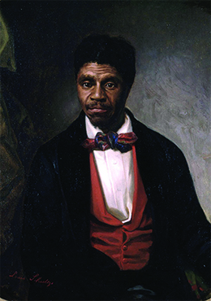

By the end of this section, you will be able to:
* Explain the importance of the Supreme Court\'s Dred Scott ruling
* Discuss the principles of the Republican Party as expressed by Abraham Lincoln in 1858

As president, Buchanan confronted a difficult and volatile situation. The nation needed a strong personality to lead it, and Buchanan did not possess this trait. The violence in Kansas demonstrated that applying popular sovereignty—the democratic principle of majority rule—to the territory offered no solution to the national battle over slavery. A decision by the Supreme Court in 1857, which concerned the slave Dred Scott, only deepened the crisis.

# DRED SCOTT

In 1857, several months after President Buchanan took the oath of office, the Supreme Court ruled in ***Dred Scott v. Sandford***{: data-type="term"}. Dred Scott ([\[link\]](#CNX_History_14_03_DredScott)), born a slave in Virginia in 1795, had been one of the thousands forced to relocate as a result of the massive internal slave trade and taken to Missouri, where slavery had been adopted as part of the Missouri Compromise. In 1820, Scott’s owner took him first to Illinois and then to the Wisconsin territory. However, both of those regions were part of the Northwest Territory, where the 1787 Northwest Ordinance had prohibited slavery. When Scott returned to Missouri, he attempted to buy his freedom. After his owner refused, he sought relief in the state courts, arguing that by virtue of having lived in areas where slavery was banned, he should be free.

 {: #CNX_History_14_03_DredScott}

In a complicated set of legal decisions, a jury found that Scott, along with his wife and two children, were free. However, on appeal from Scott’s owner, the state Superior Court reversed the decision, and the Scotts remained slaves. Scott then became the property of John Sanford (his name was misspelled as “Sandford” in later court documents), who lived in New York. He continued his legal battle, and because the issue involved Missouri and New York, the case fell under the jurisdiction of the federal court. In 1854, Scott lost in federal court and appealed to the United States Supreme Court.

In 1857, the Supreme Court—led by Chief Justice Roger Taney, a former slaveholder who had freed his slaves—handed down its decision. On the question of whether Scott was free, the Supreme Court decided he remained a slave. The court then went beyond the specific issue of Scott’s freedom to make a sweeping and momentous judgment about the status of blacks, both free and slave. Per the court, blacks could never be citizens of the United States. Further, the court ruled that Congress had no authority to stop or limit the spread of slavery into American territories. This proslavery ruling explicitly made the Missouri Compromise unconstitutional; implicitly, it made Douglas’s popular sovereignty unconstitutional.

Roger Taney on *Dred Scott v. Sandford*

In 1857, the United States Supreme Court ended years of legal battles when it ruled that Dred Scott, a slave who had resided in several free states, should remain a slave. The decision, written by Chief Justice Roger Taney, also stated that blacks could not be citizens and that Congress had no power to limit the spread of slavery. The excerpt below is from Taney’s decision.

\> A free negro of the African race, whose ancestors were brought to this country and sold as slaves, is not a “citizen” within the meaning of the Constitution of the United States. . . .
> * * *
> {: data-type="newline"}
> 
> The only two clauses in the Constitution which point to this race treat them as persons whom it was morally lawfully to deal in as articles of property and to hold as slaves. . . .
> * * *
> {: data-type="newline"}
> 
> Every citizen has a right to take with him into the Territory any article of property which the Constitution of the United States recognises as property. . . .
> * * *
> {: data-type="newline"}
> 
> The Constitution of the United States recognises slaves as property, and pledges the Federal Government to protect it. And Congress cannot exercise any more authority over property of that description than it may constitutionally exercise over property of any other kind. . . .
> * * *
> {: data-type="newline"}
> 
> Prohibiting a citizen of the United States from taking with him his slaves when he removes to the Territory . . . is an exercise of authority over private property which is not warranted by the Constitution, and the removal of the plaintiff \[Dred Scott\] by his owner to that Territory gave him no title to freedom.

How did the Supreme Court define Dred Scott? How did the court interpret the Constitution on this score?

The Dred Scott decision infuriated Republicans by rendering their goal—to prevent slavery’s spread into the territories—unconstitutional. To Republicans, the decision offered further proof of the reach of the South’s Slave Power, which now apparently extended even to the Supreme Court. The decision also complicated life for northern Democrats, especially Stephen Douglas, who could no longer sell popular sovereignty as a symbolic concession to southerners from northern voters. Few northerners favored slavery’s expansion westward.

# THE LINCOLN-DOUGLAS DEBATES

The turmoil in Kansas, combined with the furor over the Dred Scott decision, provided the background for the 1858 senatorial contest in Illinois between Democratic senator Stephen Douglas and Republican hopeful Abraham Lincoln ([\[link\]](#CNX_History_14_03_LincDoug)). Lincoln and Douglas engaged in seven debates before huge crowds that met to hear the two men argue the central issue of slavery and its expansion. Newspapers throughout the United States published their speeches. Whereas Douglas already enjoyed national recognition, Lincoln remained largely unknown before the debates. These appearances provided an opportunity for him to raise his profile with both northerners and southerners.

  debated Stephen Douglas (b) seven times in the Illinois race for the U.S. Senate. Although Douglas won the seat, the debates propelled Lincoln into the national political spotlight."){: #CNX_History_14_03_LincDoug}

Douglas portrayed the Republican Party as an abolitionist effort—one that aimed to bring about **miscegenation**{: data-type="term"}, or race-mixing through sexual relations or marriage. The “black Republicans,” Douglas declared, posed a dangerous threat to the Constitution. Indeed, because Lincoln declared the nation could not survive if the slave state–free state division continued, Douglas claimed the Republicans aimed to destroy what the founders had created.

For his part, Lincoln said: “A house divided against itself cannot stand. I believe this government cannot endure permanently half Slave and half Free. I do not expect the Union to be dissolved—I do not expect the house to fall—but I do expect it will cease to be divided. It will become all one thing, or all the other. Either the opponents of slavery will arrest the further spread of it, and place it where the public mind shall rest in the belief that it is in the course of ultimate extinction: or its advocates will push it forward till it shall became alike lawful in all the States—old as well as new, North as well as South.” Lincoln interpreted the Dred Scott decision and the Kansas-Nebraska Act as efforts to nationalize slavery: that is, to make it legal everywhere from New England to the Midwest and beyond.

The Lincoln-Douglas Debates

On August 21, 1858, Abraham Lincoln and Stephen Douglas met in Ottawa, Illinois, for the first of seven debates. People streamed into Ottawa from neighboring counties and from as far away as Chicago. Reporting on the event was strictly partisan, with each of the candidates’ supporters claiming victory for their candidate. In this excerpt, Lincoln addresses the issues of equality between blacks and whites.

\> \[A\]nything that argues me into his idea of perfect social and political equality with the negro, is but a specious and fantastic arrangement of words, . . . I have no purpose, directly or indirectly, to interfere with the institution of slavery in the States where it exists. I believe I have no lawful right to do so, and I have no inclination to do so. I have no purpose to introduce political and social equality between the white and the black races. There is a physical difference between the two, which, in my judgment, will probably forever forbid their living together upon the footing of perfect equality, . . . I, as well as Judge Douglas, am in favor of the race to which I belong having the superior position. . . . \[N\]otwithstanding all this, there is no reason in the world why the negro is not entitled to all the natural rights enumerated in the Declaration of Independence, the right to life, liberty, and the pursuit of happiness. I hold that he is as much entitled to these as the white man. . . . \[I\]n the right to eat the bread, without the leave of anybody else, which his own hand earns, he is my equal and the equal of Judge Douglas, and the equal of every living man.
> * * *
> {: data-type="newline"}
> 
> —Lincoln’s speech on August 21, 1858, in Ottawa, Illinois

How would you characterize Lincoln’s position on equality between blacks and whites? What types of equality exist, according to Lincoln?

  
Go to the [Lincoln Home National Historic Site][1] on the National Park Service’s website to read excerpts from and full texts of the debates. Then, visit [The Lincoln/Douglas Debates of 1858][2] on the Northern Illinois University website to read different newspaper accounts of the debates. Do you see any major differences in the way the newspapers reported the debates? How does the commentary vary, and why?

During the debates, Lincoln demanded that Douglas explain whether or not he believed that the 1857 Supreme Court decision in the Dred Scott case trumped the right of a majority to prevent the expansion of slavery under the principle of popular sovereignty. Douglas responded to Lincoln during the second debate at Freeport, Illinois. In what became known as the **Freeport Doctrine**{: data-type="term"}, Douglas adamantly upheld popular sovereignty, declaring: “It matters not what way the Supreme Court may hereafter decide as to the abstract question whether slavery may or may not go into a territory under the Constitution, the people have the lawful means to introduce it or exclude it as they please.” The Freeport Doctrine antagonized southerners and caused a major rift in the Democratic Party. The doctrine did help Douglas in Illinois, however, where most voters opposed the further expansion of slavery. The Illinois legislature selected Douglas over Lincoln for the senate, but the debates had the effect of launching Lincoln into the national spotlight. Lincoln had argued that slavery was morally wrong, even as he accepted the racism inherent in slavery. He warned that Douglas and the Democrats would nationalize slavery through the policy of popular sovereignty. Though Douglas had survived the election challenge from Lincoln, his Freeport Doctrine undermined the Democratic Party as a national force.

# Section Summary

The Dred Scott decision of 1857 went well beyond the question of whether or not Dred Scott gained his freedom. Instead, the Supreme Court delivered a far-reaching pronouncement about African Americans in the United States, finding they could never be citizens and that Congress could not interfere with the expansion of slavery into the territories. Republicans erupted in anger at this decision, which rendered their party’s central platform unconstitutional. Abraham Lincoln fully articulated the Republican position on the issue of slavery in his 1858 debates with Senator Stephen Douglas. By the end of that year, Lincoln had become a nationally known Republican icon. For the Democrats’ part, unity within their party frayed over both the Dred Scott case and the Freeport Doctrine, undermining the Democrats’ future ability to retain control of the presidency.

# Review Questions

On what grounds did Dred Scott sue for freedom? 

the inherent inhumanity of slavery

the cruelty of his master

the fact that he had lived in free states

the fact that his family would be torn apart

C

Which of the following was *not* a result of the Lincoln-Douglas debates? 

Douglas was elected senator of Illinois.

Lincoln’s national profile was raised.

Citizens in both the North and South followed the debates closely.

Lincoln successfully defended the principle of popular sovereignty.

D

What are the main points of the Dred Scott decision?

The Supreme Court decided that Dred Scott had not earned freedom by virtue of having lived in a free state; thus, Scott and his family would remain enslaved. More broadly, the Court ruled that blacks could never be citizens of the United States and that Congress had no authority to stop or limit the spread of slavery into American territories.

## Glossary
{: data-type="glossary-title"}

*Dred Scott v. Sandford*
: an 1857 case in which the Supreme Court ruled that blacks could not be citizens and Congress had no jurisdiction to impede the expansion of slavery
{: .definition}

Freeport Doctrine
: a doctrine that emerged during the Lincoln-Douglas debates in which Douglas reaffirmed his commitment to popular sovereignty, including the right to halt the spread of slavery, despite the 1857 Dred Scott decision affirming slaveholders’ right to bring their property wherever they wished
{: .definition}

miscegenation
: race-mixing through sexual relations or marriage
{: .definition}

[1]: http://openstaxcollege.org/l/15LincDoug
[2]: http://openstaxcollege.org/l/15LincDoug2
