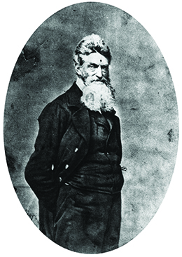

By the end of this section, you will be able to:
* Describe John Brown’s raid on Harpers Ferry and its results
* Analyze the results of the election of 1860

Events in the late 1850s did nothing to quell the country’s sectional unrest, and compromise on the issue of slavery appeared impossible. Lincoln’s 1858 speeches during his debates with Douglas made the Republican Party’s position well known; Republicans opposed the extension of slavery and believed a Slave Power conspiracy sought to nationalize the institution. They quickly gained political momentum and took control of the House of Representatives in 1858. Southern leaders were divided on how to respond to Republican success. Southern extremists, known as “**Fire-Eaters**{: data-type="term"},” openly called for secession. Others, like Mississippi senator Jefferson Davis, put forward a more moderate approach by demanding constitutional protection of slavery.

# JOHN BROWN

In October 1859, the radical abolitionist John Brown and eighteen armed men, both blacks and whites, attacked the federal arsenal in **Harpers Ferry**{: data-type="term"}, Virginia. They hoped to capture the weapons there and distribute them among slaves to begin a massive uprising that would bring an end to slavery. Brown had already demonstrated during the 1856 Pottawatomie attack in Kansas that he had no patience for the nonviolent approach preached by pacifist abolitionists like William Lloyd Garrison. Born in Connecticut in 1800, Brown ([\[link\]](#CNX_History_14_04_Brown)) spent much of his life in the North, moving from Ohio to Pennsylvania and then upstate New York as his various business ventures failed. To him, slavery appeared an unacceptable evil that must be purged from the land, and like his Puritan forebears, he believed in using the sword to defeat the ungodly.

 {: #CNX_History_14_04_Brown}

Brown had gone to Kansas in the 1850s in an effort to stop slavery, and there, he had perpetrated the killings at Pottawatomie. He told other abolitionists of his plan to take Harpers Ferry Armory and initiate a massive slave uprising. Some abolitionists provided financial support, while others, including Frederick Douglass, found the plot suicidal and refused to join. On October 16, 1859, Brown’s force easily took control of the federal armory, which was unguarded ([\[link\]](#CNX_History_14_04_HarpersFer)). However, his vision of a mass uprising failed completely. Very few slaves lived in the area to rally to Brown’s side, and the group found themselves holed up in the armory’s engine house with townspeople taking shots at them. Federal troops, commanded by Colonel Robert E. Lee, soon captured Brown and his followers. On December 2, Brown was hanged by the state of Virginia for treason.

 {: #CNX_History_14_04_HarpersFer}

  
Visit the [Avalon Project][1] on Yale Law School’s website to read the impassioned speech that Henry David Thoreau delivered on October 30, 1859, arguing against the execution of John Brown. How does Thoreau characterize Brown? What does he ask of his fellow citizens?

John Brown’s raid on Harpers Ferry generated intense reactions in both the South and the North. Southerners grew especially apprehensive of the possibility of other violent plots. They viewed Brown as a terrorist bent on destroying their civilization, and support for secession grew. Their anxiety led several southern states to pass laws designed to prevent slave rebellions. It seemed that the worst fears of the South had come true: A hostile majority would stop at nothing to destroy slavery. Was it possible, one resident of Maryland asked, to “live under a government, a majority of whose subjects or citizens regard John Brown as a martyr and Christian hero?” Many antislavery northerners did in fact consider Brown a martyr to the cause, and those who viewed slavery as a sin saw easy comparisons between him and Jesus Christ.

# THE ELECTION OF 1860

The election of 1860 triggered the collapse of American democracy when the elevation of Abraham Lincoln to the presidency inspired secessionists in the South to withdraw their states from the Union.

Lincoln’s election owed much to the disarray in the Democratic Party. The Dred Scott decision and the Freeport Doctrine had opened up huge sectional divisions among Democrats. Though Brown did not intend it, his raid had furthered the split between northern and southern Democrats. Fire-Eaters vowed to prevent a northern Democrat, especially Illinois’s Stephen Douglas, from becoming their presidential candidate. These proslavery zealots insisted on a southern Democrat.

The Democratic nominating convention met in April 1860 in Charleston, South Carolina. However, it broke up after northern Democrats, who made up a majority of delegates, rejected Jefferson Davis’s efforts to protect slavery in the territories. These northern Democratic delegates knew that supporting Davis on this issue would be very unpopular among the people in their states. A second conference, held in Baltimore, further illustrated the divide within the Democratic Party. Northern Democrats nominated Stephen Douglas, while southern Democrats, who met separately, put forward Vice President John Breckinridge from Kentucky. The Democratic Party had fractured into two competing sectional factions.

By offering two candidates for president, the Democrats gave the Republicans an enormous advantage. Also hoping to prevent a Republican victory, pro-Unionists from the border states organized the Constitutional Union Party and put up a fourth candidate, John Bell, for president, who pledged to end slavery agitation and preserve the Union but never fully explained how he’d accomplish this objective. In a pro-Lincoln political cartoon of the time ([\[link\]](#CNX_History_14_04_Election)), the presidential election is presented as a baseball game. Lincoln stands on home plate. A skunk raises its tail at the other candidates. Holding his nose, southern Democrat John Breckinridge holds a bat labeled “Slavery Extension” and declares “I guess I’d better leave for Kentucky, for I smell something strong around here, and begin to think, that we are completely skunk’d.”

 ![A cartoon titled &#x201C;The national game. Three &#x2018;outs&#x2019; and one &#x2018;run&#x2019;&#x201D; depicts a baseball game in which Lincoln has defeated John Bell, Stephen A. Douglas, and John C. Breckinridge. Lincoln, with his foot on &#x201C;Home Base,&#x201D; says, &#x201C;Gentlemen, if any of you should ever take a hand in another match at this game, remember that you must have a good bat and strike a fair ball to make a clean score and a home run.&#x2019;&#x201C; Lincoln&#x2019;s bat is a wooden rail labeled &#x201C;Equal Rights and Free Territory,&#x201D; and his belt is labeled &#x201C;Wide Awake Club.&#x201D; A skunk raises its tail at the other candidates. Breckinridge holds his nose and declares &#x201C;I guess I&#x2019;d better leave for Kentucky, for I smell something strong around here, and begin to think, that we are completely skunk&#x2019;d.&#x2019;&#x201D; Breckinridge&#x2019;s bat is labeled &#x201C;Slavery Extension,&#x201D; and his belt is labeled &#x201C;Disunion Club.&#x201D; John Bell says, &#x201C;It appears to me very singular that we three should strike foul and be put out while old Abe made such a good lick.&#x201D; Bell&#x2019;s belt is labeled &#x201C;Union Club,&#x201D; and his bat is labeled &#x201C;Fusion.&#x201D; Douglas, who holds a bat labeled &#x201C;Non Intervention,&#x201D; replies, &#x201C;That&#x2019;s because he had that confounded rail, to strike with, I thought our fusion would be a short stop to his career.&#x201D;](../resources/CNX_History_14_04_Election.jpg "The national game. Three &#x201C;outs&#x201D; and one &#x201C;run&#x201D; (1860), by Currier and Ives, shows the two Democratic candidates and one Constitutional Union candidate who lost the 1860 election to Republican Lincoln, shown at right."){: #CNX_History_14_04_Election}

The Republicans nominated Lincoln, and in the November election, he garnered a mere 40 percent of the popular vote, though he won every northern state except New Jersey. (Lincoln’s name was blocked from even appearing on many southern states’ ballots by southern Democrats.) More importantly, Lincoln did gain a majority in the Electoral College ([\[link\]](#CNX_History_14_04_1860Result)). The Fire-Eaters, however, refused to accept the results. With South Carolina leading the way, Fire-Eaters in southern states began to withdraw formally from the United States in 1860. South Carolinian Mary Boykin Chesnut wrote in her diary about the reaction to the Lincoln’s election. “Now that the black radical Republicans have the power,” she wrote, “I suppose they will Brown us all.” Her statement revealed many southerners’ fear that with Lincoln as President, the South could expect more mayhem like the John Brown raid.

 ![A map shows the disposition of electoral votes for the election of 1860. Each state is labeled to indicate the number of electoral votes cast and shaded to indicate the candidate to whom that state went. Oregon (3), California (4), Minnesota (4), Iowa (4), Wisconsin (5), Illinois (11), Indiana (13), Michigan (6), Ohio (23), Pennsylvania (27), New York (35), Connecticut (6), Rhode Island (4), Massachusetts (13), Vermont (5), New Hampshire (5), and Maine (8) voted for Lincoln. New Jersey, with seven votes total, voted for Lincoln with a majority of 4 votes and Douglas with 3. Texas (4), Louisiana (6), Arkansas (4), Mississippi (7), Alabama (9), Georgia (10), Florida (3), South Carolina (8), and North Carolina (10) voted for Breckinridge. Tennessee (12), Kentucky (12), and Virginia (15) voted for Bell. Missouri (9) voted for Douglas. The territories, which did not participate in the election, are labeled as well.](../resources/CNX_History_14_04_1860Result.jpg "This map shows the disposition of electoral votes for the election of 1860. The votes were divided along almost perfect sectional lines."){: #CNX_History_14_04_1860Result}

# Section Summary

A new level of animosity and distrust emerged in 1859 in the aftermath of John Brown’s raid. The South exploded in rage at the northern celebration of Brown as a heroic freedom fighter. Fire-Eaters called openly for disunion. Poisoned relations split the Democrats into northern and southern factions, a boon to the Republican candidate Lincoln. His election triggered the downfall of the American experiment with democracy as southern states began to leave the Union.

# Review Questions

Why did John Brown attack the armory at Harpers Ferry? 

to seize weapons to distribute to slaves for a massive uprising

to hold as a military base against proslavery forces

in revenge after the sacking of Lawrence

to prevent southern states from seceding

A

Which of the following did *not* contribute to Lincoln’s victory in the election of 1860? 

the split between northern and southern democrats

the defeat of the Whig party

Lincoln’s improved national standing after his senatorial debates with Stephen Douglas

the Constitutional Union party’s further splintering the vote

B

What were southerners’ and northerners’ views of John Brown?

Antislavery northerners tended to view Brown as a martyr for the antislavery cause; some saw in him a Christ-like figure who died for his beliefs. Southerners, for their part, considered Brown a terrorist. They felt threatened by northerners’ deification of Brown and worried about the potential for other, similar armed insurrections.

# Critical Thinking Questions

Why would Americans view the Compromise of 1850 as a final solution to the sectional controversy that began with the Wilmot Proviso in 1846?

If you were a proslavery advocate, how would you feel about the platform of the newly formed Republican Party?

Based on the text of the Lincoln-Douglas debates, what was the position of the Republican Party in 1858? Was the Republican Party an abolitionist party? Why or why not?

John Brown is often described as a terrorist. Do you agree with this description? Why or why not? What attributes might make him fit this profile?

Was it possible to save American democracy in 1860? What steps might have been taken to maintain unity? Why do you think these steps were not taken?

## Glossary
{: data-type="glossary-title"}

Harpers Ferry
: the site of a federal arsenal in Virginia, where radical abolitionist John Brown staged an ill-fated effort to end slavery by instigating a mass uprising among slaves
{: .definition}

Fire-Eaters
: radical southern secessionists
{: .definition}

[1]: http://openstaxcollege.org/l/15JohnBrown
