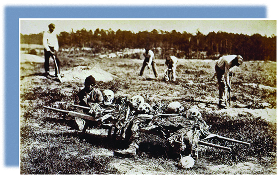

* The Origins and Outbreak of the Civil War
* Early Mobilization and War
* 1863: The Changing Nature of the War
* The Union Triumphant

<?cnx.eoc class="summary" title="Summary"?>

<?cnx.eoc class="review-questions" title="Review Questions"?>

<?cnx.eoc class="critical-thinking" title="Critical Thinking Questions"?>

 {: #CNX_History_15_00_ColdHarbor}

In May 1864, General Ulysses S. Grant ordered the Union’s Army of the Potomac to cross the Rapidan River in Virginia. Grant knew that Confederate general Robert E. Lee would defend the Confederate capital at Richmond at all costs, committing troops that might otherwise be sent to the Shenandoah or the Deep South to stop Union general William Tecumseh Sherman from capturing Atlanta, a key Confederate city. For two days, the Army of the Potomac fought Lee’s troops in the Wilderness, a wooded area along the Rapidan River. Nearly ten thousand Confederate soldiers were killed or wounded, as were more than seventeen thousand Union troops. A few weeks later, the armies would meet again at the Battle of Cold Harbor, where another fifteen thousand men would be wounded or killed. As in many battles, the bodies of those who died were left on the field where they fell. A year later, African Americans, who were often called upon to perform menial labor for the Union army ([\[link\]](#CNX_History_15_00_ColdHarbor)), collected the skeletal remains of the dead for a proper burial. The state of the graves of many Civil War soldiers partly inspired the creation of Memorial Day, a day set aside for visiting and decorating the graves of the dead.

